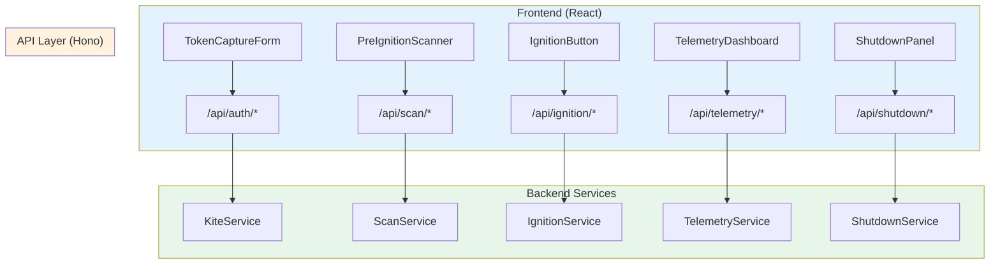

# 2.10 API Contract Architecture
## Endpoint Specs: /auth, /scan, /ignition, /telemetry, /shutdown

**Node ID:** 2.10
**Category:** Integration
**CR Impact:** Backend↔Frontend Contract
**Status:** CREATED
**Version:** 1.0
**Date:** 2026-01-27

---

## Purpose

This document defines the complete API contract between MCI's frontend and backend, including all endpoints, request/response schemas, error formats, and versioning strategy.

---

## API Overview



---

## Endpoint Registry

| Route | Method | Purpose | Phase | CR Impact |
|-------|--------|---------|-------|-----------|
| `/api/auth/validate` | POST | Validate Kite credentials | 0 | CR-001, CR-004 |
| `/api/scan` | POST | Execute 12-point scan | 1 | - |
| `/api/scan/check/:id` | GET | Get single check status | 1 | - |
| `/api/ignition` | POST | Start engine connection | 2 | - |
| `/api/ignition/status` | GET | Get ignition status | 2 | - |
| `/api/telemetry/positions` | GET | Get current positions | 3 | - |
| `/api/telemetry/orders` | GET | Get orders | 3 | - |
| `/api/telemetry/account` | GET | Get account metrics | 3 | - |
| `/api/telemetry/health` | GET | Get system health | 3 | - |
| `/api/telemetry/market` | GET | Get all market data | 3 | - |
| `/api/telemetry/market/:symbol` | GET | Get single symbol data | 3 | - |
| `/api/telemetry/snapshot` | GET | Get full snapshot | 3 | - |
| `/api/shutdown` | POST | Execute shutdown | 4 | CR-002 |
| `/api/shutdown/status` | GET | Get shutdown progress | 4 | CR-002 |

---

## Authentication Endpoints

### POST /api/auth/validate

**Purpose:** Validate Kite API credentials and obtain access token

**Request:**
```json
{
  "apiKey": "string (required)",
  "apiSecret": "string (required)",
  "requestToken": "string (required)"
}
```

**Response (200 OK):**
```json
{
  "valid": true,
  "accessToken": "string",
  "userId": "string",
  "expiresAt": 1706421000000,
  "broker": "zerodha"
}
```

**Response (401 Unauthorized):**
```json
{
  "valid": false,
  "error": {
    "what": "Authentication failed",
    "why": "Invalid API key or secret",
    "how": "Verify credentials in Kite Console"
  }
}
```

**CR Compliance:**
- CR-001: Token validated before returning success
- CR-004: `expiresAt` set to 6:00 AM IST next day

---

## Scan Endpoints

### POST /api/scan

**Purpose:** Execute 12-point pre-ignition scan

**Request:**
```json
{
  "checks": ["all"] 
}
```
*Or specify individual check IDs*

**Response (200 OK):**
```json
{
  "checks": [
    {
      "id": "kite-connection",
      "name": "Kite API Connection",
      "status": "success",
      "duration": 245,
      "error": null
    },
    {
      "id": "token-expiry",
      "name": "Token Not Expired",
      "status": "success",
      "duration": 5,
      "error": null
    }
  ],
  "summary": {
    "total": 12,
    "passed": 11,
    "failed": 0,
    "warnings": 1,
    "canProceed": true
  },
  "timestamp": 1706400000000
}
```

**Check Status Values:**
- `pending` - Not yet executed
- `running` - Currently executing
- `success` - Check passed
- `warning` - Check passed with concerns
- `failure` - Check failed (may block ignition)

---

## Ignition Endpoints

### POST /api/ignition

**Purpose:** Connect to selected broker backend

**Request:**
```json
{
  "backend": "zerodha" | "icici" | "hdfc" | "kotak"
}
```

**Response (200 OK):**
```json
{
  "success": true,
  "backend": "zerodha",
  "connectionId": "conn-abc123def456",
  "websocketUrl": "wss://mci.local/telemetry",
  "connectedAt": 1706400000000
}
```

**Response (503 Service Unavailable):**
```json
{
  "success": false,
  "error": {
    "what": "Ignition failed",
    "why": "Broker API not responding",
    "how": "Check broker status page or try again"
  }
}
```

### GET /api/ignition/status

**Response:**
```json
{
  "phase": "idle" | "armed" | "igniting" | "running" | "failed",
  "backend": "zerodha" | null,
  "connectedAt": 1706400000000 | null,
  "uptime": 3600000 | null
}
```

---

## Telemetry Endpoints

### GET /api/telemetry/positions

**Response:**
```json
{
  "positions": [
    {
      "symbol": "RELIANCE",
      "qty": 50,
      "side": "long",
      "entryPrice": 2400.50,
      "currentPrice": 2450.75,
      "unrealizedPL": 2512.50,
      "unrealizedPLPercent": 2.09,
      "marketValue": 122537.50
    }
  ],
  "timestamp": 1706400000000
}
```

### GET /api/telemetry/orders

**Response:**
```json
{
  "orders": [
    {
      "id": "order-abc123",
      "symbol": "TCS",
      "side": "buy",
      "type": "limit",
      "qty": 10,
      "filledQty": 5,
      "price": 3750.00,
      "status": "partially_filled",
      "createdAt": 1706399000000,
      "filledAt": null
    }
  ],
  "timestamp": 1706400000000
}
```

### GET /api/telemetry/account

**Response:**
```json
{
  "equity": 1050000.00,
  "cash": 315000.00,
  "buyingPower": 2100000.00,
  "portfolioValue": 735000.00,
  "dayPL": 12500.00,
  "dayPLPercent": 1.19,
  "totalPL": 50000.00,
  "totalPLPercent": 5.00,
  "timestamp": 1706400000000
}
```

### GET /api/telemetry/health

**Response:**
```json
{
  "cpu": 25,
  "memory": 45,
  "latency": 25,
  "uptime": 3600000,
  "lastHeartbeat": 1706400000000,
  "status": "healthy" | "degraded" | "critical",
  "timestamp": 1706400000000
}
```

### GET /api/telemetry/market/:symbol

**Response:**
```json
{
  "symbol": "RELIANCE",
  "price": 2450.75,
  "change": 25.50,
  "changePercent": 1.05,
  "volume": 5234567,
  "high": 2465.00,
  "low": 2420.00,
  "open": 2430.00,
  "timestamp": 1706400000000
}
```

### GET /api/telemetry/snapshot

**Purpose:** Get complete telemetry state in single request

**Response:**
```json
{
  "positions": [...],
  "orders": [...],
  "account": {...},
  "health": {...},
  "marketData": {...},
  "timestamp": 1706400000000
}
```

---

## Shutdown Endpoints

### POST /api/shutdown

**Purpose:** Execute graceful or emergency shutdown (CR-002)

**Request:**
```json
{
  "type": "graceful" | "emergency"
}
```

**Response (200 OK):**
```json
{
  "success": true,
  "type": "graceful",
  "steps": [
    { "step": 1, "name": "Cancel Orders", "status": "complete", "duration": 2500 },
    { "step": 2, "name": "Close Positions", "status": "complete", "duration": 5200 },
    { "step": 3, "name": "Disconnect Broker", "status": "complete", "duration": 800 },
    { "step": 4, "name": "Stop Telemetry", "status": "complete", "duration": 200 },
    { "step": 5, "name": "Clear Session", "status": "complete", "duration": 50 },
    { "step": 6, "name": "Log Complete", "status": "complete", "duration": 100 }
  ],
  "totalDuration": 8850,
  "timestamp": 1706400000000
}
```

### GET /api/shutdown/status

**Response:**
```json
{
  "phase": "idle" | "initiating" | "step1" | "step2" | "step3" | "step4" | "step5" | "step6" | "complete",
  "currentStep": 3,
  "steps": [...],
  "startedAt": 1706400000000
}
```

---

## Error Response Format (CR-003)

All error responses follow the WHAT/WHY/HOW format:

```json
{
  "error": {
    "what": "Brief description of what happened",
    "why": "Explanation of why it happened",
    "how": "Actionable steps to resolve"
  },
  "code": "ERROR_CODE",
  "timestamp": 1706400000000
}
```

**Standard Error Codes:**

| Code | HTTP Status | Description |
|------|-------------|-------------|
| `AUTH_INVALID_CREDENTIALS` | 401 | Invalid API key/secret |
| `AUTH_TOKEN_EXPIRED` | 401 | Token expired (CR-004) |
| `SCAN_CHECK_FAILED` | 400 | Scan check failed |
| `IGNITION_BACKEND_UNAVAILABLE` | 503 | Broker not responding |
| `IGNITION_ALREADY_RUNNING` | 409 | System already ignited |
| `SHUTDOWN_IN_PROGRESS` | 409 | Shutdown already running |
| `INTERNAL_ERROR` | 500 | Unexpected server error |

---

## Versioning Strategy

| Aspect | Strategy |
|--------|----------|
| URL versioning | `/api/v1/...` (future) |
| Header versioning | `X-API-Version: 1.0` (optional) |
| Backward compatibility | Minor versions backward compatible |
| Breaking changes | Major version bump, deprecation notice |

---

## Request/Response Headers

**Request Headers:**
```
Content-Type: application/json
X-Request-ID: uuid (optional, for tracing)
```

**Response Headers:**
```
Content-Type: application/json
X-Request-ID: uuid (echoed back)
X-Response-Time: 125ms
```

---

## Rate Limiting

| Endpoint Group | Limit | Window |
|----------------|-------|--------|
| `/api/auth/*` | 10 | 1 minute |
| `/api/scan/*` | 5 | 1 minute |
| `/api/ignition/*` | 3 | 1 minute |
| `/api/telemetry/*` | 60 | 1 minute |
| `/api/shutdown/*` | 3 | 1 minute |

---

*Document ID: FLOW-2.10-API | Layer 2 Architecture | MCI Project*
