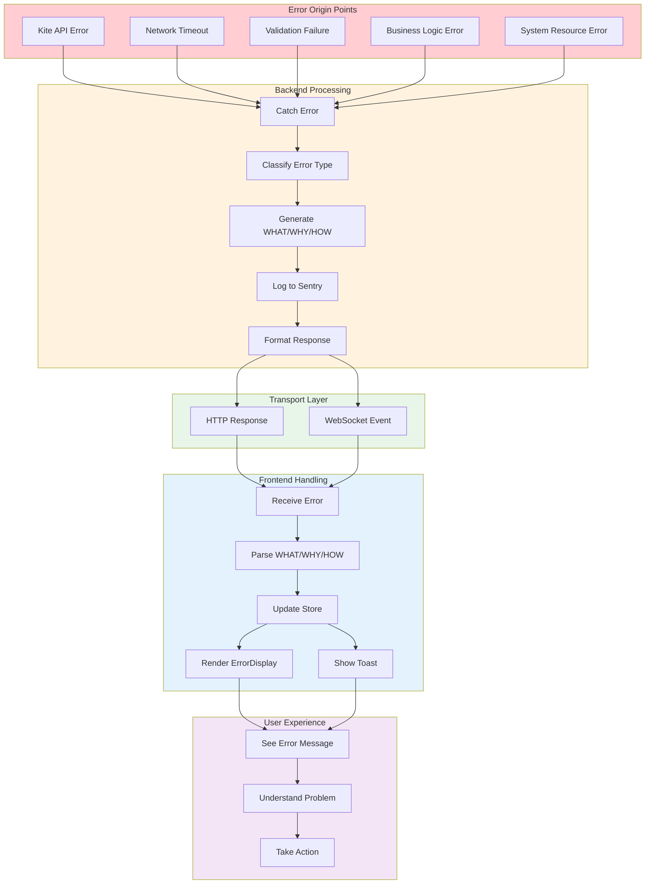
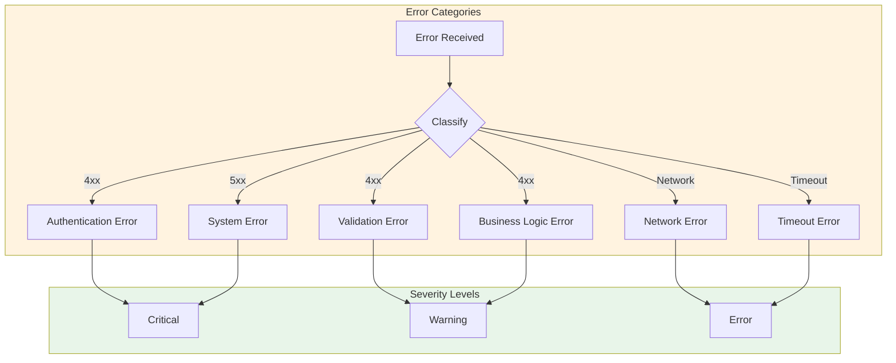
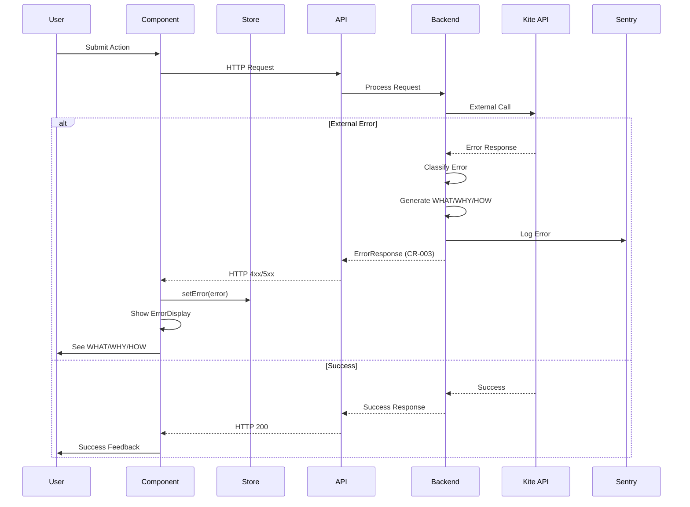

# 2.12 Error Propagation Architecture
## WHAT/WHY/HOW Flow Through All Layers (CR-003 SACRED)

**Node ID:** 2.12
**Category:** Integration
**CR Impact:** CR-003 (WHAT/WHY/HOW Error Format) - SACRED
**Status:** CREATED
**Version:** 1.0
**Date:** 2026-01-27

---

## Purpose

This document defines the complete error propagation architecture that is CONSTITUTIONALLY REQUIRED by CR-003. All errors throughout MCI must follow the WHAT/WHY/HOW format.

---

## CR-003 Definition

> **CR-003: WHAT/WHY/HOW Error Format**
> All errors must use a three-part format:
> - **WHAT**: Brief description of what happened
> - **WHY**: Explanation of why it happened
> - **HOW**: Actionable steps to resolve the issue

---

## Error Flow Overview



---

## Error Type Classification



---

## Error Interface Definition

```typescript
/**
 * CR-003 Compliant Error Structure
 */
interface MCIError {
  what: string;   // Brief description (max 50 chars)
  why: string;    // Explanation (max 100 chars)
  how: string;    // Resolution steps (max 150 chars)
}

interface ErrorResponse {
  error: MCIError;
  code: string;           // Machine-readable code
  severity: 'critical' | 'error' | 'warning' | 'info';
  timestamp: number;
  requestId?: string;     // For tracing
  context?: Record<string, unknown>;  // Additional data
}
```

---

## Error Catalog by Domain

### Authentication Errors (Phase 0)

| Code | WHAT | WHY | HOW |
|------|------|-----|-----|
| `AUTH_INVALID_KEY` | Invalid API key | The API key is not recognized by Kite | Verify the key in your Kite Console |
| `AUTH_INVALID_SECRET` | Invalid API secret | The secret doesn't match the API key | Regenerate the secret in Kite Console |
| `AUTH_INVALID_TOKEN` | Invalid request token | Token expired or already used | Get a new token from Kite login |
| `AUTH_TOKEN_EXPIRED` | Session expired | Token expired at 6:00 AM IST (CR-004) | Re-authenticate to get a new token |
| `AUTH_RATE_LIMITED` | Too many attempts | Exceeded authentication rate limit | Wait 60 seconds and try again |

### Scan Errors (Phase 1)

| Code | WHAT | WHY | HOW |
|------|------|-----|-----|
| `SCAN_KITE_UNREACHABLE` | Cannot reach Kite API | Network issue or Kite maintenance | Check internet and Kite status page |
| `SCAN_TOKEN_INVALID` | Token validation failed | Token is invalid or expired | Return to Phase 0 for new token |
| `SCAN_BACKEND_DOWN` | Backend not responding | Server process crashed | Restart the backend server |
| `SCAN_TIMEOUT` | Scan check timed out | Check took longer than 5 seconds | Retry or check system resources |

### Ignition Errors (Phase 2)

| Code | WHAT | WHY | HOW |
|------|------|-----|-----|
| `IGN_NO_BACKEND` | No backend selected | Must select a broker before ignition | Select Zerodha, ICICI, HDFC, or Kotak |
| `IGN_BACKEND_UNAVAILABLE` | Broker not available | Broker API is down or unreachable | Check broker status, try later |
| `IGN_ALREADY_RUNNING` | System already running | Cannot ignite twice | Go to Phase 3 or shutdown first |
| `IGN_TIMEOUT` | Ignition timed out | Connection took too long | Check network, retry |

### Telemetry Errors (Phase 3)

| Code | WHAT | WHY | HOW |
|------|------|-----|-----|
| `TEL_WS_DISCONNECTED` | Lost connection | WebSocket connection dropped | Reconnecting automatically... |
| `TEL_DATA_STALE` | Data not updating | Stream interrupted | Check connection status |
| `TEL_PARSE_ERROR` | Invalid data received | Malformed data from broker | Contact support if persists |

### Shutdown Errors (Phase 4 - CR-002)

| Code | WHAT | WHY | HOW |
|------|------|-----|-----|
| `SHUT_ORDERS_FAILED` | Cannot cancel orders | Broker rejected cancellation | Use emergency shutdown |
| `SHUT_POSITIONS_FAILED` | Cannot close positions | Market closed or positions locked | Wait for market open |
| `SHUT_DISCONNECT_FAILED` | Broker disconnect stuck | Connection not closing cleanly | Force disconnect will be used |
| `SHUT_ALREADY_RUNNING` | Shutdown in progress | Another shutdown is running | Wait for current shutdown |

---

## Backend Error Generation

```typescript
// src/server/lib/errors.ts

export function createMCIError(
  code: string,
  what: string,
  why: string,
  how: string,
  severity: 'critical' | 'error' | 'warning' | 'info' = 'error',
  context?: Record<string, unknown>
): ErrorResponse {
  const error: ErrorResponse = {
    error: { what, why, how },
    code,
    severity,
    timestamp: Date.now(),
    requestId: crypto.randomUUID(),
    context
  };
  
  // Log to Sentry for critical/error severity
  if (severity === 'critical' || severity === 'error') {
    Sentry.captureException(new Error(`${code}: ${what}`), {
      extra: { why, how, context }
    });
  }
  
  return error;
}

// Usage in route
app.post('/api/auth/validate', async (c) => {
  try {
    // ... validation logic
  } catch (err) {
    if (err.code === 'INVALID_API_KEY') {
      return c.json(createMCIError(
        'AUTH_INVALID_KEY',
        'Invalid API key',
        'The API key is not recognized by Kite',
        'Verify the key in your Kite Console',
        'error'
      ), 401);
    }
  }
});
```

---

## Frontend Error Handling

```typescript
// src/client/lib/errors.ts

export function handleAPIError(response: ErrorResponse): void {
  const { error, code, severity } = response;
  
  // Update relevant store with error
  switch (code.split('_')[0]) {
    case 'AUTH':
      tokenStore.setError(error);
      break;
    case 'SCAN':
      scannerStore.setError(error);
      break;
    case 'IGN':
      ignitionStore.setError(error);
      break;
    case 'TEL':
      telemetryStore.setError(error);
      break;
    case 'SHUT':
      shutdownStore.setError(error);
      break;
  }
  
  // Show toast notification
  addToast({
    type: severity === 'critical' ? 'error' : severity,
    title: error.what,
    message: `${error.why}. ${error.how}`
  });
}
```

---

## ErrorDisplay Component

```tsx
// src/client/components/uxmi/ErrorDisplay.tsx

interface ErrorDisplayProps {
  error: MCIError;
  onDismiss?: () => void;
}

export const ErrorDisplay: React.FC<ErrorDisplayProps> = ({ error, onDismiss }) => {
  return (
    <div className="bg-red-50 border border-red-200 rounded-lg p-4">
      <div className="flex items-start gap-3">
        <div className="text-red-500 text-xl">⚠️</div>
        <div className="flex-1">
          <h3 className="font-semibold text-red-800">{error.what}</h3>
          <p className="text-red-600 text-sm mt-1">
            <strong>Why:</strong> {error.why}
          </p>
          <p className="text-red-600 text-sm mt-1">
            <strong>How to fix:</strong> {error.how}
          </p>
        </div>
        {onDismiss && (
          <button onClick={onDismiss} className="text-red-400 hover:text-red-600">
            ✕
          </button>
        )}
      </div>
    </div>
  );
};
```

---

## Error Propagation Sequence



---

## Sentry Integration

All errors with severity `critical` or `error` are logged to Sentry with:

| Field | Content |
|-------|---------|
| `error.message` | `{code}: {what}` |
| `error.extra.why` | Why explanation |
| `error.extra.how` | How to fix |
| `error.extra.context` | Additional context data |
| `error.tags.phase` | Current MCI phase (0-4) |
| `error.tags.severity` | Error severity level |

---

## Testing Requirements

Each error code must have tests verifying:

1. **Backend generates correct format** - WHAT/WHY/HOW present
2. **HTTP status matches severity** - 4xx for client, 5xx for server
3. **Frontend parses correctly** - Store updated, toast shown
4. **ErrorDisplay renders all fields** - WHAT, WHY, HOW visible
5. **Sentry receives critical errors** - Logged with context

---

## CR-003 Compliance Checklist

- [ ] All backend errors return `{ error: { what, why, how } }`
- [ ] All error codes documented in catalog
- [ ] ErrorDisplay component shows all three fields
- [ ] Toast notifications include resolution steps
- [ ] Sentry captures errors with full context
- [ ] No raw error messages exposed to users
- [ ] All phases have error handling coverage

---

*Document ID: FLOW-2.12-ERRORS | Layer 2 Architecture | MCI Project | CR-003 SACRED*
