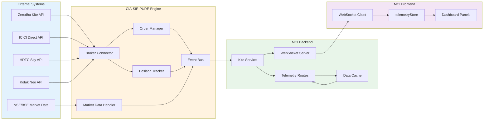
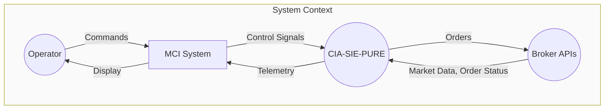
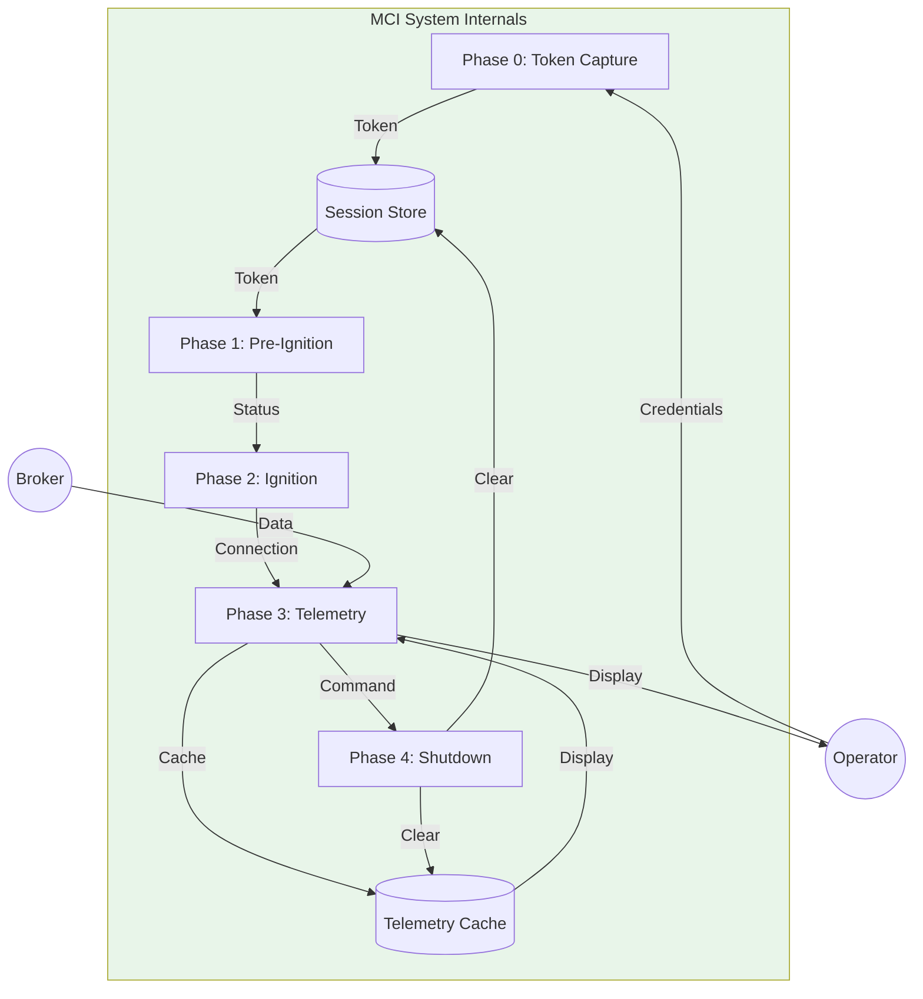
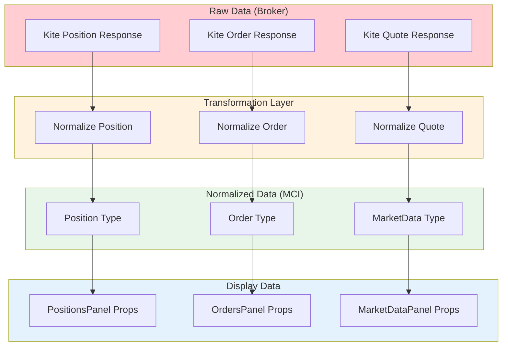
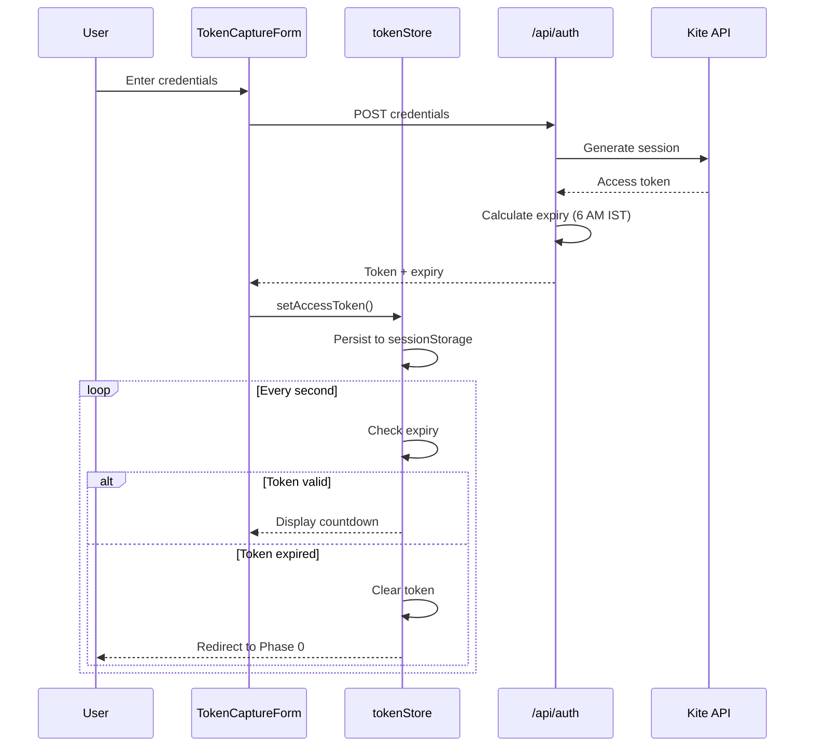
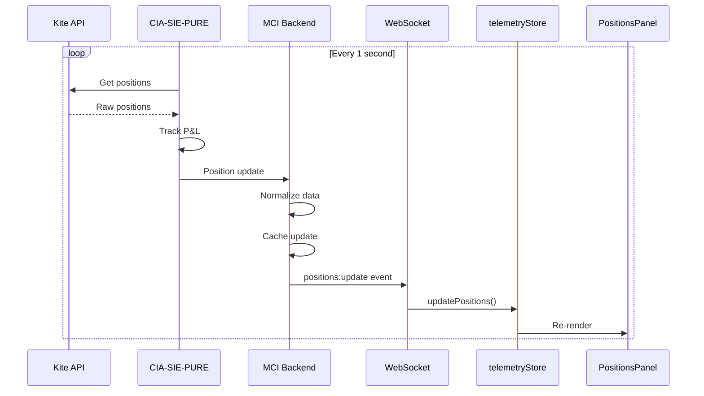
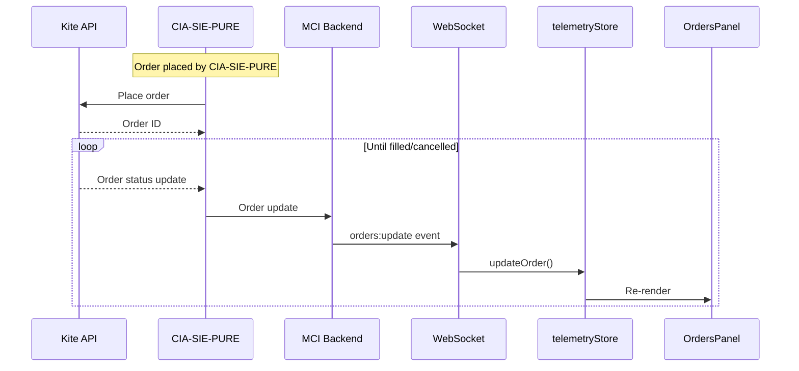
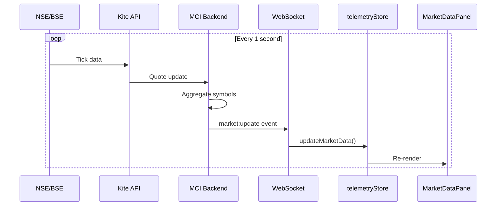
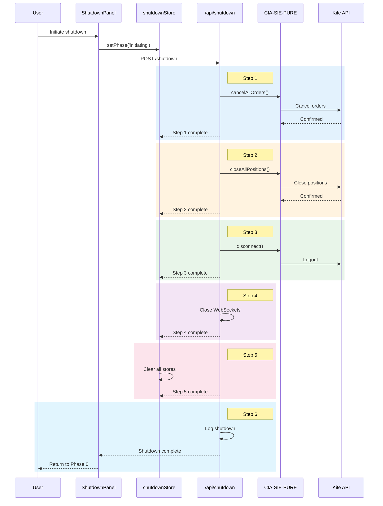

# 2.13 Data Flow Lifecycle Architecture
## Complete DFD: Broker → Engine → MCI → Dashboard

**Node ID:** 2.13
**Category:** Integration
**CR Impact:** End-to-End Data Flow, INV-006 (Input Sanitization)
**Status:** UPDATED
**Version:** 1.1
**Date:** 2026-01-28

---

## Purpose

This document defines the complete data flow lifecycle from external broker APIs through the CIA-SIE-PURE trading engine to the MCI dashboard display, showing all transformation and storage points.

---

## End-to-End Data Flow



---

## Data Flow Diagram (Level 0 - Context)



---

## Data Flow Diagram (Level 1 - System)



---

## Data Types and Transformations



---

## Data Lifecycle Stages

| Stage | Location | Data State | Retention |
|-------|----------|------------|-----------|
| **Capture** | Broker API | Raw JSON | Transient |
| **Transform** | MCI Backend | Normalized | Transient |
| **Cache** | Server Memory | Indexed | Session |
| **Transport** | WebSocket | Serialized | Transient |
| **Store** | Zustand Store | Reactive | Session |
| **Display** | React Component | Rendered | Frame |

---

## Token Data Flow (CR-001, CR-004)



---

## Position Data Flow



---

## Order Data Flow



---

## Market Data Flow



---

## Shutdown Data Flow (CR-002)



---

## Data Storage Points

| Store | Type | Scope | Data | Cleared On |
|-------|------|-------|------|------------|
| `tokenStore` | Zustand + localStorage | Daily (INV-001) | Credentials, token, expiry | Expiry (6:00 AM IST), manual clear |
| `scannerStore` | Zustand | Session | Check results | Phase transition |
| `ignitionStore` | Zustand + sessionStorage | Session | Backend, phase | Shutdown |
| `telemetryStore` | Zustand | Session | Positions, orders, account, health | Shutdown |
| `shutdownStore` | Zustand | Session | Steps, progress | Complete |
| Server Cache | In-memory | Request | Telemetry snapshot | Server restart |

---

## Data Validation Points

| Point | Validation | Failure Action |
|-------|------------|----------------|
| Token Capture | Kite API validates | Show CR-003 error |
| Token Usage | Check expiry (CR-004) | Redirect to Phase 0 |
| Scan Checks | 12-point validation | Block ignition |
| Ignition | Backend availability | Show CR-003 error |
| Telemetry | Schema validation | Log, skip update |
| Shutdown | Step completion | Retry or force |

---

## INV-006: Input Sanitization Boundaries

```
┌─────────────────────────────────────────────────────────────────────────┐
│                        DATA INGRESS BOUNDARIES                          │
├─────────────────────────────────────────────────────────────────────────┤
│                                                                         │
│   USER INPUT                                                            │
│   ══════════                                                            │
│   ┌──────────────┐                                                      │
│   │ Form Fields  │ ─────→ [SANITIZE #1] ─────→ tokenStore               │
│   │ (may have    │       sanitizeKiteCredentials()                      │
│   │  whitespace) │                                                      │
│   └──────────────┘                                                      │
│                                                                         │
│   STORAGE REHYDRATION                                                   │
│   ═══════════════════                                                   │
│   ┌──────────────┐                                                      │
│   │ localStorage │ ─────→ [SANITIZE #2] ─────→ tokenStore (in-memory)  │
│   │ (may have    │       sanitizeString() on each field                │
│   │  dirty data) │                                                      │
│   └──────────────┘                                                      │
│                                                                         │
│   API BOUNDARY                                                          │
│   ════════════                                                          │
│   ┌──────────────┐                                                      │
│   │ Request Body │ ─────→ [SANITIZE #3] ─────→ buildKiteAuthHeader()   │
│   │ (never trust │       sanitizeCredentialsFromRequest()              │
│   │  upstream)   │                                                      │
│   └──────────────┘                                                      │
│                                                                         │
│   PROTOCOL CONSTRUCTION                                                 │
│   ══════════════════════                                                │
│   ┌──────────────┐                                                      │
│   │ Sanitized    │ ─────→ [SAFE BUILDER] ────→ "token KEY:TOKEN"       │
│   │ Credentials  │       buildKiteAuthHeader()                         │
│   └──────────────┘       (ensures single space, no injection)          │
│                                                                         │
└─────────────────────────────────────────────────────────────────────────┘
```

| Boundary | Sanitizer | Purpose |
|----------|-----------|---------|
| User Input | `sanitizeKiteCredentials()` | Trim whitespace, validate format |
| localStorage | `sanitizeString()` | Never trust persisted data |
| API Request | `sanitizeCredentialsFromRequest()` | Defense in depth |
| Header Build | `buildKiteAuthHeader()` | Safe protocol construction |

---

## Performance Characteristics

| Data Type | Source Rate | Display Rate | Latency Target |
|-----------|-------------|--------------|----------------|
| Positions | 1/sec | 1/sec | < 100ms |
| Orders | On change | Immediate | < 100ms |
| Account | 5/sec | 5/sec | < 200ms |
| Health | 5/sec | 5/sec | < 200ms |
| Market | 1/sec | 1/sec | < 500ms |

---

## Failure Modes

| Failure | Detection | Recovery |
|---------|-----------|----------|
| Broker API down | Scan check, timeout | Retry, show error |
| WebSocket disconnect | Heartbeat miss | Reconnect with backoff |
| Cache overflow | Memory monitor | Evict old data |
| Token expired | Expiry check | Redirect to Phase 0 |
| Parse error | Schema validation | Log, skip, alert |

---

## Integration Points Summary

```
┌─────────────────────────────────────────────────────────────────┐
│                     EXTERNAL BOUNDARY                           │
│  ┌──────────────┐  ┌──────────────┐  ┌──────────────┐          │
│  │ Zerodha Kite │  │ ICICI Direct │  │  Other APIs  │          │
│  └──────┬───────┘  └──────┬───────┘  └──────┬───────┘          │
│         │                 │                 │                   │
│         └────────────┬────┴────────────────┘                   │
│                      ▼                                          │
│         ┌────────────────────────┐                             │
│         │    CIA-SIE-PURE        │                             │
│         │    (Trading Engine)     │                             │
│         └───────────┬────────────┘                             │
│                     │                                           │
├─────────────────────┼───────────────────────────────────────────┤
│                     ▼        MCI BOUNDARY                       │
│         ┌────────────────────────┐                             │
│         │    MCI Backend         │                             │
│         │  ┌──────────────────┐  │                             │
│         │  │ Kite Service     │  │                             │
│         │  │ Telemetry Routes │  │                             │
│         │  │ WebSocket Server │  │                             │
│         │  └──────────────────┘  │                             │
│         └───────────┬────────────┘                             │
│                     │                                           │
│                     ▼                                           │
│         ┌────────────────────────┐                             │
│         │    MCI Frontend        │                             │
│         │  ┌──────────────────┐  │                             │
│         │  │ Zustand Stores   │  │                             │
│         │  │ React Components │  │                             │
│         │  │ UXMI Library     │  │                             │
│         │  └──────────────────┘  │                             │
│         └───────────┬────────────┘                             │
│                     │                                           │
│                     ▼                                           │
│              ┌──────────────┐                                  │
│              │   Operator   │                                  │
│              └──────────────┘                                  │
└─────────────────────────────────────────────────────────────────┘
```

---

*Document ID: FLOW-2.13-LIFECYCLE | Layer 2 Architecture | MCI Project*
