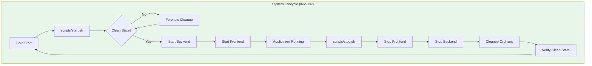
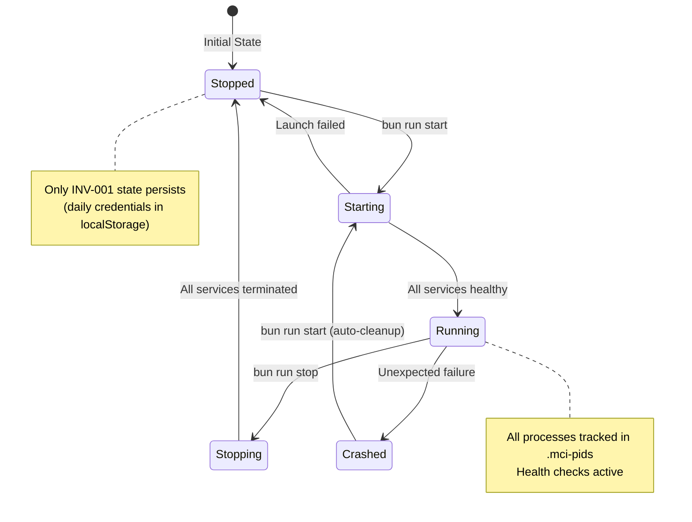
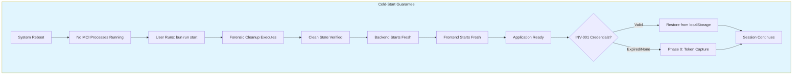

# 2.14 System Lifecycle Architecture
## INV-002 Compliant Launch, Shutdown, and State Discipline

**Node ID:** 2.14
**Category:** Operations
**INV Impact:** INV-002 (System Lifecycle Discipline) - SACRED
**Status:** CREATED
**Version:** 1.0
**Date:** 2026-01-28

---

## Purpose

This document defines the complete system lifecycle for MCI, ensuring deterministic launch, shutdown, and cold-start integrity as required by INV-002.

---

## INV-002 Definition

> **INV-002: System Lifecycle Discipline**
> The MCI application must behave as a single coherent system with deterministic launch, shutdown, and state management. No residual, orphaned, or hidden processes may influence application behavior.

---

## System Architecture Overview



---

## Launch Sequence Flow

```mermaid
flowchart TD
    subgraph LAUNCH["Launch Sequence (6 Steps)"]
        L1["Step 1: Forensic Cleanup"] --> L2["Step 2: Verify Clean State"]
        L2 --> L3["Step 3: Prepare Environment"]
        L3 --> L4["Step 4: Start Backend"]
        L4 --> L5["Step 5: Start Frontend"]
        L5 --> L6["Step 6: Display Status"]
    end

    subgraph STEP1["Step 1: Forensic Cleanup"]
        S1A[pkill vite] --> S1B[pkill bun server]
        S1B --> S1C[Kill port 5173]
        S1C --> S1D[Kill port 3000]
        S1D --> S1E[Remove .mci-pids]
    end

    subgraph STEP2["Step 2: Verify Clean State"]
        S2A{Port 5173 Free?} --> |No| S2B[Error: Cannot Proceed]
        S2A --> |Yes| S2C{Port 3000 Free?}
        S2C --> |No| S2B
        S2C --> |Yes| S2D[State Verified ✓]
    end

    subgraph STEP4["Step 4: Start Backend"]
        S4A[bun run server] --> S4B[Write PID to .mci-pids]
        S4B --> S4C{Health Check OK?}
        S4C --> |No| S4D[Retry 30x]
        S4D --> S4C
        S4C --> |Yes| S4E[Backend Ready ✓]
    end

    subgraph STEP5["Step 5: Start Frontend"]
        S5A[bun run dev] --> S5B[Write PID to .mci-pids]
        S5B --> S5C{Response on :5173?}
        S5C --> |No| S5D[Retry 30x]
        S5D --> S5C
        S5C --> |Yes| S5E[Frontend Ready ✓]
    end

    style LAUNCH fill:#e3f2fd
    style STEP1 fill:#ffcdd2
    style STEP2 fill:#fff3e0
    style STEP4 fill:#e8f5e9
    style STEP5 fill:#f3e5f5
```



---

## Shutdown Sequence Flow

```mermaid
flowchart TD
    subgraph SHUTDOWN["Shutdown Sequence (7 Steps)"]
        D1["Step 1: Read PIDs"] --> D2["Step 2: Stop Frontend"]
        D2 --> D3["Step 3: Stop Backend"]
        D3 --> D4["Step 4: Cleanup Orphans"]
        D4 --> D5["Step 5: Remove PID File"]
        D5 --> D6["Step 6: Verify Clean State"]
        D6 --> D7["Step 7: Display Status"]
    end

    subgraph STEP_D2["Step 2: Stop Frontend"]
        D2A[Kill by PID] --> D2B[pkill vite]
        D2B --> D2C[Force kill :5173]
    end

    subgraph STEP_D3["Step 3: Stop Backend"]
        D3A[Kill by PID] --> D3B[pkill bun server]
        D3B --> D3C[Force kill :3000]
    end

    subgraph STEP_D6["Step 6: Verify Clean State"]
        D6A{Port 5173 Free?} --> |No| D6B[--force?]
        D6B --> |Yes| D6C[Force Kill]
        D6B --> |No| D6D[Error]
        D6A --> |Yes| D6E{Port 3000 Free?}
        D6E --> |No| D6B
        D6E --> |Yes| D6F[State Verified ✓]
        D6C --> D6F
    end

    style SHUTDOWN fill:#ffcdd2
    style STEP_D2 fill:#fff3e0
    style STEP_D3 fill:#e8f5e9
    style STEP_D6 fill:#f3e5f5
```



---

## State Persistence Model



---

## Cold-Start Integrity



---

## Tooling Subordination

| Tool/Process | Subordination Rule |
|--------------|-------------------|
| Vite Dev Server | Started/stopped ONLY by lifecycle scripts |
| Bun Backend | Started/stopped ONLY by lifecycle scripts |
| Terminal Sessions | Must not outlive application lifecycle |
| Browser DevTools | Read-only observation, no state injection |
| Test Runners | Use isolated environments, do not affect production |

---

## File Structure

```
12_APPLICATION_CODE/
├── scripts/
│   ├── start.sh      ← Authoritative launch script
│   ├── stop.sh       ← Authoritative shutdown script
│   └── status.sh     ← Status reporting script
├── .mci-pids         ← PID tracking file (runtime only)
├── logs/
│   ├── backend.log   ← Backend server logs
│   └── frontend.log  ← Frontend server logs
└── package.json      ← npm scripts: start, stop, status, restart
```

---

## Command Reference

| Command | Action | INV-002 Compliance |
|---------|--------|-------------------|
| `bun run start` | Launch entire application | ✅ Authoritative launch |
| `bun run stop` | Shutdown entire application | ✅ Authoritative shutdown |
| `bun run status` | Report application status | ✅ State visibility |
| `bun run restart` | Stop then start | ✅ Clean cycle |
| `bun run dev` | Frontend only (dev) | ⚠️ Subordinate - use start.sh |
| `bun run server` | Backend only | ⚠️ Subordinate - use start.sh |

---

## Integration with CR-002

| Scope | CR-002 (In-App Shutdown) | INV-002 (System Lifecycle) |
|-------|--------------------------|---------------------------|
| Trigger | User clicks "Shutdown" in UI | User runs `bun run stop` |
| Orders | Cancel all pending orders | N/A (process level) |
| Positions | Close all positions | N/A (process level) |
| Broker | Disconnect from API | N/A (process level) |
| Telemetry | Stop WebSocket streams | Stop backend server |
| Session | Clear store state | Remove runtime files |
| Logging | Log shutdown complete | Verify clean state |

---

## Verification Checklist

- [ ] `bun run status` shows "APPLICATION STOPPED" before launch
- [ ] `bun run start` completes all 6 steps successfully
- [ ] `bun run status` shows "APPLICATION RUNNING" after launch
- [ ] Health check at http://localhost:3000/api/health returns OK
- [ ] Frontend accessible at http://localhost:5173
- [ ] `bun run stop` terminates all processes
- [ ] `bun run status` shows "APPLICATION STOPPED" after shutdown
- [ ] Ports 5173 and 3000 are released
- [ ] No orphaned processes remain

---

*Document ID: FLOW-2.14-LIFECYCLE | Layer 2 Architecture | MCI Project | INV-002 SACRED*
