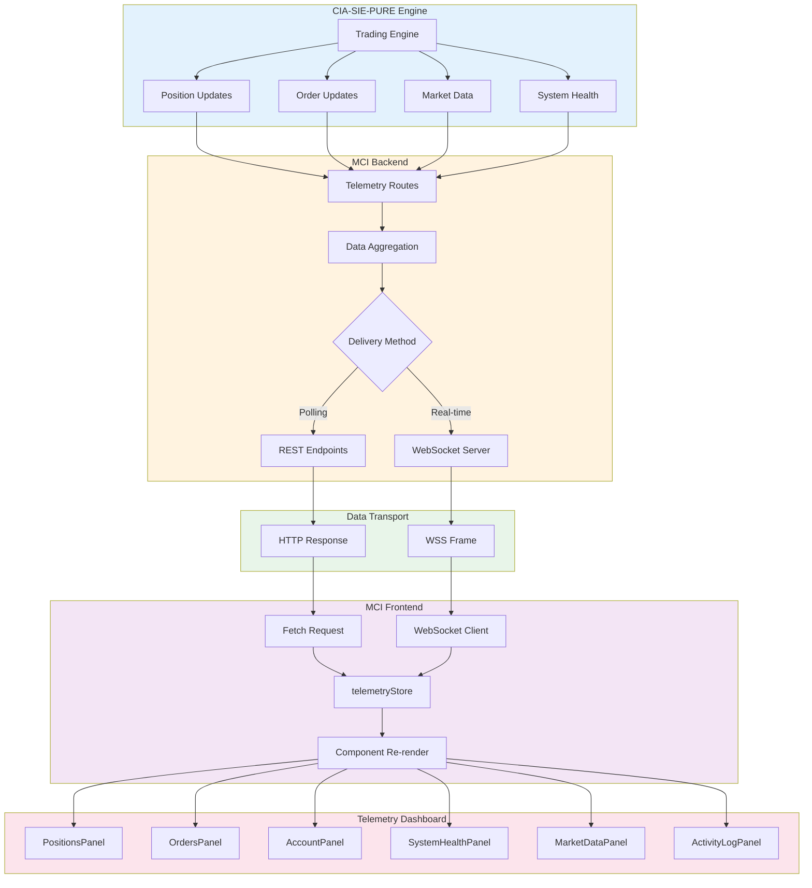
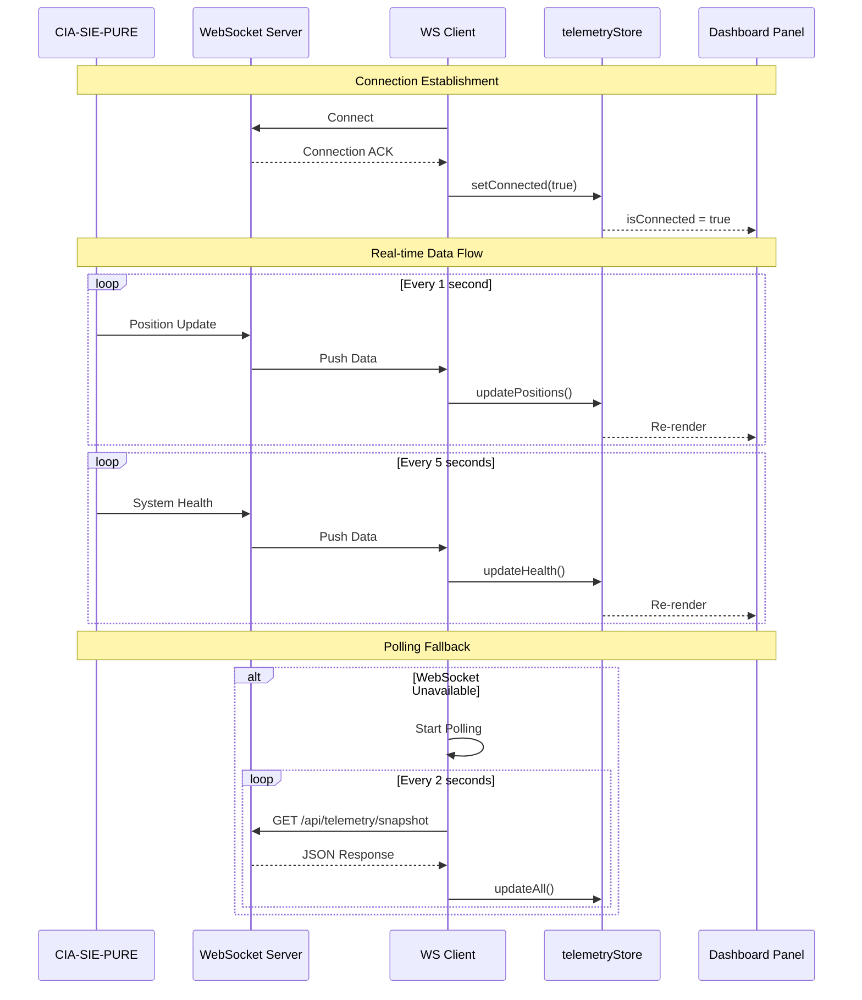
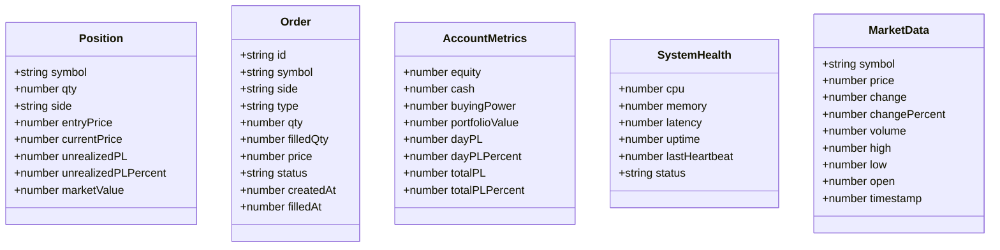
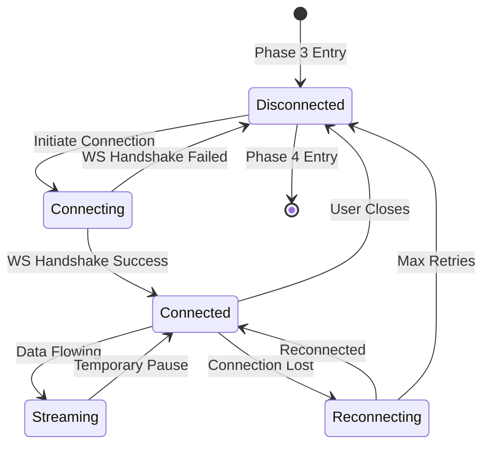

# 2.4 Telemetry Pipeline Architecture
## Data Flow: Engine → WebSocket → Cache → Frontend

**Node ID:** 2.4
**Category:** Backend
**CR Impact:** Phase 3 Real-time Data
**Status:** CREATED
**Version:** 1.0
**Date:** 2026-01-27

---

## Purpose

This document defines the complete telemetry data pipeline from the CIA-SIE-PURE trading engine through to the MCI dashboard display.

---

## Flow Diagram

---

## Sequence Diagram

---

## Data Types

---

## API Endpoints

| Endpoint | Method | Purpose | Update Frequency |
|----------|--------|---------|------------------|
| `/api/telemetry/positions` | GET | Current positions | 1s |
| `/api/telemetry/orders` | GET | Active/recent orders | 2s |
| `/api/telemetry/account` | GET | Account metrics | 5s |
| `/api/telemetry/health` | GET | System health | 5s |
| `/api/telemetry/market` | GET | Market data | 1s |
| `/api/telemetry/market/:symbol` | GET | Single symbol data | 1s |
| `/api/telemetry/snapshot` | GET | Complete snapshot | On demand |

---

## WebSocket Events

| Event | Direction | Payload | Purpose |
|-------|-----------|---------|---------|
| `connect` | Client→Server | - | Establish connection |
| `disconnect` | Client→Server | - | Close connection |
| `positions` | Server→Client | Position[] | Position updates |
| `orders` | Server→Client | Order[] | Order updates |
| `account` | Server→Client | AccountMetrics | Account updates |
| `health` | Server→Client | SystemHealth | Health updates |
| `market` | Server→Client | MarketData[] | Market updates |
| `activity` | Server→Client | ActivityLog[] | Activity log |

---

## Component Mapping

| Component | File | Data Source |
|-----------|------|-------------|
| TelemetryDashboard | `src/client/components/phase3/TelemetryDashboard.tsx` | Orchestrator |
| PositionsPanel | `src/client/components/phase3/PositionsPanel.tsx` | positions |
| OrdersPanel | `src/client/components/phase3/OrdersPanel.tsx` | orders |
| AccountPanel | `src/client/components/phase3/AccountPanel.tsx` | account |
| SystemHealthPanel | `src/client/components/phase3/SystemHealthPanel.tsx` | health |
| MarketDataPanel | `src/client/components/phase3/MarketDataPanel.tsx` | market |
| ActivityLogPanel | `src/client/components/phase3/ActivityLogPanel.tsx` | activity |
| telemetryStore | `src/client/stores/telemetryStore.ts` | All data |
| telemetry route | `src/server/routes/telemetry.ts` | Data source |

---

## Data Flow State

---

## Performance Requirements

| Metric | Target | Rationale |
|--------|--------|-----------|
| Latency (Position Update) | < 100ms | Real-time trading awareness |
| Latency (Market Data) | < 500ms | Acceptable for monitoring |
| Reconnection Time | < 5s | Minimize blind periods |
| Memory Usage | < 50MB | Dashboard efficiency |
| Update Rate | 1-5s | Balance freshness vs. load |

---

## Error Handling (CR-003)

| Scenario | WHAT | WHY | HOW |
|----------|------|-----|-----|
| WebSocket Disconnect | Connection lost | Network issue or server restart | Auto-reconnect with backoff |
| Stale Data | Data not updating | Stream interrupted | Display warning, retry |
| Parse Error | Invalid data received | Schema mismatch | Log error, skip update |
| Server Overload | Slow updates | High system load | Display degraded status |

---

## Integration Points

| From | To | Protocol | Purpose |
|------|-----|----------|---------|
| CIA-SIE-PURE | MCI Backend | Internal | Trading data |
| MCI Backend | telemetryStore | WSS/HTTP | Data delivery |
| telemetryStore | Dashboard Panels | Zustand | State distribution |

---

*Document ID: FLOW-2.4-TELEMETRY | Layer 2 Architecture | MCI Project*
