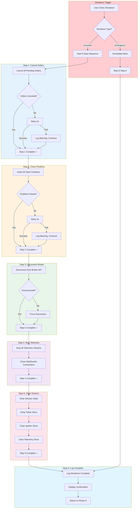
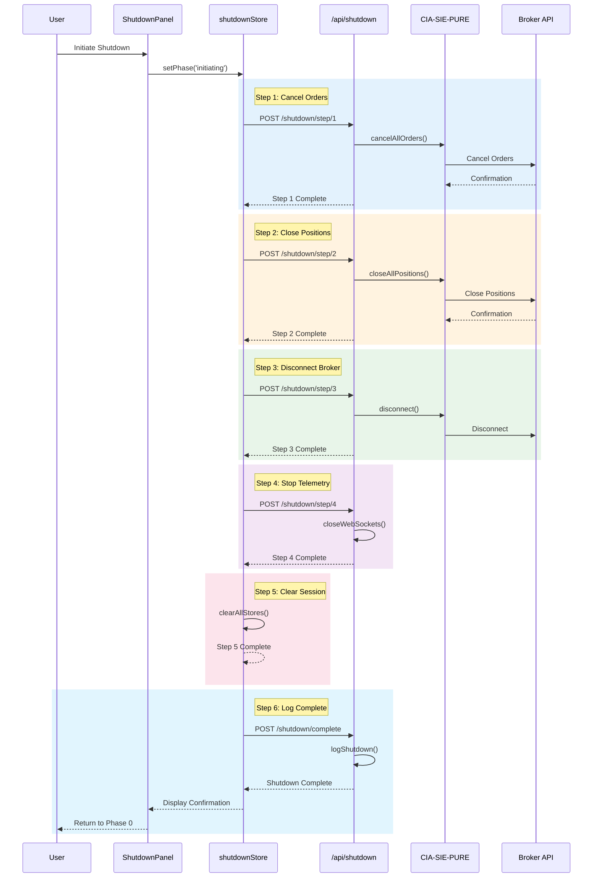
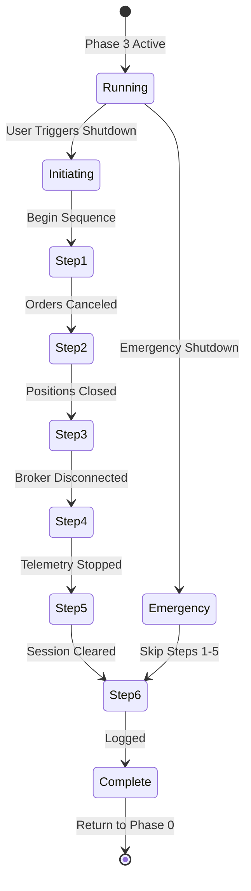

# 2.5 Shutdown Sequence Architecture
## 6-Step CR-002 Compliant Graceful Shutdown

**Node ID:** 2.5
**Category:** Backend
**CR Impact:** CR-002 (Graceful Shutdown) - SACRED
**Status:** CREATED
**Version:** 1.0
**Date:** 2026-01-27

---

## Purpose

This document defines the complete 6-step graceful shutdown protocol that is CONSTITUTIONALLY REQUIRED by CR-002. This is a SACRED requirement with no exceptions.

---

## CR-002 Definition

> **CR-002: Graceful Shutdown Protocol**
> All shutdowns must follow a 6-step sequence:
> 1. Cancel all pending orders
> 2. Close all positions
> 3. Disconnect from broker
> 4. Stop telemetry streams
> 5. Clear session state
> 6. Log shutdown complete

---

## Flow Diagram



---

## Sequence Diagram



---

## State Diagram



---

## Step Details

| Step | Action | Timeout | Retry | Fallback |
|------|--------|---------|-------|----------|
| 1 | Cancel all pending orders | 30s | 3x | Log warning, continue |
| 2 | Close all open positions | 60s | 3x | Log warning, continue |
| 3 | Disconnect from broker | 10s | 1x | Force disconnect |
| 4 | Stop telemetry streams | 5s | 0x | Force close |
| 5 | Clear session state | 1s | 0x | Force clear |
| 6 | Log shutdown complete | 1s | 0x | Log locally |

---

## Component Mapping

| Component | File | Responsibility |
|-----------|------|----------------|
| ShutdownPanel | `src/client/components/phase4/ShutdownPanel.tsx` | Shutdown UI |
| shutdownStore | `src/client/stores/shutdownStore.ts` | Shutdown state |
| shutdown route | `src/server/routes/shutdown.ts` | Shutdown execution |

---

## API Contract

### POST /api/shutdown

**Request:**
```json
{
  "type": "graceful" | "emergency"
}
```

**Response (Success):**
```json
{
  "success": true,
  "steps": [
    { "step": 1, "name": "Cancel Orders", "status": "complete", "duration": 2500 },
    { "step": 2, "name": "Close Positions", "status": "complete", "duration": 5200 },
    { "step": 3, "name": "Disconnect Broker", "status": "complete", "duration": 800 },
    { "step": 4, "name": "Stop Telemetry", "status": "complete", "duration": 200 },
    { "step": 5, "name": "Clear Session", "status": "complete", "duration": 50 },
    { "step": 6, "name": "Log Complete", "status": "complete", "duration": 100 }
  ],
  "totalDuration": 8850,
  "timestamp": 1706400000000
}
```

**Response (Error):**
```json
{
  "success": false,
  "failedStep": 2,
  "error": {
    "what": "Position close failed",
    "why": "Market closed for trading",
    "how": "Wait for market open or use emergency shutdown"
  },
  "partialSteps": [ /* completed steps */ ]
}
```

---

## Emergency vs Graceful

| Aspect | Graceful | Emergency |
|--------|----------|-----------|
| Steps Executed | All 6 | Only Step 6 |
| Orders | Canceled | Left as-is |
| Positions | Closed | Left open |
| Data Loss Risk | None | Possible |
| Use Case | Normal operation | System failure |
| User Confirmation | Required | Optional |

---

## Error Handling (CR-003)

| Scenario | WHAT | WHY | HOW |
|----------|------|-----|-----|
| Order Cancel Failed | Cannot cancel orders | Broker rejected request | Use emergency shutdown |
| Position Close Failed | Cannot close positions | Market closed or illiquid | Wait for market open |
| Broker Disconnect Failed | Connection stuck | Network issue | Force disconnect |
| Step Timeout | Step taking too long | Slow broker response | Skip step with warning |

---

## CR-002 Compliance Checklist

- [ ] All 6 steps executed in order
- [ ] Each step logged with timestamp
- [ ] Failures logged but don't block sequence
- [ ] Emergency path available
- [ ] Final confirmation displayed
- [ ] Session fully cleared before Phase 0

---

## Integration Points

| From | To | Protocol | Purpose |
|------|-----|----------|---------|
| ShutdownPanel | shutdownStore | Zustand | State management |
| shutdownStore | /api/shutdown | HTTP POST | Execute shutdown |
| /api/shutdown | CIA-SIE-PURE | Internal | Trading operations |
| /api/shutdown | Broker API | HTTPS | Cancel/close |
| shutdownStore | All Stores | Zustand | Clear state |

---

*Document ID: FLOW-2.5-SHUTDOWN | Layer 2 Architecture | MCI Project | CR-002 SACRED*
