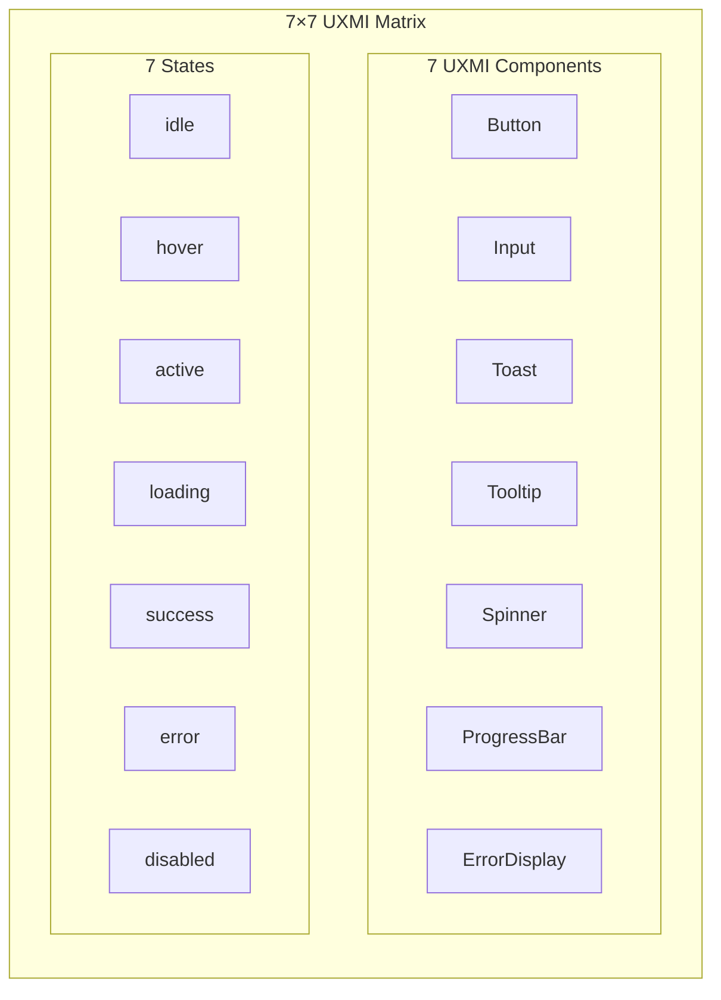
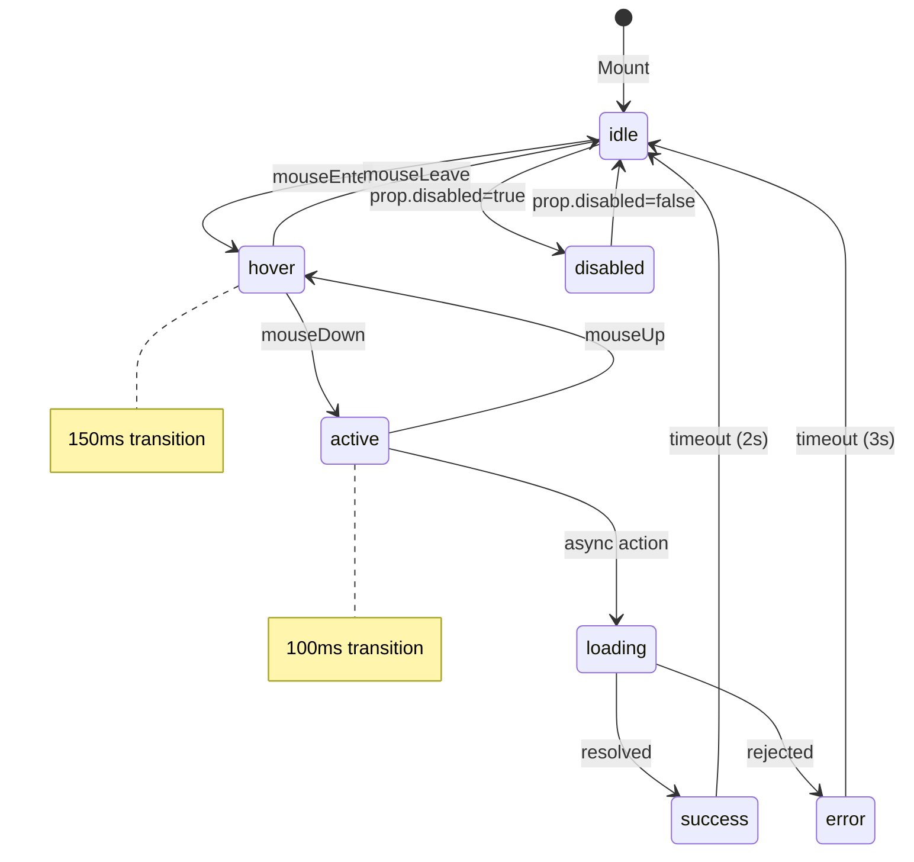
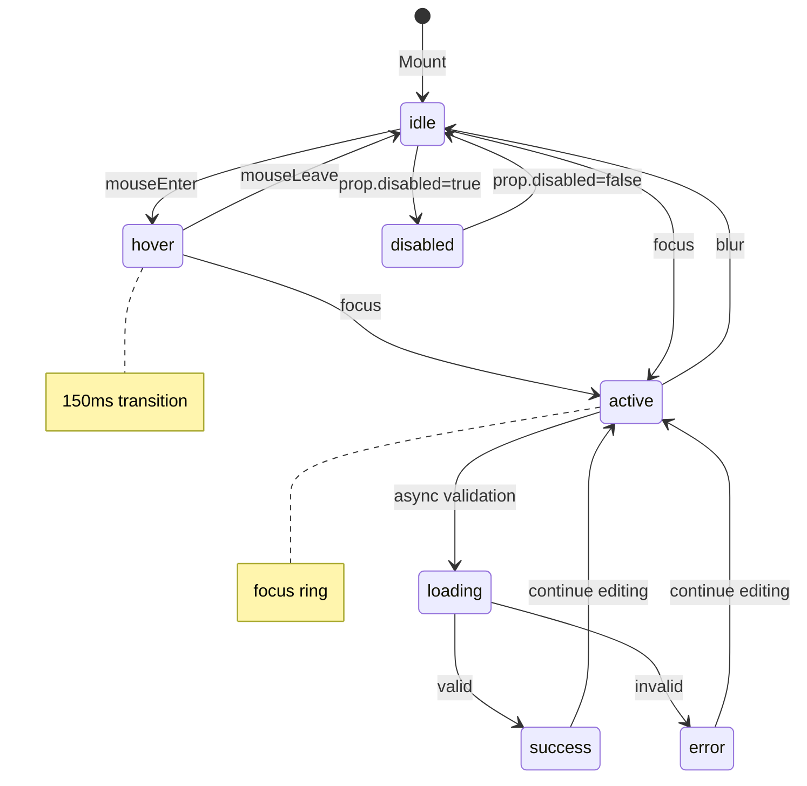
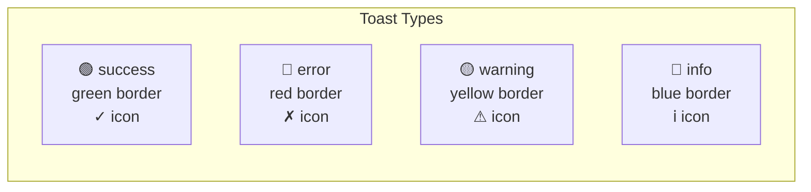

# 2.9 UXMI States Architecture
## 7 Components × 7 States Visualization (CR-005 SACRED)

**Node ID:** 2.9
**Category:** Frontend
**CR Impact:** CR-005 (UXMI 7-States) - SACRED
**Status:** CREATED
**Version:** 1.0
**Date:** 2026-01-27

---

## Purpose

This document defines the complete UXMI (UX Micro-Interactions) state matrix that is CONSTITUTIONALLY REQUIRED by CR-005. All interactive UI components MUST implement the 7-state standard.

---

## CR-005 Definition

> **CR-005: UXMI 7-States**
> All interactive UI components must implement a 7-state micro-interaction standard:
> 1. **idle** - Default resting state
> 2. **hover** - Mouse over (150ms transition)
> 3. **active** - Pressed/engaged (100ms transition)
> 4. **loading** - Async operation in progress
> 5. **success** - Operation completed successfully
> 6. **error** - Operation failed
> 7. **disabled** - Interaction prevented

---

## State Matrix



---

## Component-State Applicability

| Component | idle | hover | active | loading | success | error | disabled |
|-----------|:----:|:-----:|:------:|:-------:|:-------:|:-----:|:--------:|
| **Button** | ✅ | ✅ | ✅ | ✅ | ✅ | ✅ | ✅ |
| **Input** | ✅ | ✅ | ✅ | ✅ | ✅ | ✅ | ✅ |
| **Toast** | - | - | - | - | ✅ | ✅ | - |
| **Tooltip** | ✅ | ✅ | - | - | - | - | - |
| **Spinner** | - | - | - | ✅ | - | - | - |
| **ProgressBar** | ✅ | - | - | ✅ | ✅ | ✅ | - |
| **ErrorDisplay** | - | - | - | - | - | ✅ | - |

---

## Button State Machine



---

## Input State Machine



---

## Timing Constants (SACRED)

| Constant | Value | Usage |
|----------|-------|-------|
| `HOVER_TRANSITION` | 150ms | Button, Input hover animations |
| `ACTIVE_TRANSITION` | 100ms | Button, Input active/pressed |
| `TOOLTIP_DELAY` | 300ms | Tooltip appearance delay |
| `TOAST_DURATION` | 5000ms | Toast auto-dismiss |
| `SUCCESS_TIMEOUT` | 2000ms | Success state auto-clear |
| `ERROR_TIMEOUT` | 3000ms | Error state auto-clear |

---

## Visual Specifications

### Button States

```
┌─────────────────────────────────────────────────────────────────┐
│ State      │ Background    │ Border      │ Text        │ Cursor │
├─────────────────────────────────────────────────────────────────┤
│ idle       │ blue-600      │ transparent │ white       │ pointer│
│ hover      │ blue-700      │ transparent │ white       │ pointer│
│ active     │ blue-800      │ transparent │ white       │ pointer│
│ loading    │ blue-600/50   │ transparent │ hidden      │ wait   │
│ success    │ green-600     │ transparent │ white       │ default│
│ error      │ red-600       │ transparent │ white       │ default│
│ disabled   │ gray-300      │ transparent │ gray-500    │ not-allowed│
└─────────────────────────────────────────────────────────────────┘
```

### Input States

```
┌─────────────────────────────────────────────────────────────────┐
│ State      │ Background    │ Border      │ Ring        │ Cursor │
├─────────────────────────────────────────────────────────────────┤
│ idle       │ white         │ gray-300    │ none        │ text   │
│ hover      │ white         │ gray-400    │ none        │ text   │
│ active     │ white         │ blue-500    │ blue-200/50 │ text   │
│ loading    │ gray-50       │ gray-300    │ none        │ wait   │
│ success    │ white         │ green-500   │ green-200/50│ text   │
│ error      │ white         │ red-500     │ red-200/50  │ text   │
│ disabled   │ gray-100      │ gray-200    │ none        │ not-allowed│
└─────────────────────────────────────────────────────────────────┘
```

---

## Toast Variants



---

## CSS Implementation

```css
/* CR-005 Timing Constants */
:root {
  --uxmi-hover-transition: 150ms;
  --uxmi-active-transition: 100ms;
  --uxmi-tooltip-delay: 300ms;
  --uxmi-toast-duration: 5000ms;
}

/* Button State Transitions */
.uxmi-button {
  transition: 
    background-color var(--uxmi-hover-transition) ease,
    transform var(--uxmi-active-transition) ease;
}

.uxmi-button:hover {
  background-color: var(--color-blue-700);
}

.uxmi-button:active {
  background-color: var(--color-blue-800);
  transform: scale(0.98);
}

/* Input Focus Ring */
.uxmi-input:focus {
  outline: none;
  border-color: var(--color-blue-500);
  box-shadow: 0 0 0 3px rgba(59, 130, 246, 0.5);
}
```

---

## Component Files

| Component | File | Lines | States Implemented |
|-----------|------|-------|-------------------|
| Button | `src/client/components/uxmi/Button.tsx` | 89 | All 7 |
| Input | `src/client/components/uxmi/Input.tsx` | 76 | All 7 |
| ErrorDisplay | `src/client/components/uxmi/ErrorDisplay.tsx` | 45 | error only |
| Toast | `src/client/components/uxmi/Toast.tsx` | 58 | success, error, warning, info |
| Tooltip | `src/client/components/uxmi/Tooltip.tsx` | 42 | idle, hover |
| Spinner | `src/client/components/uxmi/Spinner.tsx` | 34 | loading only |
| ProgressBar | `src/client/components/uxmi/ProgressBar.tsx` | 38 | idle, loading, success, error |

---

## Accessibility Requirements

| Requirement | Implementation |
|-------------|----------------|
| Focus visible | All focusable elements have visible focus ring |
| Keyboard navigation | Tab order, Enter/Space activation |
| Screen reader | ARIA labels for states |
| Motion reduction | Respect prefers-reduced-motion |
| Color contrast | WCAG AA minimum (4.5:1) |

---

## Testing Requirements

Each UXMI component must have tests for:
1. All applicable states render correctly
2. State transitions occur with correct timing
3. Keyboard interactions work
4. ARIA attributes present
5. Disabled state prevents interaction

---

*Document ID: FLOW-2.9-UXMI | Layer 2 Architecture | MCI Project | CR-005 SACRED*
