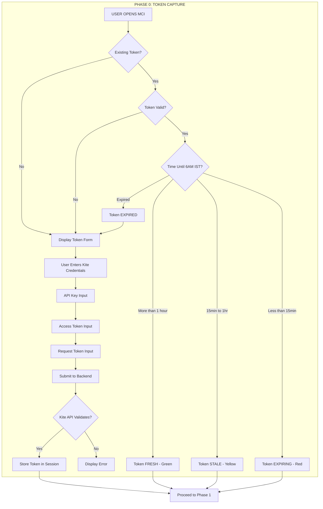

# VERBATIM STATE MACHINE - COMPLETE EXTRACTION

**Source:** b8937bc2-ac10-4287-8ced-af96ac5f6f0b.jsonl
**Extraction Date:** 2026-01-25

This document contains all state machine and state references.

**UXMI 7 States:**
1. idle - Default state
2. hover - Mouse hover
3. active - Being interacted with
4. loading - Async operation in progress
5. success - Operation completed successfully
6. error - Operation failed
7. disabled - Not interactive

---

## ALL STATE REFERENCES


### STATE REF 1

The session ended successfully after completing the terminology replacements in the HTML transcript files.

---

### STATE REF 2

### SESSION FINAL STATUS:
- **Summary:** "MCI Project Autonomous Purge Complete"
- **Checkpoint System:** Active at `/Users/nevillemehta/Downloads/PROJECTS/01_MCI/_SESSION_CHECKPOINTS/MASTER_CONTEXT.md`

---

### STATE REF 3

**Final State:** 12 occurrences remaining (intentional references in SUPERVISED_MISSION_DIRECTIVE explaining the transition, and cross-project references)

---

### STATE REF 4

The session from January 23rd has been fully analyzed and continued. The MCI project governance model has been successfully transitioned from **AUTONOMOUS** to **SUPERVISED** execution.

---

### STATE REF 5

**Current MCI Project State:**
- HTML verification: COMPLETE
- Q&A entries: 16 verified (Q1-Q16)
- LTT: 49 nodes, 34 complete, 69% score
- Autonomous→Supervised purge: COMPLETE (verified in session 02)

---

### STATE REF 6

**Batch 6 Summary:**
- L130: Claude: "MASTER_CONTEXT.md updated successfully"
- **L133: User: "first execute checkpoint"**
- L136-142: Checkpoint executed, added to log
- **L145: User: "Save this session as well so that it may be retrieved"**
- L147-149: Session save file written

---

### STATE REF 7

**Batch 8 Summary:**
- L176-179: More declines, then user interrupted
- **L181: User: "please proceed"**
- L183-196: 7 folder moves executed successfully
- L198: Claude: "All moves executed. Now verifying"
- L200: Verification of 02_SPECIFICATIONS folder

---

### STATE REF 8

**Batch 12 Summary:**
- L277: Synthesis file created successfully
- L279-300: Multiple edits to MASTER_CONTEXT.md (synthesis checkpoint added)

---

### STATE REF 9

**Batch 13 Summary:**
- L316: Claude: "Complete Project Synthesis executed successfully"
- **L319: User: "SAVE SESSION... MIRROR MCI FOLDER STRUCTURE AS A TREE IN HTML... INTERACTIVE FEATURE EXPAND..."**
- L321: Claude: "excellent strategic approach - creating dynamic HTML tree"
- L325: Starting Interactive HTML Tree creation

---

### STATE REF 10

**Batch 14 Summary:**
- L326-328: Interactive HTML Tree file created
- L330-350: Multiple edits updating session archive and MASTER_CONTEXT

---

### STATE REF 11

**Batch 15 Summary:**
- L364: Claude: "INTERACTIVE HTML TREE - COMPLETE"
- **L367: User: "05_AUDITS_AND_REPORTS... WHAT IS THE RELEVANCE... SHOULD IT BE MAINTAINED?"**
- L368-375: Claude examining audit files

---

### STATE REF 12

**Batch 25 Summary:**
- **L603: User: "CAN YOU OPEN THIS MERMAID FILE... EXPLAIN IT TO ME AS AN INTERACTIVE SESSION"**
- L605: Claude: "cannot render Mermaid diagrams visually in CLI"
- L609: Interactive architecture walkthrough
- **L612: User: "I NOW WANT YOU TO... IDENTIFY BY WAY OF THE MOST ADVANCED MAPPING SYSTEM THE ACTUAL USECASE OF THE MCI APPLICATION"**
- L614: Claude: "DEFINITIVE USE CASE SPECIFICATION"
- L615-617: Use case file created
- L619: Updating HTML tree and synthesis

---

### STATE REF 13

**Batch 31 Summary:**
- L751-754: Reading Zustand stores and components
- L756: Claude: "Excellent progress - examining UXMI and phase components"
- L757-774: Reading Input, Spinner, ProgressBar, ErrorDisplay, phase components

---

### STATE REF 14

**Batch 33 Summary:**
- L802-803: Edit error (string not found)
- L805-825: Claude fixing edit, updating multiple files

---

### STATE REF 15

**Batch 37 Summary:**
- L901-925: File edits (edit errors, Grep searches, updating synthesis and Master Context)

---

### STATE REF 16

**Batch 38 Summary:**
- L929-943: Updating Interactive HTML Tree
- L945: Claude: "SUMMARY: MCI_MASTER_LIFECYCLE_CONTROL_MAP.html created"
- **L948: User: "please add those Q&A entries directly into the html"**
- L950: Claude reading to add Q&A entries

---

### STATE REF 17

**Batch 42 Summary:**
- L1027: Claude: "I'll make integrations in two parts"
- L1028-1050: Adding Q&A entries, handling edit errors, finding correct locations

---

### STATE REF 18

| Task | Status | Details |
|------|--------|---------|
| Document Classification | ✅ | Completed all 12 documents |
| Folder Reorganization | ✅ | Moved files to proper directories |
| MCI_COMPLETE_PROJECT_SYNTHESIS.md | ✅ | Created |
| MCI_INTERACTIVE_PROJECT_TREE.html | ✅ | Created with expand/collapse |
| MCI_MASTER_USE_CASE_SPECIFICATION | ✅ | Both .md and .html versions |
| MCI_MASTER_LIFECYCLE_CONTROL_MAP.html | ✅ | 220KB, 6 tabs, LTT |
| Q&A Knowledge System | ✅ | Q1-Q16 integrated |
| Forensic Verification | ⚠️ | Interrupted mid-check |

---

### STATE REF 19

| Document | Location | Lines |
|----------|----------|-------|
| MCI_COMPLETE_PROJECT_SYNTHESIS.md | 00_MASTER_DOCUMENTS | ~300 |
| MCI_INTERACTIVE_PROJECT_TREE.html | 00_MASTER_DOCUMENTS | ~200 |
| MCI_MASTER_USE_CASE_SPECIFICATION.md | 00_MASTER_DOCUMENTS | ~400 |
| MCI_MASTER_USE_CASE_SPECIFICATION.html | 00_MASTER_DOCUMENTS | ~500 |
| MCI_MASTER_LIFECYCLE_CONTROL_MAP.html | 00_MASTER_DOCUMENTS | 4197 |

---

### STATE REF 20

**1. Present State vs Ideal State Tabs (Lines 991-992):**
```html
<button class="nav-tab active" data-tab="present">Present State (Complete)</button>
<button class="nav-tab" data-tab="ideal">Ideal State (To Achieve)</button>
```

---

### STATE REF 21

Layer 1: Constitutional Foundation    → 6/6 COMPLETE (100%)
Layer 2: Architecture Documentation   → 0% - CRITICAL GAP ⚠️
Layer 3: Quality Gates                → 6/6 PASSED (100%)
Layer 4A: Development Lifecycle       → 13/14 COMPLETE (93%)
Layer 5: Supervised Execution Pillars → 5 PILLARS ACTIVE
```

---

### STATE REF 22

## DIAGRAM 3: ENGINE/COCKPIT RELATIONSHIP TABLE
```
┌─────────────────────────────────────────────────────────┐
│  CIA-SIE-PURE (Engine)    │    MCI (Cockpit)           │
├─────────────────────────────────────────────────────────┤
│  Python/FastAPI           │    TypeScript/React        │
│  Executes trades          │    Monitors & Ignites      │
│  Backend system           │    Frontend dashboard      │
│  DOES the trading         │    DOES NOT trade          │
│  Lives separately         │    Connects via API        │
│  Runs 24/7 when active    │    Human interaction point │
└─────────────────────────────────────────────────────────┘

---

### STATE REF 23

## DIAGRAM 8: LTT HEALTH SCORECARD
```
┌─────────────────────────────────────────────────────────────────┐
│  📊 LIFECYCLE TRACEABILITY TREE - HEALTH SCORECARD              │
├─────────────────────────────────────────────────────────────────┤
│                                                                 │
│   Total Nodes    Complete    Architecture Gap    Minor Fixes    │
│      49            34              13                2          │
│    (Green)       (Green)         (Red)           (Orange)       │
│                                                                 │
│   Overall Score: 69%          Layers: 5                         │
│       (Blue)                  (Purple)                          │
│                                                                 │
├─────────────────────────────────────────────────────────────────┤
│  LAYER 1: Constitutional Foundation    → 6/6 COMPLETE (100%)    │
│  LAYER 2: Architecture Documentation   → 0/13 (CRITICAL GAP)    │
│  LAYER 3

---

### STATE REF 24

## DIAGRAM 4: 7-LAYER REVIEW FRAMEWORK
```
┌───────┬──────────────────────────────────────────────────────────────────────────┐
│ Layer │                              Understanding                               │
├───────┼──────────────────────────────────────────────────────────────────────────┤
│ 1     │ CIA-SIE-PURE is the ENGINE, MCI is the COCKPIT                           │
├───────┼──────────────────────────────────────────────────────────────────────────┤
│ 2     │ Car/Airplane analogies - Dashboard monitors and controls, does not drive │
├───────┼──────────────────────────────────────────────────────────────────────────┤
│ 3     │ 5 Phases: Token → Scan → Ignition → Telemetry → Shutdown                 │
├───────┼──────────────────────────────────────────────────────────────────────────┤
│ 4     │ 5 CRs: Token Validity, Graceful Shutdown, Error Format, 6AM Expiry, UXMI │
├───────┼──────────────────────────────────────────────────────────────────────────┤
│ 5     │ Audit: 97% c

---

### STATE REF 25

| # | Diagram | Type |
|---|---------|------|
| **BACKEND (5)** | | |
| 2.1 | Authentication Sequence | Sequence Diagram |
| 2.2 | Ignition Sequence | Sequence Diagram |
| 2.3 | Telemetry Pipeline | Flowchart |
| 2.4 | Shutdown Sequence (CR-002) | Sequence Diagram |
| 2.5 | Backend State Machine | State Diagram |
| **FRONTEND (4)** | | |
| 2.6 | Component Hierarchy | Tree Diagram |
| 2.7 | State Management Flow | Flowchart |
| 2.8 | Phase Progression | Flow Diagram |
| 2.9 | User Interaction Flow | Flowchart |
| **INTEGRATION (4)** | | |
| 2.10 | API Contract | Endpoint Spec |
| 2.11 | WebSocket Events | Event Schema |
| 2.12 | Error Propagation (CR-003) | Flow Diagram |
| 2.13 | Data Flow Lifecycle | DFD |

---

### STATE REF 26

```
┌─────────────────────────────────────────────────────────────────────────────────────────┐
│                              BACKEND STATE MACHINE                                       │
│                           MCI APPLICATION STATES                                         │
├─────────────────────────────────────────────────────────────────────────────────────────┤
│                                                                                          │
│                                    ┌───────────┐                                         │
│                                    │   START   │                                         │
│                                    └─────┬─────┘                                         │
│                                          │                                               │
│                                          ▼                                               │
│                           ┌──────────────────────────┐            

---

### STATE REF 27

```
                            ┌─────────────────────────────┐
                            │   📜 MASTER USE CASE SPEC   │
                            │      (The Constitution)     │
                            └──────────────┬──────────────┘
                                           │
              ┌────────────────────────────┼────────────────────────────┐
              │                            │                            │
              ▼                            ▼                            ▼
    ┌─────────────────┐          ┌─────────────────┐          ┌─────────────────┐
    │ ⚖️ CONSTITUTIONAL │          │ 🏗️ ARCHITECTURE  │          │ 🛡️ SUPERVISED   │
    │   REQUIREMENTS   │          │  DOCUMENTATION   │          │   EXECUTION     │
    └────────┬────────┘          └────────┬────────┘          └────────┬────────┘
             │                            │                            │
    ┌────────┴────────┐          ┌────────┴────────┐          ┌────────┴────────┐
  

---

### STATE REF 28

### 2.3.2 ERROR PROPAGATION FLOW (Node 2.12) - CR-003 COMPLIANCE

---

### STATE REF 29

**Tab 7 "ARCHITECTURE SCHEMATICS" has been successfully built and added to the HTML.**

---

### STATE REF 30

| Section | Diagrams |
|---------|----------|
| **PART 1: LTT Design** | 1.1 Node Inventory (49 nodes), 1.2 Tree Structure, 1.3 Health Scorecard |
| **PART 2A: Backend** | 2.1 Auth Sequence, 2.2 Ignition, 2.3 Telemetry Pipeline, 2.4 Shutdown (CR-002), 2.5 State Machine |
| **PART 2B: Frontend** | 2.6 Component Hierarchy, 2.7 State Management, 2.8 Phase Progression, 2.9 User Interaction (CR-005) |
| **PART 2C: Integration** | 2.10 API Contract, 2.11 WebSocket Events, 2.12 Error Propagation (CR-003), 2.13 Data Flow Lifecycle |

---

### STATE REF 31

```
04_IMPLEMENTATION/mci/docs/architecture/
├── README.md                    (Architecture Root - Node 2.0)
├── backend/
│   ├── 01_authentication.md     (Node 2.1)
│   ├── 02_ignition.md           (Node 2.2)
│   ├── 03_telemetry.md          (Node 2.3)
│   ├── 04_shutdown.md           (Node 2.4)
│   └── 05_state_machine.md      (Node 2.5)
├── frontend/
│   ├── 06_component_hierarchy.md (Node 2.6)
│   ├── 07_state_management.md    (Node 2.7)
│   ├── 08_phase_progression.md   (Node 2.8)
│   └── 09_user_interaction.md    (Node 2.9)
└── integration/
    ├── 10_api_contract.md        (Node 2.10)
    ├── 11_websocket_events.md    (Node 2.11)
    ├── 12_error_propagation.md   (Node 2.12)
    └── 13_data_flow.md           (Node 2.13)
```

---

### STATE REF 32

```
┌─────────────────────────────────────────────────────────────────┐
│                        BUILD ORDER                               │
├─────────────────────────────────────────────────────────────────┤
│                                                                  │
│   STEP 1: BACKEND (5 docs)                                      │
│   ═══════════════════════                                       │
│   • Defines data structures                                     │
│   • Defines API endpoints                                       │
│   • Defines state transitions                                   │
│   • Frontend depends on these                                   │
│                                                                  │
│   STEP 2: INTEGRATION (4 docs)                                  │
│   ════════════════════════════                                  │
│   • API contracts (what backend exposes)                        │
│   • WebSocket events (real-time protoco

---

### STATE REF 33

```
┌─────────────────────────────────────────────────────────────────┐
│  CURRENT STATE: DIVERGENT DEVELOPMENT                           │
├─────────────────────────────────────────────────────────────────┤
│                                                                  │
│  CODE EXISTS → but → ARCHITECTURE DOCS DON'T                    │
│                                                                  │
│  This violates SCHEMATIC-FIRST principle.                       │
│  We are doing REMEDIATION - creating schematics for             │
│  a circuit board that was already built.                        │
│                                                                  │
└─────────────────────────────────────────────────────────────────┘
```

---

### STATE REF 34

| # | TOOL | ROLE | USE FOR |
|---|------|------|---------|
| **5** | **GITHUB** | Automation Backbone | CI/CD pipelines, Version control, Branch protection |
| **6** | **SENTRY** | Runtime Monitoring | Error tracking, Performance metrics, Session replay |
| **9** | **DOCKER** | Environment Parity | Consistent dev environments, Containerization |

---

### STATE REF 35

**Tab 8 "Tool Arsenal" has been successfully added to the HTML file.**

---

### STATE REF 36



---

### STATE REF 37

### Flowcharts Included:
1. **2.1 Authentication Sequence** - CR-001, CR-004 compliant
2. **2.2 Ignition Sequence** - ARM → IGNITE safety
3. **2.3 Telemetry Pipeline** - Real-time data flow
4. **2.4 Shutdown Sequence** - CR-002 6-step protocol
5. **2.5 Backend State Machine** - Complete state diagram

---

### STATE REF 38

### Flowchart Inventory:
1. 2.1 Authentication Sequence (CR-001, CR-004)
2. 2.2 Ignition Sequence
3. 2.3 Telemetry Pipeline
4. 2.4 Shutdown Sequence (CR-002)
5. 2.5 Backend State Machine
6. 2.6 Component Hierarchy
7. 2.7 State Management Flow
8. 2.8 Phase Progression Flow
9. 2.9 User Interaction Flow (CR-005)
10. 2.10 API Contract
11. 2.11 WebSocket Events
12. 2.12 Error Propagation (CR-003)
13. 2.13 Data Flow Lifecycle

---

### STATE REF 39

2. **5 Constitutional Requirements (CRs):**
   - CR-001: Token-based authentication
   - CR-002: Equal visual weight (no bias toward bullish/bearish)
   - CR-003: WHAT/WHY/HOW error format
   - CR-004: 6:00 AM IST token expiry (SACRED)
   - CR-005: UXMI 7-state micro-interactions

---

### STATE REF 40

File: `MCI Document Analysis - Complete Contextual Flow.html`
Lines: 1,906
Type: Interactive HTML document

---

### STATE REF 41

Reading Document 3: `MCI_INTERACTIVE_PROJECT_TREE.html` in batches of 50-75 lines.

---

### STATE REF 42

Key insights captured from `MCI_INTERACTIVE_PROJECT_TREE.html` (2,295 lines):

---

### STATE REF 43

**CR Impact Map:**
- CR-001 (Real-time): telemetryStore.ts, MarketDataPanel.tsx, telemetry.ts
- CR-002 (Shutdown): shutdownStore.ts, ShutdownPanel.tsx, shutdown.ts
- CR-003 (Errors): ErrorDisplay.tsx, ActivityLogPanel.tsx, sentry.ts
- CR-004 (Tokens): tokenStore.ts, TokenCaptureForm.tsx, auth.ts
- CR-005 (UXMI): uxmi/*.tsx (7 components)

---

### STATE REF 44

**13 USE CASES (UC-001 to UC-013):**
- P0 CRITICAL: UC-001 (Capture Token), UC-002 (Validate), UC-004 (Start), UC-005 (Stop), UC-006 (Emergency), UC-007 (Positions), UC-008 (Health), UC-011 (Error Alerts)
- P1 HIGH: UC-003 (Expiry), UC-009 (P&L), UC-010 (Orders), UC-012 (Warnings), UC-013 (Acknowledge)

---

### STATE REF 45

**5 CONSTITUTIONAL REQUIREMENTS (REDEFINED):**
- **CR-001**: DECISION-SUPPORT, NOT DECISION-MAKING (display info, don't recommend)
- **CR-002**: EXPOSE CONTRADICTIONS, NEVER RESOLVE (show conflicts, don't hide)
- **CR-003**: DESCRIPTIVE AI, NOT PRESCRIPTIVE AI (describe IS, not SHOULD)
- **CR-004**: TOKEN LIFECYCLE ACCURACY (accurate state, expiry tracking)
- **CR-005**: USER EXPERIENCE MICRO-INTERACTIONS (7 states, tooltips, helpful errors)

---

### STATE REF 46

**MANDATORY BUILD ORDER:**
1. UXMI Component Library (7 components × 7 states) - FOUNDATION
2. Token Capture Module
3. Pre-Ignition Scanner
4. Ignition Control
5. Telemetry Dashboard
6. Shutdown Protocol

---

### STATE REF 47

**MCI RESPONSIBILITIES (Cockpit):**
- IGNITION: Start/Stop Trading Engine, Emergency Shutdown, Mode Selection
- MONITORING: Engine Health, Position Telemetry, Order Status, Error States
- DISPLAY: Real-time Gauges, Position Meters, P&L Dashboard, Alert Notifications
- TOKEN MANAGEMENT: Kite Token Capture, Validation, Session Monitoring, Expiry Alerts

---

### STATE REF 48

**CIA-SIE-PURE RESPONSIBILITIES (Engine):**
- TRADING: Order Execution, Position Management, Risk Calculation, Strategy Execution
- BROKER INTEGRATION: Kite API, ICICI API, HDFC API, Kotak API
- DATA MANAGEMENT: Trade History, Portfolio State, Market Data, Configuration
- TELEMETRY: Health Metrics, Performance Stats, Error Reporting, Status Broadcasting

---

### STATE REF 49

**Documents Ingested So Far: 7 of 20-30**
1. MCI Document Analysis - Complete Contextual Flow.html
2. MCI_FORENSIC_VISUAL_SUMMARY.html
3. MCI_INTERACTIVE_PROJECT_TREE.html
4. MCI_MASTER_USE_CASE_SPECIFICATION.html
5. CIA-SIE_ECOSYSTEM_ARCHITECTURE.md
6. FILE_INDEX.md
7. MCI_COMPLETE_PROJECT_SYNTHESIS.md

---

### STATE REF 50

**Category C: CRITICAL GAP - Layer 2 Architecture 0%**
- 13 nodes missing: Nodes 2.1-2.13
- Auth Sequence, Ignition Sequence, Telemetry Pipeline, Shutdown Sequence
- Backend State Machine, Component Hierarchy, State Management
- Phase Progression, User Interaction Flow, API Contract
- WebSocket Events, Error Propagation, Data Flow Lifecycle
- **KEY INSIGHT:** Flowcharts EXIST in Tab 7 but NOT marked complete in Tab 6 LTT - SYNCHRONIZATION ISSUE

---

### STATE REF 51

- **ACTIVITIES COMPLETED (14 items A01-A14):**
  - Document Classification, Folder Reorganization, 7-Layer Review
  - Interactive Project Tree, Project Synthesis, Master Context
  - Use Case Spec, 5 CRs, Code Audit (97% compliant)
  - RETROFIT Decision, 16 Q&A entries, 49-node LTT
  - Backend Flowcharts (5), 9-Tool Arsenal

---

### STATE REF 52

Key content:
- **HIERARCHICAL MAP - Current State:**
  - Layer 1 (Constitutional Requirements): 100% ✓
  - Layer 2 (Architecture): 0% ✗ CRITICAL - BUT EXIST IN TAB 7!
  - Layer 3 (Quality Gates): 100% ✓ - Gates 0.5, 1, 2, 3, 4, 5
  - Layer 4A (Development Lifecycle): 93% - Phases 0-12 (14 nodes)
  - Layer 4B (Application Runtime): 80% - Runtime Phases 0-4 (5 nodes)
  - Layer 5 (Supervised Execution): 100% ✓ - P1-P5 (No Assumption, Full Transparency, Checkpoint Compliance, Constitutional Fidelity, Reversibility)

---

### STATE REF 53

**THE PROBLEM STATEMENT:**
- CIA-SIE-PURE is a headless algorithmic trading engine (Python/FastAPI)
- WITHOUT MCI:
  - Cannot START safely
  - Cannot MONITOR vital signs
  - Cannot STOP in emergencies
  - No visibility into positions, health, errors
  - Token management (Kite) requires manual intervention
- Analogies: Airplane with NO COCKPIT, Nuclear reactor with NO CONTROL ROOM, Patient on life support with NO MONITORS
- RISK: Operating blind is CATASTROPHIC

---

### STATE REF 54

Key content:
- **MCI PROVIDES:**
  - IGNITION: Start/Stop with safety interlocks
  - TELEMETRY: Real-time visibility into positions, health, performance
  - ALERTING: Immediate notification of errors, warnings, anomalies
  - TOKEN MGMT: Secure capture and validation of Kite authentication
  - EMERGENCY: One-click shutdown with position closure

---

### STATE REF 55

- **WHY MCI EXISTS (5 branches):**
  1. SAFETY: Cannot operate blind, emergency shutdown, health monitoring, financial risk mitigation
  2. VISIBILITY: Position awareness, performance tracking, error detection, system health
  3. CONTROL: Start/stop operations, mode selection, configuration
  4. COMPLIANCE: Audit trail, token management, session tracking, constitutional requirements
  5. HUMAN FACTORS: Reduce cognitive load, single point of control, intuitive interface, stress reduction

---

### STATE REF 56

Key content:
- **USE CASE INVENTORY (continued):**
  - UC-010: View Order Status (Operator, P1, HIGH)
  - UC-011: Receive Error Alerts (System, P0, CRITICAL)
  - UC-012: Receive Warning Alerts (System, P1, HIGH)
  - UC-013: Acknowledge Alerts (Operator, P1, HIGH)

---

### STATE REF 57

  **PHASE 0: TOKEN CAPTURE**
  - Operator Opens MCI → Token Capture Form → Operator Pastes Token → Valid? → Stored in Engine / Error

---

### STATE REF 58

Key content:
- **USER JOURNEY MAP (4 sections):**
  - Morning Preparation: Open MCI, Check Token, Capture Token, Validate
  - Pre-Trading: Review Pre-Ignition, Verify Green, Click Ignition, Confirm Running
  - Active Trading: Monitor Positions, Check Health, Receive Alerts, Acknowledge
  - End of Day: Shutdown, Confirm, Verify Closed, Stopped

---

### STATE REF 59

- **FAILURE MODE AND EFFECTS ANALYSIS (FMEA):**
  | Component | Failure Mode | Effect | Severity | Mitigation |
  |-----------|--------------|--------|----------|------------|
  | Token Capture | Rejected | Cannot start | CRITICAL | Retry + Help |
  | Token Capture | Expires | Engine stops | HIGH | Expiry alert |
  | Ignition | Won't start | No trading | CRITICAL | Error display |
  | Ignition | Partial start | Undefined state | CRITICAL | Rollback |
  | Telemetry | Data stale | Wrong decisions | HIGH | Staleness indicator |
  | Telemetry | Connection lost | No visibility | CRITICAL | Reconnect |
  | Positions | Display wrong | Wrong perception | CRITICAL | Validation |
  | Health | False positive | Unnecessary panic | MEDIUM | Thresholds |
  | Health | False negative | Missed problem | CRITICAL | Redundancy |
  | Shutdown | Unresponsive | Cannot stop | CRITICAL | Fallback |
  | Shutdown | Incomplete | Orphan positions | CRITICAL | Verification |
  | Alerts | Not delivered | Missed err

---

### STATE REF 60

Key content:
- **CRITICAL PATH RULE:** If ANY component fails, ENTIRE system compromised. Each needs:
  - Error handling
  - Retry logic
  - Fallback mechanism
  - User notification
  - Recovery procedure

---

### STATE REF 61

- **PHASE 3.5: UXMI (CR-005)**
  - ADDENDUM_002 UXMI Specification
  - 7 Components × 7 States
  - **MUST BE BUILT FIRST**

---

### STATE REF 62

  **STEP 1: BUILD UXMI COMPONENT LIBRARY FIRST**
  - Tooltip.tsx (7 states)
  - Button.tsx (7 states)
  - Input.tsx (7 states)
  - Spinner.tsx (7 states)
  - ProgressBar.tsx (7 states)
  - Toast.tsx (7 states)
  - ErrorDisplay.tsx (7 states)
  - **WHY:** Every subsequent component MUST use UXMI. Building without UXMI first = building on sand.

---

### STATE REF 63

  **CR-005: USER EXPERIENCE MICRO-INTERACTIONS**
  - Every element has 7 states
  - Tooltips explain everything
  - Errors are helpful, not cryptic

---

### STATE REF 64

- **PART IX: COMPONENT DEPENDENCY CIRCUIT**
  - UXMI LAYER: Tooltip, Button, Input, Spinner, ProgressBar, Toast, ErrorDisplay
  - TOKEN LAYER: TokenCaptureForm, TokenPasteInput, TokenValidationStatus, TokenTimer, TokenExpiryAlert

---

### STATE REF 65

- **UXMI DEPENDENCIES (which UXMI component feeds which feature):**
  - Tooltip → TokenHelpTooltip
  - Button → TokenCaptureForm, IgnitionButton, ShutdownButton
  - Input → TokenPasteInput
  - Spinner → TokenValidationStatus, ReadinessIndicator, IgnitionStatus
  - ProgressBar → TokenTimer, PositionClosureStatus
  - Toast → TokenExpiryAlert, AlertNotifications
  - ErrorDisplay → BlockerDisplay

---

### STATE REF 66

- **GATE CRITERIA:**
  | Gate | Component | Criteria | Evidence |
  |------|-----------|----------|----------|
  | QG-1 | UXMI | All 7 components, all 7 states | Unit tests, visual review |
  | QG-2 | Token | Capture, validation, timer, alert | Integration test with mock |
  | QG-3 | Scanner | All system checks implemented | Readiness verification |
  | QG-4 | Ignition | Start/stop commands with Engine | End-to-end test |
  | QG-5 | Telemetry | All panels display accurate data | Data validation tests |
  | QG-6 | Shutdown | Complete shutdown with position closure | Full cycle test |

---

### STATE REF 67

- **DIRECTORY STRUCTURE (03_IMPLEMENTATION/mci/):**
  - src/components/
    - **uxmi/** ← UXMI Component Library (CR-005): Tooltip, Button, Input, Spinner, ProgressBar, Toast, ErrorDisplay
    - **token/** ← Token Capture Module (CR-004)
    - **scanner/** ← Pre-Ignition Scanner
    - **dashboard/** ← Telemetry Dashboard
    - **common/** ← Shared components
  - src/services/: kite.ts, anthropic.ts, telemetry.ts, guard.ts (Constitutional enforcement)
  - src/stores/ ← Zustand state stores
  - src/types/, src/utils/, tests/, public/

---

### STATE REF 68

Key content:
- **LEVEL 2: TECHNOLOGY FOUNDATION (continued)**
  - Runtime: Bun (speed, built-in tooling, native TS)
  - Backend: Hono (lightweight, fast, Bun-optimized)
  - Frontend: React 18 (component model, hooks)
  - Styling: Tailwind CSS (utility-first)
  - State: Zustand (simple, performant)

---

### STATE REF 69

Key content:
- **PHASE 0 (continued):**
  - Step 5: System validates and stores (valid until 6:00 AM IST)
  - **TOKEN STATES:**
    - ABSENT → No token, form displayed prominently
    - VALIDATING → Spinner during API check
    - VALID → Green badge, countdown active
    - EXPIRING → Amber warning <30 min remaining
    - EXPIRED → Red alert, form re-displayed
    - INVALID → Error message with WHAT/WHY/HOW

---

### STATE REF 70

- **4.1 THE SEVEN STATES:**
  - DEFAULT (base)
  - HOVER (150ms transition)
  - FOCUS (2px ring)
  - DISABLED (0.5 opacity)
  - ACTIVE (scale 98%)
  - LOADING (spinner/skeleton)
  - SUCCESS/ERROR

---

### STATE REF 71

- **AUTO-SHUTDOWN TRIGGERS:**
  - Token expiry (6:00 AM IST)
  - All backends disconnected
  - Critical error (fail-safe)

---

### STATE REF 72

- **EVERY button, input, card, tab, link MUST implement all 7 states**

---

### STATE REF 73

- **4.6 ANIMATION TIMING:**
  - Hover: 150ms ease-out
  - Press/click: 100ms ease-in
  - Modal: 200ms ease-out
  - Toast slide: 200ms slide-up
  - Progress: 300ms linear

---

### STATE REF 74

Key content:
- **4.3 LOADING INDICATORS:**
  - 100-300ms → Subtle opacity change only
  - 300ms-1s → Spinner with optional text
  - 1s-10s → Progress bar with percentage
  - 10s+ → Detailed steps + time estimate
  - **GOLDEN RULE:** Never leave user wondering "Is it working?"

---

### STATE REF 75

- **4.7 UXMI COMPONENT LIBRARY (7 components):**
  | Component | File | Requirements |
  |-----------|------|--------------|
  | Tooltip | uxmi/Tooltip.tsx | 300ms delay, escape key |
  | Button | uxmi/Button.tsx | All 7 states, loading |
  | Input | uxmi/Input.tsx | Validation, error state |
  | Spinner | uxmi/Spinner.tsx | 3 sizes, optional text |
  | ProgressBar | uxmi/ProgressBar.tsx | Percentage, steps |
  | Toast | uxmi/Toast.tsx | Success/error/warning |
  | ErrorDisplay | uxmi/ErrorDisplay.tsx | WHAT/WHY/HOW format |

---

### STATE REF 76

- **4.4 ERROR MESSAGE FORMAT (WHAT/WHY/HOW):**
  - WHAT: "Token validation failed"
  - WHY: "The Kite API returned an authentication error (401)"
  - HOW: "Please re-login to Kite Web and paste a fresh token"

---

### STATE REF 77

- **MCI_C4_ARCHITECTURE contents:**
  - C1: System Context Diagram
  - C2: Container Diagram
  - C3: Component Diagram
  - Token Capture Flow Diagram
  - UXMI Components Diagram
  - State Machines

---

### STATE REF 78

- **STEP 2: UXMI COMPONENT LIBRARY (CR-005)**
  - Location: src/components/uxmi/
  - **BUILD ORDER:**
    1. Tooltip.tsx ← Foundation for all hover help
    2. Button.tsx ← Most used interactive element
    3. Input.tsx ← Token form, search fields
    4. Spinner.tsx ← Loading states
    5. ProgressBar.tsx ← Long operations
    6. Toast.tsx ← Notifications
    7. ErrorDisplay.tsx ← Error handling
  - **EACH COMPONENT MUST:**
    - Implement The Seven States
    - Include keyboard navigation
    - Use animation timing standards
    - Export TypeScript types
    - Include usage examples in comments

---

### STATE REF 79

- **STEP 3: PHASE 0 - TOKEN CAPTURE MODULE (CR-004)**
  - Location: src/components/token/, src/services/
  - **BUILD ORDER:**
    1. TokenCaptureForm.tsx (using UXMI)
    2. TokenTimer.tsx (countdown)
    3. kite.ts (API validation)
    4. tokenStore.ts (Zustand state)
  - Requirements: UXMI components, 6:00 AM IST expiry, WHAT/WHY/HOW errors, 5-step workflow

---

### STATE REF 80

**PART III: CONSTITUTIONAL CONSTRAINT ENFORCEMENT**
| ID | Constraint | Enforcement Point | Verification |
|----|------------|-------------------|--------------|
| CR-001 | Decision-Support Only | guard.ts middleware | No trading API calls |
| CR-002 | Expose Contradictions | PositionsPanel.tsx | Side-by-side conflict |
| CR-003 | Descriptive AI Only | AILogPanel.tsx | No recommendations |
| CR-004 | Token Accuracy | TokenTimer.tsx | 6:00 AM IST hardcoded |
| CR-005 | UXMI Compliance | All components | Seven States, tooltips, errors |

---

### STATE REF 81

- **DIRECTIVE TO CLAUDE CODE:**
  1. READ THIS ENTIRE DOCUMENT before writing any code
  2. BUILD UXMI LIBRARY FIRST - all other components depend on it
  3. ENFORCE CONSTITUTIONAL CONSTRAINTS - inviolable
  4. FOLLOW THE SEVEN STATES - every interactive element
  5. USE WHAT/WHY/HOW - for all error messages
  6. UPDATE FILE_INDEX.md - as you create each file
  7. TARGET 03_IMPLEMENTATION/mci/ - for all source code

---

### STATE REF 82

- **THE SEVEN STATES:**
  Default → Hover → Focus → Active → Loading → Disabled → Success/Error

---

### STATE REF 83

- **UXMI TIMING:**
  - Tooltip: 300ms | Hover: 150ms | Press: 100ms | Modal: 200ms

---

### STATE REF 84

- **LOADING INDICATORS:**
  - <300ms: opacity | <1s: spinner | <10s: progress | >10s: steps+time

---

### STATE REF 85

**Summary of Document 10 (699 lines):**
- **Master Execution Manifest** - Complete contextual rehydration document
- **6 LEVELS of Production Lifecycle Tree:**
  - Level 0: Genesis (concept, codename)
  - Level 1: Constitutional Framework (5 CRs)
  - Level 2: Technology Foundation (TypeScript, Bun, Hono, React, Tailwind, Zustand)
  - Level 3: Operational Phases (0-4: Token, Scanner, Ignition, Telemetry, Shutdown)
  - Level 4: UXMI (CR-005) - Seven States, Tooltips, Loading, Errors, Keyboard, Animation
  - Level 5: Architecture & Specification Documents hierarchy
  - Level 6: Execution Authority Matrix (User, Cowork, Claude Code)

---

### STATE REF 86

**Key Memory Block from Document 10:**
- This is the REHYDRATION document for fresh implementation
- Must read BEFORE writing any code
- Build order is CRITICAL: UXMI FIRST, then phases in order
- Directory: 03_IMPLEMENTATION/mci/ (note: earlier docs said 04_IMPLEMENTATION)
- 6:00 AM IST expiry is SACRED
- Every element = 7 states, no exceptions

---

### STATE REF 87

- 1.4 CR-005: UXMI Specification ✅ → COWORK
  - ADDENDUM_002_UX_MICRO_INTERACTIONS.md (90 KB)
  - **The Seven States:** Default, Hover (150ms), Focus (2px ring), Active (scale 0.98), Loading (spinner), Disabled (0.5 opacity), Success/Error
  - **Tooltip Standards:** 300ms appear, 100ms disappear, 280px max width
  - **Loading Indicators:** 100-300ms opacity, 300ms-1s spinner, 1s-10s progress bar, 10s+ steps+time
  - Error Messages (WHAT/WHY/HOW), Keyboard Navigation, Animation Timing, UXMI Component Library

---

### STATE REF 88

**PHASE 2: ARCHITECTURE [COMPLETE]**
- 2.1 C4 Architecture Diagrams ✅ → COWORK
  - MCI_C4_ARCHITECTURE.html (87 KB)
  - C1, C2, C3 diagrams, Token Capture Flow, UXMI Components, State Machines

---

### STATE REF 89

- 4.3 UXMI Component Library ⏳ PENDING → **CLAUDE CODE**
  - **BUILD FIRST - All other components depend on this**
  - 7 components: Tooltip, Button, Input, Spinner, ProgressBar, Toast, ErrorDisplay

---

### STATE REF 90

**PART VI: QUICK REFERENCE CARD**
- **Constitutional Constraints:** CR-001 to CR-005
- **Seven States:** Default → Hover → Focus → Active → Loading → Disabled → Success/Error
- **UXMI Timing:** Tooltip 300ms, Hover 150ms, Press 100ms, Modal 200ms
- **Error Format:** WHAT → WHY → HOW
- **Loading Indicators:** <300ms opacity, <1s spinner, <10s progress, >10s steps+time
- **Execution Order:** Init → UXMI → Token → Scanner → Ignition → Dashboard

---

### STATE REF 91

**CR-005: User Experience Micro-Interactions (UXMI)**
- Seven States for EVERY interactive element
- Tooltips 300ms appear, 100ms disappear
- Loading indicators by duration threshold
- Error messages in WHAT/WHY/HOW format
- Keyboard navigation: Tab, Enter, Escape
- Animation timing: 150ms hover, 100ms press, 200ms modal
- VERIFICATION GATE: Gate D (Each UXMI component)

---

### STATE REF 92

**THE SEVEN STATES (Detailed):**
1. Default: Base appearance
2. Hover: Visual feedback (150ms transition, cursor: pointer)
3. Focus: 2px ring for keyboard navigation
4. Active: scale(0.98) on press (100ms transition)
5. Loading: Spinner replaces content, button disabled
6. Disabled: opacity 0.5, cursor: not-allowed
7. Success/Error: Green/red feedback after action

---

### STATE REF 93

**Props Required:**
- `variant`: 'primary' | 'secondary' | 'danger'
- `size`: 'sm' | 'md' | 'lg'
- `loading`: boolean
- `disabled`: boolean
- `tooltip`: string (integrates with Tooltip.tsx)
- `onClick`: () => void

---

### STATE REF 94

**Review Checklist:** All 7 states, transitions, Spinner loading, Tooltip integration

---

### STATE REF 95

**GATE D-3: Input.tsx**
- Focus state with 2px ring
- Validation states (success/error)
- Error message in WHAT/WHY/HOW format
- Keyboard navigation (Tab)
- Placeholder, tooltip support

---

### STATE REF 96

**GATE D-6: Toast.tsx**
- Variants: success (green), error (red), warning (amber), info (blue)
- 200ms slide-up animation
- Auto-dismiss after 5 seconds
- Manual dismiss with X button
- Stack multiple toasts

---

### STATE REF 97

**GATE D-5: ProgressBar.tsx**
- Percentage display
- 300ms smooth transitions
- Optional step indicators
- Color coding: blue (progress), green (complete), red (error)

---

### STATE REF 98

Key content:
- **Gate E-2 continued**: calculateNext6AMIST() is SACRED (CR-004), must be hardcoded not configurable
- **Gate E-3**: tokenStore.ts - 6 states: ABSENT, VALIDATING, VALID, EXPIRING, EXPIRED, INVALID
- **Gate E-4**: kite.ts validation engine with WHAT/WHY/HOW error format

---

### STATE REF 99

**Final content:**
- Document metadata: Created 2026-01-23, v1.0.0, Classification IRONCLAD
- Status: ACTIVE - Supersedes all previous autonomous directives
- All checkpoint gates are MANDATORY and INVIOLABLE

---

### STATE REF 100

**KEY SPECS:**
- Pre-ignition scan: <500ms (target <200ms)
- Token countdown: Accurate to 6:00 AM IST ±1 minute
- Memory: <150MB
- CPU idle: <5%
- Startup: <3 seconds
- Shutdown: <10 seconds

---

### STATE REF 101

| ID | Criterion |
|----|-----------|
| NF-01 | Memory footprint <150MB |
| NF-02 | CPU usage <5% during idle |
| NF-03 | Startup time <3 seconds |
| NF-04 | Pre-ignition scan <500ms (target: <200ms) |
| NF-05 | UI updates at 60fps during animations |
| NF-06 | Works on macOS 12+ |
| NF-07 | Graceful degradation when APIs unavailable |
| NF-08 | Token expiry accurate across timezones |

---

### STATE REF 102

**2.1 AUTOMATIC SYSTEM SCAN - 14 Checks:**
| Check | Status | Time |
|-------|--------|------|
| Port 8000 (Backend API) | CLEAR | 0.003s |
| Port 8001 (Health Monitor) | CLEAR | 0.002s |
| Existing uvicorn Process | NONE | 0.015s |
| Python Environment | VALID | 0.045s |
| Virtual Environment | ACTIVE | 0.012s |
| Database File | EXISTS | 0.001s |
| Disk Space | 45.2 GB | 0.008s |
| Available Memory | 8.4 GB | 0.005s |
| KITE_API_KEY | SET | 0.001s |
| KITE_API_SECRET | SET | 0.001s |
| ANTHROPIC_API_KEY | VALID | 0.002s |
| Kite Token File | EXISTS | 0.001s |
| Token Expiry Status | VALID 14h | 0.003s |

---

### STATE REF 103

**3.3 MODEL BADGE IN DASHBOARD:**
- Shows active model ID
- Context window
- Cost per 1M tokens
- Session spend

---

### STATE REF 104

**FastAPI Server Telemetry:**
- Uptime, Port, Requests/Minute, Average Latency, Active Connections, Memory Usage, CPU Usage, Last Health Check

---

### STATE REF 105

**Anthropic Claude Telemetry:**
- Active Model (selected model ID)
- Budget Used (monthly)
- Budget Remaining
- Session Spend
- Total Calls
- Total Tokens (input + output)
- Average Response Time
- Rate Limit
- Last Call (timestamp + tokens + cost)

---

### STATE REF 106

**STATUS COLORS:**
- Nominal/GO: #238636 (Green)
- Warning: #d29922 (Amber)
- Error/NO-GO: #f85149 (Red)
- Info: #58a6ff (Blue)
- Inactive: #484f58 (Gray)

---

### STATE REF 107

**Progress Bars:**
- Smooth fill (ease-out, 300ms)
- Shimmer during loading
- Color transition on status change

---

### STATE REF 108

| Level | Color | Trigger |
|-------|-------|---------|
| INFO | Blue | Normal events |
| SUCCESS | Green | Successful operations |
| WARNING | Amber | Token <2h, Budget >80%, Latency >1s |
| ERROR | Red | Component failure, Token expired |
| CRITICAL | Red+Pulse | Multiple failures, unrecoverable |

---

### STATE REF 109

**9.8 SOUND EFFECTS (OPTIONAL, TOGGLEABLE):**
- [ ] Enable sound effects
- Ignition countdown: Subtle beeps
- Launch success: Triumphant chime
- Shutdown complete: Soft power-down sound
- Error/Alert: Attention-getting tone
- Token warning: Gentle reminder chime
- All sounds: Subtle, professional, non-intrusive

---

### STATE REF 110

**IN SCOPE:** Pre-ignition verification, model selection, visual launch, telemetry, Kite token lifecycle, Anthropic budget monitoring, MET counter, activity log, graceful shutdown, error recovery, session persistence

---

### STATE REF 111

**7.2 EMERGENCY STOP:**
- Immediately terminates ALL processes without graceful shutdown
- Use only when:
  - System is unresponsive
  - Graceful shutdown timed out
  - Critical error requires immediate halt
- WARNING: Pending operations will be lost

---

### STATE REF 112

| Artifact | Format | Gate |
|----------|--------|------|
| C4 Level 1: System Context | Mermaid | Gate 3 |
| C4 Level 2: Container | Mermaid | Gate 3 |
| C4 Level 3: Component | Mermaid | Gate 3 |
| Pre-Ignition Screen Wireframe | Figma/HTML | Gate 4 |
| Model Selection Screen Wireframe | Figma/HTML | Gate 4 |
| Ignition Sequence Animation | Figma/HTML | Gate 4 |
| Operational Dashboard Wireframe | Figma/HTML | Gate 4 |
| Token Countdown States (4) | Figma/HTML | Gate 4 |
| Shutdown Sequence Wireframe | Figma/HTML | Gate 4 |
| Error/Recovery Wireframes | Figma/HTML | Gate 4 |
| System State Machine | Mermaid | Gate 4 |
| Kite Token State Machine | Mermaid | Gate 4 |
| Ignition Flowchart | Mermaid | Gate 4 |
| OAuth Flow Sequence | Mermaid | Gate 4 |
| Component Interaction | Mermaid | Gate 4 |

---

### STATE REF 113

**9.6 QUICK DIAGNOSTICS EXPORT:**
- One-click export to diagnostics_YYYY-MM-DD_HHMMSS.json
- Includes:
  - Current system state
  - Configuration (secrets redacted)
  - Last 100 log entries
  - Health check history
  - Token status (expiry only, not token value)
  - Resource utilization
  - Error history

---

### STATE REF 114

**10.2 ARCHITECTURAL DECISION RECORDS REQUIRED:**
- ADR-001: UI Technology Selection
- ADR-002: Process Management Strategy
- ADR-003: Health Polling Implementation
- ADR-004: Token Storage and Security
- ADR-005: OAuth Flow Handling
- ADR-006: Real-time Update Mechanism
- ADR-007: Session Persistence Strategy
- ADR-008: Error Recovery Patterns

---

### STATE REF 115

| ID | Criterion |
|----|-----------|
| CC-01 | Zero access to trading signals or analysis |
| CC-02 | Zero access to database content beyond health |
| CC-03 | All messages descriptive, not prescriptive |
| CC-04 | No automated decision-making in error recovery |
| CC-05 | Constitutional markers in all source files |
| CC-06 | No conflict auto-resolution |
| CC-07 | **6 AM IST token rule correctly implemented** |

---

### STATE REF 116

**3.2 MODEL SELECTION REQUIREMENTS:**
- Selection **MANDATORY** before ignition (Ignite button disabled until selected)
- Show model capabilities (context, cost, speed)
- Show current budget status
- Default: ANTHROPIC_MODEL env var, or sonnet if unset
- Remember selection option (persist to local storage)
- Budget warning if <20%
- Model change requires restart (not hot-swappable)

---

### STATE REF 117

| Stage | Name | Key Deliverables |
|-------|------|------------------|
| I | GENESIS | Vision, feasibility, stakeholders |
| II | CONSTITUTION | MCI constitutional rules, prohibited features |
| III | ARCHITECTURE | C4 diagrams, ADRs, layer definitions |
| IV | SPECIFICATION | ICDs, state machines, wireframes |
| V | IMPLEMENTATION | Source code with constitutional markers |
| VI | VALIDATION | Unit, integration, E2E tests (90%+ coverage) |
| VII | INTEGRATION | MCI + CIA-SIE integration verification |
| VIII | VERIFICATION | Forensic audit, constitutional compliance |
| IX | RECONCILIATION | Variance accounting |
| X | REMEDIATION | HITL process, remediation log |
| XI | CERTIFICATION | Certification checklist, launch readiness |
| XII | OPERATION | Monitoring plan, incident procedures |

---

### STATE REF 118

**Module Flow:** 1 → 2 → 3 → 4 → 5 → 6 → SUCCESS → PRE-IGNITION

---

### STATE REF 119

**MODULE 5: TOKEN STORAGE**
- Purpose: Securely store access_token for session use
- Trigger: Module 4 returns SUCCESS
- Storage Location: ~/.mci/kite_token.json (permissions: 600)
- Token Object Structure:
  - access_token, token_type ("Bearer")
  - user_id, user_name
  - issued_at, expires_at (6:00 AM IST next day)
  - expires_at_timestamp
- Timing: <50ms
- Progress: 80%
- Fail-safe: Storage errors → continue with in-memory token only

---

### STATE REF 120

**MODULE 6: TOKEN VERIFICATION**
- Purpose: Verify token works via test API call
- API Call: GET https://api.kite.trade/user/profile
- Headers: Authorization: token KITE_API_KEY:access_token
- Verify: HTTP 200, user_id matches stored token
- Timing: 200ms - 1000ms
- Progress: 100% COMPLETE
- SUCCESS → PROCEED TO PRE-IGNITION SCANNER

---

### STATE REF 121

**Requirements:**
- Update frequency: 60fps minimum (16.67ms)
- Color scheme: Cyan (progress), Green (success), Red (failure)
- Real-time descriptive status messages

---

### STATE REF 122

**ROCKET RE-ENTRY PRINCIPLE:**
> "A rocket re-entering Earth's atmosphere has ONE correct angle. Too shallow = bounce off. Too steep = burn up. There is NO partial success. Only SUCCESS or ABORT."

---

### STATE REF 123

**Applied to Token Capture:**
- Every module has exactly TWO outcomes: SUCCESS or FAILURE
- NO partial success
- FAILURE triggers immediate, clear guidance
- User NEVER left in ambiguous state
- Retry ALWAYS available
- System NEVER proceeds without confirmed success

---

### STATE REF 124

**Complete Operational Flow (6 Phases):**
1. **PHASE 0: TOKEN CAPTURE** - 6-module auth sequence, SUCCESS required
2. **PHASE 1: PRE-IGNITION SCANNER** - 12 checks, Kite token check (#4) now GUARANTEED valid, <500ms, ALL GREEN required
3. **PHASE 2: MODEL SELECTION** - Select Anthropic model, view budget
4. **PHASE 3: IGNITION SEQUENCE** - 3-second countdown, sequential subsystem startup
5. **PHASE 4: OPERATIONAL MONITORING** - Real-time telemetry, token countdown timer
6. **PHASE 5: SHUTDOWN** - Graceful/Emergency, cleanup, logging

---

### STATE REF 125

Key takeaways:
- Phase 0 Token Capture is MANDATORY gate before any MCI operation
- 6-module sequential authentication architecture
- 6:00 AM IST expiry is hardcoded (CR-004 compliance)
- Request tokens expire in 60 seconds (speed critical)
- Binary outcomes only: SUCCESS or FAILURE (no partial states)
- Token stored at ~/.mci/kite_token.json

---

### STATE REF 126

**MODULE 1: TOKEN STATUS CHECK**
- Purpose: Determine if valid Kite token exists
- Trigger: MCI application start (automatic)
- Process: Check ~/.mci/kite_token.json, read expiry, calculate vs 6:00 AM IST
- Outputs: TOKEN_VALID / TOKEN_EXPIRED / TOKEN_MISSING
- Timing: <10ms
- Fail-safe: File read error → MISSING; JSON parse error → CORRUPTED

---

### STATE REF 127

**MODULE 2: FORM DISPLAY**
- Purpose: Present Token Capture Form to operator
- Trigger: Module 1 returns EXPIRED or MISSING
- Process: Construct login URL, render form, monitor input, enable button when valid
- Timing: User-dependent (20-30 seconds typical)
- Fail-safe: KITE_API_KEY not set → configuration error

---

### STATE REF 128

**MODULE 3: URL VALIDATION**
- Purpose: Validate pasted callback URL, extract request_token
- Trigger: User clicks "Authenticate"
- Process: Trim whitespace, parse URL, check for request_token parameter, validate format
- Timing: <50ms
- Progress: 20%
- Fail-safes with specific error messages for each failure type

---

### STATE REF 129

**Error Message Format:** WHAT HAPPENED / LIKELY CAUSE / HOW TO FIX

---

### STATE REF 130

| Error Type | Recovery Action |
|------------|-----------------|
| Invalid URL format | Return to form, highlight input |
| Missing request_token | Return to form, explain what to copy |
| Token expired (60s limit) | Return to form, emphasize speed |
| Network error | Show retry button, check connection |
| API rate limit | Show countdown timer, auto-retry |
| Invalid credentials | Return to form, verify Kite account |
| Storage permission error | Warn but continue with in-memory |
| Verification failed | Restart entire sequence |

---

### STATE REF 131

**Form Field Specifications:**
- Kite Login URL Display: Read-only, monospace, "Copy to Clipboard" button
- Callback URL Input: Single-line, auto-trim whitespace, validate format, red/green highlight
- Authenticate Button: Disabled until valid URL, transforms to progress indicator
- Step Instructions: Numbered 1-5, always visible (hardcoded)

---

### STATE REF 132

1. **DEFAULT (Idle)** - Normal appearance, cursor: pointer, visual affordance
2. **HOVER** - Visual change on mouse enter, tooltip after 300ms, subtle highlight
3. **FOCUS** - Keyboard navigation visible, high-contrast focus ring (accessibility), distinct from hover
4. **ACTIVE (Pressed)** - Visual feedback during click, slight scale/color shift, <100ms response
5. **LOADING** - Spinner/progress bar, element disabled, text changes ("Submit" → "Submitting...")
6. **DISABLED** - Greyed out, cursor: not-allowed, MUST have tooltip explaining WHY
7. **SUCCESS/ERROR** - Green checkmark/Red highlight, clear feedback, transitions appropriately

---

### STATE REF 133

**State Transition Diagram:**
```
DEFAULT → (mouse enter) → HOVER
DEFAULT → (tab key) → FOCUS
FOCUS/HOVER → (enter/click) → ACTIVE
ACTIVE → LOADING or DISABLED
LOADING → SUCCESS or ERROR
```

---

### STATE REF 134

**Implementation Checklist (EVERY component):**
- □ Default state defined and styled
- □ Hover state with visual change
- □ Hover tooltip (appears after 300ms)
- □ Focus state with visible ring
- □ Active/pressed state feedback
- □ Loading state with spinner
- □ Disabled state with explanation tooltip
- □ Success state confirmation
- □ Error state with recovery guidance

---

### STATE REF 135

| Animation Type | Duration | Easing |
|---------------|----------|--------|
| Hover effects | 150ms | ease-out |
| Button press | 100ms | ease-in-out |
| Focus ring | 150ms | ease-out |
| Tooltip appear | 150ms | ease-out |
| Modal open | 200ms | ease-out |
| Toast slide in | 200ms | ease-out |
| Expand/Collapse | 250ms | ease-in-out |
| Page transitions | 300ms | ease-in-out |
| Spinner rotation | 1000ms | linear (infinite) |

---

### STATE REF 136

**The Seven States:**
- □ Default state styled
- □ Hover state with visual change
- □ Hover tooltip with helpful description
- □ Focus state with visible ring (2px cyan)
- □ Active/pressed state feedback
- □ Loading state with indicator
- □ Disabled state with explanation tooltip
- □ Success state confirmation
- □ Error state with WHAT/WHY/HOW

---

### STATE REF 137

**CR-005 FORMAL DECLARATION:**
> "Every interactive element SHALL provide immediate, clear, and contextual feedback for ALL possible states. No user action shall go unacknowledged. No wait shall be unexplained. No element shall be ambiguous in purpose or state."

---

### STATE REF 138

**Section 2: THE SEVEN STATES OF EVERY INTERACTIVE ELEMENT**

---

### STATE REF 139

EVERY interactive element MUST implement ALL SEVEN states:

---

### STATE REF 140

**UXMI GOLDEN RULES (10 Rules):**
1. Every interactive element has a tooltip
2. Every action has visible feedback
3. Every wait has a progress indicator
4. Every error explains recovery
5. Every disabled element explains why
6. Every function has keyboard access
7. Every transition is smooth and purposeful
8. Every empty state provides guidance
9. Every success is confirmed
10. Every user is never left confused

---

### STATE REF 141

Key takeaways from Document 15:
- CR-005 is CONSTITUTIONAL (same tier as CR-001 through CR-004)
- 7 mandatory states for EVERY interactive element
- Specific timing standards (300ms tooltip delay, etc.)
- WHAT/WHY/HOW error format mandatory
- 15 required UXMI components
- Blocks Gate 5 approval if non-compliant

---

### STATE REF 142

| UXMI Failure | Potential Consequence |
|--------------|----------------------|
| No loading indicator | User clicks again, duplicate action |
| Ambiguous button purpose | Wrong action taken |
| No error explanation | User cannot recover, abandons task |
| No disabled state explanation | User confused, wastes time |
| No keyboard navigation | Accessibility failure, exclusion |
| Jarring transitions | Disorientation, missed information |
| No success confirmation | Uncertainty, repeated actions |
| No progress indication | Assumes frozen, force-closes app |

---

### STATE REF 143

**Loading Indicator Thresholds:**
- 100ms - 300ms: Subtle indicator (button color change)
- 300ms - 1s: Spinner appears
- 1s - 10s: Progress bar with percentage
- 10s+: Detailed progress with steps + time estimate

---

### STATE REF 144

4. **SKELETON LOADER** (<2 seconds)
   - Content loading, preserves layout
   - Animated shimmer effect

---

### STATE REF 145

| Element | Required ARIA |
|---------|---------------|
| Icon Button | aria-label="Description" |
| Loading State | aria-busy="true" |
| Disabled Element | aria-disabled="true" |
| Expandable | aria-expanded="true/false" |
| Progress Bar | aria-valuenow, aria-valuemin, aria-valuemax |
| Alert/Toast | role="alert", aria-live="polite" |
| Modal | role="dialog", aria-modal="true" |

---

### STATE REF 146

**Required Components:**
- Tooltip
- Button (all 7 states, loading, disabled tooltips)
- Input (validation, help text, error states)
- Spinner (various sizes)
- ProgressBar (determinate and indeterminate)
- StepIndicator (multi-step)
- Toast (notification system)
- Modal (focus trapping, escape handling)
- Skeleton (loading placeholder)
- ErrorBoundary (graceful error handling)
- EmptyState (guidance when no data)
- ConfirmDialog (destructive action confirmation)
- HelpPopover (contextual help)
- StatusBadge (visual status with tooltip)
- FocusRing (consistent focus styling)

---

### STATE REF 147

**Component API Standards (TypeScript Interface):**
```typescript
interface UXMIComponentProps {
  tooltip?: string;
  tooltipPosition?: 'top' | 'bottom' | 'left' | 'right' | 'auto';
  loading?: boolean;
  loadingText?: string;
  disabled?: boolean;
  disabledReason?: string; // REQUIRED if disabled=true
  ariaLabel?: string;
  shortcut?: string;
}
```

---

### STATE REF 148

**Success Feedback Requirements:**
- ✓ Confirm action completed
- ✓ Show what was accomplished
- ✓ Indicate next steps
- ✓ Disappear/transition appropriately

---

### STATE REF 149

**Toast Notification Specifications:**
- Position: Top-right corner (16px from edges)
- Width: 320px - 400px
- Duration (Success): 3 seconds
- Duration (Error): Persistent (user dismisses)
- Duration (Warning): 5 seconds
- Animation In: Slide from right (200ms)
- Animation Out: Fade out (150ms)
- Stacking: Max 3 visible, queue others

---

### STATE REF 150

**Key Philosophy:**
> "THE INVISIBLE EXCELLENCE THAT MAKES SOFTWARE FEEL LIKE A LIVING SYSTEM"
> - Every interaction acknowledged
> - Every wait explained
> - Every error recoverable
> - Every element self-documenting

---
