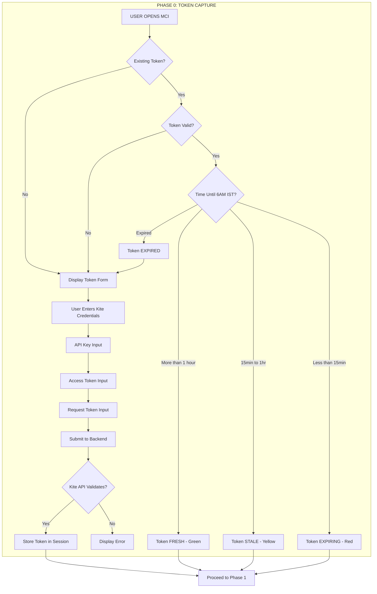

# VERBATIM BROKER REFERENCES - COMPLETE EXTRACTION

**Source:** b8937bc2-ac10-4287-8ced-af96ac5f6f0b.jsonl
**Extraction Date:** 2026-01-25

This document contains all broker-related content from the MCI session.
MCI supports 4 Indian brokers: Zerodha Kite, ICICI Direct, HDFC Sky, Kotak Neo.

---

## ALL BROKER REFERENCES


### BROKER REF 1

**Additional Files Updated:**
- `_KITE_EXECUTION_GUIDE.md` (46 occurrences)
- `_KITE_IMPLEMENTATION_REPORT.md` (22 occurrences)
- `UI_UX_DESIGN_SYSTEM.md`
- `UI_FUNCTIONAL_SPECIFICATION.md`
- `PROTOTYPE_REVIEW.md`
- HTML transcripts (MCI_JAN23_COMPLETE_TRANSCRIPT.html, MCI_JAN20_22_COMPLETE_TRANSCRIPT.html, MCI_SESSION_VERBATIM_TRANSCRIPT.html)

---

### BROKER REF 2

| Issue | Session 03 Finding | Current Status |
|-------|-------------------|----------------|
| Q&A header shows "11 Entries" | Found at L1571 | **FIXED** (now shows 16) |
| 00_MASTER_DOCUMENTS showed 12 files | Found in verification | **FIXED** (now shows 10) |
| 3 phantom files listed | IRONCLAD, KITE, Roadmap.html | **REMOVED** |

---

### BROKER REF 3

**3. Sample Flowchart Exists (Authentication Sequence, lines 3709-3739):**
- User → MCI Frontend → MCI Backend → Kite API → Store

---

### BROKER REF 4

## DIAGRAM 6: AUTHENTICATION SEQUENCE DIAGRAM (Backend ↔ Frontend)
```
┌─────────────────────────────────────────────────────────────────────────────────────────┐
│                           AUTHENTICATION SEQUENCE DIAGRAM                                │
├─────────────────────────────────────────────────────────────────────────────────────────┤
│                                                                                          │
│  👤 User          🖥️ MCI Frontend       ⚙️ MCI Backend       🔐 Kite API      💾 Store  │
│     │                    │                     │                   │              │      │
│     │  Enter Token       │                     │                   │              │      │
│     │───────────────────>│                     │                   │              │      │
│     │                    │  Validate Format    │                   │              │      │
│     │                    │  (32 chars)         │                   │              │      │
│    

---

### BROKER REF 5

## DIAGRAM 1: THE SINGULARITY OF PURPOSE
```
╔═══════════════════════════════════════════════════════════════════════════════╗
║                        THE SINGULARITY OF PURPOSE                             ║
╠═══════════════════════════════════════════════════════════════════════════════╣
║                                                                               ║
║   MCI exists for ONE reason:                                                  ║
║   To give the operator VISIBILITY and CONTROL over CIA-SIE-PURE.              ║
║                                                                               ║
║   MCI provides:                                                               ║
║   1. A way to AUTHENTICATE (Token Capture)                                    ║
║   2. A way to VERIFY readiness (Pre-Ignition Scan)                            ║
║   3. A way to START safely (Ignition)                                         ║
║   4. A way to SEE what's happening (Telemetry)     

---

### BROKER REF 6

```
┌─────────────────────────────────────────────────────────────────────────────────────────┐
│                           AUTHENTICATION SEQUENCE DIAGRAM                                │
│                              PHASE 0: TOKEN CAPTURE                                      │
│                              CR-001, CR-004 COMPLIANCE                                   │
├─────────────────────────────────────────────────────────────────────────────────────────┤
│                                                                                          │
│  👤 User          🖥️ MCI Frontend       ⚙️ MCI Backend       🔐 Kite API      💾 Store  │
│     │                    │                     │                   │              │      │
│     │  Enter Token       │                     │                   │              │      │
│     │───────────────────>│                     │                   │              │      │
│     │                    │                     │                   │  

---

### BROKER REF 7



---

### BROKER REF 8

1. **It has 5 operational phases:**
   - Phase 0: Token Capture (Kite API credentials)
   - Phase 1: Pre-Ignition Scanner (12-point system checks)
   - Phase 2: Ignition (Paper/Live mode selection, ARM → IGNITE)
   - Phase 3: Telemetry Dashboard (6 panels monitoring trading)
   - Phase 4: Shutdown (6-step graceful shutdown)

---

### BROKER REF 9

4. **It was originally built for [Out-of-Scope-Broker] API, then remediated to Kite API**

---

### BROKER REF 10

**FOUNDATIONAL UNDERSTANDING:**
- **CIA-SIE-PURE**: Sophisticated algorithmic trading engine (Python/FastAPI) - HEADLESS SYSTEM
- **MCI**: Mission Control Interface - the COCKPIT for CIA-SIE-PURE
- MCI provides: IGNITION, TELEMETRY, ALERTING, TOKEN MGMT, EMERGENCY
- MCI does NOT: Execute trades, Make decisions, Connect to brokers, Store trading data
- **MCI ONLY observes and controls. It is the EYES and HANDS, not the BRAIN.**

---

### BROKER REF 11

**4 Indian Brokers confirmed:**
- Kite/Zerodha
- ICICI Direct
- HDFC Securities
- Kotak Securities

---

### BROKER REF 12

**MCI RESPONSIBILITIES (Cockpit):**
- IGNITION: Start/Stop Trading Engine, Emergency Shutdown, Mode Selection
- MONITORING: Engine Health, Position Telemetry, Order Status, Error States
- DISPLAY: Real-time Gauges, Position Meters, P&L Dashboard, Alert Notifications
- TOKEN MANAGEMENT: Kite Token Capture, Validation, Session Monitoring, Expiry Alerts

---

### BROKER REF 13

**CIA-SIE-PURE RESPONSIBILITIES (Engine):**
- TRADING: Order Execution, Position Management, Risk Calculation, Strategy Execution
- BROKER INTEGRATION: Kite API, ICICI API, HDFC API, Kotak API
- DATA MANAGEMENT: Trade History, Portfolio State, Market Data, Configuration
- TELEMETRY: Health Metrics, Performance Stats, Error Reporting, Status Broadcasting

---

### BROKER REF 14

**MCI does NOT:**
- Execute trades directly
- Make trading decisions
- Calculate positions
- Connect to brokers directly
- Store trade data

---

### BROKER REF 15

**KEY INSIGHT:**
MCI has NO direct connection to brokers or database. ALL data flows through CIA-SIE-PURE.

---

### BROKER REF 16

Key content:
- **Branch 12: Shared & Cross-Phase Code (13 files)**
  - Client Core: App.tsx, main.tsx, index.css, stores/index.ts, App.test.tsx
  - Server Core: index.ts, routes/index.ts, kite.ts service
  - Shared Types: types.ts
  - Test Infrastructure: setup.ts, test-utils.tsx, globals.d.ts, vitest.d.ts

---

### BROKER REF 17

**THE PROBLEM STATEMENT:**
- CIA-SIE-PURE is a headless algorithmic trading engine (Python/FastAPI)
- WITHOUT MCI:
  - Cannot START safely
  - Cannot MONITOR vital signs
  - Cannot STOP in emergencies
  - No visibility into positions, health, errors
  - Token management (Kite) requires manual intervention
- Analogies: Airplane with NO COCKPIT, Nuclear reactor with NO CONTROL ROOM, Patient on life support with NO MONITORS
- RISK: Operating blind is CATASTROPHIC

---

### BROKER REF 18

Key content:
- **MCI PROVIDES:**
  - IGNITION: Start/Stop with safety interlocks
  - TELEMETRY: Real-time visibility into positions, health, performance
  - ALERTING: Immediate notification of errors, warnings, anomalies
  - TOKEN MGMT: Secure capture and validation of Kite authentication
  - EMERGENCY: One-click shutdown with position closure

---

### BROKER REF 19

- **MCI DOES NOT:**
  - Execute trades (ENGINE's job)
  - Make trading decisions (ENGINE's job)
  - Connect to brokers directly (ENGINE's job)
  - Store trading data (ENGINE's job)

---

### BROKER REF 20

- **COMPLETE USE CASE INVENTORY:**
  - UC-001: Capture Kite Token (Operator, P0, CRITICAL)
  - UC-002: Validate Token (System, P0, CRITICAL)
  - UC-003: Monitor Token Expiry (Clock, P1, HIGH)
  - UC-004: Start Trading Engine (Operator, P0, CRITICAL)
  - UC-005: Stop Trading Engine (Operator, P0, CRITICAL)
  - UC-006: Emergency Shutdown (Operator, P0, CRITICAL)
  - UC-007: View Positions (Operator, P0, CRITICAL)
  - UC-008: View Health Status (Operator, P0, CRITICAL)
  - UC-009: View P&L (Operator, P1, HIGH)

---

### BROKER REF 21

  **PHASE 2: IGNITION**
  - Ignition Button Enabled → Operator Clicks → Engine Initializes → Broker Connections → RUNNING

---

### BROKER REF 22

  **PHASE 4: SHUTDOWN**
  - Operator Clicks SHUTDOWN → Confirmation → Close Positions → Disconnect Broker → STOPPED
  - Restart possible back to Phase 0

---

### BROKER REF 23

- **DIRECTORY STRUCTURE (03_IMPLEMENTATION/mci/):**
  - src/components/
    - **uxmi/** ← UXMI Component Library (CR-005): Tooltip, Button, Input, Spinner, ProgressBar, Toast, ErrorDisplay
    - **token/** ← Token Capture Module (CR-004)
    - **scanner/** ← Pre-Ignition Scanner
    - **dashboard/** ← Telemetry Dashboard
    - **common/** ← Shared components
  - src/services/: kite.ts, anthropic.ts, telemetry.ts, guard.ts (Constitutional enforcement)
  - src/stores/ ← Zustand state stores
  - src/types/, src/utils/, tests/, public/

---

### BROKER REF 24

**PHASE 0: KITE TOKEN CAPTURE**
- PURPOSE: Secure daily authentication token for Kite API
- PREREQUISITE: Must complete BEFORE scanner/dashboard
- DOCUMENT: ADDENDUM_001_TOKEN_CAPTURE_MODULE.md

---

### BROKER REF 25

- **OPERATOR WORKFLOW (5 Steps):**
  1. Open Kite Web manually
  2. Login and authenticate
  3. Copy access_token from URL/session
  4. Paste into Token Capture Form (continued...)

---

### BROKER REF 26

**PHASE 2: IGNITION SEQUENCE**
- PURPOSE: Activate monitoring for selected backends
- PREREQUISITE: All Pre-Ignition checks passed
- **4 BACKENDS:** ICICI Direct, HDFC Sky, Kotak Neo, Zerodha Kite (toggle each)
- **5 IGNITION PHASES:**
  1. Backend Selection
  2. Connection Init (WebSocket handshake)
  3. Data Sync (initial position/order fetch)
  4. Stream Activation (real-time feed)
  5. Dashboard Ready (telemetry populates)
- **CONSTRAINT:** Claude AI observes ONLY, never interacts with trading

---

### BROKER REF 27

**PHASE 1: PRE-IGNITION SCANNER**
- PURPOSE: System health verification before market operations
- PREREQUISITE: Valid Kite token from Phase 0
- **12 SCANNER CHECKS (<500ms total):**
  1. Token Validity - Kite token present & not expired
  2. API Connectivity - Kite API reachable, <100ms
  3. Market Status - NSE/BSE open/closed
  4. Backend Health - All 4 backends responding
  5. Position Sync - Positions match across backends
  6. Order Queue - No stuck orders
  7. PnL Calculation - Intraday PnL correct
  8. Risk Limits - Within thresholds
  9. Claude AI - Anthropic API accessible
  10. Local Time Sync - Clock within tolerance
  11. WebSocket - Real-time feed connection
  12. Watchlist - Instruments loaded

---

### BROKER REF 28

- **4.4 ERROR MESSAGE FORMAT (WHAT/WHY/HOW):**
  - WHAT: "Token validation failed"
  - WHY: "The Kite API returned an authentication error (401)"
  - HOW: "Please re-login to Kite Web and paste a fresh token"

---

### BROKER REF 29

- **STEP 3: PHASE 0 - TOKEN CAPTURE MODULE (CR-004)**
  - Location: src/components/token/, src/services/
  - **BUILD ORDER:**
    1. TokenCaptureForm.tsx (using UXMI)
    2. TokenTimer.tsx (countdown)
    3. kite.ts (API validation)
    4. tokenStore.ts (Zustand state)
  - Requirements: UXMI components, 6:00 AM IST expiry, WHAT/WHY/HOW errors, 5-step workflow

---

### BROKER REF 30

- **4 INDIAN BROKERS:** ICICI Direct, HDFC Sky, Kotak Neo, Zerodha Kite

---

### BROKER REF 31

Key content:
- **Document Type:** Authoritative Project Status with Execution Responsibility Matrix
- **Status:** READY FOR IMPLEMENTATION
- **Purpose:** Unified monitoring dashboard for 4 trading backends (ICICI, HDFC, Kotak, Zerodha)

---

### BROKER REF 32

- 4.4 Phase 0: Token Capture ⏳ PENDING → **CLAUDE CODE**
  - TokenCaptureForm.tsx, TokenTimer.tsx, kite.ts, tokenStore.ts

---

### BROKER REF 33

- 4.6 Phase 2: Ignition Sequence ⏳ → **CLAUDE CODE**
  - BackendSelector.tsx, IgnitionButton.tsx
  - 4-backend toggle (ICICI/HDFC/Kotak/Zerodha)

---

### BROKER REF 34

- 4.9 Backend Services ⏳ → **CLAUDE CODE**
  - server/index.ts
  - routes/health.ts, ignition.ts, telemetry.ts
  - services/kite.ts, anthropic.ts, guard.ts

---

### BROKER REF 35

**PHASE 6: DEPLOYMENT [PENDING]**
- 6.1 Build Configuration ⏳ → **CLAUDE CODE**
- 6.2 Environment Configuration ⏳ → **USER**
  - .env with API keys, Kite credentials
- 6.3 Launch ⏳ → **USER**

---

### BROKER REF 36

Key content:
**EXECUTION AUTHORITY MATRIX:**
- **USER (Project Owner):**
  - Vision & Direction
  - Constitutional Constraints (CR-001 to CR-005)
  - Approvals & Decisions
  - Daily Kite Token Provision
  - API Keys & Credentials

---

### BROKER REF 37

Key content:
**GATE C (continued) - Directory Structure:**
```
│   ├── hooks/
│   │   ├── useTokenState.ts
│   │   ├── useIgnitionState.ts
│   │   └── useSSE.ts
│   ├── stores/
│   │   ├── tokenStore.ts
│   │   ├── scannerStore.ts
│   │   └── dashboardStore.ts
│   ├── App.tsx, main.tsx, index.css
├── server/
│   ├── index.ts
│   ├── routes/ (health, token, scanner, ignition, telemetry)
│   └── services/
│       ├── kite.ts, anthropic.ts, scanner.ts
│       └── guard.ts ← CRITICAL: Constitutional enforcement
└── shared/
    └── types.ts
```

---

### BROKER REF 38

Key content:
- **Gate E-2 continued**: calculateNext6AMIST() is SACRED (CR-004), must be hardcoded not configurable
- **Gate E-3**: tokenStore.ts - 6 states: ABSENT, VALIDATING, VALID, EXPIRING, EXPIRED, INVALID
- **Gate E-4**: kite.ts validation engine with WHAT/WHY/HOW error format

---

### BROKER REF 39

Key content:
- **CR-002 Enforcement**: Side-by-side conflicts, equal visual weight, block auto-reconciliation
- **CR-003 Enforcement**: Block prescriptive ("should", "recommend", "suggest"), allow only descriptive ("is", "shows", "indicates")
- **GATE G: DASHBOARD PANELS** - Multiple sub-checkpoints
  - G-1: TokenPanel.tsx
  - G-2: BackendPanel.tsx (4 Indian brokers)
  - G-3: PositionsPanel.tsx (CR-002 CRITICAL - no reconciliation)

---

### BROKER REF 40

**THE PROBLEM:**
- CIA-SIE-PURE requires coordinated initialization of 4 subsystems:
  1. FastAPI Backend Server
  2. SQLite Database
  3. Kite Zerodha API
  4. Anthropic Claude API

---

### BROKER REF 41

**IMPORTANT NOTE:** This document mentions **Kite/Zerodha** as the ORIGINAL broker focus. The later documents show evolution to **4 Indian Brokers** (ICICI, HDFC, Kotak, Zerodha).

---

### BROKER REF 42

**OPERATIONAL DEFINITION - "FULLY OPERATIONAL" = ALL SYSTEMS GO:**
- 4 Subsystems must be verified:
  1. FastAPI Server ✓
  2. SQLite Database ✓
  3. Kite Zerodha ✓
  4. Anthropic Claude ✓
- ALL FOUR SUBSYSTEMS MUST BE VERIFIED BEFORE "GO" STATUS

---

### BROKER REF 43

**4.1 IGNITION SEQUENCE VISUALIZATION:**
- T-countdown display
- 4 Subsystems with progress bars:
  1. FastAPI Server - 100% ● GO
  2. Database Connect - 100% ● GO  
  3. Kite Zerodha Auth - 80% VERIFYING
  4. Anthropic Claude - 0% PENDING
- Mission Elapsed Time (MET) counter
- [ABORT SEQUENCE] button available

---

### BROKER REF 44

**PHASE 3: KITE ZERODHA AUTHENTICATION**
- Step 3.1: Load token from ~/.mercury/kite_token.json
- Step 3.2: Extract access_token and created_at
- Step 3.3: **Calculate token expiry using 6 AM IST rule:**
  - If token created BEFORE 6 AM: expires SAME DAY 6 AM
  - If token created AFTER 6 AM: expires NEXT DAY 6 AM
- Step 3.4: Check expiration status
  - If EXPIRED: Trigger OAuth flow (open browser)
  - If VALID: Proceed to verification
- Step 3.5: Verify with GET /user/profile
- Step 3.6: Store expiry for countdown (HH:MM:SS remaining)
- Result: GO / NO-GO (with re-auth option)

---

### BROKER REF 45

**4.3 ABORT SEQUENCE:**
- Displays failure location (e.g., Phase 3 - Kite Zerodha Authentication)
- Shows reason (e.g., Token expired at 6:00 AM IST)
- Lists completed phases with timing
- **RECOVERY OPTIONS:**
  - RE-AUTHENTICATE (Open Kite OAuth)
  - RETRY IGNITION (From beginning)
  - SHUTDOWN PARTIAL (Clean up started components)

---

### BROKER REF 46

**SUBSYSTEM TELEMETRY - 4 Cards:**
| Card | Metrics |
|------|---------|
| FASTAPI | Port: 8000, Uptime: 2:45, Req/min: 12, Latency: 45ms |
| DATABASE | Size: 4.2 MB, Tables: 13, Queries: 847, Avg: 3ms |
| KITE ZERODHA | Token: VALID, Expiry: 14:22, User: NM****, Rate: OK |
| ANTHROPIC | Model: sonnet, Budget: $42.50, Calls: 23, Tokens: 12.4K |

---

### BROKER REF 47

**Kite Zerodha Telemetry:**
- Token Status: VALID / EXPIRING / EXPIRED
- **Time to Expiry: Countdown to 6 AM IST**
- User ID: Masked (NM****)
- API Calls Today
- Rate Limit Status: OK / APPROACHING / EXCEEDED
- Last API Call: Timestamp + endpoint + response time
- Connection Health

---

### BROKER REF 48

**9.1 GO/NO-GO POLL DISPLAY (NASA-inspired):**
- BOOSTER (FastAPI) ● GO
- RETRO (Database) ● GO
- FIDO (Kite Zerodha) ● GO
- GUIDANCE (Anthropic) ● GO
- FLIGHT DIRECTOR ● GO FOR LAUNCH

---

### BROKER REF 49

**Key takeaways from this ORIGINAL COMMISSIONING BRIEF:**
- This is the ORIGINAL project brief dated **January 16, 2026**
- Originally focused on **Kite/Zerodha** as single broker
- 4 subsystems: FastAPI + SQLite + Kite Zerodha + Anthropic Claude
- **CR-001 through CR-004** defined (CR-005 added later)
- 6 AM IST token expiry rule established here
- **Dark theme** originally specified (later docs may show evolution)
- Gold Standard 12-stage development cycle required

---

### BROKER REF 50

**1.1 PROBLEM STATEMENT:**
- CIA-SIE-PURE requires coordinated initialization of 4 subsystems
- 7 Operational Challenges identified:
  1. No pre-flight verification → Systems may fail after start
  2. No port availability check → Conflicts cause silent failures
  3. No model selection option → Locked to single AI model
  4. No visual startup feedback → User uncertainty during launch
  5. No unified status dashboard → Multiple terminals required
  6. **Kite tokens expire at 6 AM IST** → Unexpected auth failures
  7. No graceful degradation visibility → Partial failures go unnoticed

---

### BROKER REF 51

**IN SCOPE:** Pre-ignition verification, model selection, visual launch, telemetry, Kite token lifecycle, Anthropic budget monitoring, MET counter, activity log, graceful shutdown, error recovery, session persistence

---

### BROKER REF 52

**2.1 AUTOMATIC SYSTEM SCAN - 14 Checks:**
| Check | Status | Time |
|-------|--------|------|
| Port 8000 (Backend API) | CLEAR | 0.003s |
| Port 8001 (Health Monitor) | CLEAR | 0.002s |
| Existing uvicorn Process | NONE | 0.015s |
| Python Environment | VALID | 0.045s |
| Virtual Environment | ACTIVE | 0.012s |
| Database File | EXISTS | 0.001s |
| Disk Space | 45.2 GB | 0.008s |
| Available Memory | 8.4 GB | 0.005s |
| KITE_API_KEY | SET | 0.001s |
| KITE_API_SECRET | SET | 0.001s |
| ANTHROPIC_API_KEY | VALID | 0.002s |
| Kite Token File | EXISTS | 0.001s |
| Token Expiry Status | VALID 14h | 0.003s |

---

### BROKER REF 53

**KITE TOKEN COUNTDOWN:**
- Large display: 14:22:45 until 6:00 AM IST
- [Re-Authenticate Early] button

---

### BROKER REF 54

**ACTIVITY LOG:**
- Timestamped events with categories: [HEALTH], [KITE], [AI], [WEBHOOK], [DB], [SYSTEM], [IGNITION]
- Export functionality
- "Showing 7 of 156 events [Load More]"

---

### BROKER REF 55

| Component | Update Frequency | Data Source |
|-----------|------------------|-------------|
| Mission Status Banner | Real-time | Composite health |
| MET (Mission Elapsed Time) | 1 second | Local timer |
| Subsystem Cards (4) | 5 seconds | Health endpoints |
| Kite Token Countdown | **1 second** | Calculated from token |
| AI Budget Display | After each call | UsageTracker |
| Activity Log | Real-time | Event stream |
| Request/Latency Metrics | 5 seconds | Internal counters |

---

### BROKER REF 56

| Component | Poll Interval | Timeout | Failure Action |
|-----------|---------------|---------|----------------|
| FastAPI /health | 5 seconds | 3 seconds | Mark DEGRADED |
| Database SELECT 1 | 30 seconds | 5 seconds | Mark DEGRADED |
| Kite Token Expiry | **1 second** | N/A | Update countdown |
| Kite /user/profile | 5 minutes | 10 secs | Mark DEGRADED |
| Anthropic Ping | 5 minutes | 30 secs | Mark DEGRADED |
| System Resources | 30 seconds | N/A | Show warning |

---

### BROKER REF 57

**6.4 KITE TOKEN COUNTDOWN DISPLAY - By Remaining Time:**
- **>6 hours:** Green, calm - "VALID"
- **2-6 hours:** Amber, attention - "EXPIRING SOON"
- **<2 hours:** Red, urgent - "EXPIRING IMMINENTLY" (pulsing)
- **Expired:** Red, flashing - "EXPIRED"

---

### BROKER REF 58

| Scenario | Detection | Recovery |
|----------|-----------|----------|
| Server crashed | Health check fail | Auto-restart |
| Database locked | Query timeout | Force reconnect |
| Kite token expired | 401 response | OAuth prompt |
| Anthropic rate limited | 429 response | Fallback model |
| Anthropic budget exceeded | Budget check | Fallback model |
| Port conflict | Bind failure | Kill or relocate |
| Memory exhaustion | psutil check | Graceful restart |

---

### BROKER REF 59

```json
{
  "last_ignition": "2026-01-16T10:30:00Z",
  "selected_model": "claude-3-5-sonnet-20241022",
  "backend_pid": 12345,
  "kite_token_expiry": "2026-01-17T06:00:00+05:30",
  "total_ai_spend_session": 0.45,
  "event_log": [...],
  "preferences": {
    "remember_model": true,
    "auto_reconnect": true,
    "theme": "dark"
  }
}
```

---

### BROKER REF 60

| Artifact | Format | Gate |
|----------|--------|------|
| C4 Level 1: System Context | Mermaid | Gate 3 |
| C4 Level 2: Container | Mermaid | Gate 3 |
| C4 Level 3: Component | Mermaid | Gate 3 |
| Pre-Ignition Screen Wireframe | Figma/HTML | Gate 4 |
| Model Selection Screen Wireframe | Figma/HTML | Gate 4 |
| Ignition Sequence Animation | Figma/HTML | Gate 4 |
| Operational Dashboard Wireframe | Figma/HTML | Gate 4 |
| Token Countdown States (4) | Figma/HTML | Gate 4 |
| Shutdown Sequence Wireframe | Figma/HTML | Gate 4 |
| Error/Recovery Wireframes | Figma/HTML | Gate 4 |
| System State Machine | Mermaid | Gate 4 |
| Kite Token State Machine | Mermaid | Gate 4 |
| Ignition Flowchart | Mermaid | Gate 4 |
| OAuth Flow Sequence | Mermaid | Gate 4 |
| Component Interaction | Mermaid | Gate 4 |

---

### BROKER REF 61

| Shortcut | Action |
|----------|--------|
| Ctrl/Cmd + I | Ignite sequence |
| Ctrl/Cmd + S | Shutdown |
| Ctrl/Cmd + R | Refresh health |
| Ctrl/Cmd + L | Focus activity log |
| Ctrl/Cmd + E | Export diagnostics |
| Ctrl/Cmd + K | Re-authenticate Kite |
| Ctrl/Cmd + / | Show shortcuts |
| Escape | Cancel operation |

---

### BROKER REF 62

**CR-001: Decision-Support, NOT Decision-Making**
- MCI controls infrastructure only
- **NO ACCESS to:**
  - Trading signals
  - Market analysis
  - Recommendations
  - Portfolio data (except Kite profile verification)

---

### BROKER REF 63

| ID | Criterion |
|----|-----------|
| AC-01 | Pre-ignition scan completes in <500ms |
| AC-02 | All 14 pre-ignition checks execute and display |
| AC-03 | Port conflicts detected with resolution options |
| AC-04 | Anthropic model selection with 4+ options |
| AC-05 | Model capabilities and cost displayed |
| AC-06 | Selected model persists to session |
| AC-07 | Ignition displays progress for all 5 phases |
| AC-08 | Each phase shows progress bar, status, timing |
| AC-09 | GO/NO-GO status for each subsystem |
| AC-10 | Abort sequence available during ignition |
| AC-11 | Kite OAuth opens browser and completes |
| AC-12 | **Token expiry countdown accurate to 6 AM IST (±1 minute)** |
| AC-13 | Re-auth prompt when token <2 hours |
| AC-14 | Anthropic budget with visual progress bar |
| AC-15 | MET counter visible and accurate |
| AC-16 | All 4 subsystem telemetry cards updating |
| AC-17 | Activity log captures all events |
| AC-18 | Graceful shutdown within 10 seconds |
| AC-19 | Eme

---

### BROKER REF 64

**ACKNOWLEDGMENT CHECKLIST:**
- [ ] Pre-ignition verification protocol understood
- [ ] Anthropic model selection requirement understood
- [ ] Sequential ignition with visual progress understood
- [ ] **Kite 6 AM IST token expiry rule understood**
- [ ] Mission Control dashboard requirements understood
- [ ] Creative enhancements reviewed and accepted
- [ ] Gold Standard compliance requirements understood
- [ ] Constitutional constraints understood

---

### BROKER REF 65

**Key Content:**
- PHASE 0: KITE TOKEN CAPTURE MODULE = MANDATORY prerequisite
- Kite tokens expire DAILY at 6:00 AM IST (no auto-refresh - Zerodha policy)
- User must manually authenticate each trading day
- Failure to capture token = COMPLETE SYSTEM BLOCKADE

---

### BROKER REF 66

**5-Step User Instructions:**
1. Copy Kite Login URL (displayed in MCI)
2. Open Chrome and paste URL
3. Login with Zerodha credentials (User ID, Password, 2FA PIN)
4. Copy FULL redirect URL from Chrome address bar
5. Paste callback URL into MCI form

---

### BROKER REF 67

**Daily Workflow (Total ~38 seconds):**
1. 08:00:00 - Operator opens MCI (localhost:8080)
2. 08:00:01 - MCI checks for valid Kite token
3. IF TOKEN VALID → Pre-Ignition Scanner
4. IF TOKEN EXPIRED/MISSING → Token Capture Form
5. 08:00:05 - Copy Kite Login URL from MCI
6. 08:00:10 - Paste URL in Chrome, login
7. 08:00:25 - Kite redirects to callback URL
8. 08:00:30 - Copy callback URL from Chrome
9. 08:00:35 - Paste URL into MCI Token Capture Form
10. 08:00:36 - MCI processes token (6-module sequence)
11. 08:00:38 - TOKEN AUTHENTICATED → Pre-Ignition

---

### BROKER REF 68

**Form Field Specifications:**
- Kite Login URL Display: Read-only, monospace, "Copy to Clipboard" button
- Callback URL Input: Single-line, auto-trim whitespace, validate format, red/green highlight
- Authenticate Button: Disabled until valid URL, transforms to progress indicator
- Step Instructions: Numbered 1-5, always visible (hardcoded)

---

### BROKER REF 69

**MODULE 1: TOKEN STATUS CHECK**
- Purpose: Determine if valid Kite token exists
- Trigger: MCI application start (automatic)
- Process: Check ~/.mci/kite_token.json, read expiry, calculate vs 6:00 AM IST
- Outputs: TOKEN_VALID / TOKEN_EXPIRED / TOKEN_MISSING
- Timing: <10ms
- Fail-safe: File read error → MISSING; JSON parse error → CORRUPTED

---

### BROKER REF 70

**MODULE 2: FORM DISPLAY**
- Purpose: Present Token Capture Form to operator
- Trigger: Module 1 returns EXPIRED or MISSING
- Process: Construct login URL, render form, monitor input, enable button when valid
- Timing: User-dependent (20-30 seconds typical)
- Fail-safe: KITE_API_KEY not set → configuration error

---

### BROKER REF 71

**MODULE 4: TOKEN EXCHANGE**
- Purpose: Exchange request_token for access_token via Kite API
- Trigger: Module 3 returns VALID
- API Call: POST https://api.kite.trade/session/token
- Body: api_key, request_token, checksum (SHA256)
- Timing: 500ms - 3000ms (network dependent)
- Progress: 60%
- **CRITICAL:** Request tokens valid for only 60 seconds

---

### BROKER REF 72

**MODULE 5: TOKEN STORAGE**
- Purpose: Securely store access_token for session use
- Trigger: Module 4 returns SUCCESS
- Storage Location: ~/.mci/kite_token.json (permissions: 600)
- Token Object Structure:
  - access_token, token_type ("Bearer")
  - user_id, user_name
  - issued_at, expires_at (6:00 AM IST next day)
  - expires_at_timestamp
- Timing: <50ms
- Progress: 80%
- Fail-safe: Storage errors → continue with in-memory token only

---

### BROKER REF 73

**MODULE 6: TOKEN VERIFICATION**
- Purpose: Verify token works via test API call
- API Call: GET https://api.kite.trade/user/profile
- Headers: Authorization: token KITE_API_KEY:access_token
- Verify: HTTP 200, user_id matches stored token
- Timing: 200ms - 1000ms
- Progress: 100% COMPLETE
- SUCCESS → PROCEED TO PRE-IGNITION SCANNER

---

### BROKER REF 74

| Error Type | Recovery Action |
|------------|-----------------|
| Invalid URL format | Return to form, highlight input |
| Missing request_token | Return to form, explain what to copy |
| Token expired (60s limit) | Return to form, emphasize speed |
| Network error | Show retry button, check connection |
| API rate limit | Show countdown timer, auto-retry |
| Invalid credentials | Return to form, verify Kite account |
| Storage permission error | Warn but continue with in-memory |
| Verification failed | Restart entire sequence |

---

### BROKER REF 75

**Complete Operational Flow (6 Phases):**
1. **PHASE 0: TOKEN CAPTURE** - 6-module auth sequence, SUCCESS required
2. **PHASE 1: PRE-IGNITION SCANNER** - 12 checks, Kite token check (#4) now GUARANTEED valid, <500ms, ALL GREEN required
3. **PHASE 2: MODEL SELECTION** - Select Anthropic model, view budget
4. **PHASE 3: IGNITION SEQUENCE** - 3-second countdown, sequential subsystem startup
5. **PHASE 4: OPERATIONAL MONITORING** - Real-time telemetry, token countdown timer
6. **PHASE 5: SHUTDOWN** - Graceful/Emergency, cleanup, logging

---

### BROKER REF 76

**File Structure:**
```
03_IMPLEMENTATION/mci/src/
├── server/
│   ├── services/
│   │   └── kite.ts (Backend - 6 module functions)
│   └── routes/
│       └── auth.ts (API Routes)
└── client/
    └── components/
        └── TokenCaptureForm.tsx (UI Component)
```

---

### BROKER REF 77

**Backend Functions (kite.ts):**
- checkTokenStatus() - Module 1
- generateLoginURL() - Module 2 support
- validateCallbackURL() - Module 3
- exchangeToken() - Module 4
- storeToken() - Module 5
- verifyToken() - Module 6

---

### BROKER REF 78

**Environment Variables:**
- KITE_API_KEY
- KITE_API_SECRET
- MCI_TOKEN_STORAGE_PATH (~/.mci/)

---

### BROKER REF 79

Key takeaways:
- Phase 0 Token Capture is MANDATORY gate before any MCI operation
- 6-module sequential authentication architecture
- 6:00 AM IST expiry is hardcoded (CR-004 compliance)
- Request tokens expire in 60 seconds (speed critical)
- Binary outcomes only: SUCCESS or FAILURE (no partial states)
- Token stored at ~/.mci/kite_token.json

---

### BROKER REF 80

Steps 5-10:
- Step 5: Phase 1 Pre-Ignition Scanner (12 checks in <500ms)
- Step 6: Phase 2 Ignition (BackendSelector, IgnitionButton)
- Step 7: Phase 3 Telemetry Dashboard (SSE real-time)
- Step 8: Phase 4 Shutdown (ShutdownButton, ShutdownModal)
- Step 9: Backend Services (server/index.ts, kite.ts, anthropic.ts, guard.ts)
- Step 10: Config files (package.json, tsconfig.json, tailwind.config.js)

---

### BROKER REF 81

Architecture diagram: MCI (Port 8080) → CIA-SIE-PURE Backend (Port 8000). Communication protocols: HTTP REST (control), SSE (telemetry), Kite API (token validation), Anthropic (model check). System states begin: DORMANT (gray), PRE_FLIGHT (yellow pulsing).

---

### BROKER REF 82

Section 6: Pre-Ignition Scanner - 12 checks, all must pass (green). Checks 1-8: PORT_8000, API_LATENCY (<500ms), DB_CONN, KITE_VALID, KITE_TTL (>30min), ANTHROPIC_KEY, MODEL_AVAIL, MEM_USAGE (<80%).

---

### BROKER REF 83

Telemetry metrics: CPU (1s), Memory (1s), Disk (30s), Network (1s), Kite TTL (1s), Uptime (1s). SSE event format with JSON telemetry payload. Section 9: Development Gates - G1 Requirements Approved.

---

### BROKER REF 84

Directory structure: server (routes: auth, health, ignition, telemetry; services: scanner, kite, anthropic), client (App.tsx, components/TokenCaptureForm.tsx). CRs embedded in prompt. Phase 0 requirements. Cursor supporting prompt. Appendix A: Traceability Matrix begins.

---

### BROKER REF 85

Traceability Matrix: REQ-001 to REQ-006 mapped to components (scanner, anthropic, ignition, telemetry, kite, shutdown). CONST-001 to CONST-002 (guard.ts, conflicts.ts). Appendix B: Glossary begins - MCI definition.

---

### BROKER REF 86

Glossary: CIA-SIE-PURE, Pre-Ignition, Ignition, Telemetry, Kite Connect, SSE, Constitutional Constraint, C4 Diagram, ADR. Footer references PROJECT_BRIEF_BCI_001.md and TECHNOLOGY_SELECTION_LIFECYCLE_SPECIFICATION.md. JavaScript search/navigation begins.

---

### BROKER REF 87

Prototype Review v1.0.0, 2026-01-23, Phase 3.5 Deliverable. Table of Contents: High-Fidelity Mockups, Component State Variations, Interaction Specs, Constitutional Compliance, Review Checklist, Principal Approval. Part I begins: Phase 0 Token Capture mockup with MCI logo, Step 1 Kite login button.

---

### BROKER REF 88

Phase 1 Scanner mockup: Header with token countdown (04:32:15, green #22C55E). 12 checks listed with tooltips: Kite Token (12ms), API Connectivity (45ms), Market Status (23ms), ICICI Direct (67ms), HDFC Sky (54ms), Kotak Neo (78ms), Zerodha Kite (42ms), Position Sync (89ms), Order Queue (34ms), Claude AI (156ms), Time Sync (28ms), WebSocket (65ms). Total 387ms < 500ms target. PROCEED TO IGNITION button.

---

### BROKER REF 89

Phase 2 Ignition mockup: 4 backend cards (ICICI Direct, HDFC Sky, Kotak Neo, Zerodha Kite). Selected state: 2px #3B82F6 border, #3B82F610 background. Shows 2 of 4 selected. INITIATE IGNITION button (Ctrl+Enter). CR-001 reminder: "monitoring-only session. No trades will be executed."

---

### BROKER REF 90

Phase 3 Telemetry Dashboard mockup: Token status card (CR-004), Backend health (HDFC Sky 45ms, Zerodha Kite 32ms). POSITIONS table with CR-002 compliance: "Conflicts displayed side-by-side. If same symbol on multiple backends, BOTH entries shown (never auto-merged)." Orders panel, P&L Summary (CR-003).

---

### BROKER REF 91

Batch 2 ingested (lines 76-150). Navigation flow diagram: Phase 0 Token Capture (Kite login, callback URL paste, validate token) → Phase 1 Scanner (12 checks in <500ms) → Phase 2 Ignition (select 1-4 backends) → Phase 3 Dashboard (6 panels: Token Status, Backend Health, Positions, Orders, P&L Summary, AI Observations). Continuing.

---

### BROKER REF 92

Batch 4 ingested (lines 226-300). Token Capture 3-step flow wireframe complete. Component specs: Open Kite Login button (7 states), Callback URL Input (auto-validates on paste, monospace, min 48px height), Validate Token button (disabled until URL entered). Validation rules: URL must have http(s), request_token, status=success. Continuing.

---

### BROKER REF 93

Batch 6 ingested (lines 376-450). Phase 1 Scanner wireframe: 12 checks with progress bar, total time 387ms, target <500ms. 12 Scanner Checks: Kite Token, API Connectivity, Market Status, 4 backends (ICICI Direct, HDFC Sky, Kotak Neo, Zerodha Kite), Position Sync, Order Queue, Claude AI, Time Sync, WebSocket. Status icons: ✅ PASS, ⚠️ WARN, ❌ FAIL, 🔄 RUNNING, ⏳ PENDING. Checks run in parallel, 5000ms individual timeout. Continuing.

---

### BROKER REF 94

Batch 7 ingested (lines 451-525). Phase 2 Ignition Sequence wireframe: 4 backend cards (ICICI Direct, HDFC Sky, Kotak Neo, Zerodha Kite) with selection state, status display, "Selected: 2 of 4 backends" counter. Initiate Ignition button with Ctrl+Enter shortcut. Must select at least 1 backend. Backend Selector Card States starting. Continuing.

---

### BROKER REF 95

Batch 10 ingested (lines 676-750). Real-time updates via SSE, stale data amber indicator. CR-002 compliance: show BOTH entries for same symbol on different backends, color-code by backend, NEVER auto-reconcile. CR-003 compliance: ONLY descriptive, NEVER prescriptive, ALWAYS show disclaimer. Phase 4 Shutdown Confirmation Modal: session summary (duration, backends, positions, P&L), note "positions remain on broker platforms", checkbox to clear token data. Continuing.

---

### BROKER REF 96

Batch 6 ingested (lines 376-450). C1 System Context Diagram SVG: Human Operator (blue, top) → MCI (cyan, center, "Aerospace-inspired control panel for CIA-SIE-PURE operations") → CIA-SIE-PURE (green, right, Port 8000, HTTP/SSE) → Kite Connect API (amber, external, Token Status) → Anthropic API (purple, external, Model Selection). Relationships with arrows and labels. Legend starting. Continuing.

---

### BROKER REF 97

Batch 7 ingested (lines 451-525). Legend complete: Person (blue), Core System MCI (cyan), Internal CIA-SIE (green), External Kite (amber), External Anthropic (purple). Key Relationships described: Port 8080 dashboard, Port 8000 API/SSE, Kite 6 AM IST expiry. C2 Container Diagram: MCI System Boundary (Port 8080), React SPA (React 18+, Tailwind, 60fps UI), Hono API Server (Hono 4.0+, REST+SSE, Bun Runtime). Pre-Ignition Scanner starting. Continuing.

---

### BROKER REF 98

Batch 8 ingested (lines 526-600). C2 Container Diagram continued: Scanner Service (amber, 12 Pre-flight Checks), Token Manager (red, Kite Lifecycle 6AM IST), Model Selector (purple, Anthropic Models). External systems: Operator, CIA-SIE (Port 8000), Kite API (Zerodha), Anthropic (Claude API). Connections: Operator→SPA (HTTPS), SPA→Hono (HTTP/SSE), Hono→CIA-SIE (HTTP), Hono→Services (dashed), Services→External. Continuing.

---

### BROKER REF 99

Batch 9 ingested (lines 601-675). C2 Legend: React 18+ SPA, Hono 4.0+, Pre-Ignition Scanner, Kite Token Manager, Anthropic Model Selector. Container Responsibilities: 60fps UI, SSE streams, 12 checks in <500ms, token warnings at T-60/T-30/T-5 minutes. C3 Component Diagram starting: Hono API Server internal components. API Layer with Health Router (/api/health/*), Ignition Router (/api/ignition/*). Continuing.

---

### BROKER REF 100

Batch 10 ingested (lines 676-750). C3 Component Diagram continued: API Layer routes - Telemetry Router (/api/telemetry/stream), Config Router (/api/config/*). Service Layer: PreIgnitionScanner (scanner.ts, runAllChecks(), validateCheck()), KiteTokenService (kite.ts, getTokenStatus(), getTimeToExpiry()), AnthropicService (anthropic.ts, listModels(), selectModel()). State Management: SystemStateMachine (DORMANT→ACTIVE→SHUTDOWN), TelemetryEmitter (SSE Broadcast), Constitutional box (CR-001 to CR-004, INVIOLABLE RULES). Continuing.

---
