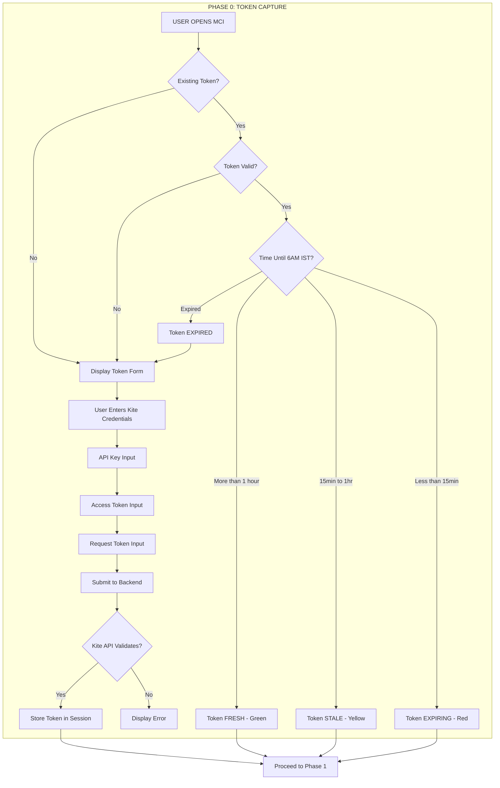

# VERBATIM ERROR HANDLING - COMPLETE EXTRACTION

**Source:** b8937bc2-ac10-4287-8ced-af96ac5f6f0b.jsonl
**Extraction Date:** 2026-01-25

This document contains all error handling and recovery references.

**CR-003 Error Format:** WHAT/WHY/HOW

---

## ALL ERROR HANDLING REFERENCES


### ERROR REF 1

**Batch 31 Summary:**
- L751-754: Reading Zustand stores and components
- L756: Claude: "Excellent progress - examining UXMI and phase components"
- L757-774: Reading Input, Spinner, ProgressBar, ErrorDisplay, phase components

---

### ERROR REF 2

**Batch 33 Summary:**
- L802-803: Edit error (string not found)
- L805-825: Claude fixing edit, updating multiple files

---

### ERROR REF 3

**Batch 37 Summary:**
- L901-925: File edits (edit errors, Grep searches, updating synthesis and Master Context)

---

### ERROR REF 4

**Batch 42 Summary:**
- L1027: Claude: "I'll make integrations in two parts"
- L1028-1050: Adding Q&A entries, handling edit errors, finding correct locations

---

### ERROR REF 5

## DIAGRAM 4: 7-LAYER REVIEW FRAMEWORK
```
┌───────┬──────────────────────────────────────────────────────────────────────────┐
│ Layer │                              Understanding                               │
├───────┼──────────────────────────────────────────────────────────────────────────┤
│ 1     │ CIA-SIE-PURE is the ENGINE, MCI is the COCKPIT                           │
├───────┼──────────────────────────────────────────────────────────────────────────┤
│ 2     │ Car/Airplane analogies - Dashboard monitors and controls, does not drive │
├───────┼──────────────────────────────────────────────────────────────────────────┤
│ 3     │ 5 Phases: Token → Scan → Ignition → Telemetry → Shutdown                 │
├───────┼──────────────────────────────────────────────────────────────────────────┤
│ 4     │ 5 CRs: Token Validity, Graceful Shutdown, Error Format, 6AM Expiry, UXMI │
├───────┼──────────────────────────────────────────────────────────────────────────┤
│ 5     │ Audit: 97% c

---

### ERROR REF 6

## DIAGRAM 7: APPLICATION RUNTIME FLOW (5 PHASES)
```
┌─────────────────────────────────────────────────────────────────────────────────────────┐
│                              APPLICATION RUNTIME FLOW                                    │
├─────────────────────────────────────────────────────────────────────────────────────────┤
│                                                                                          │
│   ┌──────────────┐    ┌──────────────┐    ┌──────────────┐    ┌──────────────┐          │
│   │   PHASE 0    │    │   PHASE 1    │    │   PHASE 2    │    │   PHASE 3    │          │
│   │    TOKEN     │───>│   SCANNER    │───>│   IGNITION   │───>│  TELEMETRY   │          │
│   │   CAPTURE    │    │ (Pre-flight) │    │   (Start)    │    │ (Dashboard)  │          │
│   └──────────────┘    └──────────────┘    └──────────────┘    └──────┬───────┘          │
│          ▲                                                           │                   │
│          │           

---

### ERROR REF 7

| # | Diagram | Type |
|---|---------|------|
| **BACKEND (5)** | | |
| 2.1 | Authentication Sequence | Sequence Diagram |
| 2.2 | Ignition Sequence | Sequence Diagram |
| 2.3 | Telemetry Pipeline | Flowchart |
| 2.4 | Shutdown Sequence (CR-002) | Sequence Diagram |
| 2.5 | Backend State Machine | State Diagram |
| **FRONTEND (4)** | | |
| 2.6 | Component Hierarchy | Tree Diagram |
| 2.7 | State Management Flow | Flowchart |
| 2.8 | Phase Progression | Flow Diagram |
| 2.9 | User Interaction Flow | Flowchart |
| **INTEGRATION (4)** | | |
| 2.10 | API Contract | Endpoint Spec |
| 2.11 | WebSocket Events | Event Schema |
| 2.12 | Error Propagation (CR-003) | Flow Diagram |
| 2.13 | Data Flow Lifecycle | DFD |

---

### ERROR REF 8

```
┌─────────────────────────────────────────────────────────────────────────────┐
│                     LIFECYCLE TRACEABILITY TREE - NODE MAP                   │
├─────────────────────────────────────────────────────────────────────────────┤
│                                                                               │
│  LAYER 1: CONSTITUTIONAL FOUNDATION (6 nodes)                                │
│  ══════════════════════════════════════════════                              │
│  ├── Node 1.0: Master Use Case Specification (ROOT)                         │
│  ├── Node 1.1: CR-001 Token Validity                                        │
│  ├── Node 1.2: CR-002 Graceful Shutdown                                     │
│  ├── Node 1.3: CR-003 Error Format (WHAT/WHY/HOW)                           │
│  ├── Node 1.4: CR-004 Token Expiry 6AM IST                                  │
│  └── Node 1.5: CR-005 UXMI 7-State Components                               │
│                              

---

### ERROR REF 9

```
                            ┌─────────────────────────────┐
                            │   📜 MASTER USE CASE SPEC   │
                            │      (The Constitution)     │
                            └──────────────┬──────────────┘
                                           │
              ┌────────────────────────────┼────────────────────────────┐
              │                            │                            │
              ▼                            ▼                            ▼
    ┌─────────────────┐          ┌─────────────────┐          ┌─────────────────┐
    │ ⚖️ CONSTITUTIONAL │          │ 🏗️ ARCHITECTURE  │          │ 🛡️ SUPERVISED   │
    │   REQUIREMENTS   │          │  DOCUMENTATION   │          │   EXECUTION     │
    └────────┬────────┘          └────────┬────────┘          └────────┬────────┘
             │                            │                            │
    ┌────────┴────────┐          ┌────────┴────────┐          ┌────────┴────────┐
  

---

### ERROR REF 10

### 2.3.2 ERROR PROPAGATION FLOW (Node 2.12) - CR-003 COMPLIANCE

---

### ERROR REF 11

| Section | Diagrams |
|---------|----------|
| **PART 1: LTT Design** | 1.1 Node Inventory (49 nodes), 1.2 Tree Structure, 1.3 Health Scorecard |
| **PART 2A: Backend** | 2.1 Auth Sequence, 2.2 Ignition, 2.3 Telemetry Pipeline, 2.4 Shutdown (CR-002), 2.5 State Machine |
| **PART 2B: Frontend** | 2.6 Component Hierarchy, 2.7 State Management, 2.8 Phase Progression, 2.9 User Interaction (CR-005) |
| **PART 2C: Integration** | 2.10 API Contract, 2.11 WebSocket Events, 2.12 Error Propagation (CR-003), 2.13 Data Flow Lifecycle |

---

### ERROR REF 12

```
04_IMPLEMENTATION/mci/docs/architecture/
├── README.md                    (Architecture Root - Node 2.0)
├── backend/
│   ├── 01_authentication.md     (Node 2.1)
│   ├── 02_ignition.md           (Node 2.2)
│   ├── 03_telemetry.md          (Node 2.3)
│   ├── 04_shutdown.md           (Node 2.4)
│   └── 05_state_machine.md      (Node 2.5)
├── frontend/
│   ├── 06_component_hierarchy.md (Node 2.6)
│   ├── 07_state_management.md    (Node 2.7)
│   ├── 08_phase_progression.md   (Node 2.8)
│   └── 09_user_interaction.md    (Node 2.9)
└── integration/
    ├── 10_api_contract.md        (Node 2.10)
    ├── 11_websocket_events.md    (Node 2.11)
    ├── 12_error_propagation.md   (Node 2.12)
    └── 13_data_flow.md           (Node 2.13)
```

---

### ERROR REF 13

```
┌─────────────────────────────────────────────────────────────────┐
│                        BUILD ORDER                               │
├─────────────────────────────────────────────────────────────────┤
│                                                                  │
│   STEP 1: BACKEND (5 docs)                                      │
│   ═══════════════════════                                       │
│   • Defines data structures                                     │
│   • Defines API endpoints                                       │
│   • Defines state transitions                                   │
│   • Frontend depends on these                                   │
│                                                                  │
│   STEP 2: INTEGRATION (4 docs)                                  │
│   ════════════════════════════                                  │
│   • API contracts (what backend exposes)                        │
│   • WebSocket events (real-time protoco

---

### ERROR REF 14

| # | TOOL | ROLE | USE FOR |
|---|------|------|---------|
| **5** | **GITHUB** | Automation Backbone | CI/CD pipelines, Version control, Branch protection |
| **6** | **SENTRY** | Runtime Monitoring | Error tracking, Performance metrics, Session replay |
| **9** | **DOCKER** | Environment Parity | Consistent dev environments, Containerization |

---

### ERROR REF 15



---

### ERROR REF 16

### Flowchart Inventory:
1. 2.1 Authentication Sequence (CR-001, CR-004)
2. 2.2 Ignition Sequence
3. 2.3 Telemetry Pipeline
4. 2.4 Shutdown Sequence (CR-002)
5. 2.5 Backend State Machine
6. 2.6 Component Hierarchy
7. 2.7 State Management Flow
8. 2.8 Phase Progression Flow
9. 2.9 User Interaction Flow (CR-005)
10. 2.10 API Contract
11. 2.11 WebSocket Events
12. 2.12 Error Propagation (CR-003)
13. 2.13 Data Flow Lifecycle

---

### ERROR REF 17

2. **5 Constitutional Requirements (CRs):**
   - CR-001: Token-based authentication
   - CR-002: Equal visual weight (no bias toward bullish/bearish)
   - CR-003: WHAT/WHY/HOW error format
   - CR-004: 6:00 AM IST token expiry (SACRED)
   - CR-005: UXMI 7-state micro-interactions

---

### ERROR REF 18

1. **It has 5 operational phases:**
   - Phase 0: Token Capture (Kite API credentials)
   - Phase 1: Pre-Ignition Scanner (12-point system checks)
   - Phase 2: Ignition (Paper/Live mode selection, ARM → IGNITE)
   - Phase 3: Telemetry Dashboard (6 panels monitoring trading)
   - Phase 4: Shutdown (6-step graceful shutdown)

---

### ERROR REF 19

**CR Impact Map:**
- CR-001 (Real-time): telemetryStore.ts, MarketDataPanel.tsx, telemetry.ts
- CR-002 (Shutdown): shutdownStore.ts, ShutdownPanel.tsx, shutdown.ts
- CR-003 (Errors): ErrorDisplay.tsx, ActivityLogPanel.tsx, sentry.ts
- CR-004 (Tokens): tokenStore.ts, TokenCaptureForm.tsx, auth.ts
- CR-005 (UXMI): uxmi/*.tsx (7 components)

---

### ERROR REF 20

**13 USE CASES (UC-001 to UC-013):**
- P0 CRITICAL: UC-001 (Capture Token), UC-002 (Validate), UC-004 (Start), UC-005 (Stop), UC-006 (Emergency), UC-007 (Positions), UC-008 (Health), UC-011 (Error Alerts)
- P1 HIGH: UC-003 (Expiry), UC-009 (P&L), UC-010 (Orders), UC-012 (Warnings), UC-013 (Acknowledge)

---

### ERROR REF 21

**5 CONSTITUTIONAL REQUIREMENTS (REDEFINED):**
- **CR-001**: DECISION-SUPPORT, NOT DECISION-MAKING (display info, don't recommend)
- **CR-002**: EXPOSE CONTRADICTIONS, NEVER RESOLVE (show conflicts, don't hide)
- **CR-003**: DESCRIPTIVE AI, NOT PRESCRIPTIVE AI (describe IS, not SHOULD)
- **CR-004**: TOKEN LIFECYCLE ACCURACY (accurate state, expiry tracking)
- **CR-005**: USER EXPERIENCE MICRO-INTERACTIONS (7 states, tooltips, helpful errors)

---

### ERROR REF 22

**MCI RESPONSIBILITIES (Cockpit):**
- IGNITION: Start/Stop Trading Engine, Emergency Shutdown, Mode Selection
- MONITORING: Engine Health, Position Telemetry, Order Status, Error States
- DISPLAY: Real-time Gauges, Position Meters, P&L Dashboard, Alert Notifications
- TOKEN MANAGEMENT: Kite Token Capture, Validation, Session Monitoring, Expiry Alerts

---

### ERROR REF 23

**CIA-SIE-PURE RESPONSIBILITIES (Engine):**
- TRADING: Order Execution, Position Management, Risk Calculation, Strategy Execution
- BROKER INTEGRATION: Kite API, ICICI API, HDFC API, Kotak API
- DATA MANAGEMENT: Trade History, Portfolio State, Market Data, Configuration
- TELEMETRY: Health Metrics, Performance Stats, Error Reporting, Status Broadcasting

---

### ERROR REF 24

**Category C: CRITICAL GAP - Layer 2 Architecture 0%**
- 13 nodes missing: Nodes 2.1-2.13
- Auth Sequence, Ignition Sequence, Telemetry Pipeline, Shutdown Sequence
- Backend State Machine, Component Hierarchy, State Management
- Phase Progression, User Interaction Flow, API Contract
- WebSocket Events, Error Propagation, Data Flow Lifecycle
- **KEY INSIGHT:** Flowcharts EXIST in Tab 7 but NOT marked complete in Tab 6 LTT - SYNCHRONIZATION ISSUE

---

### ERROR REF 25

**THE PROBLEM STATEMENT:**
- CIA-SIE-PURE is a headless algorithmic trading engine (Python/FastAPI)
- WITHOUT MCI:
  - Cannot START safely
  - Cannot MONITOR vital signs
  - Cannot STOP in emergencies
  - No visibility into positions, health, errors
  - Token management (Kite) requires manual intervention
- Analogies: Airplane with NO COCKPIT, Nuclear reactor with NO CONTROL ROOM, Patient on life support with NO MONITORS
- RISK: Operating blind is CATASTROPHIC

---

### ERROR REF 26

Key content:
- **MCI PROVIDES:**
  - IGNITION: Start/Stop with safety interlocks
  - TELEMETRY: Real-time visibility into positions, health, performance
  - ALERTING: Immediate notification of errors, warnings, anomalies
  - TOKEN MGMT: Secure capture and validation of Kite authentication
  - EMERGENCY: One-click shutdown with position closure

---

### ERROR REF 27

- **WHY MCI EXISTS (5 branches):**
  1. SAFETY: Cannot operate blind, emergency shutdown, health monitoring, financial risk mitigation
  2. VISIBILITY: Position awareness, performance tracking, error detection, system health
  3. CONTROL: Start/stop operations, mode selection, configuration
  4. COMPLIANCE: Audit trail, token management, session tracking, constitutional requirements
  5. HUMAN FACTORS: Reduce cognitive load, single point of control, intuitive interface, stress reduction

---

### ERROR REF 28

Key content:
- **USE CASE INVENTORY (continued):**
  - UC-010: View Order Status (Operator, P1, HIGH)
  - UC-011: Receive Error Alerts (System, P0, CRITICAL)
  - UC-012: Receive Warning Alerts (System, P1, HIGH)
  - UC-013: Acknowledge Alerts (Operator, P1, HIGH)

---

### ERROR REF 29

  **PHASE 0: TOKEN CAPTURE**
  - Operator Opens MCI → Token Capture Form → Operator Pastes Token → Valid? → Stored in Engine / Error

---

### ERROR REF 30

- **FAILURE MODE AND EFFECTS ANALYSIS (FMEA):**
  | Component | Failure Mode | Effect | Severity | Mitigation |
  |-----------|--------------|--------|----------|------------|
  | Token Capture | Rejected | Cannot start | CRITICAL | Retry + Help |
  | Token Capture | Expires | Engine stops | HIGH | Expiry alert |
  | Ignition | Won't start | No trading | CRITICAL | Error display |
  | Ignition | Partial start | Undefined state | CRITICAL | Rollback |
  | Telemetry | Data stale | Wrong decisions | HIGH | Staleness indicator |
  | Telemetry | Connection lost | No visibility | CRITICAL | Reconnect |
  | Positions | Display wrong | Wrong perception | CRITICAL | Validation |
  | Health | False positive | Unnecessary panic | MEDIUM | Thresholds |
  | Health | False negative | Missed problem | CRITICAL | Redundancy |
  | Shutdown | Unresponsive | Cannot stop | CRITICAL | Fallback |
  | Shutdown | Incomplete | Orphan positions | CRITICAL | Verification |
  | Alerts | Not delivered | Missed err

---

### ERROR REF 31

Key content:
- **CRITICAL PATH RULE:** If ANY component fails, ENTIRE system compromised. Each needs:
  - Error handling
  - Retry logic
  - Fallback mechanism
  - User notification
  - Recovery procedure

---

### ERROR REF 32

  **STEP 1: BUILD UXMI COMPONENT LIBRARY FIRST**
  - Tooltip.tsx (7 states)
  - Button.tsx (7 states)
  - Input.tsx (7 states)
  - Spinner.tsx (7 states)
  - ProgressBar.tsx (7 states)
  - Toast.tsx (7 states)
  - ErrorDisplay.tsx (7 states)
  - **WHY:** Every subsequent component MUST use UXMI. Building without UXMI first = building on sand.

---

### ERROR REF 33

  **CR-005: USER EXPERIENCE MICRO-INTERACTIONS**
  - Every element has 7 states
  - Tooltips explain everything
  - Errors are helpful, not cryptic

---

### ERROR REF 34

- **PART IX: COMPONENT DEPENDENCY CIRCUIT**
  - UXMI LAYER: Tooltip, Button, Input, Spinner, ProgressBar, Toast, ErrorDisplay
  - TOKEN LAYER: TokenCaptureForm, TokenPasteInput, TokenValidationStatus, TokenTimer, TokenExpiryAlert

---

### ERROR REF 35

- **UXMI DEPENDENCIES (which UXMI component feeds which feature):**
  - Tooltip → TokenHelpTooltip
  - Button → TokenCaptureForm, IgnitionButton, ShutdownButton
  - Input → TokenPasteInput
  - Spinner → TokenValidationStatus, ReadinessIndicator, IgnitionStatus
  - ProgressBar → TokenTimer, PositionClosureStatus
  - Toast → TokenExpiryAlert, AlertNotifications
  - ErrorDisplay → BlockerDisplay

---

### ERROR REF 36

**Summary of Document 9 (905 lines):**
- **TIER 1 MISSION CRITICAL** document - THE definitive specification
- **THE PROBLEM:** CIA-SIE-PURE is a headless trading engine - no visibility, no control
- **THE SOLUTION:** MCI is the COCKPIT - EYES and HANDS, not the BRAIN
- **13 Use Cases:** UC-001 to UC-013 across 4 groups (Token, Ignition, Telemetry, Alerts)
- **5 Operational Phases:** Token Capture → Pre-Ignition → Ignition → Telemetry → Shutdown
- **FMEA (Failure Mode Analysis):** 13 failure modes identified with mitigations
- **CLEAN SLATE PROTOCOL:** Eradicate all previous implementations including Alpaca code
- **MANDATORY BUILD ORDER:** UXMI FIRST → Token → Scanner → Ignition → Telemetry → Shutdown
- **5 Constitutional Requirements:** CR-001 to CR-005 (NON-NEGOTIABLE)
- **6 Quality Gates:** QG-1 to QG-6, must PASS each before proceeding
- **15 Mermaid diagrams** documenting architecture and workflows
- **SUPERSEDES all previous understanding** of MCI purpose and scope

---

### ERROR REF 37

- **DIRECTORY STRUCTURE (03_IMPLEMENTATION/mci/):**
  - src/components/
    - **uxmi/** ← UXMI Component Library (CR-005): Tooltip, Button, Input, Spinner, ProgressBar, Toast, ErrorDisplay
    - **token/** ← Token Capture Module (CR-004)
    - **scanner/** ← Pre-Ignition Scanner
    - **dashboard/** ← Telemetry Dashboard
    - **common/** ← Shared components
  - src/services/: kite.ts, anthropic.ts, telemetry.ts, guard.ts (Constitutional enforcement)
  - src/stores/ ← Zustand state stores
  - src/types/, src/utils/, tests/, public/

---

### ERROR REF 38

Key content:
- **PHASE 0 (continued):**
  - Step 5: System validates and stores (valid until 6:00 AM IST)
  - **TOKEN STATES:**
    - ABSENT → No token, form displayed prominently
    - VALIDATING → Spinner during API check
    - VALID → Green badge, countdown active
    - EXPIRING → Amber warning <30 min remaining
    - EXPIRED → Red alert, form re-displayed
    - INVALID → Error message with WHAT/WHY/HOW

---

### ERROR REF 39

- **AUTO-SHUTDOWN TRIGGERS:**
  - Token expiry (6:00 AM IST)
  - All backends disconnected
  - Critical error (fail-safe)

---

### ERROR REF 40

- **4.1 THE SEVEN STATES:**
  - DEFAULT (base)
  - HOVER (150ms transition)
  - FOCUS (2px ring)
  - DISABLED (0.5 opacity)
  - ACTIVE (scale 98%)
  - LOADING (spinner/skeleton)
  - SUCCESS/ERROR

---

### ERROR REF 41

**PHASE 4: SHUTDOWN PROTOCOL**
- PURPOSE: Graceful termination of monitoring session
- **SHUTDOWN SEQUENCE (5 steps):**
  1. User initiates → "End Session" button (confirmation required)
  2. Stream close → WebSocket connections terminated
  3. State snapshot → Final positions/P&L logged
  4. Token clear → Optionally clear stored token
  5. Session end → Return to Token Capture (Phase 0)

---

### ERROR REF 42

- **4.4 ERROR MESSAGE FORMAT (WHAT/WHY/HOW):**
  - WHAT: "Token validation failed"
  - WHY: "The Kite API returned an authentication error (401)"
  - HOW: "Please re-login to Kite Web and paste a fresh token"

---

### ERROR REF 43

- **4.7 UXMI COMPONENT LIBRARY (7 components):**
  | Component | File | Requirements |
  |-----------|------|--------------|
  | Tooltip | uxmi/Tooltip.tsx | 300ms delay, escape key |
  | Button | uxmi/Button.tsx | All 7 states, loading |
  | Input | uxmi/Input.tsx | Validation, error state |
  | Spinner | uxmi/Spinner.tsx | 3 sizes, optional text |
  | ProgressBar | uxmi/ProgressBar.tsx | Percentage, steps |
  | Toast | uxmi/Toast.tsx | Success/error/warning |
  | ErrorDisplay | uxmi/ErrorDisplay.tsx | WHAT/WHY/HOW format |

---

### ERROR REF 44

- **STEP 2: UXMI COMPONENT LIBRARY (CR-005)**
  - Location: src/components/uxmi/
  - **BUILD ORDER:**
    1. Tooltip.tsx ← Foundation for all hover help
    2. Button.tsx ← Most used interactive element
    3. Input.tsx ← Token form, search fields
    4. Spinner.tsx ← Loading states
    5. ProgressBar.tsx ← Long operations
    6. Toast.tsx ← Notifications
    7. ErrorDisplay.tsx ← Error handling
  - **EACH COMPONENT MUST:**
    - Implement The Seven States
    - Include keyboard navigation
    - Use animation timing standards
    - Export TypeScript types
    - Include usage examples in comments

---

### ERROR REF 45

- **STEP 3: PHASE 0 - TOKEN CAPTURE MODULE (CR-004)**
  - Location: src/components/token/, src/services/
  - **BUILD ORDER:**
    1. TokenCaptureForm.tsx (using UXMI)
    2. TokenTimer.tsx (countdown)
    3. kite.ts (API validation)
    4. tokenStore.ts (Zustand state)
  - Requirements: UXMI components, 6:00 AM IST expiry, WHAT/WHY/HOW errors, 5-step workflow

---

### ERROR REF 46

**PART III: CONSTITUTIONAL CONSTRAINT ENFORCEMENT**
| ID | Constraint | Enforcement Point | Verification |
|----|------------|-------------------|--------------|
| CR-001 | Decision-Support Only | guard.ts middleware | No trading API calls |
| CR-002 | Expose Contradictions | PositionsPanel.tsx | Side-by-side conflict |
| CR-003 | Descriptive AI Only | AILogPanel.tsx | No recommendations |
| CR-004 | Token Accuracy | TokenTimer.tsx | 6:00 AM IST hardcoded |
| CR-005 | UXMI Compliance | All components | Seven States, tooltips, errors |

---

### ERROR REF 47

- **STEP 7: PHASE 4 - SHUTDOWN PROTOCOL**
  - Location: src/components/shutdown/
  - **BUILD ORDER:**
    1. ShutdownButton.tsx (end session trigger)
    2. ShutdownModal.tsx (confirmation dialog)
    3. shutdownService.ts (cleanup logic)
  - Requirements: Confirmation required, graceful close, return to Phase 0

---

### ERROR REF 48

- **DIRECTIVE TO CLAUDE CODE:**
  1. READ THIS ENTIRE DOCUMENT before writing any code
  2. BUILD UXMI LIBRARY FIRST - all other components depend on it
  3. ENFORCE CONSTITUTIONAL CONSTRAINTS - inviolable
  4. FOLLOW THE SEVEN STATES - every interactive element
  5. USE WHAT/WHY/HOW - for all error messages
  6. UPDATE FILE_INDEX.md - as you create each file
  7. TARGET 03_IMPLEMENTATION/mci/ - for all source code

---

### ERROR REF 49

- **THE SEVEN STATES:**
  Default → Hover → Focus → Active → Loading → Disabled → Success/Error

---

### ERROR REF 50

**Summary of Document 10 (699 lines):**
- **Master Execution Manifest** - Complete contextual rehydration document
- **6 LEVELS of Production Lifecycle Tree:**
  - Level 0: Genesis (concept, codename)
  - Level 1: Constitutional Framework (5 CRs)
  - Level 2: Technology Foundation (TypeScript, Bun, Hono, React, Tailwind, Zustand)
  - Level 3: Operational Phases (0-4: Token, Scanner, Ignition, Telemetry, Shutdown)
  - Level 4: UXMI (CR-005) - Seven States, Tooltips, Loading, Errors, Keyboard, Animation
  - Level 5: Architecture & Specification Documents hierarchy
  - Level 6: Execution Authority Matrix (User, Cowork, Claude Code)

---

### ERROR REF 51

**Key Memory Block from Document 10:**
- This is the REHYDRATION document for fresh implementation
- Must read BEFORE writing any code
- Build order is CRITICAL: UXMI FIRST, then phases in order
- Directory: 03_IMPLEMENTATION/mci/ (note: earlier docs said 04_IMPLEMENTATION)
- 6:00 AM IST expiry is SACRED
- Every element = 7 states, no exceptions

---

### ERROR REF 52

- 1.4 CR-005: UXMI Specification ✅ → COWORK
  - ADDENDUM_002_UX_MICRO_INTERACTIONS.md (90 KB)
  - **The Seven States:** Default, Hover (150ms), Focus (2px ring), Active (scale 0.98), Loading (spinner), Disabled (0.5 opacity), Success/Error
  - **Tooltip Standards:** 300ms appear, 100ms disappear, 280px max width
  - **Loading Indicators:** 100-300ms opacity, 300ms-1s spinner, 1s-10s progress bar, 10s+ steps+time
  - Error Messages (WHAT/WHY/HOW), Keyboard Navigation, Animation Timing, UXMI Component Library

---

### ERROR REF 53

- 4.3 UXMI Component Library ⏳ PENDING → **CLAUDE CODE**
  - **BUILD FIRST - All other components depend on this**
  - 7 components: Tooltip, Button, Input, Spinner, ProgressBar, Toast, ErrorDisplay

---

### ERROR REF 54

- 4.8 Phase 4: Shutdown Protocol ⏳ → **CLAUDE CODE**
  - ShutdownButton, ShutdownModal, graceful close

---

### ERROR REF 55

**PART VI: QUICK REFERENCE CARD**
- **Constitutional Constraints:** CR-001 to CR-005
- **Seven States:** Default → Hover → Focus → Active → Loading → Disabled → Success/Error
- **UXMI Timing:** Tooltip 300ms, Hover 150ms, Press 100ms, Modal 200ms
- **Error Format:** WHAT → WHY → HOW
- **Loading Indicators:** <300ms opacity, <1s spinner, <10s progress, >10s steps+time
- **Execution Order:** Init → UXMI → Token → Scanner → Ignition → Dashboard

---

### ERROR REF 56

**IMMEDIATE: Claude Code Implementation (9 Steps):**
1. Read Master Documents (Manifest + Claude Code Instruction)
2. Project Initialization (cd 04_IMPLEMENTATION, bun init, install deps)
3. UXMI Component Library (**BUILD FIRST**) - 7 components, Seven States, 300ms tooltips
4. Phase 0 - Token Capture (6-module, 5-step workflow)
5. Phase 1 - Pre-Ignition Scanner (12 checks in <500ms)
6. Phase 2 - Ignition Sequence (4-backend selection)
7. Phase 3 - Telemetry Dashboard (real-time panels)
8. Phase 4 - Shutdown Protocol (graceful termination)
9. Testing & Gate 5 Audit (UXMI compliance)

---

### ERROR REF 57

**CR-005: User Experience Micro-Interactions (UXMI)**
- Seven States for EVERY interactive element
- Tooltips 300ms appear, 100ms disappear
- Loading indicators by duration threshold
- Error messages in WHAT/WHY/HOW format
- Keyboard navigation: Tab, Enter, Escape
- Animation timing: 150ms hover, 100ms press, 200ms modal
- VERIFICATION GATE: Gate D (Each UXMI component)

---

### ERROR REF 58

**THE SEVEN STATES (Detailed):**
1. Default: Base appearance
2. Hover: Visual feedback (150ms transition, cursor: pointer)
3. Focus: 2px ring for keyboard navigation
4. Active: scale(0.98) on press (100ms transition)
5. Loading: Spinner replaces content, button disabled
6. Disabled: opacity 0.5, cursor: not-allowed
7. Success/Error: Green/red feedback after action

---

### ERROR REF 59

**GATE D-3: Input.tsx**
- Focus state with 2px ring
- Validation states (success/error)
- Error message in WHAT/WHY/HOW format
- Keyboard navigation (Tab)
- Placeholder, tooltip support

---

### ERROR REF 60

**GATE D-5: ProgressBar.tsx**
- Percentage display
- 300ms smooth transitions
- Optional step indicators
- Color coding: blue (progress), green (complete), red (error)

---

### ERROR REF 61

**GATE D-6: Toast.tsx**
- Variants: success (green), error (red), warning (amber), info (blue)
- 200ms slide-up animation
- Auto-dismiss after 5 seconds
- Manual dismiss with X button
- Stack multiple toasts

---

### ERROR REF 62

Key content:
- **Gate E-2 continued**: calculateNext6AMIST() is SACRED (CR-004), must be hardcoded not configurable
- **Gate E-3**: tokenStore.ts - 6 states: ABSENT, VALIDATING, VALID, EXPIRING, EXPIRED, INVALID
- **Gate E-4**: kite.ts validation engine with WHAT/WHY/HOW error format

---

### ERROR REF 63

Key content:
- **Gate E-5**: Expiry Monitor - 60-second check, 30-min warning, 5-min critical, auto-transition
- **Gate E-6**: Fail-Safe Handler - network recovery, graceful degradation
- **GATE F: CONSTITUTIONAL GUARD** - CRITICAL GATE for guard.ts
- **CR-001 Enforcement**: Block trade execution, whitelist only view/display/show/list/get/fetch

---

### ERROR REF 64

| Section | Content |
|---------|---------|
| 1 | Project Definition - Problem/Solution/Scope |
| 2 | Pre-Ignition Verification Protocol (PIVP) - <500ms, 14 checks |
| 3 | Anthropic Model Selection - 4 models, budget display |
| 4 | Sequential Ignition Protocol - 5 phases with progress bars |
| 5 | Mission Control Dashboard Design - 4 subsystem cards |
| 6 | Telemetry & Monitoring - Real-time metrics |
| 7 | Shutdown & Recovery Protocols - Graceful + Emergency |
| 8 | Visual Design Specifications - Dark theme, NASA-inspired |
| 9 | Creative Feature Enhancements - GO/NO-GO poll, MET, heartbeat |
| 10 | Technical Architecture - Web-based (FastAPI+HTML) recommended |
| 11 | Gold Standard Compliance - 12 stages, 10 gates |
| 12 | Acceptance Criteria - 20 functional, 8 non-functional, 7 constitutional |
| 13 | Authorization |

---

### ERROR REF 65

**IN SCOPE:** Pre-ignition verification, model selection, visual launch, telemetry, Kite token lifecycle, Anthropic budget monitoring, MET counter, activity log, graceful shutdown, error recovery, session persistence

---

### ERROR REF 66

| Level | Color | Trigger |
|-------|-------|---------|
| INFO | Blue | Normal events |
| SUCCESS | Green | Successful operations |
| WARNING | Amber | Token <2h, Budget >80%, Latency >1s |
| ERROR | Red | Component failure, Token expired |
| CRITICAL | Red+Pulse | Multiple failures, unrecoverable |

---

### ERROR REF 67

**7.2 EMERGENCY STOP:**
- Immediately terminates ALL processes without graceful shutdown
- Use only when:
  - System is unresponsive
  - Graceful shutdown timed out
  - Critical error requires immediate halt
- WARNING: Pending operations will be lost

---

### ERROR REF 68

**STATUS COLORS:**
- Nominal/GO: #238636 (Green)
- Warning: #d29922 (Amber)
- Error/NO-GO: #f85149 (Red)
- Info: #58a6ff (Blue)
- Inactive: #484f58 (Gray)

---

### ERROR REF 69

| Artifact | Format | Gate |
|----------|--------|------|
| C4 Level 1: System Context | Mermaid | Gate 3 |
| C4 Level 2: Container | Mermaid | Gate 3 |
| C4 Level 3: Component | Mermaid | Gate 3 |
| Pre-Ignition Screen Wireframe | Figma/HTML | Gate 4 |
| Model Selection Screen Wireframe | Figma/HTML | Gate 4 |
| Ignition Sequence Animation | Figma/HTML | Gate 4 |
| Operational Dashboard Wireframe | Figma/HTML | Gate 4 |
| Token Countdown States (4) | Figma/HTML | Gate 4 |
| Shutdown Sequence Wireframe | Figma/HTML | Gate 4 |
| Error/Recovery Wireframes | Figma/HTML | Gate 4 |
| System State Machine | Mermaid | Gate 4 |
| Kite Token State Machine | Mermaid | Gate 4 |
| Ignition Flowchart | Mermaid | Gate 4 |
| OAuth Flow Sequence | Mermaid | Gate 4 |
| Component Interaction | Mermaid | Gate 4 |

---

### ERROR REF 70

**9.6 QUICK DIAGNOSTICS EXPORT:**
- One-click export to diagnostics_YYYY-MM-DD_HHMMSS.json
- Includes:
  - Current system state
  - Configuration (secrets redacted)
  - Last 100 log entries
  - Health check history
  - Token status (expiry only, not token value)
  - Resource utilization
  - Error history

---

### ERROR REF 71

**9.8 SOUND EFFECTS (OPTIONAL, TOGGLEABLE):**
- [ ] Enable sound effects
- Ignition countdown: Subtle beeps
- Launch success: Triumphant chime
- Shutdown complete: Soft power-down sound
- Error/Alert: Attention-getting tone
- Token warning: Gentle reminder chime
- All sounds: Subtle, professional, non-intrusive

---

### ERROR REF 72

**10.2 ARCHITECTURAL DECISION RECORDS REQUIRED:**
- ADR-001: UI Technology Selection
- ADR-002: Process Management Strategy
- ADR-003: Health Polling Implementation
- ADR-004: Token Storage and Security
- ADR-005: OAuth Flow Handling
- ADR-006: Real-time Update Mechanism
- ADR-007: Session Persistence Strategy
- ADR-008: Error Recovery Patterns

---

### ERROR REF 73

| ID | Criterion |
|----|-----------|
| CC-01 | Zero access to trading signals or analysis |
| CC-02 | Zero access to database content beyond health |
| CC-03 | All messages descriptive, not prescriptive |
| CC-04 | No automated decision-making in error recovery |
| CC-05 | Constitutional markers in all source files |
| CC-06 | No conflict auto-resolution |
| CC-07 | **6 AM IST token rule correctly implemented** |

---

### ERROR REF 74

**1.1 PROBLEM STATEMENT:**
- CIA-SIE-PURE requires coordinated initialization of 4 subsystems
- 7 Operational Challenges identified:
  1. No pre-flight verification → Systems may fail after start
  2. No port availability check → Conflicts cause silent failures
  3. No model selection option → Locked to single AI model
  4. No visual startup feedback → User uncertainty during launch
  5. No unified status dashboard → Multiple terminals required
  6. **Kite tokens expire at 6 AM IST** → Unexpected auth failures
  7. No graceful degradation visibility → Partial failures go unnoticed

---

### ERROR REF 75

**4.3 ABORT SEQUENCE:**
- Displays failure location (e.g., Phase 3 - Kite Zerodha Authentication)
- Shows reason (e.g., Token expired at 6:00 AM IST)
- Lists completed phases with timing
- **RECOVERY OPTIONS:**
  - RE-AUTHENTICATE (Open Kite OAuth)
  - RETRY IGNITION (From beginning)
  - SHUTDOWN PARTIAL (Clean up started components)

---

### ERROR REF 76

| Component | Poll Interval | Timeout | Failure Action |
|-----------|---------------|---------|----------------|
| FastAPI /health | 5 seconds | 3 seconds | Mark DEGRADED |
| Database SELECT 1 | 30 seconds | 5 seconds | Mark DEGRADED |
| Kite Token Expiry | **1 second** | N/A | Update countdown |
| Kite /user/profile | 5 minutes | 10 secs | Mark DEGRADED |
| Anthropic Ping | 5 minutes | 30 secs | Mark DEGRADED |
| System Resources | 30 seconds | N/A | Show warning |

---

### ERROR REF 77

| Scenario | Detection | Recovery |
|----------|-----------|----------|
| Server crashed | Health check fail | Auto-restart |
| Database locked | Query timeout | Force reconnect |
| Kite token expired | 401 response | OAuth prompt |
| Anthropic rate limited | 429 response | Fallback model |
| Anthropic budget exceeded | Budget check | Fallback model |
| Port conflict | Bind failure | Kill or relocate |
| Memory exhaustion | psutil check | Graceful restart |

---

### ERROR REF 78

**CONTROL BUTTONS:**
- SHUTDOWN (Graceful, 10s max)
- EMERGENCY STOP (Immediate SIGKILL)

---

### ERROR REF 79

**7.1 GRACEFUL SHUTDOWN SEQUENCE - 7 Steps:**
1. Stop accepting new requests ● DONE 0.1s
2. Complete pending requests ● DONE 1.2s
3. Flush activity logs ● DONE 0.3s
4. Close database connections ● DONE 0.2s
5. Send SIGTERM to uvicorn ◐ IN PROGRESS
6. Verify process terminated ○ PENDING
7. Clean up PID files ○ PENDING

---

### ERROR REF 80

| ID | Criterion |
|----|-----------|
| AC-01 | Pre-ignition scan completes in <500ms |
| AC-02 | All 14 pre-ignition checks execute and display |
| AC-03 | Port conflicts detected with resolution options |
| AC-04 | Anthropic model selection with 4+ options |
| AC-05 | Model capabilities and cost displayed |
| AC-06 | Selected model persists to session |
| AC-07 | Ignition displays progress for all 5 phases |
| AC-08 | Each phase shows progress bar, status, timing |
| AC-09 | GO/NO-GO status for each subsystem |
| AC-10 | Abort sequence available during ignition |
| AC-11 | Kite OAuth opens browser and completes |
| AC-12 | **Token expiry countdown accurate to 6 AM IST (±1 minute)** |
| AC-13 | Re-auth prompt when token <2 hours |
| AC-14 | Anthropic budget with visual progress bar |
| AC-15 | MET counter visible and accurate |
| AC-16 | All 4 subsystem telemetry cards updating |
| AC-17 | Activity log captures all events |
| AC-18 | Graceful shutdown within 10 seconds |
| AC-19 | Eme

---

### ERROR REF 81

| ID | Criterion |
|----|-----------|
| NF-01 | Memory footprint <150MB |
| NF-02 | CPU usage <5% during idle |
| NF-03 | Startup time <3 seconds |
| NF-04 | Pre-ignition scan <500ms (target: <200ms) |
| NF-05 | UI updates at 60fps during animations |
| NF-06 | Works on macOS 12+ |
| NF-07 | Graceful degradation when APIs unavailable |
| NF-08 | Token expiry accurate across timezones |

---

### ERROR REF 82

**MODULE 1: TOKEN STATUS CHECK**
- Purpose: Determine if valid Kite token exists
- Trigger: MCI application start (automatic)
- Process: Check ~/.mci/kite_token.json, read expiry, calculate vs 6:00 AM IST
- Outputs: TOKEN_VALID / TOKEN_EXPIRED / TOKEN_MISSING
- Timing: <10ms
- Fail-safe: File read error → MISSING; JSON parse error → CORRUPTED

---

### ERROR REF 83

**MODULE 2: FORM DISPLAY**
- Purpose: Present Token Capture Form to operator
- Trigger: Module 1 returns EXPIRED or MISSING
- Process: Construct login URL, render form, monitor input, enable button when valid
- Timing: User-dependent (20-30 seconds typical)
- Fail-safe: KITE_API_KEY not set → configuration error

---

### ERROR REF 84

**MODULE 3: URL VALIDATION**
- Purpose: Validate pasted callback URL, extract request_token
- Trigger: User clicks "Authenticate"
- Process: Trim whitespace, parse URL, check for request_token parameter, validate format
- Timing: <50ms
- Progress: 20%
- Fail-safes with specific error messages for each failure type

---

### ERROR REF 85

**MODULE 5: TOKEN STORAGE**
- Purpose: Securely store access_token for session use
- Trigger: Module 4 returns SUCCESS
- Storage Location: ~/.mci/kite_token.json (permissions: 600)
- Token Object Structure:
  - access_token, token_type ("Bearer")
  - user_id, user_name
  - issued_at, expires_at (6:00 AM IST next day)
  - expires_at_timestamp
- Timing: <50ms
- Progress: 80%
- Fail-safe: Storage errors → continue with in-memory token only

---

### ERROR REF 86

**Error Message Format:** WHAT HAPPENED / LIKELY CAUSE / HOW TO FIX

---

### ERROR REF 87

| Error Type | Recovery Action |
|------------|-----------------|
| Invalid URL format | Return to form, highlight input |
| Missing request_token | Return to form, explain what to copy |
| Token expired (60s limit) | Return to form, emphasize speed |
| Network error | Show retry button, check connection |
| API rate limit | Show countdown timer, auto-retry |
| Invalid credentials | Return to form, verify Kite account |
| Storage permission error | Warn but continue with in-memory |
| Verification failed | Restart entire sequence |

---

### ERROR REF 88

**Key Content:**
- PHASE 0: KITE TOKEN CAPTURE MODULE = MANDATORY prerequisite
- Kite tokens expire DAILY at 6:00 AM IST (no auto-refresh - Zerodha policy)
- User must manually authenticate each trading day
- Failure to capture token = COMPLETE SYSTEM BLOCKADE

---

### ERROR REF 89

**Requirements:**
- Update frequency: 60fps minimum (16.67ms)
- Color scheme: Cyan (progress), Green (success), Red (failure)
- Real-time descriptive status messages

---

### ERROR REF 90

**Applied to Token Capture:**
- Every module has exactly TWO outcomes: SUCCESS or FAILURE
- NO partial success
- FAILURE triggers immediate, clear guidance
- User NEVER left in ambiguous state
- Retry ALWAYS available
- System NEVER proceeds without confirmed success

---

### ERROR REF 91

Key takeaways:
- Phase 0 Token Capture is MANDATORY gate before any MCI operation
- 6-module sequential authentication architecture
- 6:00 AM IST expiry is hardcoded (CR-004 compliance)
- Request tokens expire in 60 seconds (speed critical)
- Binary outcomes only: SUCCESS or FAILURE (no partial states)
- Token stored at ~/.mci/kite_token.json

---

### ERROR REF 92

**Complete Operational Flow (6 Phases):**
1. **PHASE 0: TOKEN CAPTURE** - 6-module auth sequence, SUCCESS required
2. **PHASE 1: PRE-IGNITION SCANNER** - 12 checks, Kite token check (#4) now GUARANTEED valid, <500ms, ALL GREEN required
3. **PHASE 2: MODEL SELECTION** - Select Anthropic model, view budget
4. **PHASE 3: IGNITION SEQUENCE** - 3-second countdown, sequential subsystem startup
5. **PHASE 4: OPERATIONAL MONITORING** - Real-time telemetry, token countdown timer
6. **PHASE 5: SHUTDOWN** - Graceful/Emergency, cleanup, logging

---

### ERROR REF 93

**Key Philosophy:**
> "THE INVISIBLE EXCELLENCE THAT MAKES SOFTWARE FEEL LIKE A LIVING SYSTEM"
> - Every interaction acknowledged
> - Every wait explained
> - Every error recoverable
> - Every element self-documenting

---

### ERROR REF 94

| UXMI Failure | Potential Consequence |
|--------------|----------------------|
| No loading indicator | User clicks again, duplicate action |
| Ambiguous button purpose | Wrong action taken |
| No error explanation | User cannot recover, abandons task |
| No disabled state explanation | User confused, wastes time |
| No keyboard navigation | Accessibility failure, exclusion |
| Jarring transitions | Disorientation, missed information |
| No success confirmation | Uncertainty, repeated actions |
| No progress indication | Assumes frozen, force-closes app |

---

### ERROR REF 95

1. **DEFAULT (Idle)** - Normal appearance, cursor: pointer, visual affordance
2. **HOVER** - Visual change on mouse enter, tooltip after 300ms, subtle highlight
3. **FOCUS** - Keyboard navigation visible, high-contrast focus ring (accessibility), distinct from hover
4. **ACTIVE (Pressed)** - Visual feedback during click, slight scale/color shift, <100ms response
5. **LOADING** - Spinner/progress bar, element disabled, text changes ("Submit" → "Submitting...")
6. **DISABLED** - Greyed out, cursor: not-allowed, MUST have tooltip explaining WHY
7. **SUCCESS/ERROR** - Green checkmark/Red highlight, clear feedback, transitions appropriately

---

### ERROR REF 96

**State Transition Diagram:**
```
DEFAULT → (mouse enter) → HOVER
DEFAULT → (tab key) → FOCUS
FOCUS/HOVER → (enter/click) → ACTIVE
ACTIVE → LOADING or DISABLED
LOADING → SUCCESS or ERROR
```

---

### ERROR REF 97

**Implementation Checklist (EVERY component):**
- □ Default state defined and styled
- □ Hover state with visual change
- □ Hover tooltip (appears after 300ms)
- □ Focus state with visible ring
- □ Active/pressed state feedback
- □ Loading state with spinner
- □ Disabled state with explanation tooltip
- □ Success state confirmation
- □ Error state with recovery guidance

---

### ERROR REF 98

**Error Feedback MUST Include ALL THREE:**
1. **WHAT HAPPENED** (Clear description)
2. **WHY IT HAPPENED** (Likely cause)
3. **HOW TO FIX IT** (Actionable recovery steps)

---

### ERROR REF 99

**Toast Notification Specifications:**
- Position: Top-right corner (16px from edges)
- Width: 320px - 400px
- Duration (Success): 3 seconds
- Duration (Error): Persistent (user dismisses)
- Duration (Warning): 5 seconds
- Animation In: Slide from right (200ms)
- Animation Out: Fade out (150ms)
- Stacking: Max 3 visible, queue others

---

### ERROR REF 100

**Philosophy:**
> "THE BEST ERROR MESSAGE IS NO ERROR MESSAGE"
> Design to PREVENT errors, not just handle them.

---

### ERROR REF 101

**Error Prevention Techniques:**
- Input Constraints (numbers only for numeric fields)
- Real-time Validation (check as user types)
- Format Hints (placeholder showing expected format)
- Auto-formatting (add dashes, capitalize)
- Confirmation Dialogs (destructive actions)
- Undo Support
- Disable Invalid Actions
- Smart Defaults

---

### ERROR REF 102

**The Seven States:**
- □ Default state styled
- □ Hover state with visual change
- □ Hover tooltip with helpful description
- □ Focus state with visible ring (2px cyan)
- □ Active/pressed state feedback
- □ Loading state with indicator
- □ Disabled state with explanation tooltip
- □ Success state confirmation
- □ Error state with WHAT/WHY/HOW

---

### ERROR REF 103

**Required Components:**
- Tooltip
- Button (all 7 states, loading, disabled tooltips)
- Input (validation, help text, error states)
- Spinner (various sizes)
- ProgressBar (determinate and indeterminate)
- StepIndicator (multi-step)
- Toast (notification system)
- Modal (focus trapping, escape handling)
- Skeleton (loading placeholder)
- ErrorBoundary (graceful error handling)
- EmptyState (guidance when no data)
- ConfirmDialog (destructive action confirmation)
- HelpPopover (contextual help)
- StatusBadge (visual status with tooltip)
- FocusRing (consistent focus styling)

---

### ERROR REF 104

**UXMI GOLDEN RULES (10 Rules):**
1. Every interactive element has a tooltip
2. Every action has visible feedback
3. Every wait has a progress indicator
4. Every error explains recovery
5. Every disabled element explains why
6. Every function has keyboard access
7. Every transition is smooth and purposeful
8. Every empty state provides guidance
9. Every success is confirmed
10. Every user is never left confused

---

### ERROR REF 105

Key takeaways from Document 15:
- CR-005 is CONSTITUTIONAL (same tier as CR-001 through CR-004)
- 7 mandatory states for EVERY interactive element
- Specific timing standards (300ms tooltip delay, etc.)
- WHAT/WHY/HOW error format mandatory
- 15 required UXMI components
- Blocks Gate 5 approval if non-compliant

---

### ERROR REF 106

**Why UXMI is Constitutional - Failure Consequences:**

---

### ERROR REF 107

| Expected Duration | Warning At | Message |
|------------------|------------|---------|
| < 1 second | 3 seconds | "Taking longer than expected..." |
| 1-5 seconds | 10 seconds | "Still working. Network may be slow." |
| 5-30 seconds | 45 seconds | "This is taking longer than usual. [Retry]" |
| > 30 seconds | 60 seconds | "Operation may have stalled. [Retry] [Cancel]" |

---

### ERROR REF 108

Part III: Constitutional Constraints (INVIOLABLE) - All 5 CRs restated:
- CR-001: Decision-Support only, ZERO trading
- CR-002: Expose contradictions side-by-side
- CR-003: Descriptive only ("Position is X"), NEVER prescriptive
- CR-004: 6:00 AM IST expiry SACRED, to-the-second accurate
- CR-005: Seven States, 300ms tooltips, WHAT/WHY/HOW errors

---

### ERROR REF 109

Step 3: UXMI Component Library (CRITICAL - BUILD FIRST):
- Tooltip.tsx (300ms delay, auto-flip, Escape dismisses)
- Button.tsx (Seven States)
- Input.tsx (2px focus ring, WHAT/WHY/HOW)
- Spinner.tsx (3 sizes)
- ProgressBar.tsx (300ms transitions)
- Toast.tsx (4 variants, 200ms slide-up, 5s auto-dismiss)
- ErrorDisplay.tsx (WHAT/WHY/HOW)

---

### ERROR REF 110

Part V: Verification Checklist - 3 categories:
1. UXMI Compliance: 7 states, 300ms tooltips, loading indicators, WHAT/WHY/HOW, keyboard nav, standard timing
2. Constitutional Compliance: All 5 CRs verified
3. Functional Verification: Token capture, validation, countdown, scanner <500ms, backend selection, ignition, dashboard real-time, shutdown

---

### ERROR REF 111

Seven States: Disabled (WHY tooltip), Success/Error (recovery guidance). Tooltip standards: 300ms appear, 100ms disappear, 280px max, fade 150ms. Loading Golden Rule: 100-300ms subtle, 300ms-1s spinner, 1s-10s progress bar, 10s+ detailed steps. WHAT/WHY/HOW error format examples.

---

### ERROR REF 112

6-Module timing: Token Exchange (500ms-3s), Token Storage (<50ms), Verification (200ms-1s). Progress indicators (Pending/In Progress/Complete/Failed). ROCKET RE-ENTRY PRINCIPLE: TWO outcomes only (SUCCESS/FAILURE), never partial. Error Recovery Matrix with 5 error types.

---

### ERROR REF 113

Ignition timeline: 0-1s VALIDATING, 1-2s INITIALIZING, 2-3s CONNECTING, 3.0s ACTIVE. Abort conditions (4 types). Section 8: Telemetry Dashboard layout diagram with token countdown, uptime, model, CPU/MEM/DISK/NET metrics, emergency stop and graceful shutdown buttons.

---

### ERROR REF 114

**Constitutional Constraints:**
- CR-001: Decision-Support only, ZERO trading access
- CR-002: Expose contradictions side-by-side
- CR-003: Descriptive AI only
- CR-004: 6:00 AM IST token expiry (WARNING at T-60, CRITICAL at T-30)
- CR-005: UXMI (Seven States, 300ms tooltips, WHAT/WHY/HOW errors)

---

### ERROR REF 115

Button SUCCESS (#22C55E, 2s revert) and ERROR (#DC2626, until user action). Input State Variations: DEFAULT (1px #334155), FOCUS (2px #06B6D4), SUCCESS (1px #22C55E), ERROR (1px #DC2626 with WHAT/WHY/HOW). Token Timer States begin: FRESH (>1 hour, green).

---

### ERROR REF 116

Error display with WHAT/WHY/HOW format example. Part IV: Constitutional Compliance Verification - CR-001 check (all screens compliant, prohibited Buy/Sell/Execute buttons). CR-002 check begins: Equal Visual Weight verification for bullish/bearish.

---

### ERROR REF 117

Batch 1 ingested (lines 1-75). Phase 3.5 deliverable, 5 primary screens (TokenCapture, Scanner, Ignition, Dashboard, Shutdown), 4 modals (TokenExpired, ShutdownConfirm, Error, IgnitionConfirm). Continuing.

---

### ERROR REF 118

Batch 5 ingested (lines 301-375). Error messages in WHAT/WHY/HOW format (Invalid URL, Missing Token, Token Expired, API Error). Token Timer Component (CR-004): Progress bar visual, 5 color states (>1hr green, 30min-1hr amber, <30min amber pulse, <5min red pulse, expired red+modal), updates every 1 second, HH:MM:SS format, NEVER 24-hour countdown. Phase 1 Scanner wireframe starting. Continuing.

---

### ERROR REF 119

Batch 11 ingested (lines 751-825). Shutdown Sequence: 5 steps (Close WebSocket, Save session state, Generate report, Clear auth, Redirect to login) with progress bar. Header Component: 64px height, #1E293B background, elements include logo, token countdown, LIVE indicator, End Session button. UXMI Component Library: 7 components (Tooltip, Button, Input, Spinner, ProgressBar, Toast, ErrorDisplay) in src/client/uxmi/. UXMI Golden Rules: tooltip for every interactive element, visible feedback for every action, progress indicator for every wait. Continuing.

---

### ERROR REF 120

Batch 12 ingested (lines 826-900). UXMI Golden Rules continued: every error explains recovery, every disabled element explains why, every function has keyboard access, every transition is smooth and purposeful. Responsive Breakpoints: sm <640px, md 640-1024px, lg 1024-1280px, xl >1280px. Minimum 375px mobile, optimal 1280px+ desktop. Mobile: collapsible panels, 44x44px touch targets, swipe gestures. Happy Path User Flow starting (steps 1-4). Continuing.

---

### ERROR REF 121

Batch 13 ingested (lines 901-975). Happy Path Flow complete (steps 5-10): Validate Token → Scanner 12 checks → Proceed to Ignition → Select backends → Dashboard with real-time telemetry → End Session → Return to Phase 0. Error Recovery Flows: Token Validation Failed (WHAT/WHY/HOW error → Try Again → Input cleared), Scanner Check Failed (red highlight → Ignition disabled → Re-run Scanner). Continuing.

---

### ERROR REF 122

Batch 14 ingested (lines 976-1050). Error Recovery Flows continued: Token Expired at 6:00 AM IST (CR-004) - modal forces Re-Authenticate or End Session. WebSocket Disconnection - auto-reconnect 3 times, toast notifications, error modal if failed. PART XI Keyboard Shortcuts: Ctrl+Enter (Validate/Ignite), Ctrl+R (Re-run Scanner), Escape (close modal), Tab/Shift+Tab (navigate), Space (toggle/select), Ctrl+Q (End Session). All shortcuts shown in tooltips. Document Control section starting. Continuing.

---

### ERROR REF 123

Batch 2 ingested (lines 76-150). Token Lifecycle Colors (CR-004): #22C55E fresh (>1hr), #EAB308 recent (<30min, pulse), #DC2626 stale (<5min, urgent pulse). Token countdown thresholds with visual treatments. Feedback Colors: success #22C55E, error #DC2626, warning #EAB308, info #3B82F6 (all with 15% opacity backgrounds). Neutral Palette: background #0F172A, surface #1E293B, surface-elevated #334155, text-primary #F8FAFC, text-secondary #94A3B8, text-muted #64748B. UXMI Colors: focus-ring #06B6D4 cyan, tooltip-bg #1A2332. Continuing.

---

### ERROR REF 124

Batch 7 ingested (lines 451-525). 7 States continued: State 4 ACTIVE (scale 0.98, 100ms), State 5 LOADING (spinner, "Saving...", cursor:wait), State 6 DISABLED (opacity 0.5, cursor:not-allowed, MUST have tooltip explaining WHY), State 7 SUCCESS/ERROR (green #22C55E checkmark / red #DC2626 X, 2-3s duration). Button State Styles table with exact values. Tooltip Specifications: #1A2332 bg (95% opacity), 1px #334155 border, 6px radius, 8px 12px padding, max 280px, 12px font, 6px arrow, z-index 9999. Continuing.

---

### ERROR REF 125

Batch 8 ingested (lines 526-600). Tooltip timing confirmed: 300ms appear, 100ms disappear, 150ms fade in, 100ms fade out. Positioning: prefer top, auto-flip. Content must answer "What happens if I click?", include keyboard shortcut, explain WHY disabled. Error Message Format (CR-005): WHAT/WHY/HOW structure with example (Token Exchange Error - 60 second validity). Toast Notification Specs: top-right 16px from edges, 320-400px width, max 3 visible with queue. Continuing.

---

### ERROR REF 126

Batch 9 ingested (lines 601-675). Toast Types: Success (3s auto-dismiss), Error (persistent), Warning (5s), Info (5s) with respective icons and 15% opacity backgrounds. Animation: slide-in 200ms, fade-out 150ms. Loading Indicator by Duration: 100-300ms subtle, 300ms-1s inline spinner (16px), 1s-10s progress bar with percentage, 10s+ step indicator with completed/current/pending states. Spinner sizes: 16/24/32px, 1000ms rotation. Motion Preferences: @media prefers-reduced-motion support required. CSS Custom Properties Export starting. Continuing.

---

### ERROR REF 127

Batch 13 ingested (lines 901-975). Phase 0 continued: Storage file ~/.mci/kite_token.json. Module 6 Verification (200ms-1s). SUCCESS path → PRE-IGNITION. FAIL-SAFE with clear error message (WHAT HAPPENED, HOW TO FIX, TRY AGAIN button). Flow arrows: Decision YES (green) → Pre-Ignition, Decision NO (red) → Module 2. Any Module can trigger Fail-Safe (dotted red lines). Progress Indicator visual. Continuing.

---

### ERROR REF 128

Batch 14 ingested (lines 976-1050). Token Capture Legend: Validation (cyan), Form/UI (blue), API Exchange (amber), Storage/Success (green), Verification (purple), Error/Fail-Safe (red). Key Points: MANDATORY before Pre-Ignition, DAILY 6:00 AM IST expiry, Operator workflow, 2-5 seconds total, Fail-Safe with WHAT/CAUSE/HOW, Reference ADDENDUM_001_TOKEN_CAPTURE_MODULE.md. CR-005 UXMI Components section starting: Seven States of Every Interactive Element. Continuing.

---

### ERROR REF 129

Batch 15 ingested (lines 1051-1125). UXMI Seven States SVG: State 1 DEFAULT (idle, cursor:pointer, visual affordance), State 2 HOVER (highlight/glow, tooltip after 300ms), State 3 FOCUS (2px cyan focus ring, Tab navigable), State 4 ACTIVE (immediate feedback, <100ms response), State 5 LOADING (spinner/progress, element disabled), State 6 DISABLED (greyed out, tooltip WHY disabled), State 7 SUCCESS/ERROR (confirmation + WHAT/WHY/HOW). Tooltip box: "What happens if I click/interact?". Continuing.

---

### ERROR REF 130

Batch 16 ingested (lines 1126-1200). Tooltip specs: 300ms appear, 280px max width, include keyboard shortcut. Loading Indicators: 100-300ms subtle, 300ms-1s spinner, 1s-10s progress bar, 10s+ detailed steps. Animation Timing: Hover 150ms, Press 100ms, Modal 200ms, Toast 200ms slide, Progress 300ms linear. UXMI Legend: Default, Hover+Tooltip, Focus, Active/Loading, Disabled, Success/Error. UXMI Golden Rules: Rule 1 (tooltip for every element), Rule 2 (feedback within 100ms), Rule 3 (progress indicator for >100ms wait). Continuing.

---

### ERROR REF 131

Batch 17 ingested (lines 1201-1275). UXMI Golden Rules continued: Rule 4 (WHAT/WHY/HOW for errors), Rule 5 (disabled explanation via tooltip), Rule 6 (keyboard access Tab/Enter/Escape), Rule 7 (smooth animations, respect motion preferences). Reference: ADDENDUM_002_UX_MICRO_INTERACTIONS.md. State Machine Diagrams section: System State Machine SVG with states: DORMANT (gray) → PRE_FLIGHT (amber, scan_init) → READY (green, all_pass) → IGNITION (blue, ignite) → ACTIVE (cyan, bold) → SHUTDOWN (red). Transitions with labels. Continuing.

---

### ERROR REF 132

Batch 20 ingested (lines 1426-1500). CheckResult interface: id, name, status (pass/fail/warn), latency_ms, details. All 12 checks <500ms total. Step 4 State Machine: SystemState type (DORMANT, PRE_FLIGHT, READY, IGNITION, ACTIVE, SHUTDOWN). Step 5 React Dashboard components: PreIgnitionScanner, ModelSelector, IgnitionButton, TelemetryDashboard, KiteTokenCountdown. Design tokens: Background #0a0e17, Accent #06b6d4, Success #10b981, Warning #f59e0b, Error #ef4444. Step 6 Constitutional Constraints Enforcement: CR-001 (ZERO trading signal access), CR-002 (expose contradictions), CR-003 (descriptive only). Continuing.

---

### ERROR REF 133

Batch 8 ingested (lines 525-599). WebSocket test continued: error/close handlers, heartbeat every 30 seconds. Test trading events via paper-api.alpaca.markets. Troubleshooting: connection refused → check keys, auth failed → verify paper keys. Step 2.2 Design WebSocket Manager Architecture: Claude prompt for production-grade manager with exponential backoff (1s→2s→4s→8s→max 30s), multiple streams (trade_updates, account_updates), heartbeat, graceful shutdown, Zustand telemetryStore integration. Continuing.

---

### ERROR REF 134

Batch 13 ingested (lines 900-974). Test real-time updates: Place test order on paper-api, verify Orders/Positions/Activity panels update. Test reconnection by closing connection in DevTools. Troubleshooting guide. Step 2.7 Write WebSocket Tests: Claude Code prompt for Vitest tests, mock WebSocket pattern, test scenarios (connection, auth, subscription, message handling, reconnection with exponential backoff, disconnection, error handling), target 90%+ coverage. Continuing.

---

### ERROR REF 135

Batch 16 ingested (lines 1123-1197). Email template for backend team requesting: Health Check (GET /api/health/scan), Ignition (POST /api/ignition/start), Shutdown (POST /api/shutdown/graceful), Status (GET /api/status) endpoints. Authentication query (JWT/API Key/OAuth), WebSocket events, rate limits, error format. Schedule integration call. Document to docs/cia-sie-pure-api.md. Step 3.2 Create API Client starting. Continuing.

---

### ERROR REF 136

Batch 17 ingested (lines 1198-1272). Step 3.2 Create API Client: Claude Code prompt for CiaSieClient class (~400-500 lines) with methods (runHealthScan, startIgnition, shutdownGraceful, getStatus), fetch(), 3 attempts with exponential backoff, Sentry logging. Private _request() helper with retry. Step 3.3 Test in Replit: Create simplified test script without Sentry. Continuing.

---

### ERROR REF 137

Batch 18 ingested (lines 1273-1347). Test script functions: testHealthScan() (expects 12/12 checks passed), testIgnition() (paper backend, test-strategy). Expected output format. Troubleshooting: CORS error, 401 Unauthorized, 404 Not Found, Timeout. Step 3.4 Integrate Scanner with CIA-SIE-PURE starting. Continuing.

---

### ERROR REF 138

Batch 19 ingested (lines 1348-1422). Step 3.4: Open scan.ts, import CiaSieClient. Replace simulated checks in POST /all route with real ciaSieClient.runHealthScan(). Map CIA-SIE response to MCI format (checkId→id, passed→status, durationMs→duration). Overall status based on critical checks. Error handling with Sentry.captureException. Add environment variables starting. Continuing.

---

### ERROR REF 139

Batch 21 ingested (lines 1498-1572). Ignition code complete: POST /start with backend (paper/live), strategy, returns status/sessionId/startedAt. Test with curl. Step 3.6 Integrate Shutdown: Open shutdown.ts, replace POST /full with real ciaSieClient.shutdownGraceful(closePositions, cancelOrders). Continuing.

---

### ERROR REF 140

Batch 22 ingested (lines 1573-1647). Shutdown code: POST /full with closePositions/cancelOrders (default true), returns status/completedSteps/shutdownAt. Test with curl. Step 3.7 Write Integration Tests: Claude Code prompt for ciaSieClient.test.ts with vitest mock fetch. Test scenarios: health scan success/partial failures, ignition paper/live, shutdown with options, retry logic, authentication headers. Continuing.

---

### ERROR REF 141

Batch 1 ingested (lines 1-75). SECTION N: Sentry Operations Guide, IRONCLAD+ ULTIMATE Standards. Sentry Project Structure: mci-frontend (React, Error Tracking, Performance, Session Replay, User Feedback) and mci-backend (Bun/Node.js). Implementation status 100% coverage for tracking/performance. CI/CD Integration: Sourcemap Upload Flow via GitHub Actions → Vite build → @sentry/vite-plugin. Continuing.

---

### ERROR REF 142

Memory block:
- Rule 3 completion: P1 Critical, PagerDuty integration
- Rule 4: Auth Failure Spike - 10 events/5 min threshold on /api/auth/validate
- Rule 5: Performance Degradation - p95 > 2000ms threshold
- Rule 6: Paper Trading Errors - lower priority, 5/hour rate limit
- Rule 7: Scanner Check Failed - 3/15 min rate limit
- Section 5: Dashboard Configuration beginning

---

### ERROR REF 143

Memory block:
- Dashboard creation: Sentry → Dashboards → Create Dashboard
- Widget 1: Big Number - Active Trading Sessions (24h)
- Widget 2: Area Chart - Errors by Phase (7d)
- Widget 3: Pie Chart - Trading Mode Distribution (24h)
- Widget 4: Line Chart - Ignition Success Rate (7d)
- Widget 5: Line Chart - Shutdown Duration p95 (7d)
- Widget 6: Table - API Endpoint Latency (p50, p95, count)

---

### ERROR REF 144

Memory block:
- Widget 7: List - Recent Error Sessions with replay_id (4h)
- Widget 8: Big Number 4-up - Backend Health metrics
- Dashboard JSON export format for import
- displayType options: big_number, area, line
- Query structure: conditions, fields, aggregates, columns

---

### ERROR REF 145

Memory block:
- Monthly: archive >30d resolved, update thresholds, quota check, dashboard review
- Quarterly: full audit, team settings, documentation, new features, cost optimization
- **Appendix A: SDK Configuration Reference**
- Frontend React config: browserTracingIntegration, replayIntegration, tracesSampleRate 1.0, replaysSessionSampleRate 0.1, replaysOnErrorSampleRate 1.0
- Backend Bun config: process.env.SENTRY_DSN, sanitizeServerEvent
- **Appendix B: Quick Reference Commands** beginning

---

### ERROR REF 146

**Key Contents**:
- Sentry project setup (mci-frontend, mci-backend)
- CI/CD GitHub Actions workflow for sourcemap uploads
- 7 Alert Rules (Emergency Shutdown, Ignition Failure, Live Trading Error, Auth Spike, Performance Degradation, Paper Trading Error, Scanner Failures)
- 8 Dashboard Widgets with JSON export
- Performance Budgets and Web Vitals targets
- Incident Response (SEV-1 to SEV-4)
- Maintenance procedures (weekly/monthly/quarterly)
- SDK configuration for React and Bun

---

### ERROR REF 147

Memory block:
- **IRONCLAD SYSTEM PREFIX v1.0** - paste at start of every Claude session
- MODE: IRONCLAD+ ULTIMATE, FINANCIAL-GRADE, ZERO tolerance for mediocrity
- **Rule 1**: Maximum Capability Exploitation - no "good enough", list ALL edge cases
- **Rule 2**: No Apologies - Only Execution - immediate correct answer
- **Rule 3**: Assume Maximum Complexity - production-ready, financial-grade
- **Rule 4**: Exhaustive By Default - every endpoint, status code, error condition
- **Rule 5**: No Shortcuts - no "etc.", no "similar for other cases", list EVERYTHING
- **Rule 6**: Supervised Execution with Checkpoints - checkpoint, ask, present, verify, report

---

### ERROR REF 148

Memory block:
- **CR-003 Detail**: Observations only ("Position is X"), NEVER recommend ("You should Y"), guard.ts enforcement
- **CR-004 Detail (SACRED)**: 
  - 6:00:00 AM IST expiry exact
  - HH:MM:SS format, 1000ms interval
  - 6:00 AM IST = 00:30 UTC (IST is UTC+5:30)
  - Exact TypeScript implementation with `getNextExpiryTime()` function
- **CR-005 Detail**: Seven States mandatory, 300ms tooltip delay, WHAT/WHY/HOW errors, Tab/Enter/Escape keyboard support

---

### ERROR REF 149

Memory block:
- **Section 2: UXMI Component Library** - FOUNDATION, build FIRST
- **Tooltip.tsx**: 300ms appear, 100ms disappear, 280px max width, prefer top auto-flip, Escape dismiss
- **Button.tsx Seven States**:
  1. Default
  2. Hover (150ms transition, cursor:pointer)
  3. Focus (2px ring)
  4. Active (scale 0.98, 100ms)
  5. Loading (spinner replaces content)
  6. Disabled (opacity 0.5, cursor:not-allowed)
  7. Success/Error (green/red feedback)
- Button Props: variant, size, loading, disabled, tooltip, onClick
- **Input.tsx**: 2px focus ring, success/error states, WHAT/WHY/HOW errors, Tab navigation
- **Spinner.tsx**: 16px(sm), 24px(md), 32px(lg), optional text label

---

### ERROR REF 150

Memory block:
- **ProgressBar.tsx**: Percentage display, 300ms transitions, Blue progress, Green complete, Red error
- **Toast.tsx**: Success(green), Error(red), Warning(amber), Info(blue), 200ms slide-up, 5s auto-dismiss, X button
- **ErrorDisplay.tsx**: WHAT/WHY/HOW format with exact ASCII layout
- **Section 3: Phase 0 - Token Capture Module** - 6-Module Architecture
- **MOD-TC-1 TokenCaptureForm.tsx**: Large text input, "Validate Token" button
- **CRITICAL Line 372**: `kiteAccessToken: string;  // NOT alpacaKey/alpacaSecret` - explicit rejection of Alpaca pattern

---
