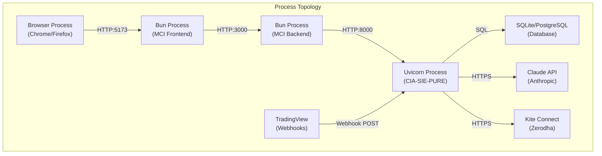
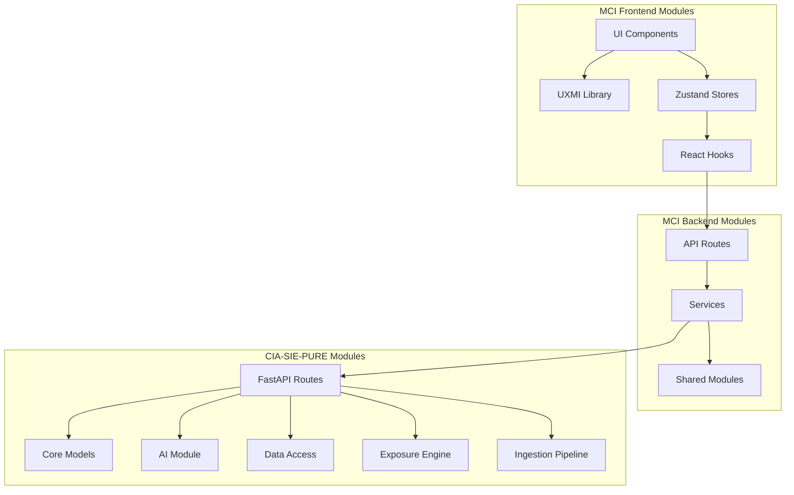
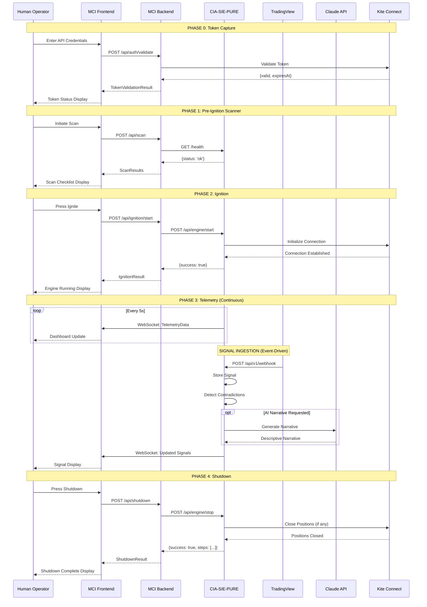
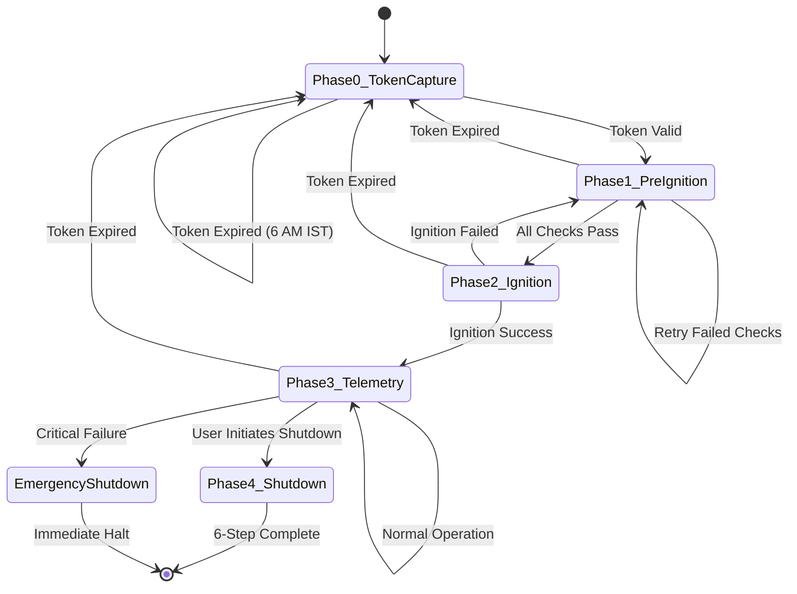

# CANONICAL FULL-STACK CIRCUIT DIAGRAM

**Authority:** PAD-CFD1 — CANONICAL FULL-STACK CIRCUIT FLOW & SYSTEM INTEGRITY DIRECTIVE
**Classification:** AEROSPACE-GRADE · ELECTRICAL-CIRCUIT FIDELITY
**Execution Date:** 2026-01-29
**Agent:** Claude Opus 4.5

---

## EXECUTIVE SUMMARY

This document provides an exhaustive canonical circuit-level representation of the integrated CIA-SIE-PURE + MCI system, treating it as a deterministic electrical-grade system.

---

## SYSTEM TOPOLOGY OVERVIEW

```
┌─────────────────────────────────────────────────────────────────────────────────────────────────┐
│                                    COMPLETE SYSTEM CIRCUIT                                       │
├─────────────────────────────────────────────────────────────────────────────────────────────────┤
│                                                                                                  │
│  ┌─────────────────────────────────────────────────────────────────────────────────────────┐   │
│  │                              HUMAN OPERATOR (PRINCIPAL)                                   │   │
│  │                         ┌───────────────────────────────────┐                            │   │
│  │                         │ Cognition Layer (Decision Making) │                            │   │
│  │                         └───────────────┬───────────────────┘                            │   │
│  │                                         │                                                 │   │
│  │                     ┌───────────────────┼───────────────────┐                            │   │
│  │                     │                   │                   │                            │   │
│  │                     ▼                   ▼                   ▼                            │   │
│  │              [Input Signals]    [Acknowledgment]    [Abort Authority]                    │   │
│  └─────────────────────────────────────────────────────────────────────────────────────────┘   │
│                                            │                                                     │
│  ══════════════════════════════════════════╪═════════════════════════════════════════════════  │
│                                            │ HUMAN/MACHINE BOUNDARY                             │
│  ══════════════════════════════════════════╪═════════════════════════════════════════════════  │
│                                            │                                                     │
│  ┌─────────────────────────────────────────▼───────────────────────────────────────────────┐   │
│  │                                        MCI                                                │   │
│  │                        (Mission Control Interface — COCKPIT)                             │   │
│  │                                                                                           │   │
│  │  ┌─────────────────────────────────────────────────────────────────────────────────────┐ │   │
│  │  │ FRONTEND (React/TypeScript) — Bun Runtime                                           │ │   │
│  │  │                                                                                     │ │   │
│  │  │  ┌──────────┐  ┌──────────┐  ┌──────────┐  ┌──────────┐  ┌──────────┐              │ │   │
│  │  │  │ Phase 0  │→→│ Phase 1  │→→│ Phase 2  │→→│ Phase 3  │→→│ Phase 4  │              │ │   │
│  │  │  │ Token    │  │ Scanner  │  │ Ignition │  │Telemetry │  │ Shutdown │              │ │   │
│  │  │  │ Capture  │  │          │  │          │  │Dashboard │  │          │              │ │   │
│  │  │  └─────┬────┘  └─────┬────┘  └─────┬────┘  └─────┬────┘  └─────┬────┘              │ │   │
│  │  │        │             │             │             │             │                    │ │   │
│  │  │  ┌─────▼─────────────▼─────────────▼─────────────▼─────────────▼────┐              │ │   │
│  │  │  │                    ZUSTAND STATE STORES                          │              │ │   │
│  │  │  │  tokenStore │ scannerStore │ ignitionStore │ telemetryStore │ shutdownStore   │ │   │
│  │  │  └───────────────────────────────┬──────────────────────────────────┘              │ │   │
│  │  │                                  │                                                  │ │   │
│  │  │  ┌───────────────────────────────▼──────────────────────────────────┐              │ │   │
│  │  │  │                    UXMI COMPONENT LIBRARY                        │              │ │   │
│  │  │  │  Button │ Input │ ErrorDisplay │ Toast │ Spinner │ ProgressBar │ Tooltip      │ │   │
│  │  │  └──────────────────────────────────────────────────────────────────┘              │ │   │
│  │  └─────────────────────────────────────────────────────────────────────────────────────┘ │   │
│  │                                         │                                                  │   │
│  │  ═══════════════════════════════════════╪═══════════════════════════════════════════════  │   │
│  │                                         │ HTTP/REST BOUNDARY                               │   │
│  │  ═══════════════════════════════════════╪═══════════════════════════════════════════════  │   │
│  │                                         │                                                  │   │
│  │  ┌─────────────────────────────────────▼───────────────────────────────────────────────┐ │   │
│  │  │ BACKEND (Hono/TypeScript) — Bun Runtime                                             │ │   │
│  │  │                                                                                     │ │   │
│  │  │  ┌───────────────────────────────────────────────────────────────────────────────┐  │ │   │
│  │  │  │                          API ROUTES                                           │  │ │   │
│  │  │  │  /api/auth │ /api/scan │ /api/ignition │ /api/telemetry │ /api/shutdown     │  │ │   │
│  │  │  └───────────────────────────────┬───────────────────────────────────────────────┘  │ │   │
│  │  │                                  │                                                   │ │   │
│  │  │  ┌───────────────────────────────▼───────────────────────────────────────────────┐  │ │   │
│  │  │  │                         SERVICES                                              │  │ │   │
│  │  │  │  cia-sie.ts │ kite.ts │ ciaSieHealthProbe.ts                                 │  │ │   │
│  │  │  └───────────────────────────────────────────────────────────────────────────────┘  │ │   │
│  │  │                                                                                      │ │   │
│  │  │  ┌───────────────────────────────────────────────────────────────────────────────┐  │ │   │
│  │  │  │                    SHARED MODULES                                             │  │ │   │
│  │  │  │  activation/ │ resilience/ │ validation/ │ verification/ │ live/ │ errors/  │  │ │   │
│  │  │  └───────────────────────────────────────────────────────────────────────────────┘  │ │   │
│  │  └─────────────────────────────────────────────────────────────────────────────────────┘ │   │
│  └───────────────────────────────────────────────────────────────────────────────────────────┘   │
│                                            │                                                     │
│  ══════════════════════════════════════════╪═════════════════════════════════════════════════  │
│                                            │ MCI ↔ CIA-SIE-PURE INTEGRATION BOUNDARY            │
│  ══════════════════════════════════════════╪═════════════════════════════════════════════════  │
│                                            │                                                     │
│  ┌─────────────────────────────────────────▼───────────────────────────────────────────────┐   │
│  │                                  CIA-SIE-PURE                                            │   │
│  │                          (Chart Intelligence Engine — ENGINE)                            │   │
│  │                                                                                           │   │
│  │  ┌─────────────────────────────────────────────────────────────────────────────────────┐ │   │
│  │  │ API LAYER (FastAPI/Python) — Uvicorn Runtime                                        │ │   │
│  │  │                                                                                     │ │   │
│  │  │  ┌───────────────────────────────────────────────────────────────────────────────┐  │ │   │
│  │  │  │                          API ROUTES                                           │  │ │   │
│  │  │  │  /instruments │ /silos │ /charts │ /signals │ /webhook │ /relationships     │  │ │   │
│  │  │  │  /narratives │ /baskets │ /platforms │ /ai │ /chat │ /strategy             │  │ │   │
│  │  │  └───────────────────────────────────────────────────────────────────────────────┘  │ │   │
│  │  │                                                                                      │ │   │
│  │  │  ┌───────────────────────────────────────────────────────────────────────────────┐  │ │   │
│  │  │  │                          CORE MODULES                                         │  │ │   │
│  │  │  │  ai/ │ core/ │ dal/ │ exposure/ │ ingestion/ │ platforms/ │ webhooks/       │  │ │   │
│  │  │  └───────────────────────────────────────────────────────────────────────────────┘  │ │   │
│  │  └─────────────────────────────────────────────────────────────────────────────────────┘ │   │
│  │                                         │                                                  │   │
│  │  ┌─────────────────────────────────────▼───────────────────────────────────────────────┐ │   │
│  │  │                           DATA ACCESS LAYER                                         │ │   │
│  │  │  database.py │ models.py │ repositories.py                                         │ │   │
│  │  └─────────────────────────────────────────────────────────────────────────────────────┘ │   │
│  └───────────────────────────────────────────────────────────────────────────────────────────┘   │
│                                            │                                                     │
│  ══════════════════════════════════════════╪═════════════════════════════════════════════════  │
│                                            │ EXTERNAL SERVICES BOUNDARY                         │
│  ══════════════════════════════════════════╪═════════════════════════════════════════════════  │
│                                            │                                                     │
│  ┌─────────────────────────────────────────▼───────────────────────────────────────────────┐   │
│  │                               EXTERNAL SERVICES                                          │   │
│  │                                                                                           │   │
│  │  ┌──────────────┐  ┌──────────────┐  ┌──────────────┐  ┌──────────────┐                 │   │
│  │  │  TradingView │  │    Claude    │  │ Kite Connect │  │   SQLite/    │                 │   │
│  │  │   Webhooks   │  │     AI       │  │   (Zerodha)  │  │   PostgreSQL │                 │   │
│  │  └──────────────┘  └──────────────┘  └──────────────┘  └──────────────┘                 │   │
│  └───────────────────────────────────────────────────────────────────────────────────────────┘   │
│                                                                                                  │
└─────────────────────────────────────────────────────────────────────────────────────────────────┘
```

---

## LAYERED CIRCUIT VIEWS

### VIEW 1: PHYSICAL LAYER (Processes)



### VIEW 2: LOGICAL LAYER (Module Boundaries)



### VIEW 3: SEMANTIC LAYER (Intent Boundaries)

```
┌─────────────────────────────────────────────────────────────────────────────────────┐
│                              SEMANTIC INTENT MAP                                     │
├─────────────────────────────────────────────────────────────────────────────────────┤
│                                                                                      │
│  DECISION-SUPPORT ZONE (PP-001)                                                     │
│  ╔═════════════════════════════════════════════════════════════════════════════╗   │
│  ║  MCI displays information → Human interprets → Human decides               ║   │
│  ║                                                                              ║   │
│  ║  ┌──────────────┐     ┌──────────────┐     ┌──────────────┐                 ║   │
│  ║  │ Data Display │ ─→  │ Cognition    │ ─→  │ Action       │                 ║   │
│  ║  │ (MCI)        │     │ (Human)      │     │ (Human)      │                 ║   │
│  ║  └──────────────┘     └──────────────┘     └──────────────┘                 ║   │
│  ╚═════════════════════════════════════════════════════════════════════════════╝   │
│                                                                                      │
│  CONTRADICTION EXPOSURE ZONE (PP-002)                                               │
│  ╔═════════════════════════════════════════════════════════════════════════════╗   │
│  ║  CIA-SIE-PURE detects → MCI exposes → Human observes (NO RESOLUTION)       ║   │
│  ║                                                                              ║   │
│  ║  ┌──────────────┐     ┌──────────────┐     ┌──────────────┐                 ║   │
│  ║  │ Contradiction│ ─→  │ Side-by-Side │ ─→  │ Human Sees   │                 ║   │
│  ║  │ Detector     │     │ Display      │     │ BOTH Signals │                 ║   │
│  ║  └──────────────┘     └──────────────┘     └──────────────┘                 ║   │
│  ╚═════════════════════════════════════════════════════════════════════════════╝   │
│                                                                                      │
│  DESCRIPTIVE AI ZONE (PP-003)                                                       │
│  ╔═════════════════════════════════════════════════════════════════════════════╗   │
│  ║  Claude generates → Validator filters → MCI displays (NO PRESCRIPTION)     ║   │
│  ║                                                                              ║   │
│  ║  ┌──────────────┐     ┌──────────────┐     ┌──────────────┐                 ║   │
│  ║  │ Claude       │ ─→  │ Response     │ ─→  │ Narrative    │                 ║   │
│  ║  │ Narrative    │     │ Validator    │     │ Display      │                 ║   │
│  ║  └──────────────┘     └──────────────┘     └──────────────┘                 ║   │
│  ╚═════════════════════════════════════════════════════════════════════════════╝   │
│                                                                                      │
└─────────────────────────────────────────────────────────────────────────────────────┘
```

---

## SIGNAL TYPE CATALOG

### A. DATA SIGNALS

| Signal ID | Name | Source | Destination | Payload | Direction |
|-----------|------|--------|-------------|---------|-----------|
| DS-001 | Token Credential | Human Input | tokenStore | `{apiKey, accessToken}` | Unidirectional |
| DS-002 | Token Validation | MCI Backend | tokenStore | `{valid, expiresAt}` | Unidirectional |
| DS-003 | Scan Results | MCI Backend | scannerStore | `ScanCheck[]` | Unidirectional |
| DS-004 | Ignition Response | MCI Backend | ignitionStore | `{success, message}` | Unidirectional |
| DS-005 | Telemetry Snapshot | CIA-SIE-PURE | telemetryStore | `EngineTelemetry` | Unidirectional |
| DS-006 | Position Data | CIA-SIE-PURE | PositionsPanel | `EnginePosition[]` | Unidirectional |
| DS-007 | Order Data | CIA-SIE-PURE | OrdersPanel | `EngineOrder[]` | Unidirectional |
| DS-008 | Signal Data | TradingView | CIA-SIE-PURE | `SignalPayload` | Unidirectional |
| DS-009 | AI Narrative | Claude API | CIA-SIE-PURE | `NarrativeResponse` | Unidirectional |

### B. CONTROL SIGNALS

| Signal ID | Name | Source | Destination | Payload | Direction |
|-----------|------|--------|-------------|---------|-----------|
| CS-001 | Phase Transition | State Machine | All Phases | `{from, to}` | Unidirectional |
| CS-002 | Ignition Command | Human → UI | MCI Backend | `{broker, credentials}` | Unidirectional |
| CS-003 | Shutdown Command | Human → UI | CIA-SIE-PURE | `{emergency: boolean}` | Unidirectional |
| CS-004 | Kill Switch | Abort Handler | All Systems | `TERMINATE` | Broadcast |
| CS-005 | LEAP Phase Advance | Orchestrator | Phase Executor | `{phase: A|B|C|D|E}` | Unidirectional |

### C. STATE TRANSITION SIGNALS

| Signal ID | Name | States | Trigger | Impact |
|-----------|------|--------|---------|--------|
| ST-001 | Token Status | absent→validating→valid→expired | Time + Validation | Phase 0 gate |
| ST-002 | Scanner Progress | pending→running→pass/fail | Scan execution | Phase 1 gate |
| ST-003 | Ignition Phase | pre-ignition→igniting→running | Ignite command | Phase 2 gate |
| ST-004 | Shutdown Steps | 1→2→3→4→5→6 | Sequential completion | CR-002 enforcement |
| ST-005 | Circuit Breaker | closed→open→half_open | Failure/Recovery | Resilience |

### D. HEALTH AND HEARTBEAT SIGNALS

| Signal ID | Name | Interval | Source | Destination | Failure Action |
|-----------|------|----------|--------|-------------|----------------|
| HB-001 | MCI Health | 30s | MCI Backend | StatusBar | Show degraded |
| HB-002 | CIA-SIE Health | 10s | ciaSieHealthProbe | EngineStatusIndicator | Show disconnected |
| HB-003 | WebSocket Ping | 5s | CIA-SIE-PURE | MCI Service | Reconnect |
| HB-004 | Token Countdown | 1s | Timer | TokenTimer | Show remaining |

### E. ABORT AND ROLLBACK SIGNALS

| Signal ID | Name | Trigger | Effect | Recovery |
|-----------|------|---------|--------|----------|
| AB-001 | Kill Switch | Manual or System | Immediate halt | Full restart |
| AB-002 | Phase Rollback | Phase failure | Reverse to prior state | Retry or abort |
| AB-003 | Emergency Shutdown | CR-002 emergency | Skip steps, halt | Manual restart |
| AB-004 | Circuit Open | Failure threshold | Reject requests | Wait + half-open |

### F. DEGRADATION SIGNALS

| Signal ID | Name | Condition | Visual Indicator | User Impact |
|-----------|------|-----------|------------------|-------------|
| DG-001 | Token Warning | <15 min remaining | Yellow timer | Alert user |
| DG-002 | Token Critical | <5 min remaining | Red timer | Force action |
| DG-003 | Latency Warn | >500ms | Orange badge | Data may lag |
| DG-004 | Latency Slow | >2000ms | Red badge | Significant delay |
| DG-005 | Connection Lost | No heartbeat | Disconnected state | Limited function |

---

## FLOW DIRECTION SPECIFICATIONS

### Unidirectional Flows

```
┌─────────────────────────────────────────────────────────────────────────────────┐
│                           UNIDIRECTIONAL SIGNAL FLOWS                            │
├─────────────────────────────────────────────────────────────────────────────────┤
│                                                                                  │
│  Human Input → MCI Frontend → MCI Backend → CIA-SIE-PURE                        │
│  ──────────────────────────────────────────────────────→                        │
│                                                                                  │
│  TradingView Webhook → CIA-SIE-PURE → Database                                  │
│  ──────────────────────────────────────────────→                                │
│                                                                                  │
│  Claude API Response → Response Validator → Narrative Store                     │
│  ──────────────────────────────────────────────────────→                        │
│                                                                                  │
└─────────────────────────────────────────────────────────────────────────────────┘
```

### Bidirectional Flows

```
┌─────────────────────────────────────────────────────────────────────────────────┐
│                           BIDIRECTIONAL SIGNAL FLOWS                             │
├─────────────────────────────────────────────────────────────────────────────────┤
│                                                                                  │
│  MCI Backend ←→ CIA-SIE-PURE (REST API)                                         │
│  ←─────────────────────────────────────→                                        │
│  Request: /api/v1/telemetry                                                      │
│  Response: EngineTelemetry                                                       │
│                                                                                  │
│  CIA-SIE-PURE ←→ Kite Connect (Trading API)                                     │
│  ←─────────────────────────────────────→                                        │
│  Request: Place Order                                                            │
│  Response: Order Status                                                          │
│                                                                                  │
└─────────────────────────────────────────────────────────────────────────────────┘
```

### Push vs Pull Classification

| Flow | Type | Protocol | Frequency |
|------|------|----------|-----------|
| Health Check | Pull | HTTP GET | 10s polling |
| Telemetry Stream | Push | WebSocket | Continuous |
| Token Validation | Pull | HTTP POST | On demand |
| Webhook Signal | Push | HTTP POST | Event-driven |
| Scan Execution | Pull | HTTP POST | User-triggered |

### Blocking vs Non-Blocking

| Operation | Blocking | Timeout | Fallback |
|-----------|----------|---------|----------|
| Token Validation | Yes | 5000ms | Reject |
| Scan Checks | Yes | 10000ms per check | Mark failed |
| Ignition | Yes | 30000ms | Abort |
| Telemetry Fetch | No (async) | 5000ms | Use cached |
| Health Probe | No (async) | 2000ms | Mark degraded |

---

## FAILURE MODE EXPLICIT BRANCHES

### FM-001: Partial Failure

```
┌─────────────────────────────────────────────────────────────────────────────────┐
│                        PARTIAL FAILURE: Scan Check Fails                         │
├─────────────────────────────────────────────────────────────────────────────────┤
│                                                                                  │
│  Phase 1 Scanner                                                                 │
│       │                                                                          │
│       ├── Check 1: API Connectivity ─── PASS                                    │
│       │                                                                          │
│       ├── Check 2: Token Valid ─── PASS                                         │
│       │                                                                          │
│       ├── Check 3: Backend Health ─── FAIL ───┐                                 │
│       │                                        │                                 │
│       │                            ┌───────────▼───────────┐                    │
│       │                            │ Partial Failure Path  │                    │
│       │                            │                       │                    │
│       │                            │ 1. Mark check failed  │                    │
│       │                            │ 2. Continue other     │                    │
│       │                            │ 3. Aggregate results  │                    │
│       │                            │ 4. Block Phase 2 if   │                    │
│       │                            │    any critical fails │                    │
│       │                            └───────────────────────┘                    │
│       │                                                                          │
│       ├── Check 4: Market Hours ─── PASS                                        │
│       │                                                                          │
│       └── [Continue remaining checks]                                            │
│                                                                                  │
└─────────────────────────────────────────────────────────────────────────────────┘
```

### FM-002: Silent Failure (PREVENTED)

```
┌─────────────────────────────────────────────────────────────────────────────────┐
│                    SILENT FAILURE: ARCHITECTURALLY PREVENTED                     │
├─────────────────────────────────────────────────────────────────────────────────┤
│                                                                                  │
│  CONSTRAINT: INV-005 (Failure Visibility)                                       │
│                                                                                  │
│  All failure paths MUST:                                                        │
│  1. Log to Sentry                                                               │
│  2. Display via ErrorDisplay (WHAT/WHY/HOW)                                     │
│  3. Update store state to error                                                 │
│  4. Trigger Toast notification                                                  │
│                                                                                  │
│  NO SILENT FAILURES EXIST IN THE CIRCUIT.                                       │
│                                                                                  │
│  Verification:                                                                   │
│  - Every catch block includes error handling                                    │
│  - Every async operation has onError                                            │
│  - Sentry captures all exceptions                                               │
│                                                                                  │
└─────────────────────────────────────────────────────────────────────────────────┘
```

### FM-003: Hard Failure

```
┌─────────────────────────────────────────────────────────────────────────────────┐
│                        HARD FAILURE: CIA-SIE-PURE Unreachable                   │
├─────────────────────────────────────────────────────────────────────────────────┤
│                                                                                  │
│  Health Probe Loop                                                               │
│       │                                                                          │
│       ├── Attempt 1 ─── TIMEOUT ───┐                                           │
│       │                             │                                            │
│       ├── Attempt 2 ─── TIMEOUT ───┤                                           │
│       │                             │                                            │
│       ├── Attempt 3 ─── TIMEOUT ───┤                                           │
│       │                             │                                            │
│       ├── Attempt 4 ─── TIMEOUT ───┤                                           │
│       │                             │                                            │
│       └── Attempt 5 ─── TIMEOUT ───┘                                           │
│                                     │                                            │
│                         ┌───────────▼───────────┐                               │
│                         │   HARD FAILURE PATH   │                               │
│                         │                       │                               │
│                         │ 1. Circuit OPEN       │                               │
│                         │ 2. Status: DISCONNECTED│                              │
│                         │ 3. isDegradedMode: true│                              │
│                         │ 4. User notification   │                              │
│                         │ 5. Retry after timeout │                              │
│                         └───────────────────────┘                               │
│                                                                                  │
└─────────────────────────────────────────────────────────────────────────────────┘
```

### FM-004: Latency Injection

```
┌─────────────────────────────────────────────────────────────────────────────────┐
│                        LATENCY INJECTION: Slow Response Handling                 │
├─────────────────────────────────────────────────────────────────────────────────┤
│                                                                                  │
│  classifyLatency(latencyMs)                                                      │
│       │                                                                          │
│       ├── ≤100ms ─── 'ok' ─── Normal operation                                  │
│       │                                                                          │
│       ├── ≤500ms ─── 'warn' ─── Yellow indicator                                │
│       │                         "System is slightly slower than usual"          │
│       │                                                                          │
│       ├── ≤2000ms ── 'slow' ─── Orange indicator                                │
│       │                         "System is experiencing delays"                  │
│       │                                                                          │
│       ├── >2000ms ── 'fail' ─── Red indicator                                   │
│       │                         "System is very slow"                            │
│       │                                                                          │
│       └── null ───── 'timeout' ─ "Cannot reach CIA-SIE-PURE"                    │
│                                                                                  │
└─────────────────────────────────────────────────────────────────────────────────┘
```

### FM-005: Schema Drift

```
┌─────────────────────────────────────────────────────────────────────────────────┐
│                        SCHEMA DRIFT: Response Shape Mismatch                     │
├─────────────────────────────────────────────────────────────────────────────────┤
│                                                                                  │
│  CIA-SIE-PURE Response                                                           │
│       │                                                                          │
│       ▼                                                                          │
│  sanitizeCiaSieResponse(rawData)                                                │
│       │                                                                          │
│       ├── Valid Shape ─── Return sanitized data                                 │
│       │                                                                          │
│       └── Invalid Shape ─── SCHEMA DRIFT DETECTED                               │
│                              │                                                   │
│                   ┌──────────▼──────────┐                                       │
│                   │ Schema Drift Path   │                                       │
│                   │                     │                                       │
│                   │ 1. Log warning      │                                       │
│                   │ 2. Sanitize strings │                                       │
│                   │ 3. Default missing  │                                       │
│                   │ 4. Reject if fatal  │                                       │
│                   └─────────────────────┘                                       │
│                                                                                  │
│  PROTECTION: TypeScript types + runtime validation                              │
│                                                                                  │
└─────────────────────────────────────────────────────────────────────────────────┘
```

### FM-006: Contract Violation

```
┌─────────────────────────────────────────────────────────────────────────────────┐
│                        CONTRACT VIOLATION: Constitutional Breach                 │
├─────────────────────────────────────────────────────────────────────────────────┤
│                                                                                  │
│  Response Validator (response_validator.py)                                      │
│       │                                                                          │
│       ├── Check for prescriptive language                                       │
│       │   └── "should", "recommend", "must buy" → REJECT                        │
│       │                                                                          │
│       ├── Check for hidden aggregation                                          │
│       │   └── confidence scores, probabilities → STRIP                          │
│       │                                                                          │
│       └── Check for constitutional violations                                   │
│           └── PP-001, PP-002, PP-003 breach → BLOCK                             │
│                                                                                  │
│  ┌─────────────────────────────────────────────────────────────────────────┐   │
│  │                     CONTRACT VIOLATION HANDLING                         │   │
│  │                                                                         │   │
│  │ 1. Response REJECTED at boundary                                        │   │
│  │ 2. Error logged with violation details                                  │   │
│  │ 3. Fallback response generated                                          │   │
│  │ 4. Constitutional violation flagged                                     │   │
│  └─────────────────────────────────────────────────────────────────────────┘   │
│                                                                                  │
└─────────────────────────────────────────────────────────────────────────────────┘
```

---

## BOUNDARY DEMARCATION

### CIA-SIE-PURE Boundaries

```
┌─────────────────────────────────────────────────────────────────────────────────┐
│                         CIA-SIE-PURE BOUNDARY DEFINITION                         │
├─────────────────────────────────────────────────────────────────────────────────┤
│                                                                                  │
│  OWNS:                                                                           │
│  ├── Signal storage and retrieval                                               │
│  ├── Contradiction detection                                                     │
│  ├── Confirmation detection                                                      │
│  ├── AI narrative generation                                                     │
│  ├── TradingView webhook ingestion                                              │
│  ├── Platform integrations (Kite, etc.)                                         │
│  └── Database persistence                                                        │
│                                                                                  │
│  EXPOSES:                                                                        │
│  ├── REST API at /api/v1/*                                                      │
│  ├── Health endpoint at /health                                                 │
│  ├── WebSocket at /ws (telemetry stream)                                        │
│  └── Webhook endpoint at /api/v1/webhook                                        │
│                                                                                  │
│  DOES NOT OWN:                                                                   │
│  ├── Token lifecycle (delegated to Kite)                                        │
│  ├── UI rendering (delegated to MCI)                                            │
│  ├── Human decision making                                                       │
│  └── Operational supervision                                                     │
│                                                                                  │
└─────────────────────────────────────────────────────────────────────────────────┘
```

### MCI Boundaries

```
┌─────────────────────────────────────────────────────────────────────────────────┐
│                             MCI BOUNDARY DEFINITION                              │
├─────────────────────────────────────────────────────────────────────────────────┤
│                                                                                  │
│  OWNS:                                                                           │
│  ├── Token capture and validation                                               │
│  ├── Pre-ignition scanning                                                       │
│  ├── Ignition control (start/stop engine)                                       │
│  ├── Telemetry display                                                           │
│  ├── Shutdown orchestration                                                      │
│  ├── UXMI component library                                                      │
│  └── Error presentation (WHAT/WHY/HOW)                                          │
│                                                                                  │
│  OBSERVES (but does not control):                                               │
│  ├── CIA-SIE-PURE engine status                                                 │
│  ├── Signal data (read-only)                                                    │
│  ├── Contradiction data (read-only)                                             │
│  └── AI narratives (read-only)                                                  │
│                                                                                  │
│  DOES NOT OWN:                                                                   │
│  ├── Trading execution                                                           │
│  ├── Signal interpretation                                                       │
│  ├── Contradiction resolution                                                    │
│  └── Recommendations (PROHIBITED)                                                │
│                                                                                  │
└─────────────────────────────────────────────────────────────────────────────────┘
```

### Integration Boundary

```
┌─────────────────────────────────────────────────────────────────────────────────┐
│                         INTEGRATION BOUNDARY DEFINITION                          │
├─────────────────────────────────────────────────────────────────────────────────┤
│                                                                                  │
│  HANDSHAKE PROTOCOL:                                                             │
│  ├── MCI initiates ALL connections to CIA-SIE-PURE                              │
│  ├── CIA-SIE-PURE never initiates to MCI (except WebSocket push)                │
│  ├── All data flows through REST API contracts                                   │
│  └── WebSocket is unidirectional (CIA-SIE-PURE → MCI)                           │
│                                                                                  │
│  AUTHORITY TRANSFER:                                                             │
│  ├── Token: Human → MCI → Kite (validation)                                     │
│  ├── Ignition: Human → MCI → CIA-SIE-PURE (start command)                       │
│  ├── Shutdown: Human → MCI → CIA-SIE-PURE (stop command)                        │
│  └── Trading: CIA-SIE-PURE → Kite (execution) — MCI has NO authority            │
│                                                                                  │
│  DATA SANITIZATION:                                                              │
│  ├── ALL CIA-SIE-PURE responses sanitized at MCI boundary                       │
│  ├── sanitizeCiaSieResponse() in src/shared/validation/sanitize.ts              │
│  └── BLOCK-001 compliance enforced                                               │
│                                                                                  │
└─────────────────────────────────────────────────────────────────────────────────┘
```

---

## MERMAID CIRCUIT DIAGRAMS

### Complete Signal Flow



### State Machine Diagram



---

## FIRST-PRINCIPLES VERIFICATION

### Why Does Each Component Exist?

| Component | Why It Exists | Invariant Protected | Breaks If Removed | Breaks If Misfires | Failure Detection | Rollback |
|-----------|---------------|---------------------|-------------------|--------------------|--------------------|----------|
| TokenTimer | CR-004: Token expires at 6 AM IST | Token lifecycle accuracy | No expiry warning | Wrong expiry time | Timer vs server time | Redirect to Phase 0 |
| PreIgnitionScanner | Prevent ignition with unhealthy dependencies | System readiness | Ignite unready system | False positives | Check status flags | Block Phase 2 |
| IgnitionButton | Human-controlled engine start | Human authority | No way to start | Auto-start possible | Button state | Shutdown command |
| TelemetryDashboard | PP-001: Decision support display | Operator awareness | No visibility | Wrong data shown | Data freshness flags | Mark stale |
| ShutdownPanel | CR-002: 6-step graceful shutdown | Clean termination | Abrupt termination | Steps out of order | Step status | Emergency mode |
| ErrorDisplay | CR-003: WHAT/WHY/HOW format | Error recovery | Cryptic errors | Wrong recovery path | Error structure | Retry action |
| CircuitBreaker | INV-005: Failure containment | Service isolation | Cascading failures | Block healthy service | State monitoring | Reset circuit |
| SimulationBadge | GAP-04: No fake data deception | Truth labeling | Fake looks real | Real looks simulated | isSimulated flag | Toggle mode |

---

## ATTESTATION

This Canonical Full-Stack Circuit Diagram:
- Treats the system as a deterministic electrical-grade circuit
- Explicitly models all signal types, flow directions, and failure modes
- Demarcates clear boundaries between CIA-SIE-PURE, MCI, and integration points
- Provides layered views (Physical, Logical, Semantic)
- Answers first-principles verification questions for each component

**Signed:** Claude Opus 4.5
**Date:** 2026-01-29
**Authority:** PAD-CFD1 AEROSPACE-GRADE EXECUTION

---

*This document fulfills PAD-CFD1 Deliverable 1 requirements.*
