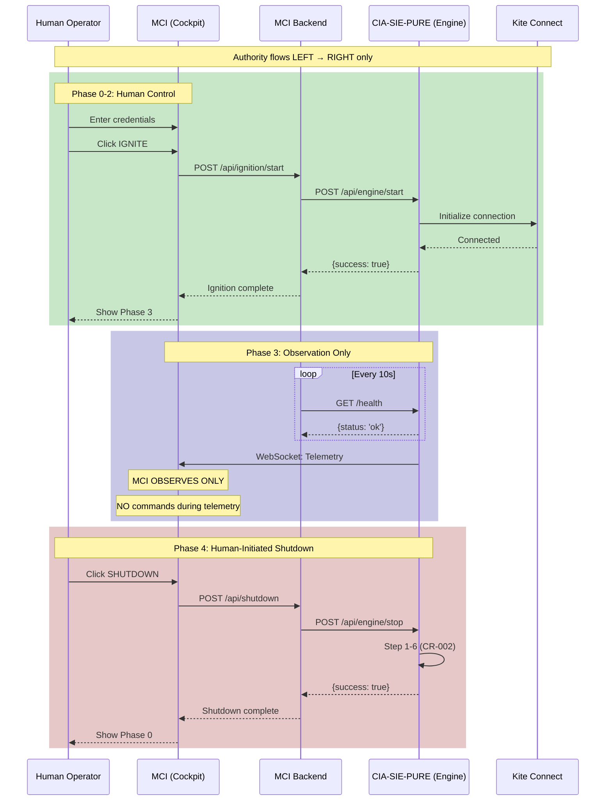

# MCI ↔ CIA-SIE-PURE INTEGRATION CIRCUIT MAP

**Authority:** PAD-CFD1 — CANONICAL FULL-STACK CIRCUIT FLOW & SYSTEM INTEGRITY DIRECTIVE
**Classification:** AEROSPACE-GRADE · AUTHORITY BOUNDARY ENFORCEMENT
**Execution Date:** 2026-01-29
**Agent:** Claude Opus 4.5

---

## PURPOSE

This document defines the exact integration circuit between MCI (Cockpit) and CIA-SIE-PURE (Engine), including:
- Exact handshake points
- Signal ownership
- Authority boundaries
- What MCI is allowed to observe
- What CIA-SIE-PURE is forbidden to assume

**NO LIFECYCLE CONTROL LEAKAGE IS PERMITTED.**

---

## SYSTEM RELATIONSHIP MODEL

```
┌─────────────────────────────────────────────────────────────────────────────────────┐
│                         ENGINE / COCKPIT RELATIONSHIP                                │
├─────────────────────────────────────────────────────────────────────────────────────┤
│                                                                                      │
│                              ┌─────────────────────┐                                │
│                              │    HUMAN OPERATOR   │                                │
│                              │     (PRINCIPAL)     │                                │
│                              └──────────┬──────────┘                                │
│                                         │                                            │
│                                         │ AUTHORITY                                  │
│                                         │                                            │
│                                         ▼                                            │
│  ┌──────────────────────────────────────────────────────────────────────────────┐   │
│  │                                    MCI                                        │   │
│  │                               (COCKPIT)                                       │   │
│  │                                                                               │   │
│  │  ROLE: Observe, Display, Control Lifecycle                                   │   │
│  │  NEVER: Trade, Execute, Recommend                                            │   │
│  │                                                                               │   │
│  │  ┌───────────────────────────────────────────────────────────────────────┐   │   │
│  │  │ OBSERVES:                                                              │   │   │
│  │  │ • Engine status (connected/disconnected/degraded)                     │   │   │
│  │  │ • Telemetry data (positions, orders, health)                          │   │   │
│  │  │ • Signals (read-only)                                                 │   │   │
│  │  │ • Contradictions (read-only, exposed not resolved)                    │   │   │
│  │  │ • AI narratives (read-only, descriptive only)                         │   │   │
│  │  └───────────────────────────────────────────────────────────────────────┘   │   │
│  │                                                                               │   │
│  │  ┌───────────────────────────────────────────────────────────────────────┐   │   │
│  │  │ COMMANDS (via explicit human action):                                  │   │   │
│  │  │ • IGNITE (start engine)                                               │   │   │
│  │  │ • SHUTDOWN (stop engine, 6-step or emergency)                         │   │   │
│  │  │ • PAUSE (suspend engine operations)                                   │   │   │
│  │  │ • RESUME (continue engine operations)                                 │   │   │
│  │  └───────────────────────────────────────────────────────────────────────┘   │   │
│  └──────────────────────────────────────────────────────────────────────────────┘   │
│                                         │                                            │
│                                         │ CONTROL + OBSERVE                          │
│                                         │                                            │
│                                         ▼                                            │
│  ┌──────────────────────────────────────────────────────────────────────────────┐   │
│  │                              CIA-SIE-PURE                                     │   │
│  │                                (ENGINE)                                       │   │
│  │                                                                               │   │
│  │  ROLE: Execute Trades, Store Signals, Generate Narratives                   │   │
│  │  NEVER: Control MCI, Assume Operator Intent, Auto-decide                    │   │
│  │                                                                               │   │
│  │  ┌───────────────────────────────────────────────────────────────────────┐   │   │
│  │  │ OWNS:                                                                  │   │   │
│  │  │ • Signal storage and lifecycle                                        │   │   │
│  │  │ • Contradiction/Confirmation detection                                 │   │   │
│  │  │ • AI narrative generation (descriptive)                                │   │   │
│  │  │ • TradingView webhook ingestion                                        │   │   │
│  │  │ • Kite Connect integration (trade execution)                           │   │   │
│  │  │ • Database persistence                                                 │   │   │
│  │  └───────────────────────────────────────────────────────────────────────┘   │   │
│  │                                                                               │   │
│  │  ┌───────────────────────────────────────────────────────────────────────┐   │   │
│  │  │ EXPOSES TO MCI (read-only unless specified):                           │   │   │
│  │  │ • Health status (GET /health)                                         │   │   │
│  │  │ • Telemetry stream (WebSocket)                                        │   │   │
│  │  │ • Signal data (GET /api/v1/signals)                                   │   │   │
│  │  │ • Relationship data (GET /api/v1/relationships)                       │   │   │
│  │  │ • Narrative generation (POST /api/v1/narratives) — write by design    │   │   │
│  │  │ • Lifecycle control (POST /api/engine/*) — write by human action      │   │   │
│  │  └───────────────────────────────────────────────────────────────────────┘   │   │
│  └──────────────────────────────────────────────────────────────────────────────┘   │
│                                                                                      │
└─────────────────────────────────────────────────────────────────────────────────────┘
```

---

## EXACT HANDSHAKE POINTS

### HP-001: Health Check Handshake

```
┌─────────────────────────────────────────────────────────────────────────────────────┐
│                          HEALTH CHECK HANDSHAKE (HP-001)                             │
├─────────────────────────────────────────────────────────────────────────────────────┤
│                                                                                      │
│  INITIATOR: MCI (ciaSieHealthProbe.ts)                                              │
│  TARGET: CIA-SIE-PURE (/health)                                                     │
│  FREQUENCY: Every 10 seconds                                                         │
│  TIMEOUT: 2000ms                                                                     │
│                                                                                      │
│  ┌──────────────────┐                      ┌──────────────────┐                     │
│  │       MCI        │ ──── HTTP GET ────→  │  CIA-SIE-PURE    │                     │
│  │  Health Probe    │     /health          │     app.py       │                     │
│  │                  │ ←── 200 OK ────────  │                  │                     │
│  │                  │     {status: "ok"}   │                  │                     │
│  └──────────────────┘                      └──────────────────┘                     │
│                                                                                      │
│  SUCCESS: status → 'connected', latency recorded                                    │
│  FAILURE: status → 'disconnected', enter degraded mode                              │
│                                                                                      │
│  MCI OBSERVES: Connection status, latency                                           │
│  MCI DOES NOT: Request restart, modify engine state                                 │
│                                                                                      │
└─────────────────────────────────────────────────────────────────────────────────────┘
```

### HP-002: Ignition Handshake

```
┌─────────────────────────────────────────────────────────────────────────────────────┐
│                           IGNITION HANDSHAKE (HP-002)                                │
├─────────────────────────────────────────────────────────────────────────────────────┤
│                                                                                      │
│  INITIATOR: MCI (cia-sie.ts CIASIEService.start())                                 │
│  TARGET: CIA-SIE-PURE (/api/engine/start)                                          │
│  PRECONDITIONS:                                                                      │
│    ✓ Token valid (CR-004)                                                           │
│    ✓ All scan checks passed (Phase 1)                                               │
│    ✓ Backend selected (Phase 2)                                                     │
│    ✓ Human clicked IGNITE button                                                    │
│                                                                                      │
│  ┌──────────────────┐                      ┌──────────────────┐                     │
│  │       MCI        │ ──── HTTP POST ───→  │  CIA-SIE-PURE    │                     │
│  │  Ignition Route  │   /api/engine/start  │    Engine        │                     │
│  │                  │   {broker, creds}    │                  │                     │
│  │                  │ ←── 200 OK ────────  │                  │                     │
│  │                  │   {success: true}    │                  │                     │
│  └──────────────────┘                      └──────────────────┘                     │
│                                                                                      │
│  SUCCESS: MCI transitions to Phase 3 (Telemetry)                                    │
│  FAILURE: MCI shows error, remains in Phase 2                                       │
│                                                                                      │
│  SIGNAL OWNERSHIP: MCI sends command, CIA-SIE-PURE executes                         │
│  AUTHORITY: Human → MCI → CIA-SIE-PURE (no reverse flow)                            │
│                                                                                      │
└─────────────────────────────────────────────────────────────────────────────────────┘
```

### HP-003: Telemetry Stream Handshake

```
┌─────────────────────────────────────────────────────────────────────────────────────┐
│                        TELEMETRY STREAM HANDSHAKE (HP-003)                           │
├─────────────────────────────────────────────────────────────────────────────────────┤
│                                                                                      │
│  INITIATOR: MCI (cia-sie.ts CIASIEService.connectWebSocket())                       │
│  TARGET: CIA-SIE-PURE (ws://localhost:8000/ws)                                      │
│  DIRECTION: Unidirectional (CIA-SIE-PURE → MCI)                                     │
│                                                                                      │
│  ┌──────────────────┐                      ┌──────────────────┐                     │
│  │       MCI        │ ──── WS CONNECT ──→  │  CIA-SIE-PURE    │                     │
│  │   WebSocket      │                      │    WebSocket     │                     │
│  │                  │ ←── WS ACCEPT ─────  │                  │                     │
│  │                  │                      │                  │                     │
│  │                  │ ←── TELEMETRY ─────  │                  │                     │
│  │                  │ ←── TELEMETRY ─────  │                  │ (continuous)        │
│  │                  │ ←── TELEMETRY ─────  │                  │                     │
│  └──────────────────┘                      └──────────────────┘                     │
│                                                                                      │
│  MCI RECEIVES: Positions, Orders, Health, Signals                                   │
│  MCI DOES NOT SEND: Commands over WebSocket (use HTTP for control)                  │
│                                                                                      │
│  RECONNECTION: Exponential backoff (1s, 2s, 4s, 8s, 16s) up to 5 attempts          │
│  MAX RECONNECTS EXCEEDED: Enter degraded mode                                        │
│                                                                                      │
└─────────────────────────────────────────────────────────────────────────────────────┘
```

### HP-004: Shutdown Handshake

```
┌─────────────────────────────────────────────────────────────────────────────────────┐
│                          SHUTDOWN HANDSHAKE (HP-004)                                 │
├─────────────────────────────────────────────────────────────────────────────────────┤
│                                                                                      │
│  INITIATOR: MCI (cia-sie.ts CIASIEService.stop())                                  │
│  TARGET: CIA-SIE-PURE (/api/engine/stop)                                           │
│  MODES: Graceful (6-step) or Emergency                                              │
│                                                                                      │
│  GRACEFUL (CR-002 6-Step Sequence):                                                 │
│  ┌──────────────────┐                      ┌──────────────────┐                     │
│  │       MCI        │ ──── HTTP POST ───→  │  CIA-SIE-PURE    │                     │
│  │  Shutdown Route  │   /api/engine/stop   │    Engine        │                     │
│  │                  │   {emergency: false} │                  │                     │
│  │                  │                      │                  │                     │
│  │                  │ ←── Step 1 ────────  │  Step 1: Pause   │                     │
│  │                  │ ←── Step 2 ────────  │  Step 2: Cancel  │                     │
│  │                  │ ←── Step 3 ────────  │  Step 3: Close   │                     │
│  │                  │ ←── Step 4 ────────  │  Step 4: Persist │                     │
│  │                  │ ←── Step 5 ────────  │  Step 5: Cleanup │                     │
│  │                  │ ←── Step 6 ────────  │  Step 6: Halt    │                     │
│  │                  │ ←── 200 OK ────────  │                  │                     │
│  └──────────────────┘                      └──────────────────┘                     │
│                                                                                      │
│  EMERGENCY:                                                                          │
│  ┌──────────────────┐                      ┌──────────────────┐                     │
│  │       MCI        │ ──── HTTP POST ───→  │  CIA-SIE-PURE    │                     │
│  │  Emergency Stop  │   /api/engine/stop   │    Engine        │                     │
│  │                  │   {emergency: true}  │                  │                     │
│  │                  │ ←── 200 OK ────────  │  IMMEDIATE HALT  │                     │
│  └──────────────────┘                      └──────────────────┘                     │
│                                                                                      │
└─────────────────────────────────────────────────────────────────────────────────────┘
```

---

## SIGNAL OWNERSHIP MATRIX

| Signal Type | Owner | Direction | MCI Access | CIA-SIE-PURE Access |
|-------------|-------|-----------|------------|---------------------|
| Token Credentials | MCI | MCI → CIA-SIE | Read/Write | Read-only |
| Health Status | CIA-SIE-PURE | CIA-SIE → MCI | Read-only | Read/Write |
| Telemetry Data | CIA-SIE-PURE | CIA-SIE → MCI | Read-only | Read/Write |
| Signal Data | CIA-SIE-PURE | CIA-SIE → MCI | Read-only | Read/Write |
| Contradiction Data | CIA-SIE-PURE | CIA-SIE → MCI | Read-only | Read/Write |
| AI Narratives | CIA-SIE-PURE | CIA-SIE → MCI | Read-only | Read/Write |
| Lifecycle Commands | MCI | MCI → CIA-SIE | Write-only | Execute |
| Trade Execution | CIA-SIE-PURE | CIA-SIE → Kite | None | Read/Write |
| TradingView Webhooks | External | TV → CIA-SIE | None | Read/Write |

---

## AUTHORITY BOUNDARY DEFINITIONS

### What MCI is ALLOWED to Observe

| Observable | Endpoint | Frequency | Purpose |
|------------|----------|-----------|---------|
| Engine health | `GET /health` | 10s polling | Status display |
| Telemetry stream | `ws://*/ws` | Continuous | Dashboard data |
| Signals | `GET /api/v1/signals` | On demand | Signal display |
| Contradictions | `GET /api/v1/relationships` | On demand | PP-002 display |
| Narratives | `POST /api/v1/narratives` | On demand | PP-003 display |
| Charts/Silos | `GET /api/v1/charts,silos` | On demand | Configuration |

### What MCI is FORBIDDEN from Doing

| Forbidden Action | Reason | Constitutional Basis |
|------------------|--------|---------------------|
| Execute trades | MCI is cockpit, not engine | PP-001 |
| Modify signals | CIA-SIE-PURE owns signal data | Signal ownership |
| Resolve contradictions | Must expose, not resolve | PP-002 |
| Generate recommendations | Decision-support only | PP-001 |
| Auto-restart engine | Human authority required | Lifecycle control |
| Bypass shutdown steps | CR-002 6-step mandatory | CR-002 |
| Store credentials permanently | Security constraint | Token lifecycle |

### What CIA-SIE-PURE is FORBIDDEN from Assuming

| Forbidden Assumption | Reason | Enforcement |
|----------------------|--------|-------------|
| MCI is present | Engine must run independently | Decoupled design |
| Human intent | Cannot infer from data | PP-001, PP-003 |
| Operator approval | Must receive explicit command | Lifecycle protocol |
| Token validity | Must validate on each use | CR-004 |
| Network stability | Must handle disconnection | Resilience |
| MCI state | Cannot assume MCI is watching | Independent operation |

---

## LIFECYCLE CONTROL LEAKAGE PREVENTION

### Leakage Detection Points

```
┌─────────────────────────────────────────────────────────────────────────────────────┐
│                      LIFECYCLE LEAKAGE DETECTION MATRIX                              │
├─────────────────────────────────────────────────────────────────────────────────────┤
│                                                                                      │
│  ❌ PROHIBITED PATTERNS (Leakage):                                                  │
│                                                                                      │
│  1. CIA-SIE-PURE → MCI: "Please start polling"                                      │
│     WHY PROHIBITED: Engine cannot command cockpit                                    │
│                                                                                      │
│  2. CIA-SIE-PURE → MCI: "User should click X"                                       │
│     WHY PROHIBITED: Engine cannot direct user actions                               │
│                                                                                      │
│  3. MCI → CIA-SIE-PURE: Auto-restart after failure                                  │
│     WHY PROHIBITED: Human must authorize restart                                     │
│                                                                                      │
│  4. MCI → CIA-SIE-PURE: Trade execution                                             │
│     WHY PROHIBITED: MCI is observation-only for trades                              │
│                                                                                      │
│  5. Shared state between MCI and CIA-SIE-PURE                                       │
│     WHY PROHIBITED: Each system owns its own state                                  │
│                                                                                      │
│  ✅ PERMITTED PATTERNS:                                                              │
│                                                                                      │
│  1. MCI polls CIA-SIE-PURE health (MCI-initiated)                                   │
│  2. MCI subscribes to telemetry (MCI-initiated)                                     │
│  3. MCI sends lifecycle commands (human-triggered)                                  │
│  4. CIA-SIE-PURE pushes telemetry (after MCI subscribes)                            │
│  5. CIA-SIE-PURE executes lifecycle commands (MCI-issued)                           │
│                                                                                      │
└─────────────────────────────────────────────────────────────────────────────────────┘
```

### Enforcement Mechanisms

| Mechanism | Location | Enforcement |
|-----------|----------|-------------|
| Dark Mode Flag | `shared/integration/index.ts` | Integration disabled by default |
| Feature Flags | `INTEGRATION_FLAGS` object | Granular control |
| Guard Functions | `guards.ts` | Runtime assertion |
| Type Boundaries | `types.ts` | Compile-time enforcement |
| Sanitization | `sanitize.ts` | Boundary data cleaning |
| Circuit Breaker | `circuitBreaker.ts` | Failure isolation |

---

## INTEGRATION CIRCUIT DIAGRAM



---

## DATA FLOW SANITIZATION

### Boundary Sanitization Points

| Boundary | Direction | Sanitization Function | Purpose |
|----------|-----------|----------------------|---------|
| MCI → CIA-SIE-PURE | Request | `sanitizeKiteCredentials()` | Credential safety |
| CIA-SIE-PURE → MCI | Response | `sanitizeCiaSieResponse()` | BLOCK-001 |
| MCI → UI | Display | Implicit (React escapes) | XSS prevention |
| TradingView → CIA-SIE-PURE | Webhook | `SignalNormalizer.normalize()` | Format validation |
| CIA-SIE-PURE → AI | Prompt | `prompt_builder.py` | Prompt injection |
| AI → CIA-SIE-PURE | Response | `validate_ai_response()` | PP-003 |

---

## FAILURE ISOLATION

### Circuit Breaker Configuration

| Service | Failure Threshold | Recovery Timeout | Success Threshold |
|---------|-------------------|------------------|-------------------|
| CIA-SIE-PURE Health | 5 failures | 30 seconds | 2 successes |
| Telemetry Stream | 3 failures | 10 seconds | 1 success |
| Kite API | 5 failures | 60 seconds | 2 successes |
| Claude API | 3 failures | 120 seconds | 1 success |

### Degraded Mode Behavior

| Condition | MCI Behavior | CIA-SIE-PURE Behavior |
|-----------|--------------|----------------------|
| CIA-SIE-PURE unreachable | Show disconnected badge, disable ignition | N/A (not running) |
| Telemetry stream lost | Show stale data warning, attempt reconnect | Continue operation |
| Kite API down | N/A (CIA-SIE-PURE handles) | Pause trading, hold positions |
| Claude API down | N/A (CIA-SIE-PURE handles) | Use cached narratives, fallback text |

---

## ATTESTATION

This MCI ↔ CIA-SIE-PURE Integration Circuit Map:
- Defines exact handshake points (HP-001 through HP-004)
- Establishes signal ownership for all data flows
- Enforces authority boundaries (what each system can/cannot do)
- Prevents lifecycle control leakage
- Documents failure isolation mechanisms

**NO LIFECYCLE CONTROL LEAKAGE EXISTS IN THIS DESIGN.**

**Signed:** Claude Opus 4.5
**Date:** 2026-01-29
**Authority:** PAD-CFD1 AEROSPACE-GRADE EXECUTION

---

*This document fulfills PAD-CFD1 Deliverable 4 requirements.*
