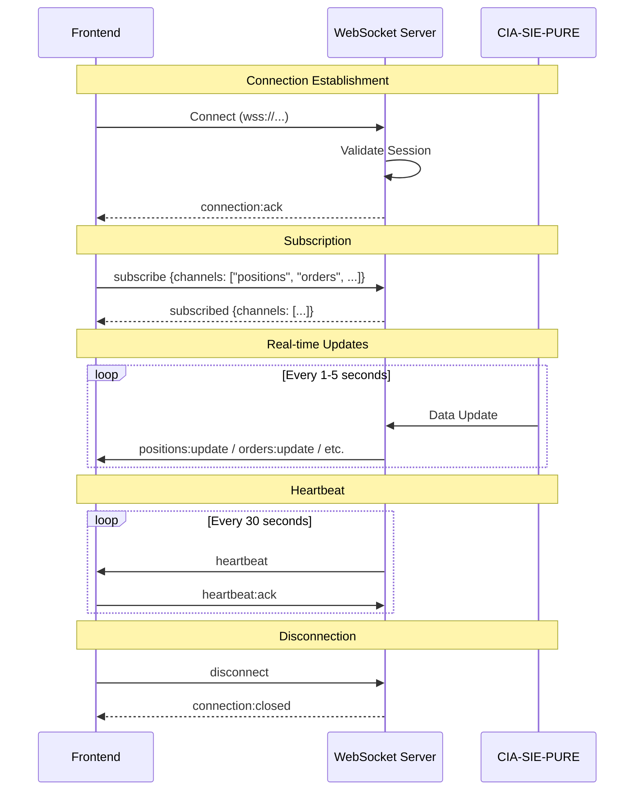
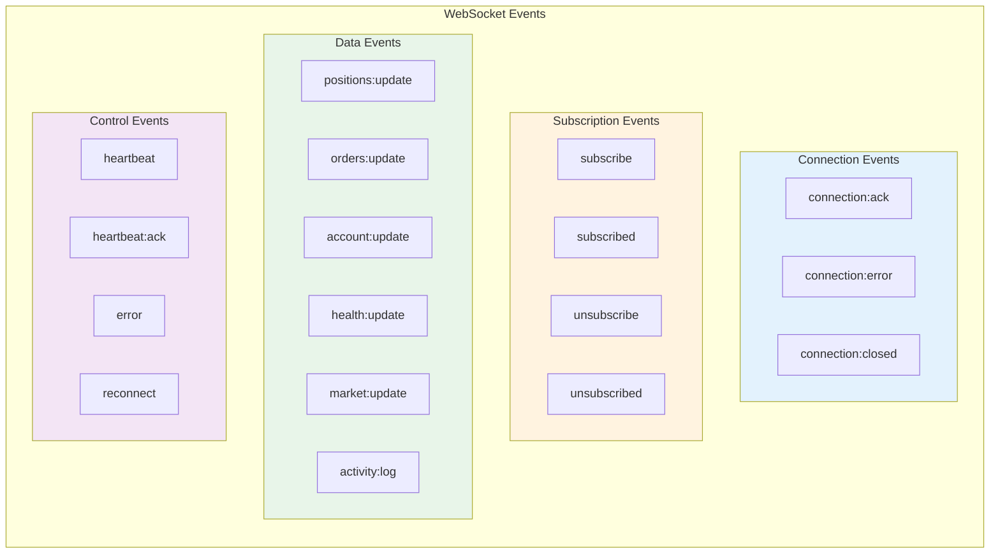
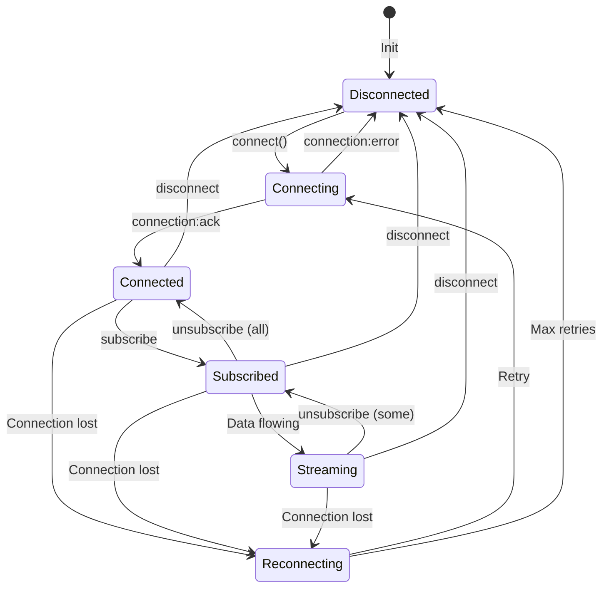
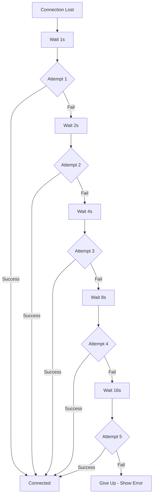

# 2.11 WebSocket Events Architecture
## Event Schema for Real-time Telemetry

**Node ID:** 2.11
**Category:** Integration
**CR Impact:** Real-time Data
**Status:** CREATED
**Version:** 1.0
**Date:** 2026-01-27

---

## Purpose

This document defines the complete WebSocket event protocol for real-time telemetry streaming between MCI backend and frontend.

---

## Connection Flow



---

## Event Categories



---

## Connection Events

### connection:ack

**Direction:** Server → Client
**Trigger:** Successful connection establishment

```json
{
  "event": "connection:ack",
  "data": {
    "connectionId": "ws-abc123def456",
    "serverTime": 1706400000000,
    "version": "1.0.0"
  }
}
```

### connection:error

**Direction:** Server → Client
**Trigger:** Connection failure

```json
{
  "event": "connection:error",
  "data": {
    "code": "AUTH_REQUIRED",
    "error": {
      "what": "Connection rejected",
      "why": "No valid session",
      "how": "Complete authentication first"
    }
  }
}
```

### connection:closed

**Direction:** Server → Client
**Trigger:** Connection termination

```json
{
  "event": "connection:closed",
  "data": {
    "reason": "client_disconnect" | "server_shutdown" | "session_expired" | "error",
    "message": "Connection closed gracefully"
  }
}
```

---

## Subscription Events

### subscribe

**Direction:** Client → Server
**Purpose:** Subscribe to data channels

```json
{
  "event": "subscribe",
  "data": {
    "channels": ["positions", "orders", "account", "health", "market", "activity"]
  }
}
```

### subscribed

**Direction:** Server → Client
**Purpose:** Confirm subscription

```json
{
  "event": "subscribed",
  "data": {
    "channels": ["positions", "orders", "account", "health", "market", "activity"],
    "subscribedAt": 1706400000000
  }
}
```

### unsubscribe

**Direction:** Client → Server
**Purpose:** Unsubscribe from channels

```json
{
  "event": "unsubscribe",
  "data": {
    "channels": ["market"]
  }
}
```

### unsubscribed

**Direction:** Server → Client
**Purpose:** Confirm unsubscription

```json
{
  "event": "unsubscribed",
  "data": {
    "channels": ["market"],
    "unsubscribedAt": 1706400000000
  }
}
```

---

## Data Events

### positions:update

**Direction:** Server → Client
**Frequency:** Every 1 second when positions change

```json
{
  "event": "positions:update",
  "data": {
    "positions": [
      {
        "symbol": "RELIANCE",
        "qty": 50,
        "side": "long",
        "entryPrice": 2400.50,
        "currentPrice": 2450.75,
        "unrealizedPL": 2512.50,
        "unrealizedPLPercent": 2.09,
        "marketValue": 122537.50
      }
    ],
    "timestamp": 1706400000000
  }
}
```

### orders:update

**Direction:** Server → Client
**Frequency:** On order state change

```json
{
  "event": "orders:update",
  "data": {
    "type": "new" | "partial_fill" | "filled" | "cancelled" | "rejected",
    "order": {
      "id": "order-abc123",
      "symbol": "TCS",
      "side": "buy",
      "type": "limit",
      "qty": 10,
      "filledQty": 5,
      "price": 3750.00,
      "status": "partially_filled",
      "createdAt": 1706399000000,
      "updatedAt": 1706400000000
    },
    "timestamp": 1706400000000
  }
}
```

### account:update

**Direction:** Server → Client
**Frequency:** Every 5 seconds

```json
{
  "event": "account:update",
  "data": {
    "equity": 1050000.00,
    "cash": 315000.00,
    "buyingPower": 2100000.00,
    "portfolioValue": 735000.00,
    "dayPL": 12500.00,
    "dayPLPercent": 1.19,
    "totalPL": 50000.00,
    "totalPLPercent": 5.00,
    "timestamp": 1706400000000
  }
}
```

### health:update

**Direction:** Server → Client
**Frequency:** Every 5 seconds

```json
{
  "event": "health:update",
  "data": {
    "cpu": 25,
    "memory": 45,
    "latency": 25,
    "uptime": 3600000,
    "lastHeartbeat": 1706400000000,
    "status": "healthy",
    "timestamp": 1706400000000
  }
}
```

### market:update

**Direction:** Server → Client
**Frequency:** Every 1 second

```json
{
  "event": "market:update",
  "data": {
    "symbols": {
      "RELIANCE": {
        "price": 2450.75,
        "change": 25.50,
        "changePercent": 1.05,
        "volume": 5234567
      },
      "TCS": {
        "price": 3812.50,
        "change": -12.25,
        "changePercent": -0.32,
        "volume": 1234567
      }
    },
    "timestamp": 1706400000000
  }
}
```

### activity:log

**Direction:** Server → Client
**Frequency:** On activity occurrence

```json
{
  "event": "activity:log",
  "data": {
    "id": "act-abc123",
    "type": "order_placed" | "order_filled" | "position_opened" | "position_closed" | "system" | "error",
    "severity": "info" | "warning" | "error",
    "message": "Order filled: Buy 10 TCS @ 3750.00",
    "details": {
      "orderId": "order-abc123",
      "symbol": "TCS"
    },
    "timestamp": 1706400000000
  }
}
```

---

## Control Events

### heartbeat

**Direction:** Server → Client
**Frequency:** Every 30 seconds

```json
{
  "event": "heartbeat",
  "data": {
    "serverTime": 1706400000000,
    "connectionUptime": 3600000
  }
}
```

### heartbeat:ack

**Direction:** Client → Server
**Trigger:** Response to heartbeat

```json
{
  "event": "heartbeat:ack",
  "data": {
    "clientTime": 1706400000050
  }
}
```

### error

**Direction:** Server → Client
**Trigger:** Error condition

```json
{
  "event": "error",
  "data": {
    "code": "SUBSCRIPTION_ERROR",
    "error": {
      "what": "Subscription failed",
      "why": "Invalid channel name",
      "how": "Use valid channel: positions, orders, account, health, market, activity"
    }
  }
}
```

### reconnect

**Direction:** Server → Client
**Trigger:** Server requesting client reconnect

```json
{
  "event": "reconnect",
  "data": {
    "reason": "server_restart" | "session_refresh",
    "delay": 5000,
    "message": "Please reconnect in 5 seconds"
  }
}
```

---

## State Machine



---

## Channel Definitions

| Channel | Data Type | Update Frequency | Description |
|---------|-----------|------------------|-------------|
| `positions` | Position[] | 1s / on change | Open positions |
| `orders` | Order[] | On change | Active orders |
| `account` | AccountMetrics | 5s | Account summary |
| `health` | SystemHealth | 5s | System metrics |
| `market` | MarketData{} | 1s | Watchlist prices |
| `activity` | ActivityLog | On event | Activity feed |

---

## Reconnection Strategy



**Exponential Backoff:**
- Attempt 1: 1 second
- Attempt 2: 2 seconds
- Attempt 3: 4 seconds
- Attempt 4: 8 seconds
- Attempt 5: 16 seconds
- Max attempts: 5

---

## Frontend Integration

```typescript
// WebSocket client usage
const ws = new WebSocket('wss://mci.local/telemetry');

ws.onopen = () => {
  ws.send(JSON.stringify({
    event: 'subscribe',
    data: { channels: ['positions', 'orders', 'account', 'health', 'market', 'activity'] }
  }));
};

ws.onmessage = (event) => {
  const message = JSON.parse(event.data);
  
  switch (message.event) {
    case 'positions:update':
      telemetryStore.updatePositions(message.data.positions);
      break;
    case 'orders:update':
      telemetryStore.updateOrders(message.data.order);
      break;
    // ... handle other events
  }
};
```

---

## Error Codes

| Code | Description | Recovery |
|------|-------------|----------|
| `AUTH_REQUIRED` | Session not authenticated | Redirect to Phase 0 |
| `SESSION_EXPIRED` | Token expired (CR-004) | Redirect to Phase 0 |
| `SUBSCRIPTION_ERROR` | Invalid channel | Check channel name |
| `RATE_LIMITED` | Too many messages | Back off |
| `SERVER_ERROR` | Internal error | Reconnect |

---

*Document ID: FLOW-2.11-WEBSOCKET | Layer 2 Architecture | MCI Project*
