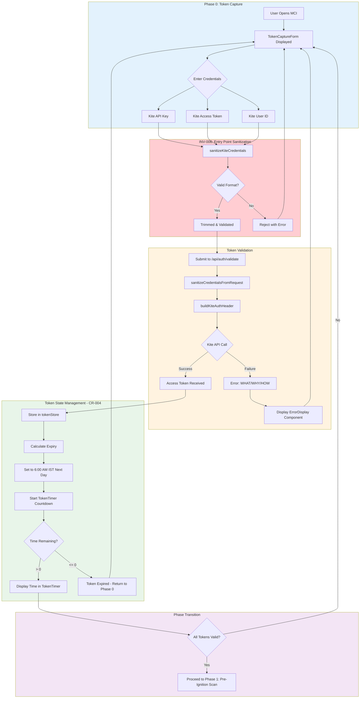
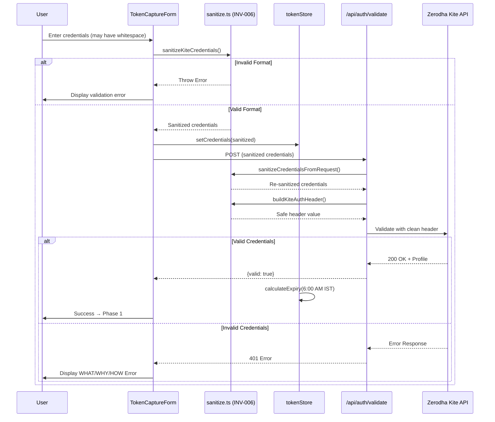
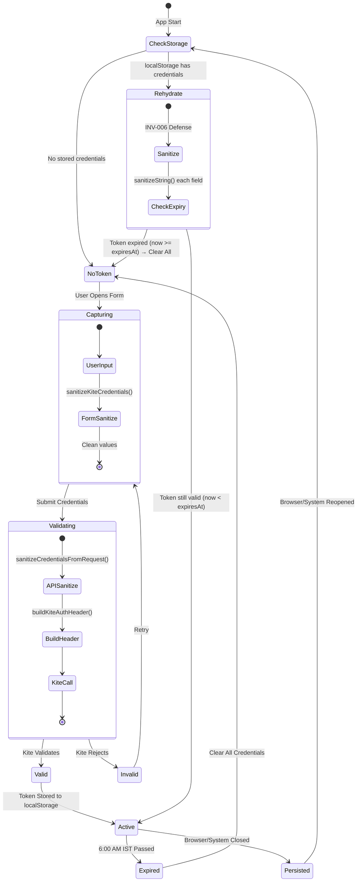

# 2.1 Token Flow Architecture
## Authentication Sequence: User Input → Kite Validation

**Node ID:** 2.1
**Category:** Backend
**CR Impact:** CR-001 (Token Validity), CR-004 (Token Expiry @ 6:00 AM IST), INV-006 (Input Sanitization)
**Status:** UPDATED
**Version:** 1.1
**Date:** 2026-01-28

---

## Purpose

This document defines the complete authentication flow for MCI, from initial user credential entry through Kite API validation and token state management.

---

## Flow Diagram



---

## Sequence Diagram



---

## State Diagram



### Daily Credential Continuity

**System Invariant INV-001:** Credentials persist across browser and system restarts within the daily validity window.

| Event | Behavior |
|-------|----------|
| Browser closed (token valid) | Credentials persist in localStorage |
| Browser reopened (token valid) | Credentials restored, session continues |
| Browser reopened (token expired) | Credentials cleared, forced re-authentication |
| System reboot (token valid) | Credentials persist and restore |
| 6:00 AM IST reached | All credentials forcibly cleared |

---

## Component Mapping

| Component | File | Responsibility |
|-----------|------|----------------|
| TokenCaptureForm | `src/client/components/phase0/TokenCaptureForm.tsx` | Credential input UI |
| TokenTimer | `src/client/components/phase0/TokenTimer.tsx` | Expiry countdown display |
| CredentialsHelper | `src/client/components/phase0/CredentialsHelper.tsx` | Credential reference |
| tokenStore | `src/client/stores/tokenStore.ts` | Token state management |
| auth route | `src/server/routes/auth.ts` | Validation endpoint |
| **sanitize module** | `src/shared/validation/sanitize.ts` | **INV-006 centralized sanitization** |

---

## INV-006 Sanitization Points

```
User Input → [SANITIZE #1] → tokenStore → localStorage
                                             ↓
                                       App Restart
                                             ↓
                           localStorage → [SANITIZE #2] → tokenStore
                                             ↓
                                       API Request
                                             ↓
           Request Body → [SANITIZE #3] → buildKiteAuthHeader → Kite API
```

| Point | Function | Location | Purpose |
|-------|----------|----------|---------|
| SANITIZE #1 | `sanitizeKiteCredentials()` | TokenCaptureForm | Entry point sanitization |
| SANITIZE #2 | `sanitizeString()` | tokenStore merge | Rehydration sanitization |
| SANITIZE #3 | `sanitizeCredentialsFromRequest()` + `buildKiteAuthHeader()` | auth route | API boundary sanitization |

---

## CR Compliance Verification

### CR-001: Token Validity Check
- **Requirement:** Every operation must validate the token before execution
- **Implementation:** `tokenStore.isExpired` checked before any API call
- **Evidence:** `src/client/stores/tokenStore.ts` lines 15-25

### CR-004: Token Expiry @ 6:00 AM IST
- **Requirement:** Kite tokens expire daily at 6:00 AM IST (00:30 UTC)
- **Implementation:** `calculateExpiry()` function sets expiry to next 6:00 AM IST
- **Evidence:** `src/client/stores/tokenStore.ts` lines 30-45

### INV-006: Input Sanitization & Boundary Cleanliness
- **Requirement:** All externally supplied inputs sanitized at point of entry; all API boundaries sanitize regardless of upstream guarantees
- **Implementation:** Centralized `sanitize.ts` module with defense-in-depth at 3 points
- **Evidence:** 
  - Entry: `src/client/components/phase0/TokenCaptureForm.tsx` calls `sanitizeKiteCredentials()`
  - Rehydration: `src/client/stores/tokenStore.ts` merge function calls `sanitizeString()`
  - API: `src/server/routes/auth.ts` calls `sanitizeCredentialsFromRequest()` + `buildKiteAuthHeader()`

---

## Error Handling (CR-003)

| Error Scenario | WHAT | WHY | HOW |
|----------------|------|-----|-----|
| Invalid API Key | Authentication failed | API key is incorrect or expired | Verify API key in Kite Console |
| Invalid Secret | Authentication failed | API secret doesn't match key | Re-generate secret in Kite Console |
| Invalid Request Token | Session creation failed | Request token expired or used | Get new request token from Kite login |
| Network Error | Connection failed | Cannot reach Kite API | Check internet connection |

---

## Integration Points

| Integration | Protocol | Contract |
|-------------|----------|----------|
| Frontend → Backend | HTTP POST | `/api/auth/validate` |
| Backend → Kite | HTTPS | Kite Connect REST API |
| Store → Components | Zustand | `useTokenStore()` hook |

---

*Document ID: FLOW-2.1-TOKEN | Layer 2 Architecture | MCI Project*
