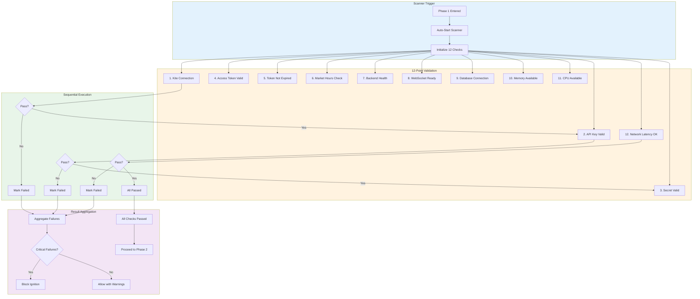
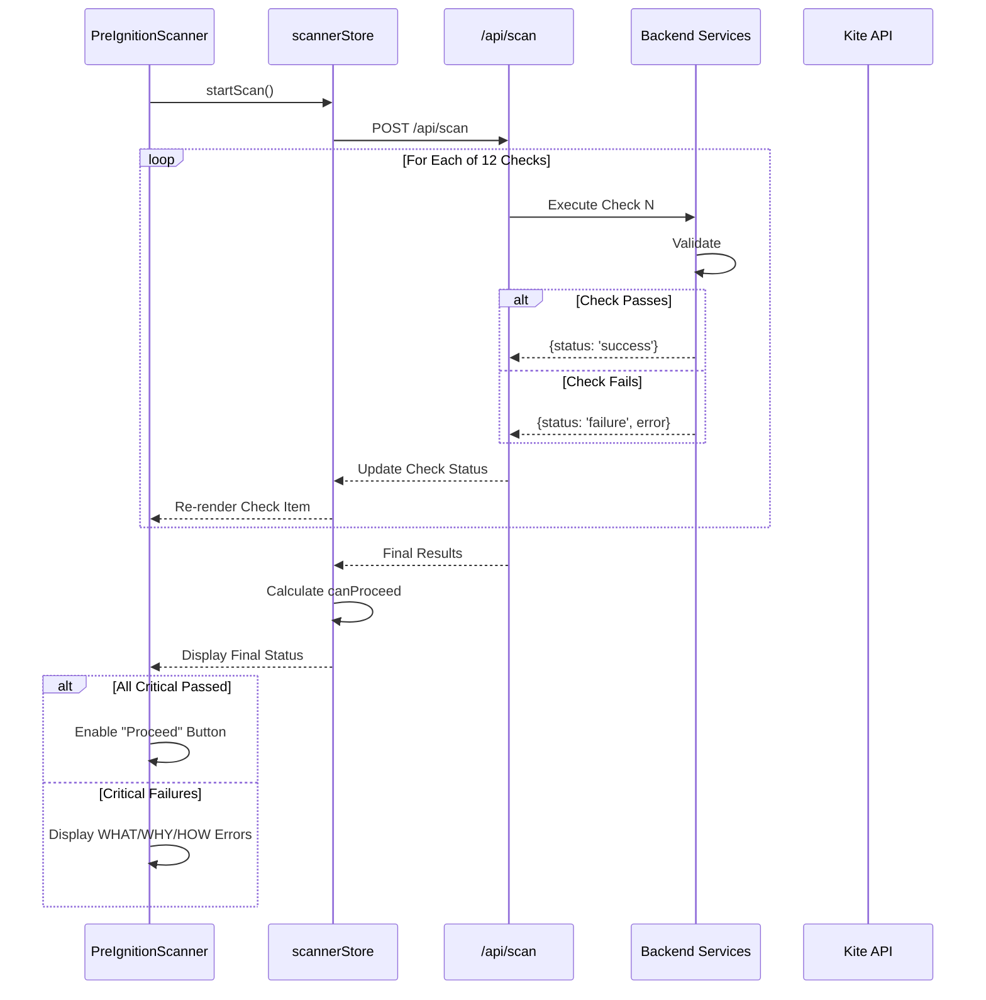
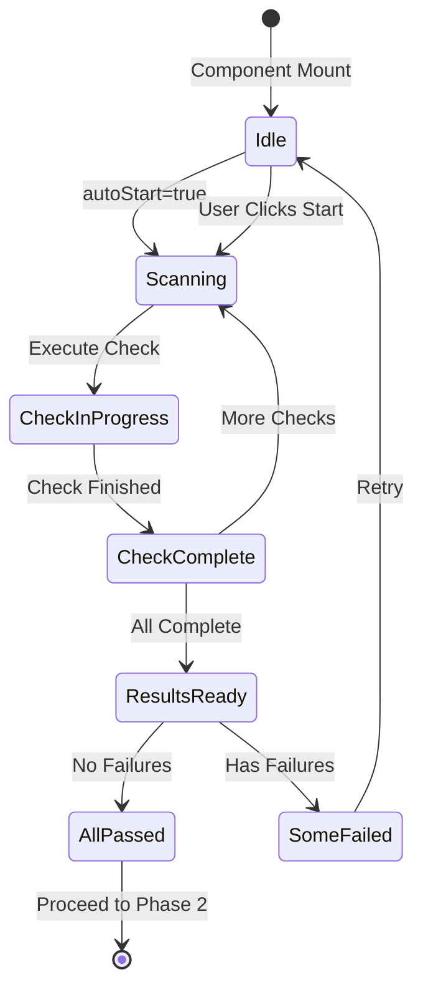

# 2.2 Scanner Logic Architecture
## 12-Point Pre-Ignition Validation Sequence

**Node ID:** 2.2
**Category:** Backend
**CR Impact:** Phase 1 Validation
**Status:** CREATED
**Version:** 1.0
**Date:** 2026-01-27

---

## Purpose

This document defines the complete 12-point pre-ignition scanner that validates system readiness before engine ignition.

---

## Flow Diagram



---

## Sequence Diagram



---

## Check Definitions

| # | Check ID | Name | Category | Critical? | Timeout |
|---|----------|------|----------|-----------|---------|
| 1 | kite-connection | Kite API Connection | Network | YES | 5000ms |
| 2 | api-key-valid | API Key Validation | Auth | YES | 3000ms |
| 3 | secret-valid | API Secret Validation | Auth | YES | 3000ms |
| 4 | access-token | Access Token Valid | Auth | YES | 3000ms |
| 5 | token-expiry | Token Not Expired | Auth | YES | 100ms |
| 6 | market-hours | Market Hours Check | Business | NO | 100ms |
| 7 | backend-health | Backend Server Health | System | YES | 2000ms |
| 8 | websocket-ready | WebSocket Available | Network | NO | 3000ms |
| 9 | database-conn | Database Connection | System | NO | 3000ms |
| 10 | memory-check | Memory Available | Resources | NO | 100ms |
| 11 | cpu-check | CPU Available | Resources | NO | 100ms |
| 12 | network-latency | Network Latency < 100ms | Network | NO | 5000ms |

---

## State Diagram



---

## Component Mapping

| Component | File | Responsibility |
|-----------|------|----------------|
| PreIgnitionScanner | `src/client/components/phase1/PreIgnitionScanner.tsx` | Orchestrates 12-point scan |
| ScanCheckItem | `src/client/components/phase1/ScanCheckItem.tsx` | Individual check display |
| scannerStore | `src/client/stores/scannerStore.ts` | Scanner state management |
| scan route | `src/server/routes/scan.ts` | Scan execution endpoint |

---

## API Contract

### POST /api/scan

**Request:**
```json
{
  "checks": ["all"] | ["check-id-1", "check-id-2"]
}
```

**Response:**
```json
{
  "checks": [
    {
      "id": "kite-connection",
      "name": "Kite API Connection",
      "status": "success" | "failure" | "warning",
      "duration": 245,
      "error": null | { "what": "", "why": "", "how": "" }
    }
  ],
  "summary": {
    "total": 12,
    "passed": 10,
    "failed": 1,
    "warnings": 1,
    "canProceed": true
  },
  "timestamp": 1706400000000
}
```

---

## Error Handling (CR-003)

| Check | Failure WHAT | WHY | HOW |
|-------|--------------|-----|-----|
| kite-connection | Cannot connect to Kite | Network issue or Kite down | Check internet, verify Kite status |
| api-key-valid | Invalid API Key | Key revoked or incorrect | Verify key in Kite Console |
| token-expiry | Token has expired | Past 6:00 AM IST | Return to Phase 0 for new token |
| backend-health | Backend not responding | Server crashed or not started | Restart backend server |
| websocket-ready | WebSocket unavailable | Port blocked or server issue | Check firewall, restart server |

---

## Integration Points

| From | To | Protocol | Purpose |
|------|-----|----------|---------|
| PreIgnitionScanner | scannerStore | Zustand | State management |
| scannerStore | /api/scan | HTTP POST | Execute checks |
| /api/scan | KiteService | Internal | Validate Kite connection |
| /api/scan | System | Internal | Check resources |

---

*Document ID: FLOW-2.2-SCANNER | Layer 2 Architecture | MCI Project*
