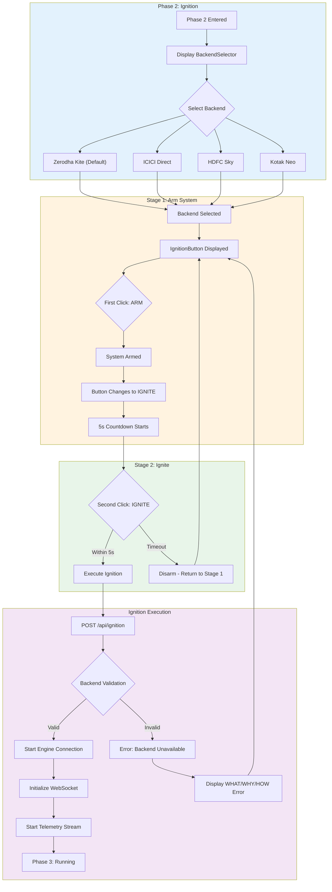
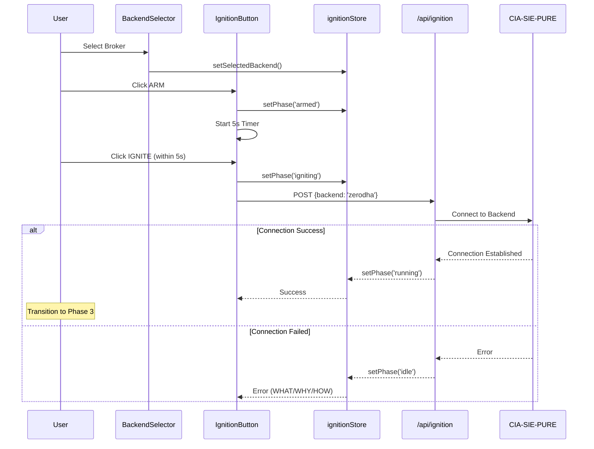
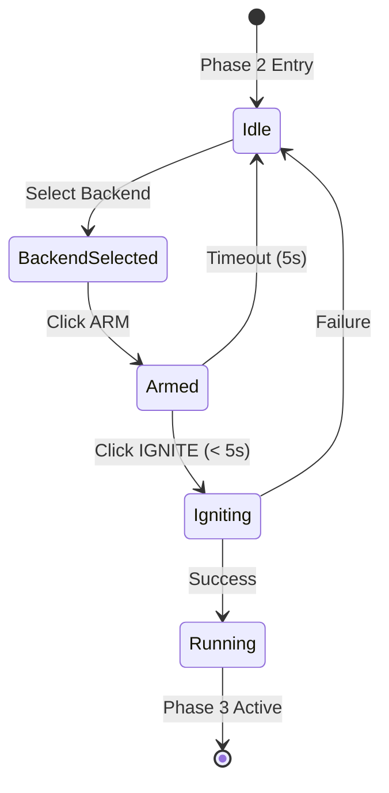

# 2.3 Ignition Sequence Architecture
## Engine Start Sequence with Safety Gates

**Node ID:** 2.3
**Category:** Backend
**CR Impact:** Phase 2 Validation
**Status:** CREATED
**Version:** 1.0
**Date:** 2026-01-27

---

## Purpose

This document defines the two-stage ignition sequence that safely starts the trading engine, including backend selection and safety gate validation.

---

## Flow Diagram



---

## Sequence Diagram



---

## Two-Stage Safety Gate



### Why Two Stages?

| Stage | Purpose | Safety Gate |
|-------|---------|-------------|
| ARM | Prepare system, confirm intent | Prevents accidental ignition |
| IGNITE | Execute connection | Timeout forces re-confirmation |

---

## Backend Configurations

| Backend ID | Display Name | Icon | API Endpoint | Status |
|------------|--------------|------|--------------|--------|
| zerodha | Zerodha Kite | 🪁 | api.kite.trade | Primary |
| icici | ICICI Direct | 🏦 | api.icicidirect.com | Supported |
| hdfc | HDFC Sky | 🌤️ | api.hdfcsky.com | Supported |
| kotak | Kotak Neo | 🏛️ | api.kotaksecurities.com | Supported |

---

## Component Mapping

| Component | File | Responsibility |
|-----------|------|----------------|
| BackendSelector | `src/client/components/phase2/BackendSelector.tsx` | Backend selection UI |
| IgnitionButton | `src/client/components/phase2/IgnitionButton.tsx` | Two-stage ignition control |
| ignitionStore | `src/client/stores/ignitionStore.ts` | Ignition state management |
| ignition route | `src/server/routes/ignition.ts` | Ignition execution endpoint |

---

## API Contract

### POST /api/ignition

**Request:**
```json
{
  "backend": "zerodha" | "icici" | "hdfc" | "kotak"
}
```

**Response (Success):**
```json
{
  "success": true,
  "backend": "zerodha",
  "connectionId": "conn-abc123",
  "websocketUrl": "wss://...",
  "timestamp": 1706400000000
}
```

**Response (Error):**
```json
{
  "success": false,
  "error": {
    "what": "Ignition failed",
    "why": "Backend service unavailable",
    "how": "Contact broker support or try again later"
  }
}
```

---

## Error Handling (CR-003)

| Scenario | WHAT | WHY | HOW |
|----------|------|-----|-----|
| Backend Unavailable | Ignition failed | Broker API not responding | Check broker status, try later |
| Token Expired During Ignition | Session invalid | Token expired at 6:00 AM IST | Return to Phase 0 |
| Network Timeout | Connection timeout | Slow network or firewall | Check network, retry |
| Rate Limited | Too many requests | Exceeded API rate limit | Wait 60 seconds, retry |

---

## Safety Constraints

1. **Pre-Ignition Scan Must Pass**: Cannot enter Phase 2 without Phase 1 completion
2. **Token Must Be Valid**: CR-001 checked before ignition
3. **Two-Stage Confirmation**: Prevents accidental activation
4. **5-Second Timeout**: Forces conscious decision
5. **Single Backend**: Only one backend can be active at a time

---

## Integration Points

| From | To | Protocol | Purpose |
|------|-----|----------|---------|
| BackendSelector | ignitionStore | Zustand | Backend selection |
| IgnitionButton | ignitionStore | Zustand | Phase state |
| ignitionStore | /api/ignition | HTTP POST | Execute ignition |
| /api/ignition | Broker API | HTTPS | Establish connection |
| /api/ignition | WebSocket | WSS | Initialize telemetry |

---

*Document ID: FLOW-2.3-IGNITION | Layer 2 Architecture | MCI Project*
