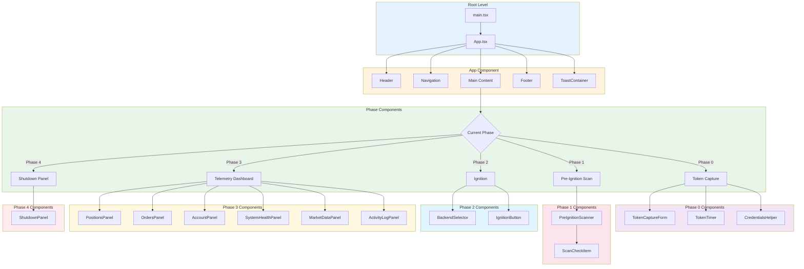
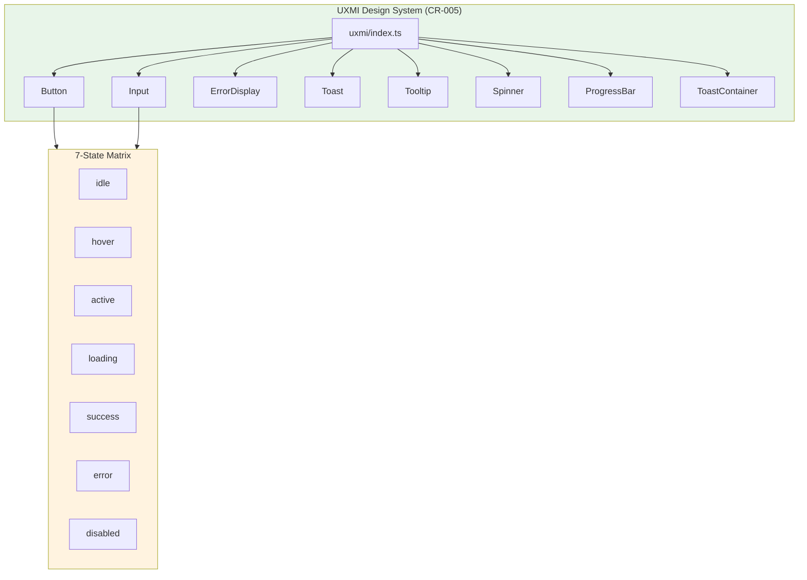
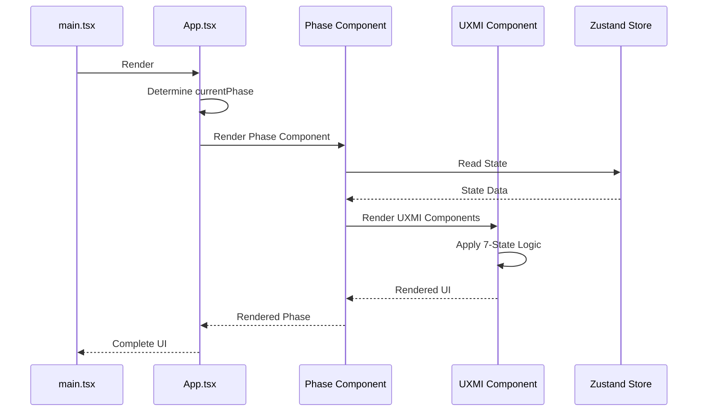

# 2.6 Component Hierarchy Architecture
## Tree: App.tsx → Phase Components → UXMI Library

**Node ID:** 2.6
**Category:** Frontend
**CR Impact:** CR-005 (UXMI 7-States)
**Status:** CREATED
**Version:** 1.0
**Date:** 2026-01-27

---

## Purpose

This document defines the complete React component hierarchy from the root App component through phase-specific components to the UXMI design system.

---

## Component Tree



---

## UXMI Component Library



---

## File Structure

```
src/client/
├── main.tsx                     # Entry point
├── App.tsx                      # Root component
├── index.css                    # Global styles
├── lib/
│   └── sentry.ts               # Sentry client config
├── stores/
│   ├── index.ts                # Store exports
│   ├── tokenStore.ts           # Token state (CR-004)
│   ├── scannerStore.ts         # Scanner state
│   ├── ignitionStore.ts        # Ignition state
│   ├── telemetryStore.ts       # Telemetry state
│   └── shutdownStore.ts        # Shutdown state (CR-002)
└── components/
    ├── phase0/
    │   ├── index.ts
    │   ├── TokenCaptureForm.tsx
    │   ├── TokenTimer.tsx
    │   └── CredentialsHelper.tsx
    ├── phase1/
    │   ├── index.ts
    │   ├── PreIgnitionScanner.tsx
    │   └── ScanCheckItem.tsx
    ├── phase2/
    │   ├── index.ts
    │   ├── BackendSelector.tsx
    │   └── IgnitionButton.tsx
    ├── phase3/
    │   ├── index.ts
    │   ├── TelemetryDashboard.tsx
    │   ├── PositionsPanel.tsx
    │   ├── OrdersPanel.tsx
    │   ├── AccountPanel.tsx
    │   ├── SystemHealthPanel.tsx
    │   ├── MarketDataPanel.tsx
    │   └── ActivityLogPanel.tsx
    ├── phase4/
    │   ├── index.ts
    │   └── ShutdownPanel.tsx
    └── uxmi/
        ├── index.ts
        ├── Button.tsx          # 7-state (CR-005)
        ├── Input.tsx           # 7-state
        ├── ErrorDisplay.tsx    # WHAT/WHY/HOW (CR-003)
        ├── Toast.tsx           # 5000ms duration (CR-005)
        ├── Tooltip.tsx         # 300ms delay (CR-005)
        ├── Spinner.tsx
        └── ProgressBar.tsx
```

---

## Component Dependencies

| Component | Dependencies | CR Compliance |
|-----------|--------------|---------------|
| App | All phase components, ToastContainer | - |
| TokenCaptureForm | Button, Input, tokenStore | CR-001, CR-004 |
| TokenTimer | - | CR-004 |
| PreIgnitionScanner | ScanCheckItem, Button, scannerStore | - |
| BackendSelector | Button, ignitionStore | - |
| IgnitionButton | Button, ignitionStore | - |
| TelemetryDashboard | All Panel components, telemetryStore | - |
| ShutdownPanel | Button, ProgressBar, shutdownStore | CR-002 |
| Button | - | CR-005 (7-state) |
| Input | - | CR-005 (7-state) |
| ErrorDisplay | - | CR-003 (WHAT/WHY/HOW) |
| Toast | - | CR-005 (5000ms) |
| Tooltip | - | CR-005 (300ms) |

---

## Props Interface Summary

### Phase Components

| Component | Key Props |
|-----------|-----------|
| TokenCaptureForm | `onSuccess: () => void` |
| TokenTimer | `compact?: boolean`, `showRefreshButton?: boolean` |
| PreIgnitionScanner | `onComplete: (canProceed: boolean) => void`, `autoStart?: boolean` |
| BackendSelector | - (uses store) |
| IgnitionButton | `onIgnition: () => void` |
| TelemetryDashboard | `watchlist?: string[]` |
| ShutdownPanel | `onComplete: () => void` |

### UXMI Components

| Component | Key Props |
|-----------|-----------|
| Button | `state: ButtonState`, `variant`, `size`, `onClick` |
| Input | `state: InputState`, `type`, `value`, `onChange` |
| ErrorDisplay | `error: { what, why, how }` |
| Toast | `type`, `title`, `message`, `duration` |
| Tooltip | `content`, `delay` |
| Spinner | `size`, `color`, `label` |
| ProgressBar | `value`, `max`, `variant` |

---

## Render Hierarchy



---

## CR-005 Compliance Points

| Timing Constant | Value | Used In |
|-----------------|-------|---------|
| Hover transition | 150ms | Button, Input |
| Active transition | 100ms | Button, Input |
| Tooltip delay | 300ms | Tooltip |
| Toast duration | 5000ms | Toast |

---

*Document ID: FLOW-2.6-HIERARCHY | Layer 2 Architecture | MCI Project*
