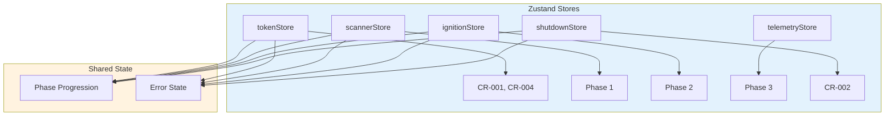
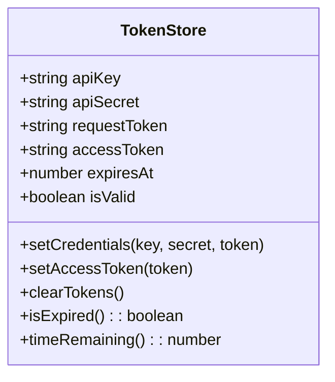
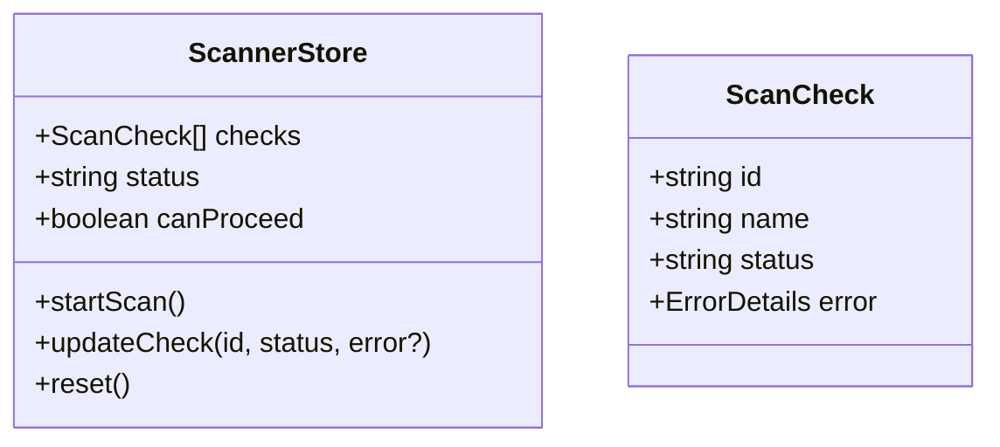
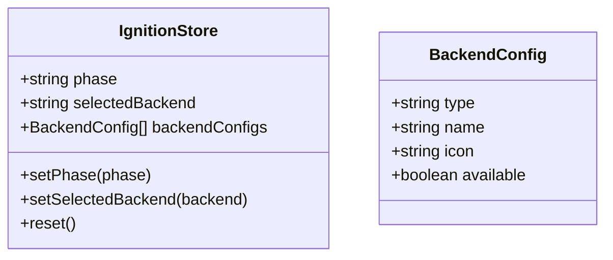
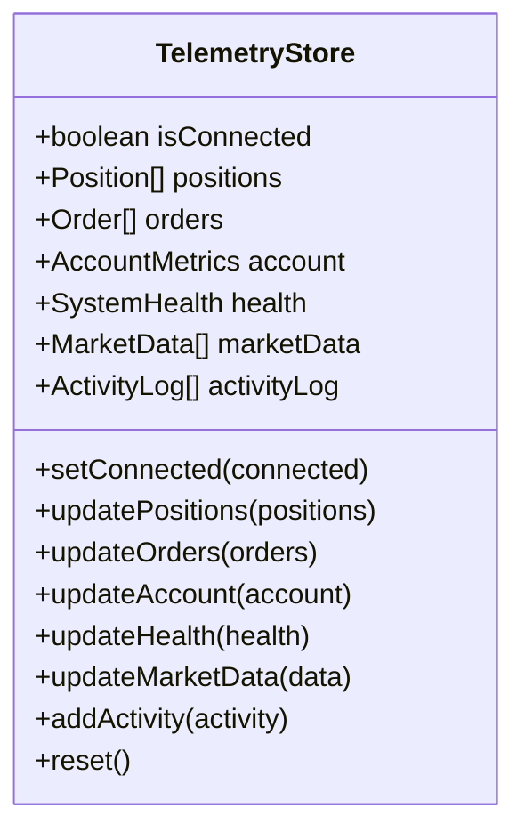
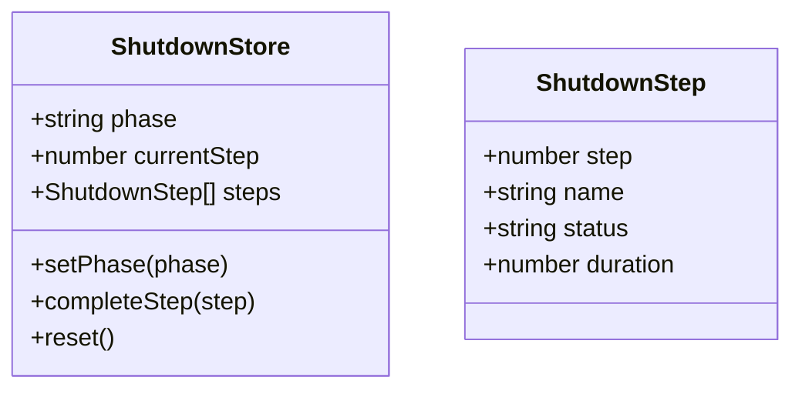
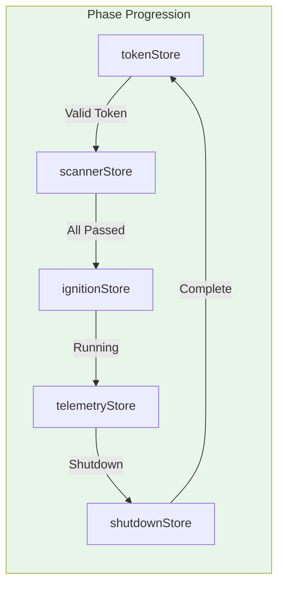
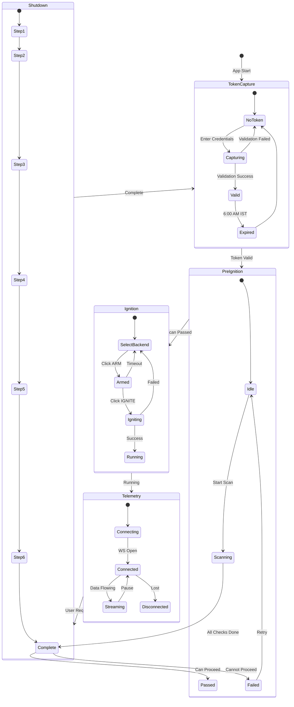
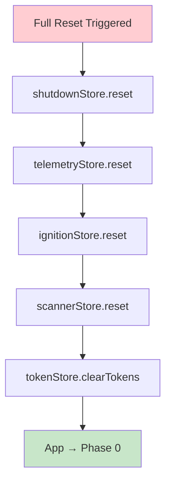

# 2.7 State Management Flow Architecture
## Zustand Store Interactions and Data Flow

**Node ID:** 2.7
**Category:** Frontend
**CR Impact:** All Stores
**Status:** CREATED
**Version:** 1.0
**Date:** 2026-01-27

---

## Purpose

This document defines the complete Zustand state management architecture, including store definitions, inter-store relationships, and data flow patterns.

---

## Store Overview



---

## Store Definitions

### tokenStore (CR-001, CR-004)



### scannerStore



### ignitionStore



### telemetryStore



### shutdownStore (CR-002)



---

## Inter-Store Data Flow



---

## Store State Lifecycle



---

## Component-Store Bindings

| Component | Store | Hook | Actions Used |
|-----------|-------|------|--------------|
| TokenCaptureForm | tokenStore | useTokenStore | setCredentials, setAccessToken |
| TokenTimer | tokenStore | useTokenStore | isExpired, timeRemaining |
| PreIgnitionScanner | scannerStore | useScannerStore | startScan, updateCheck |
| BackendSelector | ignitionStore | useIgnitionStore | setSelectedBackend |
| IgnitionButton | ignitionStore | useIgnitionStore | setPhase |
| TelemetryDashboard | telemetryStore | useTelemetryStore | setConnected |
| PositionsPanel | telemetryStore | useTelemetryStore | positions |
| OrdersPanel | telemetryStore | useTelemetryStore | orders |
| AccountPanel | telemetryStore | useTelemetryStore | account |
| SystemHealthPanel | telemetryStore | useTelemetryStore | health |
| MarketDataPanel | telemetryStore | useTelemetryStore | marketData |
| ShutdownPanel | shutdownStore | useShutdownStore | setPhase, completeStep |

---

## State Persistence

| Store | Persistence | Mechanism |
|-------|-------------|-----------|
| tokenStore | Daily (until 6:00 AM IST) | localStorage with CR-004 enforcement |
| scannerStore | None | In-memory only |
| ignitionStore | Session | sessionStorage |
| telemetryStore | None | In-memory only |
| shutdownStore | None | In-memory only |

### Daily Credential Continuity (System Invariant)

**INV-001: Daily Credential Persistence**

The tokenStore implements daily credential continuity as a system invariant:

```
┌─────────────────────────────────────────────────────────────────────────┐
│  INVARIANT: DAILY CREDENTIAL CONTINUITY                                 │
├─────────────────────────────────────────────────────────────────────────┤
│                                                                         │
│  1. Credentials persist in localStorage across browser/system restarts │
│  2. Persistence is BOUNDED to tokenExpiresAt (6:00 AM IST)             │
│  3. On rehydration: if now >= tokenExpiresAt → ALL credentials cleared │
│  4. No backend persistence — credentials remain client-side only        │
│  5. No silent renewal — expiry forces re-authentication                 │
│                                                                         │
│  This invariant is NON-NEGOTIABLE and requires Principal approval       │
│  for any modification.                                                  │
│                                                                         │
└─────────────────────────────────────────────────────────────────────────┘
```

**Verification Points:**
- `tokenStore.ts` line 263: `storage: createJSONStorage(() => localStorage)`
- `tokenStore.ts` lines 280-298: CR-004 enforcement on rehydration
- `tokenStore.ts` lines 264-272: Credentials included in `partialize`

---

## Error State Pattern

All stores follow a consistent error pattern:

```typescript
interface ErrorState {
  hasError: boolean;
  error: {
    what: string;   // What happened
    why: string;    // Why it happened
    how: string;    // How to fix it
  } | null;
}
```

---

## Store Reset Flow



---

## Performance Considerations

| Optimization | Implementation |
|--------------|----------------|
| Selective subscriptions | Components subscribe only to needed slices |
| Shallow comparisons | Zustand default prevents unnecessary re-renders |
| Memoized selectors | Used for derived state |
| Batched updates | Multiple state changes in single action |

---

*Document ID: FLOW-2.7-STATE | Layer 2 Architecture | MCI Project*
