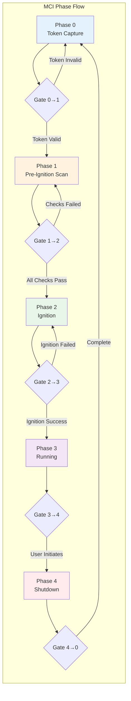
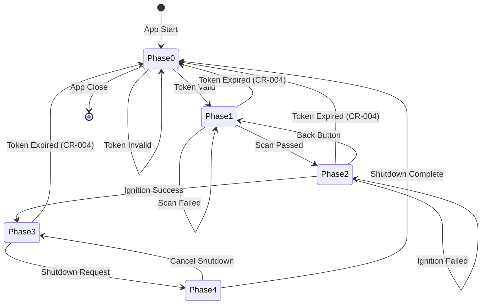
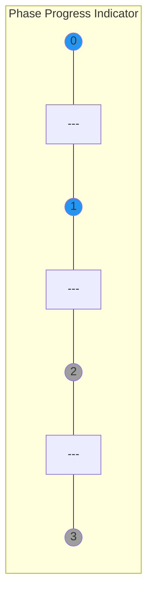
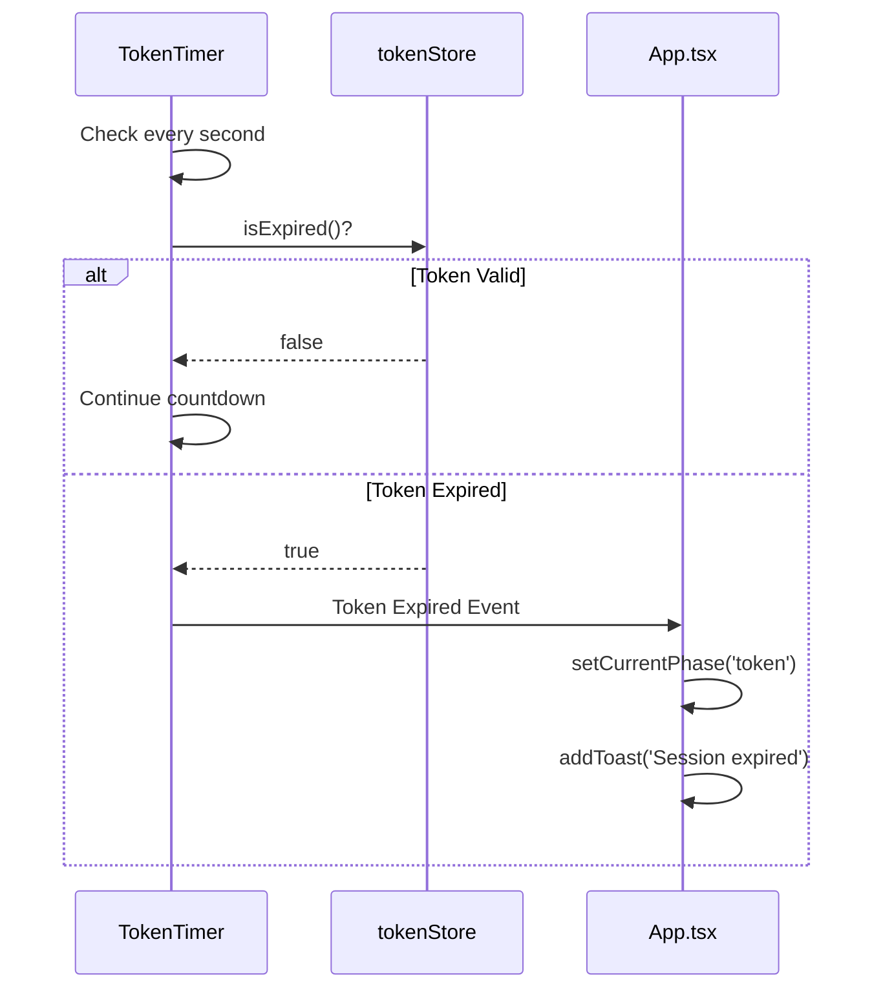

# 2.8 Routing Flow Architecture
## Phase 0→1→2→3→4 Progression with Gates

**Node ID:** 2.8
**Category:** Frontend
**CR Impact:** Navigation
**Status:** CREATED
**Version:** 1.0
**Date:** 2026-01-27

---

## Purpose

This document defines the complete navigation flow between MCI's 5 operational phases, including the gate conditions that control phase transitions.

---

## Phase Navigation Overview



---

## Gate Conditions

```mermaid
flowchart TD
    subgraph GATE_01["Gate 0→1: Token Validation"]
        A1[Token Submitted] --> B1{API Key Valid?}
        B1 -->|No| C1[Stay Phase 0]
        B1 -->|Yes| D1{API Secret Valid?}
        D1 -->|No| C1
        D1 -->|Yes| E1{Request Token Valid?}
        E1 -->|No| C1
        E1 -->|Yes| F1{Access Token Received?}
        F1 -->|No| C1
        F1 -->|Yes| G1[Proceed to Phase 1]
    end

    subgraph GATE_12["Gate 1→2: Scan Validation"]
        A2[Scan Complete] --> B2{Critical Checks Passed?}
        B2 -->|No| C2[Stay Phase 1]
        B2 -->|Yes| D2{Warning Count < 3?}
        D2 -->|No| E2[Allow with Warning]
        D2 -->|Yes| F2[Proceed to Phase 2]
        E2 --> F2
    end

    subgraph GATE_23["Gate 2→3: Ignition Validation"]
        A3[Ignition Attempted] --> B3{Backend Selected?}
        B3 -->|No| C3[Stay Phase 2]
        B3 -->|Yes| D3{Two-Stage Confirmed?}
        D3 -->|No| C3
        D3 -->|Yes| E3{Connection Established?}
        E3 -->|No| C3
        E3 -->|Yes| F3[Proceed to Phase 3]
    end

    subgraph GATE_34["Gate 3→4: Shutdown Request"]
        A4[User Clicks Shutdown] --> B4[Proceed to Phase 4]
    end

    subgraph GATE_40["Gate 4→0: Completion"]
        A5[6-Step Complete] --> B5[Return to Phase 0]
    end

    style GATE_01 fill:#e3f2fd
    style GATE_12 fill:#fff3e0
    style GATE_23 fill:#e8f5e9
    style GATE_34 fill:#f3e5f5
    style GATE_40 fill:#ffebee
```



---

## State Machine



---

## App.tsx Phase Rendering

```typescript
// Simplified phase rendering logic
const renderPhase = () => {
  switch (currentPhase) {
    case 'token':
      return <TokenCaptureForm onSuccess={handleTokenSuccess} />;
    case 'scan':
      return <PreIgnitionScanner onComplete={handleScanComplete} autoStart />;
    case 'ignition':
      return (
        <>
          <BackendSelector />
          <IgnitionButton onIgnition={handleIgnition} />
        </>
      );
    case 'running':
      return <TelemetryDashboard />;
    case 'shutdown':
      return <ShutdownPanel onComplete={handleShutdownComplete} />;
  }
};
```

---

## Navigation Handlers

| Handler | Trigger | Action | Target Phase |
|---------|---------|--------|--------------|
| handleTokenSuccess | Token validation success | setCurrentPhase('scan') | Phase 1 |
| handleScanComplete(true) | All checks passed | setCurrentPhase('ignition') | Phase 2 |
| handleScanComplete(false) | Critical checks failed | Stay in Phase 1 | Phase 1 |
| handleIgnition | Ignition success | setCurrentPhase('running') | Phase 3 |
| handleShutdownRequest | User clicks shutdown | setCurrentPhase('shutdown') | Phase 4 |
| handleShutdownComplete | 6-step complete | setCurrentPhase('token') | Phase 0 |
| handleBack | User clicks back | Previous phase | Phase N-1 |
| handleFullReset | User clicks reset | Clear all, go to Phase 0 | Phase 0 |

---

## Back Navigation Rules

| Current Phase | Can Go Back? | Target Phase |
|---------------|--------------|--------------|
| Phase 0 (Token) | No | - |
| Phase 1 (Scan) | Yes | Phase 0 |
| Phase 2 (Ignition) | Yes | Phase 1 |
| Phase 3 (Running) | No | - (must use Shutdown) |
| Phase 4 (Shutdown) | Yes | Phase 3 (cancel) |

---

## Phase Indicators



The header displays phase progression with:
- Blue circles: Completed/current phases
- Gray circles: Future phases
- Blue lines: Completed transitions
- Gray lines: Future transitions

---

## URL Parameters

| Parameter | Value | Effect |
|-----------|-------|--------|
| `?reset=true` | true | Clear all state, return to Phase 0 |

---

## Emergency Routes

| Condition | Action |
|-----------|--------|
| Token Expired (any phase) | Immediate return to Phase 0 |
| Network Lost | Display error, allow retry |
| Session Corrupted | Full reset to Phase 0 |

---

## Integration with CR-004

Token expiry at 6:00 AM IST triggers automatic phase regression:



---

*Document ID: FLOW-2.8-ROUTING | Layer 2 Architecture | MCI Project*
