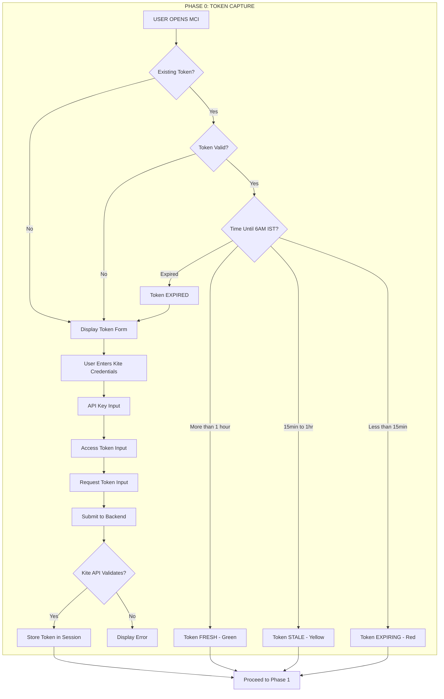

# VERBATIM PHASE CONTENT - COMPLETE EXTRACTION

**Source:** b8937bc2-ac10-4287-8ced-af96ac5f6f0b.jsonl
**Extraction Date:** 2026-01-25

This document contains all phase-specific content (Phase 0-4).

**5 Runtime Phases:**
- Phase 0: Token Capture
- Phase 1: Pre-Ignition Scanner
- Phase 2: Ignition
- Phase 3: Telemetry
- Phase 4: Shutdown

---


# PHASE 0: TOKEN CAPTURE


### REF 1

**Documents Classified:**
1. IRONCLAD_DOCUMENT_PARSING_PROTOCOL.pdf - Phase 8 (Governance)
2. 01_PROJECT_BRIEF_BCI_001.pdf - Phase 0 (Ideation)
3. 01A_ADDENDUM_001_TOKEN_CAPTURE_MODULE.pdf - Phase 3 (Architecture)
4. 01B_ADDENDUM_002_UX_MICRO_INTERACTIONS.pdf - Phase 3.5 (UI/UX)
5. MCI Document Analysis HTML - Meta-document
6. SESSION_ARCHIVE_UI_SPECIFICATION_TREE - Session Archive
7. MCI_PRODUCTION_LIFECYCLE_MASTER_MAP - Phase 12 (Master Reference)
8. CLAUDE_CODE_AUTONOMOUS_MISSION_DIRECTIVE - Phase 9 (Governance)
... and more

---

### REF 2

## DIAGRAM 7: APPLICATION RUNTIME FLOW (5 PHASES)
```
┌─────────────────────────────────────────────────────────────────────────────────────────┐
│                              APPLICATION RUNTIME FLOW                                    │
├─────────────────────────────────────────────────────────────────────────────────────────┤
│                                                                                          │
│   ┌──────────────┐    ┌──────────────┐    ┌──────────────┐    ┌──────────────┐          │
│   │   PHASE 0    │    │   PHASE 1    │    │   PHASE 2    │    │   PHASE 3    │          │
│   │    TOKEN     │───>│   SCANNER    │───>│   IGNITION   │───>│  TELEMETRY   │          │
│   │   CAPTURE    │    │ (Pre-flight) │    │   (Start)    │    │ (Dashboard)  │          │
│   └──────────────┘    └──────────────┘    └──────────────┘    └──────┬───────┘          │
│          ▲                                                           │                   │
│          │                                                           ▼                   │
│          │                                                   ┌──────────────┐           │
│          │                                                   │   PHASE 4    │           │
│          │                                                   │   SHUTDOWN   │           │
│          │                                                   │  (Graceful)  │           │
│          │                                                  

---

### REF 3

```
┌─────────────────────────────────────────────────────────────────────────────┐
│                     LIFECYCLE TRACEABILITY TREE - NODE MAP                   │
├─────────────────────────────────────────────────────────────────────────────┤
│                                                                               │
│  LAYER 1: CONSTITUTIONAL FOUNDATION (6 nodes)                                │
│  ══════════════════════════════════════════════                              │
│  ├── Node 1.0: Master Use Case Specification (ROOT)                         │
│  ├── Node 1.1: CR-001 Token Validity                                        │
│  ├── Node 1.2: CR-002 Graceful Shutdown                                     │
│  ├── Node 1.3: CR-003 Error Format (WHAT/WHY/HOW)                           │
│  ├── Node 1.4: CR-004 Token Expiry 6AM IST                                  │
│  └── Node 1.5: CR-005 UXMI 7-State Components                               │
│                                                                               │
│  LAYER 2: ARCHITECTURE DOCUMENTATION (13 nodes) ◄── NEW LAYER               │
│  ═══════════════════════════════════════════════                             │
│  ├── Node 2.0: Architecture Root                                            │
│  │                                                                           │
│  ├── BACKEND FLOWCHARTS (5 nodes)                                           │
│  │   ├── Node 2.1: Authentication Sequence   

---

### REF 4

| Reason | Explanation |
|--------|-------------|
| **The Constitution** | Supreme authority per project governance |
| **Defines CRs** | CR-001 to CR-005 that all architecture must comply with |
| **Defines Phases** | Phase 0-4 runtime behavior |
| **Defines Requirements** | What each component MUST do |

---

### REF 5



---

### REF 6

1. **It has 5 operational phases:**
   - Phase 0: Token Capture (Kite API credentials)
   - Phase 1: Pre-Ignition Scanner (12-point system checks)
   - Phase 2: Ignition (Paper/Live mode selection, ARM → IGNITE)
   - Phase 3: Telemetry Dashboard (6 panels monitoring trading)
   - Phase 4: Shutdown (6-step graceful shutdown)

---

### REF 7

**Phase Color Coding:**
- Phase 0: Token Capture (Red)
- Phase 1: Pre-Ignition (Orange)
- Phase 2: Architecture (Yellow)
- Phase 3: Telemetry (Green)
- Phase 3.5: UXMI/CR-005 (Cyan)
- Phase 4: Shutdown (Blue)
- Phase 4-5: Implementation (Indigo)
- Phase 6: QA/Audits (Purple)
- Phase 9: Sentry (Brown)

---

### REF 8

**PHASES:**
- Phase 0: Token Capture
- Phase 1: Pre-Ignition Scanner
- Phase 2: Ignition Control
- Phase 3: Telemetry Dashboard
- Phase 3.5: UXMI (CR-005) - **MUST BE BUILT FIRST**
- Phase 4: Shutdown Protocol

---

### REF 9

**KEY SOURCE DOCUMENTS:**
| Document | Size | Purpose |
|----------|------|---------|
| PROJECT_BRIEF_BCI_001.md | 146 KB | Original project brief - THE GENESIS |
| TECHNOLOGY_SELECTION_LIFECYCLE_SPECIFICATION.md | 34 KB | Golden State standards |
| ADDENDUM_001_TOKEN_CAPTURE_MODULE.md | 84 KB | Phase 0: Token Capture (6 modules) |
| ADDENDUM_002_UX_MICRO_INTERACTIONS.md | 90 KB | CR-005: UXMI specification |

---

### REF 10

1. **Rebuild Phase 0/00 correctly** - The foundation (Token Capture, possibly the core architecture)

---

### REF 11

**The Outcome:**
- Fresh, correct foundation (Phase 0, core architecture)
- Surgical integration of salvageable downstream modules
- NOT a complete scorched-earth rebuild (which Document 4 suggested)
- Efficient correction that preserves valid work

---

### REF 12

- **COMPLETE FILE COUNT SUMMARY - 178 TOTAL FILES**
  - Governance: 12
  - Phase 0 (Token): 14
  - Phase 1 (Scanner): 14
  - Phase 2 (Architecture/Ignition): 14
  - Phase 3 (Telemetry): 21
  - Phase 3.5 (UXMI): 19
  - Phase 4 (Shutdown): 9
  - Phase 4-5 (Implementation): 3
  - Phase 6 (QA): 6
  - Phase 8 (Deployment): 1
  - Phase 9 (Sentry): 10
  - Shared/Cross-Phase: 13
  - Infrastructure/Build: 18
  - Historical/Archives: 13
  - External/Reference: 10

---

### REF 13

  **PHASE 4: SHUTDOWN**
  - Operator Clicks SHUTDOWN → Confirmation → Close Positions → Disconnect Broker → STOPPED
  - Restart possible back to Phase 0

---

### REF 14

  **PHASE 0: TOKEN CAPTURE**
  - Operator Opens MCI → Token Capture Form → Operator Pastes Token → Valid? → Stored in Engine / Error

---

### REF 15

**CRITICAL INSIGHT:** This confirms the user's earlier statement - the existing implementation was incorrectly designed and requires surgical correction at Phase 0/00.

---

### REF 16

- **PHASE 0: TOKEN CAPTURE**
  - ADDENDUM_001 Token Capture Module
  - 6 Module Specification
  - Implementation

---

### REF 17

- **BUILD FLOW:**
  Foundation → Phase 3.5 (UXMI) → Phase 0 → Phase 1 → Phase 2 → Phase 3 → Phase 4 → Production

---

### REF 18

**KEY INSIGHT:** Phase 3.5 (UXMI) comes BEFORE Phase 0 in build order despite its numbering. This is the foundation that everything else depends on.

---

### REF 19

**PHASE 0: KITE TOKEN CAPTURE**
- PURPOSE: Secure daily authentication token for Kite API
- PREREQUISITE: Must complete BEFORE scanner/dashboard
- DOCUMENT: ADDENDUM_001_TOKEN_CAPTURE_MODULE.md

---

### REF 20

**PHASE 1: PRE-IGNITION SCANNER**
- PURPOSE: System health verification before market operations
- PREREQUISITE: Valid Kite token from Phase 0
- **12 SCANNER CHECKS (<500ms total):**
  1. Token Validity - Kite token present & not expired
  2. API Connectivity - Kite API reachable, <100ms
  3. Market Status - NSE/BSE open/closed
  4. Backend Health - All 4 backends responding
  5. Position Sync - Positions match across backends
  6. Order Queue - No stuck orders
  7. PnL Calculation - Intraday PnL correct
  8. Risk Limits - Within thresholds
  9. Claude AI - Anthropic API accessible
  10. Local Time Sync - Clock within tolerance
  11. WebSocket - Real-time feed connection
  12. Watchlist - Instruments loaded

---

### REF 21

Key content:
- **PHASE 0 (continued):**
  - Step 5: System validates and stores (valid until 6:00 AM IST)
  - **TOKEN STATES:**
    - ABSENT → No token, form displayed prominently
    - VALIDATING → Spinner during API check
    - VALID → Green badge, countdown active
    - EXPIRING → Amber warning <30 min remaining
    - EXPIRED → Red alert, form re-displayed
    - INVALID → Error message with WHAT/WHY/HOW

---

### REF 22

**PHASE 4: SHUTDOWN PROTOCOL**
- PURPOSE: Graceful termination of monitoring session
- **SHUTDOWN SEQUENCE (5 steps):**
  1. User initiates → "End Session" button (confirmation required)
  2. Stream close → WebSocket connections terminated
  3. State snapshot → Final positions/P&L logged
  4. Token clear → Optionally clear stored token
  5. Session end → Return to Token Capture (Phase 0)

---

### REF 23

Key content:
- **MCI_MASTER_SPECIFICATION sections:**
  - §5: Constitutional Constraints (CR-001 to CR-005)
  - §5a: CR-005 UXMI Standards
  - §5b: Token Capture Module (Phase 0)
  - §6: Pre-Ignition Scanner
  - §7: Ignition Sequence
  - §8: Telemetry Dashboard

---

### REF 24

- **5.2 DOCUMENT READING ORDER FOR CLAUDE CODE:**
  1. THIS DOCUMENT (Master Manifest) - Complete context
  2. CLAUDE_CODE_INSTRUCTION_v2.md - Implementation prompt
  3. MCI_MASTER_SPECIFICATION_v1.0.0.html - Detailed specs
  4. MCI_C4_ARCHITECTURE.html - Visual architecture
  5. ADDENDUM_001 & ADDENDUM_002 - Deep-dive on Phase 0 & UXMI

---

### REF 25

- **STEP 3: PHASE 0 - TOKEN CAPTURE MODULE (CR-004)**
  - Location: src/components/token/, src/services/
  - **BUILD ORDER:**
    1. TokenCaptureForm.tsx (using UXMI)
    2. TokenTimer.tsx (countdown)
    3. kite.ts (API validation)
    4. tokenStore.ts (Zustand state)
  - Requirements: UXMI components, 6:00 AM IST expiry, WHAT/WHY/HOW errors, 5-step workflow

---

### REF 26

- **STEP 6: PHASE 3 - TELEMETRY DASHBOARD**
  - Location: src/components/dashboard/
  - **BUILD ORDER:**
    1. DashboardLayout.tsx (panel arrangement)
    2. TokenPanel.tsx (Phase 0 integration)
    3. BackendPanel.tsx (health cards)
    4. PositionsPanel.tsx (CR-002 conflict display)
    5. OrdersPanel.tsx (order tracking)
    6. PnLPanel.tsx (P&L calculation)
    7. AILogPanel.tsx (CR-003 Claude observations)
  - Requirements: Real-time WebSocket, UXMI throughout, CR-002 conflict display

---

### REF 27

- **STEP 7: PHASE 4 - SHUTDOWN PROTOCOL**
  - Location: src/components/shutdown/
  - **BUILD ORDER:**
    1. ShutdownButton.tsx (end session trigger)
    2. ShutdownModal.tsx (confirmation dialog)
    3. shutdownService.ts (cleanup logic)
  - Requirements: Confirmation required, graceful close, return to Phase 0

---

### REF 28

**PHASE 0: GENESIS & GOVERNANCE [COMPLETE]**
- 0.1 Project Conception ✅ → USER
- 0.2 Constitutional Constraints ✅ → USER + COWORK
  - CR-001 through CR-005 all ESTABLISHED
- 0.3 Technology Selection ✅ → COWORK
  - TypeScript, Bun, Hono, React 18, Tailwind, Zustand - all DECIDED
- 0.4 Folder Reorganization ✅ → COWORK
  - 00_MASTER_DOCUMENTS through 05_AUDITS_AND_REPORTS - all created
  - **04_IMPLEMENTATION → Ready (Empty)**

---

### REF 29

- 1.3 Phase 0: Token Capture Module ✅ → COWORK
  - ADDENDUM_001_TOKEN_CAPTURE_MODULE.md (84 KB)
  - MOD-TC-1 through MOD-TC-6 all SPECIFIED
  - 5-Step Operator Workflow SPECIFIED

---

### REF 30

- 4.4 Phase 0: Token Capture ⏳ PENDING → **CLAUDE CODE**
  - TokenCaptureForm.tsx, TokenTimer.tsx, kite.ts, tokenStore.ts

---

# PHASE 1: PRE-IGNITION SCANNER


### REF 1

**Documents Classified:**
1. IRONCLAD_DOCUMENT_PARSING_PROTOCOL.pdf - Phase 8 (Governance)
2. 01_PROJECT_BRIEF_BCI_001.pdf - Phase 0 (Ideation)
3. 01A_ADDENDUM_001_TOKEN_CAPTURE_MODULE.pdf - Phase 3 (Architecture)
4. 01B_ADDENDUM_002_UX_MICRO_INTERACTIONS.pdf - Phase 3.5 (UI/UX)
5. MCI Document Analysis HTML - Meta-document
6. SESSION_ARCHIVE_UI_SPECIFICATION_TREE - Session Archive
7. MCI_PRODUCTION_LIFECYCLE_MASTER_MAP - Phase 12 (Master Reference)
8. CLAUDE_CODE_AUTONOMOUS_MISSION_DIRECTIVE - Phase 9 (Governance)
... and more

---

### REF 2

### PHASE 1: Session History Reconstruction (Lines 1-200)
**Goal:** Recreate complete sessions history from `~/.claude/projects`

---

### REF 3

## DIAGRAM 7: APPLICATION RUNTIME FLOW (5 PHASES)
```
┌─────────────────────────────────────────────────────────────────────────────────────────┐
│                              APPLICATION RUNTIME FLOW                                    │
├─────────────────────────────────────────────────────────────────────────────────────────┤
│                                                                                          │
│   ┌──────────────┐    ┌──────────────┐    ┌──────────────┐    ┌──────────────┐          │
│   │   PHASE 0    │    │   PHASE 1    │    │   PHASE 2    │    │   PHASE 3    │          │
│   │    TOKEN     │───>│   SCANNER    │───>│   IGNITION   │───>│  TELEMETRY   │          │
│   │   CAPTURE    │    │ (Pre-flight) │    │   (Start)    │    │ (Dashboard)  │          │
│   └──────────────┘    └──────────────┘    └──────────────┘    └──────┬───────┘          │
│          ▲                                                           │                   │
│          │                                                           ▼                   │
│          │                                                   ┌──────────────┐           │
│          │                                                   │   PHASE 4    │           │
│          │                                                   │   SHUTDOWN   │           │
│          │                                                   │  (Graceful)  │           │
│          │                                                  

---

### REF 4

```
┌─────────────────────────────────────────────────────────────────────────────┐
│                     LIFECYCLE TRACEABILITY TREE - NODE MAP                   │
├─────────────────────────────────────────────────────────────────────────────┤
│                                                                               │
│  LAYER 1: CONSTITUTIONAL FOUNDATION (6 nodes)                                │
│  ══════════════════════════════════════════════                              │
│  ├── Node 1.0: Master Use Case Specification (ROOT)                         │
│  ├── Node 1.1: CR-001 Token Validity                                        │
│  ├── Node 1.2: CR-002 Graceful Shutdown                                     │
│  ├── Node 1.3: CR-003 Error Format (WHAT/WHY/HOW)                           │
│  ├── Node 1.4: CR-004 Token Expiry 6AM IST                                  │
│  └── Node 1.5: CR-005 UXMI 7-State Components                               │
│                                                                               │
│  LAYER 2: ARCHITECTURE DOCUMENTATION (13 nodes) ◄── NEW LAYER               │
│  ═══════════════════════════════════════════════                             │
│  ├── Node 2.0: Architecture Root                                            │
│  │                                                                           │
│  ├── BACKEND FLOWCHARTS (5 nodes)                                           │
│  │   ├── Node 2.1: Authentication Sequence   

---

### REF 5


---

### REF 6

1. **It has 5 operational phases:**
   - Phase 0: Token Capture (Kite API credentials)
   - Phase 1: Pre-Ignition Scanner (12-point system checks)
   - Phase 2: Ignition (Paper/Live mode selection, ARM → IGNITE)
   - Phase 3: Telemetry Dashboard (6 panels monitoring trading)
   - Phase 4: Shutdown (6-step graceful shutdown)

---

### REF 7

**4-Phase Action Plan:**
- Phase 1 (Immediate): Sync Tab 6/7, cosmetic fixes, remove unused CSS, implement JS
- Phase 2 (Short-term): Create 4 Frontend + 4 Integration Flowcharts, complete Tab 3
- Phase 3 (Medium-term): Consolidate tabs 8→5, cross-reference linking, LocalStorage
- Phase 4 (Long-term): Maintain LTT, version control, consider React migration

---

### REF 8

**Phase Color Coding:**
- Phase 0: Token Capture (Red)
- Phase 1: Pre-Ignition (Orange)
- Phase 2: Architecture (Yellow)
- Phase 3: Telemetry (Green)
- Phase 3.5: UXMI/CR-005 (Cyan)
- Phase 4: Shutdown (Blue)
- Phase 4-5: Implementation (Indigo)
- Phase 6: QA/Audits (Purple)
- Phase 9: Sentry (Brown)

---

### REF 9

**PHASES:**
- Phase 0: Token Capture
- Phase 1: Pre-Ignition Scanner
- Phase 2: Ignition Control
- Phase 3: Telemetry Dashboard
- Phase 3.5: UXMI (CR-005) - **MUST BE BUILT FIRST**
- Phase 4: Shutdown Protocol

---

### REF 10

- **COMPLETE FILE COUNT SUMMARY - 178 TOTAL FILES**
  - Governance: 12
  - Phase 0 (Token): 14
  - Phase 1 (Scanner): 14
  - Phase 2 (Architecture/Ignition): 14
  - Phase 3 (Telemetry): 21
  - Phase 3.5 (UXMI): 19
  - Phase 4 (Shutdown): 9
  - Phase 4-5 (Implementation): 3
  - Phase 6 (QA): 6
  - Phase 8 (Deployment): 1
  - Phase 9 (Sentry): 10
  - Shared/Cross-Phase: 13
  - Infrastructure/Build: 18
  - Historical/Archives: 13
  - External/Reference: 10

---

### REF 11

- **RECOMMENDED ACTION PLAN:**
  - **Phase 1 IMMEDIATE (1-2 days):** Sync LTT/Schematics, cosmetic fixes, remove unused CSS, implement JS
  - **Phase 2 SHORT-TERM (3-5 days):** Create 4 Frontend + 4 Integration Flowcharts, complete 180 files, merge Q&A
  - **Phase 3 MEDIUM-TERM (1-2 weeks):** Consolidate tabs 1+2, restructure to 5 tabs, cross-references, LocalStorage
  - **Phase 4 LONG-TERM:** Maintain LTT, update Q&A, version control, consider React migration

---

### REF 12

  **PHASE 1: PRE-IGNITION**
  - Pre-Ignition Scanner Runs → All Systems Ready? → Display Ready / Display Blockers → Loop back

---

### REF 13

- **PHASE 1: PRE-IGNITION**
  - Scanner Specification
  - Readiness Checks
  - Implementation

---

### REF 14

- **BUILD FLOW:**
  Foundation → Phase 3.5 (UXMI) → Phase 0 → Phase 1 → Phase 2 → Phase 3 → Phase 4 → Production

---

### REF 15

**PHASE 1: PRE-IGNITION SCANNER**
- PURPOSE: System health verification before market operations
- PREREQUISITE: Valid Kite token from Phase 0
- **12 SCANNER CHECKS (<500ms total):**
  1. Token Validity - Kite token present & not expired
  2. API Connectivity - Kite API reachable, <100ms
  3. Market Status - NSE/BSE open/closed
  4. Backend Health - All 4 backends responding
  5. Position Sync - Positions match across backends
  6. Order Queue - No stuck orders
  7. PnL Calculation - Intraday PnL correct
  8. Risk Limits - Within thresholds
  9. Claude AI - Anthropic API accessible
  10. Local Time Sync - Clock within tolerance
  11. WebSocket - Real-time feed connection
  12. Watchlist - Instruments loaded

---

### REF 16

- **STEP 4: PHASE 1 - PRE-IGNITION SCANNER**
  - Location: src/components/scanner/, src/services/
  - **BUILD ORDER:**
    1. ScannerPanel.tsx (12-check display)
    2. ScannerService.ts (parallel execution)
    3. scannerStore.ts (state)
  - Requirements: All 12 checks in <500ms, Pass/Warning/Fail states, UXMI ProgressBar

---

### REF 17

**PHASE 1: REQUIREMENTS & SPECIFICATIONS [COMPLETE]**
- 1.1 Project Brief ✅ → COWORK
  - PROJECT_BRIEF_BCI_001.md (146 KB)
  - Pre-Ignition, Model Selection, Ignition, Dashboard, Telemetry, Shutdown - all SPECIFIED

---

### REF 18

Key content:
**PHASE 1 (continued):**
- 1.2 Golden State Document ✅ → COWORK
  - TECHNOLOGY_SELECTION_LIFECYCLE_SPECIFICATION.md (34 KB)
  - 11-Phase Lifecycle, Seven-Factor Evaluation, Gate Process, Section 7.3 Constitutional

---

### REF 19

- 4.5 Phase 1: Pre-Ignition Scanner ⏳ PENDING → **CLAUDE CODE**
  - ScannerPanel.tsx, scanner.ts (continued...)

---

### REF 20

**IMMEDIATE: Claude Code Implementation (9 Steps):**
1. Read Master Documents (Manifest + Claude Code Instruction)
2. Project Initialization (cd 04_IMPLEMENTATION, bun init, install deps)
3. UXMI Component Library (**BUILD FIRST**) - 7 components, Seven States, 300ms tooltips
4. Phase 0 - Token Capture (6-module, 5-step workflow)
5. Phase 1 - Pre-Ignition Scanner (12 checks in <500ms)
6. Phase 2 - Ignition Sequence (4-backend selection)
7. Phase 3 - Telemetry Dashboard (real-time panels)
8. Phase 4 - Shutdown Protocol (graceful termination)
9. Testing & Gate 5 Audit (UXMI compliance)

---

### REF 21

**1.2 PROPOSED SOLUTION - 4 PHASES:**
- **Phase 0: PRE-IGNITION VERIFICATION** - Lightning-fast scan BEFORE user action
- **Phase 1: CONFIGURATION** - Anthropic model selection
- **Phase 2: SEQUENTIAL IGNITION** - Visual launch with progress bars
- **Phase 3: OPERATIONAL MONITORING** - Real-time telemetry, token countdown

---

### REF 22

**PHASE 1: FASTAPI SERVER IGNITION**
- Step 1.1: Activate Python venv
- Step 1.2: Load .env file
- Step 1.3: Start uvicorn (port 8000)
- Step 1.4: Poll /health every 200ms (max 30s)
- Step 1.5: Verify {"status": "healthy"}
- Result: GO / NO-GO

---

### REF 23

**Revised MCI Operational Phases:**
- PHASE 0: TOKEN CAPTURE (NEW - This Addendum)
- PHASE 1: PRE-IGNITION SCANNER
- PHASE 2: MODEL SELECTION
- PHASE 3: IGNITION SEQUENCE
- PHASE 4: OPERATIONAL MONITORING
- PHASE 5: SHUTDOWN

---

### REF 24

**Complete Operational Flow (6 Phases):**
1. **PHASE 0: TOKEN CAPTURE** - 6-module auth sequence, SUCCESS required
2. **PHASE 1: PRE-IGNITION SCANNER** - 12 checks, Kite token check (#4) now GUARANTEED valid, <500ms, ALL GREEN required
3. **PHASE 2: MODEL SELECTION** - Select Anthropic model, view budget
4. **PHASE 3: IGNITION SEQUENCE** - 3-second countdown, sequential subsystem startup
5. **PHASE 4: OPERATIONAL MONITORING** - Real-time telemetry, token countdown timer
6. **PHASE 5: SHUTDOWN** - Graceful/Emergency, cleanup, logging

---

### REF 25

Phase 8 verification checklist. Phase 9: Integration - Compatibility verification. Phase 10: Verification & Validation - **MANDATORY GATE #4 (FINAL)**. Technology Decision Retrospective form captured.

---

### REF 26

Phase 11: Deployment & Operations. Part III: Backend Technology Reference - Language comparison matrix (Python, TypeScript, Go, Rust, Java, C#). Use case recommendations captured.

---

### REF 27

Steps 5-10:
- Step 5: Phase 1 Pre-Ignition Scanner (12 checks in <500ms)
- Step 6: Phase 2 Ignition (BackendSelector, IgnitionButton)
- Step 7: Phase 3 Telemetry Dashboard (SSE real-time)
- Step 8: Phase 4 Shutdown (ShutdownButton, ShutdownModal)
- Step 9: Backend Services (server/index.ts, kite.ts, anthropic.ts, guard.ts)
- Step 10: Config files (package.json, tsconfig.json, tailwind.config.js)

---

### REF 28

**Phases:**
- Phase 0: Token Capture (6 modules, mandatory prerequisite)
- Phase 1: Pre-Ignition Scanner (12 checks)
- Phase 2: Ignition Sequence (3-second timeline)
- Phase 3: Telemetry Dashboard (SSE real-time)
- Phase 4: Shutdown

---

### REF 29

Token Capture mockup continued: Step 2 (callback URL instruction), Step 3 (input field - JetBrains Mono, 48px height), Validate Token button (DISABLED until URL entered). CR-004 info banner. Color palette: Background #0F172A, Surface #1E293B, Border #334155, Text #F8FAFC. Phase 1 Scanner begins.

---

### REF 30

Phase 1 Scanner mockup: Header with token countdown (04:32:15, green #22C55E). 12 checks listed with tooltips: Kite Token (12ms), API Connectivity (45ms), Market Status (23ms), ICICI Direct (67ms), HDFC Sky (54ms), Kotak Neo (78ms), Zerodha Kite (42ms), Position Sync (89ms), Order Queue (34ms), Claude AI (156ms), Time Sync (28ms), WebSocket (65ms). Total 387ms < 500ms target. PROCEED TO IGNITION button.

---

# PHASE 2: IGNITION


### REF 1

### PHASE 2: NASA Project (Abandoned) → MCI Checkpoint System (Lines 200-280)
**Goal:** Create new project "NASA" as mirror of MCI

---

### REF 2

## DIAGRAM 7: APPLICATION RUNTIME FLOW (5 PHASES)
```
┌─────────────────────────────────────────────────────────────────────────────────────────┐
│                              APPLICATION RUNTIME FLOW                                    │
├─────────────────────────────────────────────────────────────────────────────────────────┤
│                                                                                          │
│   ┌──────────────┐    ┌──────────────┐    ┌──────────────┐    ┌──────────────┐          │
│   │   PHASE 0    │    │   PHASE 1    │    │   PHASE 2    │    │   PHASE 3    │          │
│   │    TOKEN     │───>│   SCANNER    │───>│   IGNITION   │───>│  TELEMETRY   │          │
│   │   CAPTURE    │    │ (Pre-flight) │    │   (Start)    │    │ (Dashboard)  │          │
│   └──────────────┘    └──────────────┘    └──────────────┘    └──────┬───────┘          │
│          ▲                                                           │                   │
│          │                                                           ▼                   │
│          │                                                   ┌──────────────┐           │
│          │                                                   │   PHASE 4    │           │
│          │                                                   │   SHUTDOWN   │           │
│          │                                                   │  (Graceful)  │           │
│          │                                                  

---

### REF 3

```
┌─────────────────────────────────────────────────────────────────────────────┐
│                     LIFECYCLE TRACEABILITY TREE - NODE MAP                   │
├─────────────────────────────────────────────────────────────────────────────┤
│                                                                               │
│  LAYER 1: CONSTITUTIONAL FOUNDATION (6 nodes)                                │
│  ══════════════════════════════════════════════                              │
│  ├── Node 1.0: Master Use Case Specification (ROOT)                         │
│  ├── Node 1.1: CR-001 Token Validity                                        │
│  ├── Node 1.2: CR-002 Graceful Shutdown                                     │
│  ├── Node 1.3: CR-003 Error Format (WHAT/WHY/HOW)                           │
│  ├── Node 1.4: CR-004 Token Expiry 6AM IST                                  │
│  └── Node 1.5: CR-005 UXMI 7-State Components                               │
│                                                                               │
│  LAYER 2: ARCHITECTURE DOCUMENTATION (13 nodes) ◄── NEW LAYER               │
│  ═══════════════════════════════════════════════                             │
│  ├── Node 2.0: Architecture Root                                            │
│  │                                                                           │
│  ├── BACKEND FLOWCHARTS (5 nodes)                                           │
│  │   ├── Node 2.1: Authentication Sequence   

---

### REF 4

1. **It has 5 operational phases:**
   - Phase 0: Token Capture (Kite API credentials)
   - Phase 1: Pre-Ignition Scanner (12-point system checks)
   - Phase 2: Ignition (Paper/Live mode selection, ARM → IGNITE)
   - Phase 3: Telemetry Dashboard (6 panels monitoring trading)
   - Phase 4: Shutdown (6-step graceful shutdown)

---

### REF 5

**4-Phase Action Plan:**
- Phase 1 (Immediate): Sync Tab 6/7, cosmetic fixes, remove unused CSS, implement JS
- Phase 2 (Short-term): Create 4 Frontend + 4 Integration Flowcharts, complete Tab 3
- Phase 3 (Medium-term): Consolidate tabs 8→5, cross-reference linking, LocalStorage
- Phase 4 (Long-term): Maintain LTT, version control, consider React migration

---

### REF 6

**Phase Color Coding:**
- Phase 0: Token Capture (Red)
- Phase 1: Pre-Ignition (Orange)
- Phase 2: Architecture (Yellow)
- Phase 3: Telemetry (Green)
- Phase 3.5: UXMI/CR-005 (Cyan)
- Phase 4: Shutdown (Blue)
- Phase 4-5: Implementation (Indigo)
- Phase 6: QA/Audits (Purple)
- Phase 9: Sentry (Brown)

---

### REF 7

**PHASES:**
- Phase 0: Token Capture
- Phase 1: Pre-Ignition Scanner
- Phase 2: Ignition Control
- Phase 3: Telemetry Dashboard
- Phase 3.5: UXMI (CR-005) - **MUST BE BUILT FIRST**
- Phase 4: Shutdown Protocol

---

### REF 8

- **COMPLETE FILE COUNT SUMMARY - 178 TOTAL FILES**
  - Governance: 12
  - Phase 0 (Token): 14
  - Phase 1 (Scanner): 14
  - Phase 2 (Architecture/Ignition): 14
  - Phase 3 (Telemetry): 21
  - Phase 3.5 (UXMI): 19
  - Phase 4 (Shutdown): 9
  - Phase 4-5 (Implementation): 3
  - Phase 6 (QA): 6
  - Phase 8 (Deployment): 1
  - Phase 9 (Sentry): 10
  - Shared/Cross-Phase: 13
  - Infrastructure/Build: 18
  - Historical/Archives: 13
  - External/Reference: 10

---

### REF 9

- **RECOMMENDED ACTION PLAN:**
  - **Phase 1 IMMEDIATE (1-2 days):** Sync LTT/Schematics, cosmetic fixes, remove unused CSS, implement JS
  - **Phase 2 SHORT-TERM (3-5 days):** Create 4 Frontend + 4 Integration Flowcharts, complete 180 files, merge Q&A
  - **Phase 3 MEDIUM-TERM (1-2 weeks):** Consolidate tabs 1+2, restructure to 5 tabs, cross-references, LocalStorage
  - **Phase 4 LONG-TERM:** Maintain LTT, update Q&A, version control, consider React migration

---

### REF 10

  **PHASE 2: IGNITION**
  - Ignition Button Enabled → Operator Clicks → Engine Initializes → Broker Connections → RUNNING

---

### REF 11

- **PHASE 2: IGNITION**
  - Ignition Protocol
  - Backend Selector
  - Implementation

---

### REF 12

- **BUILD FLOW:**
  Foundation → Phase 3.5 (UXMI) → Phase 0 → Phase 1 → Phase 2 → Phase 3 → Phase 4 → Production

---

### REF 13

**PHASE 2: IGNITION SEQUENCE**
- PURPOSE: Activate monitoring for selected backends
- PREREQUISITE: All Pre-Ignition checks passed
- **4 BACKENDS:** ICICI Direct, HDFC Sky, Kotak Neo, Zerodha Kite (toggle each)
- **5 IGNITION PHASES:**
  1. Backend Selection
  2. Connection Init (WebSocket handshake)
  3. Data Sync (initial position/order fetch)
  4. Stream Activation (real-time feed)
  5. Dashboard Ready (telemetry populates)
- **CONSTRAINT:** Claude AI observes ONLY, never interacts with trading

---

### REF 14

- **STEP 5: PHASE 2 - IGNITION SEQUENCE**
  - Location: src/components/ignition/
  - **BUILD ORDER:**
    1. BackendSelector.tsx (4-backend toggle)
    2. IgnitionButton.tsx (start monitoring)
    3. ignitionStore.ts (connection state)

---

### REF 15

**PHASE 2: ARCHITECTURE [COMPLETE]**
- 2.1 C4 Architecture Diagrams ✅ → COWORK
  - MCI_C4_ARCHITECTURE.html (87 KB)
  - C1, C2, C3 diagrams, Token Capture Flow, UXMI Components, State Machines

---

### REF 16

- 4.6 Phase 2: Ignition Sequence ⏳ → **CLAUDE CODE**
  - BackendSelector.tsx, IgnitionButton.tsx
  - 4-backend toggle (ICICI/HDFC/Kotak/Zerodha)

---

### REF 17

**IMMEDIATE: Claude Code Implementation (9 Steps):**
1. Read Master Documents (Manifest + Claude Code Instruction)
2. Project Initialization (cd 04_IMPLEMENTATION, bun init, install deps)
3. UXMI Component Library (**BUILD FIRST**) - 7 components, Seven States, 300ms tooltips
4. Phase 0 - Token Capture (6-module, 5-step workflow)
5. Phase 1 - Pre-Ignition Scanner (12 checks in <500ms)
6. Phase 2 - Ignition Sequence (4-backend selection)
7. Phase 3 - Telemetry Dashboard (real-time panels)
8. Phase 4 - Shutdown Protocol (graceful termination)
9. Testing & Gate 5 Audit (UXMI compliance)

---

### REF 18

**1.2 PROPOSED SOLUTION - 4 PHASES:**
- **Phase 0: PRE-IGNITION VERIFICATION** - Lightning-fast scan BEFORE user action
- **Phase 1: CONFIGURATION** - Anthropic model selection
- **Phase 2: SEQUENTIAL IGNITION** - Visual launch with progress bars
- **Phase 3: OPERATIONAL MONITORING** - Real-time telemetry, token countdown

---

### REF 19

**PHASE 2: DATABASE VERIFICATION**
- Step 2.1: Check data/cia_sie.db exists
- Step 2.2: SELECT 1 connectivity test
- Step 2.3: Verify schema (instruments, silos, charts, signals)
- Step 2.4: Insert/delete test record
- Result: GO / NO-GO

---

### REF 20

**Revised MCI Operational Phases:**
- PHASE 0: TOKEN CAPTURE (NEW - This Addendum)
- PHASE 1: PRE-IGNITION SCANNER
- PHASE 2: MODEL SELECTION
- PHASE 3: IGNITION SEQUENCE
- PHASE 4: OPERATIONAL MONITORING
- PHASE 5: SHUTDOWN

---

### REF 21

**Complete Operational Flow (6 Phases):**
1. **PHASE 0: TOKEN CAPTURE** - 6-module auth sequence, SUCCESS required
2. **PHASE 1: PRE-IGNITION SCANNER** - 12 checks, Kite token check (#4) now GUARANTEED valid, <500ms, ALL GREEN required
3. **PHASE 2: MODEL SELECTION** - Select Anthropic model, view budget
4. **PHASE 3: IGNITION SEQUENCE** - 3-second countdown, sequential subsystem startup
5. **PHASE 4: OPERATIONAL MONITORING** - Real-time telemetry, token countdown timer
6. **PHASE 5: SHUTDOWN** - Graceful/Emergency, cleanup, logging

---

### REF 22

Steps 5-10:
- Step 5: Phase 1 Pre-Ignition Scanner (12 checks in <500ms)
- Step 6: Phase 2 Ignition (BackendSelector, IgnitionButton)
- Step 7: Phase 3 Telemetry Dashboard (SSE real-time)
- Step 8: Phase 4 Shutdown (ShutdownButton, ShutdownModal)
- Step 9: Backend Services (server/index.ts, kite.ts, anthropic.ts, guard.ts)
- Step 10: Config files (package.json, tsconfig.json, tailwind.config.js)

---

### REF 23

**Phases:**
- Phase 0: Token Capture (6 modules, mandatory prerequisite)
- Phase 1: Pre-Ignition Scanner (12 checks)
- Phase 2: Ignition Sequence (3-second timeline)
- Phase 3: Telemetry Dashboard (SSE real-time)
- Phase 4: Shutdown

---

### REF 24

Phase 2 Ignition mockup: 4 backend cards (ICICI Direct, HDFC Sky, Kotak Neo, Zerodha Kite). Selected state: 2px #3B82F6 border, #3B82F610 background. Shows 2 of 4 selected. INITIATE IGNITION button (Ctrl+Enter). CR-001 reminder: "monitoring-only session. No trades will be executed."

---

### REF 25

Batch 2 ingested (lines 76-150). Navigation flow diagram: Phase 0 Token Capture (Kite login, callback URL paste, validate token) → Phase 1 Scanner (12 checks in <500ms) → Phase 2 Ignition (select 1-4 backends) → Phase 3 Dashboard (6 panels: Token Status, Backend Health, Positions, Orders, P&L Summary, AI Observations). Continuing.

---

### REF 26

Batch 7 ingested (lines 451-525). Phase 2 Ignition Sequence wireframe: 4 backend cards (ICICI Direct, HDFC Sky, Kotak Neo, Zerodha Kite) with selection state, status display, "Selected: 2 of 4 backends" counter. Initiate Ignition button with Ctrl+Enter shortcut. Must select at least 1 backend. Backend Selector Card States starting. Continuing.

---

### REF 27

Batch 7 ingested (lines 450-524). Phase 2 WebSocket Integration (4-5 days): Replace simulated data with real [Out-of-Scope-Broker] streams for positions, orders, market data. Step 2.1 Prototype in Replit: Create isolated test before modifying production. Node.js with ws package. [Out-of-Scope-Broker] WebSocket URL: wss://[out-of-scope-broker-api]/stream. Authentication flow: connect → send auth action with key/secret → on success, subscribe to trade_updates. Continuing.

---

### REF 28

Batch 15 ingested (lines 1049-1122). Commit message includes all changes and closes #1. Push, verify CI Pipeline, verify Vercel staging deployment. Phase 2 Complete checklist. Phase 3 CIA-SIE-PURE Backend Integration (5-7 days): Connect to actual trading backend for scanner health checks, ignition sequences, shutdown protocols. Step 3.1 Get API Documentation via email to backend team. Continuing.

---

### REF 29

Key captures:
- **95% Complete** status, 7 phases to reach 100%
- **Tools:** Claude, Claude Code, Cursor, GitHub, Vercel, Replit, Sentry
- **Phase 1 (2-3 days):** Vercel deployment, GitHub Secrets, .env files, API keys ([Out-of-Scope-Broker] Paper/Live, [Out-of-Scope-Data-Provider])
- **Phase 2 (4-5 days):** WebSocket integration with [Out-of-Scope-Broker] (wss://[out-of-scope-broker-api]/stream), exponential backoff, telemetryStore integration, 92% test coverage
- **Phase 3 (5-7 days):** CIA-SIE-PURE backend integration (CiaSieClient class), scanner/ignition/shutdown real API calls, 87% coverage
- **Phase 4 (3-4 days):** JWT Authentication & Session Management (outlined)
- **Phase 5 (2-3 days):** Real Data Testing (outlined)
- **Phase 6 (2 days):** Production Deployment (outlined)
- **Phase 7 (Ongoing):** Monitoring & Post-Launch (outlined)
- **Total Timeline:** 3-4 weeks

---

### REF 30

Memory block:
- Phase 0 modules continued: MOD-TC-4 to MOD-TC-6 (Validation Engine Kite API, Expiry Monitor, Fail-Safe Handler)
- **12 Scanner Checks (SCAN-01 to SCAN-12)**: Kite Token, API Connectivity, Market Status, ICICI Direct, HDFC Sky, Kotak Neo, Zerodha Kite, Position Sync, Order Queue, Claude AI, Time Sync, WebSocket
- **Phase 2**: BackendSelector (4 Indian Brokers), IgnitionButton
- **Phase 3**: Dashboard Layout, SSE Real-time Updates
- **Phase 4**: ShutdownButton, ShutdownModal, Shutdown Sequence
- **Backend Services**: server/index.ts (Hono), services/kite.ts, services/anthropic.ts, services/guard.ts
- **CR-001 Detail**: ZERO trading signal generation, display info ONLY
- **CR-002 Detail**: Show conflicts side-by-side, NEVER auto-fix

---

# PHASE 3: TELEMETRY


### REF 1

**Documents Classified:**
1. IRONCLAD_DOCUMENT_PARSING_PROTOCOL.pdf - Phase 8 (Governance)
2. 01_PROJECT_BRIEF_BCI_001.pdf - Phase 0 (Ideation)
3. 01A_ADDENDUM_001_TOKEN_CAPTURE_MODULE.pdf - Phase 3 (Architecture)
4. 01B_ADDENDUM_002_UX_MICRO_INTERACTIONS.pdf - Phase 3.5 (UI/UX)
5. MCI Document Analysis HTML - Meta-document
6. SESSION_ARCHIVE_UI_SPECIFICATION_TREE - Session Archive
7. MCI_PRODUCTION_LIFECYCLE_MASTER_MAP - Phase 12 (Master Reference)
8. CLAUDE_CODE_AUTONOMOUS_MISSION_DIRECTIVE - Phase 9 (Governance)
... and more

---

### REF 2

### PHASE 3: Document Classification (Lines 280-400)
**Goal:** Classify all MCI documents by development phase

---

### REF 3

## DIAGRAM 7: APPLICATION RUNTIME FLOW (5 PHASES)
```
┌─────────────────────────────────────────────────────────────────────────────────────────┐
│                              APPLICATION RUNTIME FLOW                                    │
├─────────────────────────────────────────────────────────────────────────────────────────┤
│                                                                                          │
│   ┌──────────────┐    ┌──────────────┐    ┌──────────────┐    ┌──────────────┐          │
│   │   PHASE 0    │    │   PHASE 1    │    │   PHASE 2    │    │   PHASE 3    │          │
│   │    TOKEN     │───>│   SCANNER    │───>│   IGNITION   │───>│  TELEMETRY   │          │
│   │   CAPTURE    │    │ (Pre-flight) │    │   (Start)    │    │ (Dashboard)  │          │
│   └──────────────┘    └──────────────┘    └──────────────┘    └──────┬───────┘          │
│          ▲                                                           │                   │
│          │                                                           ▼                   │
│          │                                                   ┌──────────────┐           │
│          │                                                   │   PHASE 4    │           │
│          │                                                   │   SHUTDOWN   │           │
│          │                                                   │  (Graceful)  │           │
│          │                                                  

---

### REF 4

```
┌─────────────────────────────────────────────────────────────────────────────┐
│                     LIFECYCLE TRACEABILITY TREE - NODE MAP                   │
├─────────────────────────────────────────────────────────────────────────────┤
│                                                                               │
│  LAYER 1: CONSTITUTIONAL FOUNDATION (6 nodes)                                │
│  ══════════════════════════════════════════════                              │
│  ├── Node 1.0: Master Use Case Specification (ROOT)                         │
│  ├── Node 1.1: CR-001 Token Validity                                        │
│  ├── Node 1.2: CR-002 Graceful Shutdown                                     │
│  ├── Node 1.3: CR-003 Error Format (WHAT/WHY/HOW)                           │
│  ├── Node 1.4: CR-004 Token Expiry 6AM IST                                  │
│  └── Node 1.5: CR-005 UXMI 7-State Components                               │
│                                                                               │
│  LAYER 2: ARCHITECTURE DOCUMENTATION (13 nodes) ◄── NEW LAYER               │
│  ═══════════════════════════════════════════════                             │
│  ├── Node 2.0: Architecture Root                                            │
│  │                                                                           │
│  ├── BACKEND FLOWCHARTS (5 nodes)                                           │
│  │   ├── Node 2.1: Authentication Sequence   

---

### REF 5

| Date | Archive |
|------|---------|
| 2026-01-20 | `MASTER_SESSION_ARCHIVE_2026-01-20.md` |
| 2026-01-21 | `SESSION_ARCHIVE_UI_SPECIFICATION_TREE_2026-01-21.md` |
| 2026-01-22 | `SESSION_ARCHIVE_MASTER_ROADMAP_2026-01-22.md` |
| 2026-01-23 | `SESSION_ARCHIVE_PHASE_3.5_REMEDIATION_2026-01-23.md` |
| 2026-01-24 | `SESSION_ARCHIVE_TAB7_SCHEMATICS_2026-01-24.md` |

---

### REF 6

### Pending Additions Section
- Figma/FigJam, Lucidchart, Draw.io (marked for Phase 3.5/4 integration)

---

### REF 7

1. **It has 5 operational phases:**
   - Phase 0: Token Capture (Kite API credentials)
   - Phase 1: Pre-Ignition Scanner (12-point system checks)
   - Phase 2: Ignition (Paper/Live mode selection, ARM → IGNITE)
   - Phase 3: Telemetry Dashboard (6 panels monitoring trading)
   - Phase 4: Shutdown (6-step graceful shutdown)

---

### REF 8

**4-Phase Action Plan:**
- Phase 1 (Immediate): Sync Tab 6/7, cosmetic fixes, remove unused CSS, implement JS
- Phase 2 (Short-term): Create 4 Frontend + 4 Integration Flowcharts, complete Tab 3
- Phase 3 (Medium-term): Consolidate tabs 8→5, cross-reference linking, LocalStorage
- Phase 4 (Long-term): Maintain LTT, version control, consider React migration

---

### REF 9

**Phase Color Coding:**
- Phase 0: Token Capture (Red)
- Phase 1: Pre-Ignition (Orange)
- Phase 2: Architecture (Yellow)
- Phase 3: Telemetry (Green)
- Phase 3.5: UXMI/CR-005 (Cyan)
- Phase 4: Shutdown (Blue)
- Phase 4-5: Implementation (Indigo)
- Phase 6: QA/Audits (Purple)
- Phase 9: Sentry (Brown)

---

### REF 10

**PHASES:**
- Phase 0: Token Capture
- Phase 1: Pre-Ignition Scanner
- Phase 2: Ignition Control
- Phase 3: Telemetry Dashboard
- Phase 3.5: UXMI (CR-005) - **MUST BE BUILT FIRST**
- Phase 4: Shutdown Protocol

---

### REF 11

- **COMPLETE FILE COUNT SUMMARY - 178 TOTAL FILES**
  - Governance: 12
  - Phase 0 (Token): 14
  - Phase 1 (Scanner): 14
  - Phase 2 (Architecture/Ignition): 14
  - Phase 3 (Telemetry): 21
  - Phase 3.5 (UXMI): 19
  - Phase 4 (Shutdown): 9
  - Phase 4-5 (Implementation): 3
  - Phase 6 (QA): 6
  - Phase 8 (Deployment): 1
  - Phase 9 (Sentry): 10
  - Shared/Cross-Phase: 13
  - Infrastructure/Build: 18
  - Historical/Archives: 13
  - External/Reference: 10

---

### REF 12

- **RECOMMENDED ACTION PLAN:**
  - **Phase 1 IMMEDIATE (1-2 days):** Sync LTT/Schematics, cosmetic fixes, remove unused CSS, implement JS
  - **Phase 2 SHORT-TERM (3-5 days):** Create 4 Frontend + 4 Integration Flowcharts, complete 180 files, merge Q&A
  - **Phase 3 MEDIUM-TERM (1-2 weeks):** Consolidate tabs 1+2, restructure to 5 tabs, cross-references, LocalStorage
  - **Phase 4 LONG-TERM:** Maintain LTT, update Q&A, version control, consider React migration

---

### REF 13

  **PHASE 3: TELEMETRY**
  - Telemetry Loop → Positions Displayed → Health Gauges → P&L Calculated → Alerts Processed → Loop

---

### REF 14

  - **MANDATE:**
    - Build from scratch following this specification
    - Implement Phase 3.5 (UXMI) from foundation
    - MUST NOT reference or reuse any previous code

---

### REF 15

- **PHASE 3: TELEMETRY**
  - Dashboard Specification
  - Gauge Components
  - Implementation

---

### REF 16

- **PHASE 3.5: UXMI (CR-005)**
  - ADDENDUM_002 UXMI Specification
  - 7 Components × 7 States
  - **MUST BE BUILT FIRST**

---

### REF 17

- **BUILD FLOW:**
  Foundation → Phase 3.5 (UXMI) → Phase 0 → Phase 1 → Phase 2 → Phase 3 → Phase 4 → Production

---

### REF 18

**KEY INSIGHT:** Phase 3.5 (UXMI) comes BEFORE Phase 0 in build order despite its numbering. This is the foundation that everything else depends on.

---

### REF 19

Key content:
**PHASE 3: TELEMETRY DASHBOARD (continued)**
- **DASHBOARD PANELS:**
  - Token Status → Countdown timer, validity badge
  - Backend Health → 4-card grid with connection status
  - Positions → Aggregated across backends, CR-002 conflict display
  - Orders → Open/executed/cancelled, filtered view
  - P&L → Intraday calculation with charts
  - AI Log → Claude observations (CR-003 compliant)

---

### REF 20

- **STEP 6: PHASE 3 - TELEMETRY DASHBOARD**
  - Location: src/components/dashboard/
  - **BUILD ORDER:**
    1. DashboardLayout.tsx (panel arrangement)
    2. TokenPanel.tsx (Phase 0 integration)
    3. BackendPanel.tsx (health cards)
    4. PositionsPanel.tsx (CR-002 conflict display)
    5. OrdersPanel.tsx (order tracking)
    6. PnLPanel.tsx (P&L calculation)
    7. AILogPanel.tsx (CR-003 Claude observations)
  - Requirements: Real-time WebSocket, UXMI throughout, CR-002 conflict display

---

### REF 21

Key content:
**PHASE 3: AUDITS & GOVERNANCE [COMPLETE]**
- 3.1 CR-005 UXMI Retrofit Audit ✅ → COWORK
  - CR-005_UXMI_RETROFIT_AUDIT_REPORT.md (17 KB)
  - 6 files verified, constitutional constraint added

---

### REF 22

- 4.7 Phase 3: Telemetry Dashboard ⏳ → **CLAUDE CODE**
  - TokenPanel, BackendPanel, PositionsPanel, OrdersPanel, PnLPanel, AILogPanel

---

### REF 23

**IMMEDIATE: Claude Code Implementation (9 Steps):**
1. Read Master Documents (Manifest + Claude Code Instruction)
2. Project Initialization (cd 04_IMPLEMENTATION, bun init, install deps)
3. UXMI Component Library (**BUILD FIRST**) - 7 components, Seven States, 300ms tooltips
4. Phase 0 - Token Capture (6-module, 5-step workflow)
5. Phase 1 - Pre-Ignition Scanner (12 checks in <500ms)
6. Phase 2 - Ignition Sequence (4-backend selection)
7. Phase 3 - Telemetry Dashboard (real-time panels)
8. Phase 4 - Shutdown Protocol (graceful termination)
9. Testing & Gate 5 Audit (UXMI compliance)

---

### REF 24

**1.2 PROPOSED SOLUTION - 4 PHASES:**
- **Phase 0: PRE-IGNITION VERIFICATION** - Lightning-fast scan BEFORE user action
- **Phase 1: CONFIGURATION** - Anthropic model selection
- **Phase 2: SEQUENTIAL IGNITION** - Visual launch with progress bars
- **Phase 3: OPERATIONAL MONITORING** - Real-time telemetry, token countdown

---

### REF 25

**4.3 ABORT SEQUENCE:**
- Displays failure location (e.g., Phase 3 - Kite Zerodha Authentication)
- Shows reason (e.g., Token expired at 6:00 AM IST)
- Lists completed phases with timing
- **RECOVERY OPTIONS:**
  - RE-AUTHENTICATE (Open Kite OAuth)
  - RETRY IGNITION (From beginning)
  - SHUTDOWN PARTIAL (Clean up started components)

---

### REF 26

**PHASE 3: KITE ZERODHA AUTHENTICATION**
- Step 3.1: Load token from ~/.mercury/kite_token.json
- Step 3.2: Extract access_token and created_at
- Step 3.3: **Calculate token expiry using 6 AM IST rule:**
  - If token created BEFORE 6 AM: expires SAME DAY 6 AM
  - If token created AFTER 6 AM: expires NEXT DAY 6 AM
- Step 3.4: Check expiration status
  - If EXPIRED: Trigger OAuth flow (open browser)
  - If VALID: Proceed to verification
- Step 3.5: Verify with GET /user/profile
- Step 3.6: Store expiry for countdown (HH:MM:SS remaining)
- Result: GO / NO-GO (with re-auth option)

---

### REF 27

**Revised MCI Operational Phases:**
- PHASE 0: TOKEN CAPTURE (NEW - This Addendum)
- PHASE 1: PRE-IGNITION SCANNER
- PHASE 2: MODEL SELECTION
- PHASE 3: IGNITION SEQUENCE
- PHASE 4: OPERATIONAL MONITORING
- PHASE 5: SHUTDOWN

---

### REF 28

**Complete Operational Flow (6 Phases):**
1. **PHASE 0: TOKEN CAPTURE** - 6-module auth sequence, SUCCESS required
2. **PHASE 1: PRE-IGNITION SCANNER** - 12 checks, Kite token check (#4) now GUARANTEED valid, <500ms, ALL GREEN required
3. **PHASE 2: MODEL SELECTION** - Select Anthropic model, view budget
4. **PHASE 3: IGNITION SEQUENCE** - 3-second countdown, sequential subsystem startup
5. **PHASE 4: OPERATIONAL MONITORING** - Real-time telemetry, token countdown timer
6. **PHASE 5: SHUTDOWN** - Graceful/Emergency, cleanup, logging

---

### REF 29

Steps 5-10:
- Step 5: Phase 1 Pre-Ignition Scanner (12 checks in <500ms)
- Step 6: Phase 2 Ignition (BackendSelector, IgnitionButton)
- Step 7: Phase 3 Telemetry Dashboard (SSE real-time)
- Step 8: Phase 4 Shutdown (ShutdownButton, ShutdownModal)
- Step 9: Backend Services (server/index.ts, kite.ts, anthropic.ts, guard.ts)
- Step 10: Config files (package.json, tsconfig.json, tailwind.config.js)

---

### REF 30

HTML body begins. Sidebar navigation structure: Overview (1-2), Architecture (3-5, 5a), Functional Spec (5b, 6-8), Implementation (9-10), Appendix (A-B). Cover page: v1.0.0, Codename BACKEND_CONTROL_INTERFACE, Phase 3: Architecture.

---

# PHASE 4: SHUTDOWN


### REF 1

### PHASE 4: AUTONOMOUS → SUPERVISED Purge (Lines 350-994)
**Goal:** Replace ALL references to "autonomous" with "supervised" throughout MCI project

---

### REF 2

## DIAGRAM 7: APPLICATION RUNTIME FLOW (5 PHASES)
```
┌─────────────────────────────────────────────────────────────────────────────────────────┐
│                              APPLICATION RUNTIME FLOW                                    │
├─────────────────────────────────────────────────────────────────────────────────────────┤
│                                                                                          │
│   ┌──────────────┐    ┌──────────────┐    ┌──────────────┐    ┌──────────────┐          │
│   │   PHASE 0    │    │   PHASE 1    │    │   PHASE 2    │    │   PHASE 3    │          │
│   │    TOKEN     │───>│   SCANNER    │───>│   IGNITION   │───>│  TELEMETRY   │          │
│   │   CAPTURE    │    │ (Pre-flight) │    │   (Start)    │    │ (Dashboard)  │          │
│   └──────────────┘    └──────────────┘    └──────────────┘    └──────┬───────┘          │
│          ▲                                                           │                   │
│          │                                                           ▼                   │
│          │                                                   ┌──────────────┐           │
│          │                                                   │   PHASE 4    │           │
│          │                                                   │   SHUTDOWN   │           │
│          │                                                   │  (Graceful)  │           │
│          │                                                  

---

### REF 3

```
┌─────────────────────────────────────────────────────────────────────────────┐
│                     LIFECYCLE TRACEABILITY TREE - NODE MAP                   │
├─────────────────────────────────────────────────────────────────────────────┤
│                                                                               │
│  LAYER 1: CONSTITUTIONAL FOUNDATION (6 nodes)                                │
│  ══════════════════════════════════════════════                              │
│  ├── Node 1.0: Master Use Case Specification (ROOT)                         │
│  ├── Node 1.1: CR-001 Token Validity                                        │
│  ├── Node 1.2: CR-002 Graceful Shutdown                                     │
│  ├── Node 1.3: CR-003 Error Format (WHAT/WHY/HOW)                           │
│  ├── Node 1.4: CR-004 Token Expiry 6AM IST                                  │
│  └── Node 1.5: CR-005 UXMI 7-State Components                               │
│                                                                               │
│  LAYER 2: ARCHITECTURE DOCUMENTATION (13 nodes) ◄── NEW LAYER               │
│  ═══════════════════════════════════════════════                             │
│  ├── Node 2.0: Architecture Root                                            │
│  │                                                                           │
│  ├── BACKEND FLOWCHARTS (5 nodes)                                           │
│  │   ├── Node 2.1: Authentication Sequence   

---

### REF 4

1. **It has 5 operational phases:**
   - Phase 0: Token Capture (Kite API credentials)
   - Phase 1: Pre-Ignition Scanner (12-point system checks)
   - Phase 2: Ignition (Paper/Live mode selection, ARM → IGNITE)
   - Phase 3: Telemetry Dashboard (6 panels monitoring trading)
   - Phase 4: Shutdown (6-step graceful shutdown)

---

### REF 5

**4-Phase Action Plan:**
- Phase 1 (Immediate): Sync Tab 6/7, cosmetic fixes, remove unused CSS, implement JS
- Phase 2 (Short-term): Create 4 Frontend + 4 Integration Flowcharts, complete Tab 3
- Phase 3 (Medium-term): Consolidate tabs 8→5, cross-reference linking, LocalStorage
- Phase 4 (Long-term): Maintain LTT, version control, consider React migration

---

### REF 6

**Phase Color Coding:**
- Phase 0: Token Capture (Red)
- Phase 1: Pre-Ignition (Orange)
- Phase 2: Architecture (Yellow)
- Phase 3: Telemetry (Green)
- Phase 3.5: UXMI/CR-005 (Cyan)
- Phase 4: Shutdown (Blue)
- Phase 4-5: Implementation (Indigo)
- Phase 6: QA/Audits (Purple)
- Phase 9: Sentry (Brown)

---

### REF 7

**PHASES:**
- Phase 0: Token Capture
- Phase 1: Pre-Ignition Scanner
- Phase 2: Ignition Control
- Phase 3: Telemetry Dashboard
- Phase 3.5: UXMI (CR-005) - **MUST BE BUILT FIRST**
- Phase 4: Shutdown Protocol

---

### REF 8

- **COMPLETE FILE COUNT SUMMARY - 178 TOTAL FILES**
  - Governance: 12
  - Phase 0 (Token): 14
  - Phase 1 (Scanner): 14
  - Phase 2 (Architecture/Ignition): 14
  - Phase 3 (Telemetry): 21
  - Phase 3.5 (UXMI): 19
  - Phase 4 (Shutdown): 9
  - Phase 4-5 (Implementation): 3
  - Phase 6 (QA): 6
  - Phase 8 (Deployment): 1
  - Phase 9 (Sentry): 10
  - Shared/Cross-Phase: 13
  - Infrastructure/Build: 18
  - Historical/Archives: 13
  - External/Reference: 10

---

### REF 9

- **RECOMMENDED ACTION PLAN:**
  - **Phase 1 IMMEDIATE (1-2 days):** Sync LTT/Schematics, cosmetic fixes, remove unused CSS, implement JS
  - **Phase 2 SHORT-TERM (3-5 days):** Create 4 Frontend + 4 Integration Flowcharts, complete 180 files, merge Q&A
  - **Phase 3 MEDIUM-TERM (1-2 weeks):** Consolidate tabs 1+2, restructure to 5 tabs, cross-references, LocalStorage
  - **Phase 4 LONG-TERM:** Maintain LTT, update Q&A, version control, consider React migration

---

### REF 10

  **PHASE 4: SHUTDOWN**
  - Operator Clicks SHUTDOWN → Confirmation → Close Positions → Disconnect Broker → STOPPED
  - Restart possible back to Phase 0

---

### REF 11

- **BUILD FLOW:**
  Foundation → Phase 3.5 (UXMI) → Phase 0 → Phase 1 → Phase 2 → Phase 3 → Phase 4 → Production

---

### REF 12

Key content:
- **PHASE 4: SHUTDOWN**
  - Shutdown Protocol
  - Position Closure
  - Implementation

---

### REF 13

**PHASE 4: SHUTDOWN PROTOCOL**
- PURPOSE: Graceful termination of monitoring session
- **SHUTDOWN SEQUENCE (5 steps):**
  1. User initiates → "End Session" button (confirmation required)
  2. Stream close → WebSocket connections terminated
  3. State snapshot → Final positions/P&L logged
  4. Token clear → Optionally clear stored token
  5. Session end → Return to Token Capture (Phase 0)

---

### REF 14

- **STEP 7: PHASE 4 - SHUTDOWN PROTOCOL**
  - Location: src/components/shutdown/
  - **BUILD ORDER:**
    1. ShutdownButton.tsx (end session trigger)
    2. ShutdownModal.tsx (confirmation dialog)
    3. shutdownService.ts (cleanup logic)
  - Requirements: Confirmation required, graceful close, return to Phase 0

---

### REF 15

**PHASE 4: IMPLEMENTATION [PENDING]**
- 4.1 Claude Code Instructions ✅ READY → COWORK
  - CLAUDE_CODE_INSTRUCTION_v2.md (27 KB)

---

### REF 16

- 4.8 Phase 4: Shutdown Protocol ⏳ → **CLAUDE CODE**
  - ShutdownButton, ShutdownModal, graceful close

---

### REF 17

Key content:
**PHASE 4 (continued):**
- 4.5 Pre-Ignition Scanner: 12 health checks (<500ms) ⏳

---

### REF 18

**IMMEDIATE: Claude Code Implementation (9 Steps):**
1. Read Master Documents (Manifest + Claude Code Instruction)
2. Project Initialization (cd 04_IMPLEMENTATION, bun init, install deps)
3. UXMI Component Library (**BUILD FIRST**) - 7 components, Seven States, 300ms tooltips
4. Phase 0 - Token Capture (6-module, 5-step workflow)
5. Phase 1 - Pre-Ignition Scanner (12 checks in <500ms)
6. Phase 2 - Ignition Sequence (4-backend selection)
7. Phase 3 - Telemetry Dashboard (real-time panels)
8. Phase 4 - Shutdown Protocol (graceful termination)
9. Testing & Gate 5 Audit (UXMI compliance)

---

### REF 19

**PHASE 4: ANTHROPIC CLAUDE VERIFICATION**
- Step 4.1: Validate API key format (must start with "sk-")
- Step 4.2: Initialize client with SELECTED MODEL
- Step 4.3: Execute health check (minimal ping)
- Step 4.4: Retrieve UsageTracker data, calculate budget
- Step 4.5: Check rate limit status
- Result: GO / NO-GO

---

### REF 20

**Revised MCI Operational Phases:**
- PHASE 0: TOKEN CAPTURE (NEW - This Addendum)
- PHASE 1: PRE-IGNITION SCANNER
- PHASE 2: MODEL SELECTION
- PHASE 3: IGNITION SEQUENCE
- PHASE 4: OPERATIONAL MONITORING
- PHASE 5: SHUTDOWN

---

### REF 21

**Complete Operational Flow (6 Phases):**
1. **PHASE 0: TOKEN CAPTURE** - 6-module auth sequence, SUCCESS required
2. **PHASE 1: PRE-IGNITION SCANNER** - 12 checks, Kite token check (#4) now GUARANTEED valid, <500ms, ALL GREEN required
3. **PHASE 2: MODEL SELECTION** - Select Anthropic model, view budget
4. **PHASE 3: IGNITION SEQUENCE** - 3-second countdown, sequential subsystem startup
5. **PHASE 4: OPERATIONAL MONITORING** - Real-time telemetry, token countdown timer
6. **PHASE 5: SHUTDOWN** - Graceful/Emergency, cleanup, logging

---

### REF 22

Phase 4: Architecture - **MANDATORY GATE #1** with TSR-001 form. Phase 5: Technology Selection - **MANDATORY GATE #2 (CRITICAL)** - dedicated phase SOLELY for tech selection.

---

### REF 23

Steps 5-10:
- Step 5: Phase 1 Pre-Ignition Scanner (12 checks in <500ms)
- Step 6: Phase 2 Ignition (BackendSelector, IgnitionButton)
- Step 7: Phase 3 Telemetry Dashboard (SSE real-time)
- Step 8: Phase 4 Shutdown (ShutdownButton, ShutdownModal)
- Step 9: Backend Services (server/index.ts, kite.ts, anthropic.ts, guard.ts)
- Step 10: Config files (package.json, tsconfig.json, tailwind.config.js)

---

### REF 24

**Phases:**
- Phase 0: Token Capture (6 modules, mandatory prerequisite)
- Phase 1: Pre-Ignition Scanner (12 checks)
- Phase 2: Ignition Sequence (3-second timeline)
- Phase 3: Telemetry Dashboard (SSE real-time)
- Phase 4: Shutdown

---

### REF 25

Key captures from final batches:
- Principal Approval Section with signature fields
- Next steps: Gate 0.5 → Phase 4 Architecture Design → Phase 6 Development
- Document Control: Version 1.0.0, Date 2026-01-23
- Source documents include ADDENDUM_002_UX_MICRO_INTERACTIONS.md (1,077 lines)
- All 5 CRs verified compliant
- Phase 3.5 UI/UX Approval deliverable complete

---

### REF 26

Batch 3 ingested (lines 151-225). Phase 4 Shutdown sequence (confirm, close connections, save state, return to Phase 0). Token Expiry Interrupt Flow - modal appears at 6:00 AM IST (CR-004) from any phase with Re-Authenticate or End Session options. Phase 0 Token Capture wireframe starting. Continuing.

---

### REF 27

Batch 10 ingested (lines 676-750). Real-time updates via SSE, stale data amber indicator. CR-002 compliance: show BOTH entries for same symbol on different backends, color-code by backend, NEVER auto-reconcile. CR-003 compliance: ONLY descriptive, NEVER prescriptive, ALWAYS show disclaimer. Phase 4 Shutdown Confirmation Modal: session summary (duration, backends, positions, P&L), note "positions remain on broker platforms", checkbox to clear token data. Continuing.

---

### REF 28

Batch 25 ingested (lines 1798-1861). Push to GitHub, add Vercel environment variables for staging/production (CIA_SIE_BASE_URL, CIA_SIE_API_KEY), redeploy, verify integration works. Phase 3 Complete checklist. Summary of all 7 phases with timeline: Phase 1-3 complete, Phase 4-7 pending. Total 3-4 weeks. Continuing to check for more content.

---

### REF 29

Key captures:
- **95% Complete** status, 7 phases to reach 100%
- **Tools:** Claude, Claude Code, Cursor, GitHub, Vercel, Replit, Sentry
- **Phase 1 (2-3 days):** Vercel deployment, GitHub Secrets, .env files, API keys ([Out-of-Scope-Broker] Paper/Live, [Out-of-Scope-Data-Provider])
- **Phase 2 (4-5 days):** WebSocket integration with [Out-of-Scope-Broker] (wss://[out-of-scope-broker-api]/stream), exponential backoff, telemetryStore integration, 92% test coverage
- **Phase 3 (5-7 days):** CIA-SIE-PURE backend integration (CiaSieClient class), scanner/ignition/shutdown real API calls, 87% coverage
- **Phase 4 (3-4 days):** JWT Authentication & Session Management (outlined)
- **Phase 5 (2-3 days):** Real Data Testing (outlined)
- **Phase 6 (2 days):** Production Deployment (outlined)
- **Phase 7 (Ongoing):** Monitoring & Post-Launch (outlined)
- **Total Timeline:** 3-4 weeks

---

### REF 30

Memory block:
- Phase 0 modules continued: MOD-TC-4 to MOD-TC-6 (Validation Engine Kite API, Expiry Monitor, Fail-Safe Handler)
- **12 Scanner Checks (SCAN-01 to SCAN-12)**: Kite Token, API Connectivity, Market Status, ICICI Direct, HDFC Sky, Kotak Neo, Zerodha Kite, Position Sync, Order Queue, Claude AI, Time Sync, WebSocket
- **Phase 2**: BackendSelector (4 Indian Brokers), IgnitionButton
- **Phase 3**: Dashboard Layout, SSE Real-time Updates
- **Phase 4**: ShutdownButton, ShutdownModal, Shutdown Sequence
- **Backend Services**: server/index.ts (Hono), services/kite.ts, services/anthropic.ts, services/guard.ts
- **CR-001 Detail**: ZERO trading signal generation, display info ONLY
- **CR-002 Detail**: Show conflicts side-by-side, NEVER auto-fix

---
