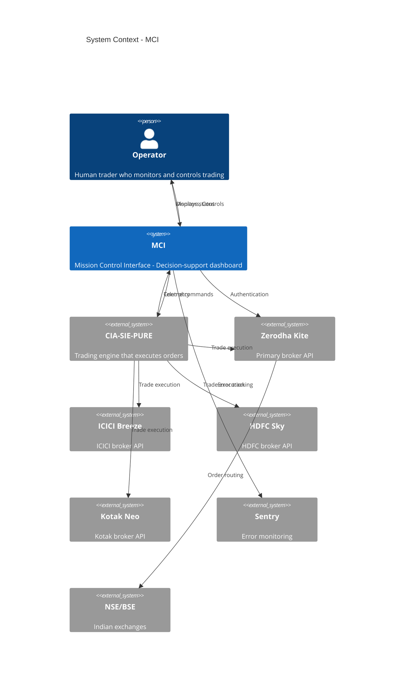

# P3-A01: C4 Model — Context Diagram
## Phase III — System Architecture

**Artifact ID:** P3-A01
**Phase:** III — System Architecture
**Status:** CREATED
**Version:** 1.0
**Date:** 2026-01-27

---

## Purpose

This document defines the System Context (Level 1) of the C4 model, showing MCI's relationship with external actors and systems.

---

## Context Diagram

```
┌─────────────────────────────────────────────────────────────────────────────┐
│                              SYSTEM CONTEXT                                  │
└─────────────────────────────────────────────────────────────────────────────┘

                              ┌─────────────┐
                              │   OPERATOR  │
                              │   (Human)   │
                              └──────┬──────┘
                                     │
                    Monitors, Controls, Makes Decisions
                                     │
                                     ▼
┌───────────────┐           ┌─────────────────┐           ┌───────────────┐
│   ZERODHA     │◄─────────►│                 │◄─────────►│  CIA-SIE-PURE │
│   KITE API    │  Auth,    │      MCI        │  Control, │    ENGINE     │
│               │  Data     │                 │  Telemetry│   (Python)    │
└───────────────┘           │   Mission       │           └───────────────┘
                            │   Control       │
┌───────────────┐           │   Interface     │           ┌───────────────┐
│   ICICI       │◄─────────►│                 │◄─────────►│    SENTRY     │
│   BREEZE API  │  Auth,    │   (React/TS)    │  Errors,  │   (Monitoring)│
│               │  Data     │                 │  Metrics  │               │
└───────────────┘           └─────────────────┘           └───────────────┘
                                     │
┌───────────────┐                    │                    ┌───────────────┐
│   HDFC        │◄───────────────────┘                    │   NSE/BSE     │
│   SKY API     │  Auth, Data                             │   (Exchanges) │
└───────────────┘                                         └───────────────┘
                                                                  │
┌───────────────┐                                                 │
│   KOTAK       │◄────────────────────────────────────────────────┘
│   NEO API     │  Market Data (via Brokers)
└───────────────┘
```

---

## System Context Elements

### Primary User

| Element | Type | Description |
|---------|------|-------------|
| **Operator** | Person | Human trader who monitors and controls the trading system. Makes all trading decisions. |

### System Under Design

| Element | Type | Description |
|---------|------|-------------|
| **MCI** | Software System | Mission Control Interface — NASA-grade decision-support dashboard for monitoring and controlling algorithmic trading operations in Indian markets. |

### External Systems

| Element | Type | Description |
|---------|------|-------------|
| **CIA-SIE-PURE Engine** | Software System | Headless Python/FastAPI trading engine that executes actual trades. MCI controls this engine. |
| **Zerodha Kite API** | External Service | Primary broker API for authentication, order execution, and market data. |
| **ICICI Breeze API** | External Service | ICICI Direct broker API for trading. |
| **HDFC Sky API** | External Service | HDFC Securities broker API for trading. |
| **Kotak Neo API** | External Service | Kotak Securities broker API for trading. |
| **NSE/BSE** | External Service | Indian stock exchanges. Data accessed via broker APIs. |
| **Sentry** | External Service | Error monitoring and performance tracking platform. |

---

## Relationships

| From | To | Description |
|------|-----|-------------|
| Operator | MCI | Views telemetry, initiates actions, makes decisions |
| MCI | Operator | Displays status, alerts, market data |
| MCI | CIA-SIE-PURE | Sends control commands (start, stop, status) |
| CIA-SIE-PURE | MCI | Sends telemetry (positions, orders, health) |
| MCI | Zerodha Kite | Authentication, token management |
| Zerodha Kite | MCI | Access token, session data |
| MCI | Sentry | Error reports, performance data |
| CIA-SIE-PURE | Broker APIs | Order execution, market data |
| Broker APIs | NSE/BSE | Order routing, exchange data |

---

## Key Constraints (from Phase I)

1. **Indian Markets Only** — MCI supports NSE/BSE via 4 Indian brokers
2. **Decision-Support Only** — MCI displays information, does not execute trades
3. **Token Expiry** — All tokens expire at 6:00 AM IST daily (CR-004)
4. **Supervised Operation** — Human operator approves all significant actions

---

## Mermaid Representation



---

*P3-A01 C4 Context v1.0 | Phase III Artifact | MCI Project*
