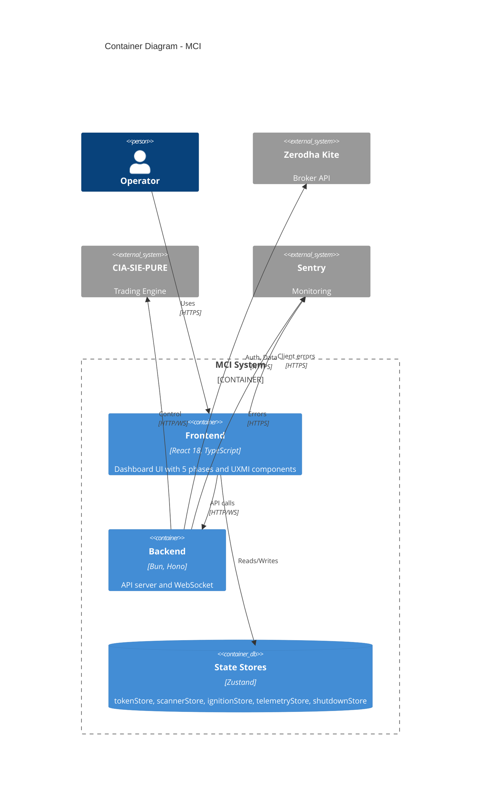

# P3-A02: C4 Model — Container Diagram
## Phase III — System Architecture

**Artifact ID:** P3-A02
**Phase:** III — System Architecture
**Status:** CREATED
**Version:** 1.0
**Date:** 2026-01-27

---

## Purpose

This document defines the Container (Level 2) of the C4 model, showing MCI's internal container architecture.

---

## Container Diagram

```
┌─────────────────────────────────────────────────────────────────────────────┐
│                                   MCI SYSTEM                                 │
├─────────────────────────────────────────────────────────────────────────────┤
│                                                                             │
│  ┌─────────────────────────────────────────────────────────────────────┐   │
│  │                         FRONTEND CONTAINER                          │   │
│  │                      (React 18 + TypeScript)                        │   │
│  ├─────────────────────────────────────────────────────────────────────┤   │
│  │                                                                     │   │
│  │  ┌───────────────┐ ┌───────────────┐ ┌───────────────┐            │   │
│  │  │   Phase 0     │ │   Phase 1     │ │   Phase 2     │            │   │
│  │  │ TokenCapture  │ │  PreIgnition  │ │   Ignition    │            │   │
│  │  └───────────────┘ └───────────────┘ └───────────────┘            │   │
│  │                                                                     │   │
│  │  ┌───────────────┐ ┌───────────────┐ ┌───────────────┐            │   │
│  │  │   Phase 3     │ │   Phase 4     │ │    UXMI       │            │   │
│  │  │  Telemetry    │ │   Shutdown    │ │   Library     │            │   │
│  │  └───────────────┘ └───────────────┘ └───────────────┘            │   │
│  │                                                                     │   │
│  │  ┌─────────────────────────────────────────────────────────────┐   │   │
│  │  │                    ZUSTAND STORES                           │   │   │
│  │  │  tokenStore | scannerStore | ignitionStore | telemetryStore │   │   │
│  │  │                       shutdownStore                          │   │   │
│  │  └─────────────────────────────────────────────────────────────┘   │   │
│  │                                                                     │   │
│  └─────────────────────────────────────────────────────────────────────┘   │
│                                      │                                      │
│                          HTTP / WebSocket                                   │
│                                      │                                      │
│  ┌─────────────────────────────────────────────────────────────────────┐   │
│  │                         BACKEND CONTAINER                           │   │
│  │                        (Bun + Hono + TS)                            │   │
│  ├─────────────────────────────────────────────────────────────────────┤   │
│  │                                                                     │   │
│  │  ┌───────────────┐ ┌───────────────┐ ┌───────────────┐            │   │
│  │  │  /api/auth    │ │  /api/scan    │ │ /api/ignition │            │   │
│  │  └───────────────┘ └───────────────┘ └───────────────┘            │   │
│  │                                                                     │   │
│  │  ┌───────────────┐ ┌───────────────┐ ┌───────────────┐            │   │
│  │  │/api/telemetry │ │ /api/shutdown │ │  WebSocket    │            │   │
│  │  └───────────────┘ └───────────────┘ └───────────────┘            │   │
│  │                                                                     │   │
│  │  ┌─────────────────────────────────────────────────────────────┐   │   │
│  │  │                       SERVICES                              │   │   │
│  │  │          KiteService | SentryService                        │   │   │
│  │  └─────────────────────────────────────────────────────────────┘   │   │
│  │                                                                     │   │
│  └─────────────────────────────────────────────────────────────────────┘   │
│                                                                             │
└─────────────────────────────────────────────────────────────────────────────┘
```

---

## Container Definitions

### Frontend Container

| Attribute | Value |
|-----------|-------|
| **Name** | MCI Frontend |
| **Technology** | React 18, TypeScript, Vite, Tailwind CSS |
| **Purpose** | Render dashboard UI, manage client state, handle user interactions |
| **Port** | 5173 (dev), 80/443 (prod) |

**Components:**
- Phase 0-4 component trees
- UXMI component library (7 components)
- Zustand state stores (5 stores)
- Sentry client integration

### Backend Container

| Attribute | Value |
|-----------|-------|
| **Name** | MCI Backend |
| **Technology** | Bun runtime, Hono framework, TypeScript |
| **Purpose** | API endpoints, WebSocket server, broker integration |
| **Port** | 3000 |

**Routes:**
- `/api/auth` — Token validation
- `/api/scan` — Pre-ignition checks
- `/api/ignition` — Start/stop control
- `/api/telemetry` — Data endpoints
- `/api/shutdown` — Graceful shutdown

**Services:**
- KiteService — Broker API integration
- SentryService — Error reporting

---

## Container Interactions

| From | To | Protocol | Purpose |
|------|-----|----------|---------|
| Frontend | Backend | HTTP/REST | API calls |
| Frontend | Backend | WebSocket | Real-time telemetry |
| Backend | Kite API | HTTPS | Authentication, data |
| Backend | Sentry | HTTPS | Error reporting |
| Frontend | Sentry | HTTPS | Client error reporting |

---

## Technology Stack

| Layer | Technology | Version |
|-------|------------|---------|
| Runtime | Bun | Latest |
| Backend Framework | Hono | Latest |
| Frontend Framework | React | 18.x |
| State Management | Zustand | Latest |
| Styling | Tailwind CSS | 3.x |
| Build Tool | Vite | 5.x |
| Language | TypeScript | 5.x |
| Testing | Vitest | Latest |
| E2E Testing | Playwright | Latest |

---

## Mermaid Representation



---

*P3-A02 C4 Container v1.0 | Phase III Artifact | MCI Project*
